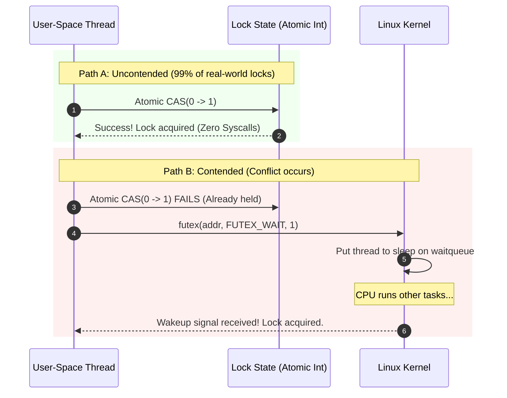
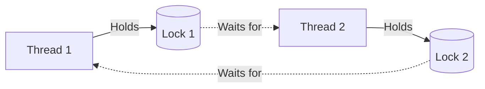

## Concurrency is hard because hardware lies

When multiple threads execute concurrently on multi-core processors, simple code like `count++` fails catastrophically. What looks like one line of code in Python, Go, or C is actually three machine instructions:
1. **Read** memory value into a CPU register (`mov eax, [count]`)
2. **Increment** register value (`add eax, 1`)
3. **Write** register back to memory (`mov [count], eax`)

If two threads execute this sequence concurrently, their instructions interleave. Both read `5`, both increment to `6`, and both write `6`. One increment is permanently lost. This is a **data race**.

To prevent data races, operating systems and processors provide **synchronization primitives** to build **critical sections** — regions of code where only one thread can execute at a time.

---

## 1. Hardware Foundations: Atomicity & Memory Ordering

Software locks cannot exist without direct hardware support:

### Test-and-Set & Compare-And-Swap (CAS)
CPUs provide atomic instructions (e.g., `CMPXCHG` on x86-64) that read, compare, and modify a memory location in a single indivisible hardware cycle:
```c
// Conceptual atomic CAS:
bool compare_and_swap(int* ptr, int expected, int new_val) {
    if (*ptr == expected) {
        *ptr = new_val;
        return true;  // Swap succeeded
    }
    return false;     // Another thread modified it first
}
```

### Cache Coherence & Memory Barriers
Modern CPUs have independent L1/L2 caches and reorder instructions out-of-order for speed. 
- **MESI Protocol**: Hardware enforces cache consistency across cores (Modified, Exclusive, Shared, Invalid). When Core 0 writes to an address, Core 1's cached copy is marked *Invalid*.
- **Memory Barriers (Fences)**: Instructions that force the CPU and compiler to preserve memory read/write order across threads.

---

## 2. Spinlocks vs Mutexes

When a thread attempts to acquire a lock that is already held, it has two choices:

| Mechanism | Behavior | CPU Cost | Context Switch Cost | Best Used When |
| :--- | :--- | :--- | :--- | :--- |
| **Spinlock** | Loops continuously (`while (!try_lock()) {}`), burning CPU cycles until free. | High (100% core burn while waiting) | **0 μs** (No OS intervention) | Wait time is guaranteed to be extremely short (e.g. < 1μs in kernel interrupt handlers). |
| **Mutex** (Sleep Lock) | Surrenders the CPU; kernel puts the thread to sleep on a wait queue until released. | Zero while sleeping | **1–10 μs** (Save registers, reschedule, restore) | Wait time is long or indeterminate (I/O, network, database calls). |

---

## 3. The Linux Futex: Fast Userspace Mutex

In early operating systems, acquiring a mutex always required a `syscall` into the kernel — taking microseconds even when no other thread was competing for the lock.

Linux solved this with the **Futex (Fast Userspace Mutex)**:

### The Two Paths
1. **Uncontended Fast Path (Userspace, ~10 nanoseconds)**: The thread executes an atomic CAS on an integer in user memory. If the lock was free (`0`), it sets it to `1` and enters the critical section with **zero system calls**.
2. **Contended Slow Path (Kernel, ~5 microseconds)**: If the CAS fails (another thread already holds it), the thread calls `sys_futex(uaddr, FUTEX_WAIT, ...)`. The kernel places the thread on a sleep queue and yields the CPU core. When the holder finishes, it calls `sys_futex(..., FUTEX_WAKE)` to wake the sleeper.



Nearly all modern user-space locks — `pthread_mutex`, Go's `sync.Mutex`, Java `synchronized`, Rust `std::sync::Mutex` — are built on top of futexes.

---

## 4. Higher-Level Primitives: Semaphores & Condition Variables

- **Counting Semaphore**: Holds an integer counter. `wait()` decrements; if counter $\le 0$, it blocks. `post()` increments and wakes a sleeper. Used for **rate limiting and connection pools** (e.g. max 50 database connections).
- **Condition Variable**: Allows a thread to sleep atomically until a specific application state becomes true:
  ```c
  pthread_mutex_lock(&lock);
  while (queue_is_empty()) {
      pthread_cond_wait(&cv, &lock); // Releases lock & sleeps atomically!
  }
  process_item();
  pthread_mutex_unlock(&lock);
  ```

---

## 5. Deadlocks: The Coffman Conditions

A **deadlock** occurs when a set of threads are blocked because each is holding a resource and waiting for another resource held by someone else in the set.

Deadlock can **only** occur if all 4 **Coffman Conditions** hold simultaneously:
1. **Mutual Exclusion**: Resources cannot be shared; only one thread holds a resource at a time.
2. **Hold and Wait**: A thread holds at least one lock while waiting to acquire another.
3. **No Preemption**: A lock cannot be forcibly confiscated from a thread.
4. **Circular Wait**: Thread A holds Lock 1 and waits for Lock 2; Thread B holds Lock 2 and waits for Lock 1.



### The Universal Fix: Strict Lock Ordering
To prevent deadlocks in production, enforce a global acquisition hierarchy: *Always acquire Lock 1 before Lock 2 across all code paths*. If Circular Wait is impossible, deadlock is mathematically prevented.

---

## 6. Diagnostic & Debugging Toolchain

### Trace Futex Contention with `strace`
```bash
# Monitor futex wait and wake system calls
strace -f -e trace=futex ./my-multithreaded-server
```

### Detect Lock Contention Hotspots with `perf lock`
```bash
# Record lock events system-wide
perf lock record -- sleep 3

# Report which locks cause the longest sleep latencies
perf lock report
```

### Diagnose Thread Deadlocks with `pstack` or `gdb`
```bash
# Print stack traces of all threads in a frozen process
gdb -p <pid> -batch -ex "thread apply all bt"
```

---

## Mental Anchors & Takeaways

- **CAS is the bedrock**: Without atomic hardware instructions, user-space concurrency is impossible.
- **Futexes optimize for optimism**: They assume locks are mostly uncontended (costing nanoseconds), only paying the kernel syscall penalty when contention actually happens.
- **Break Circular Wait**: Eliminate deadlocks by enforcing strict lock acquisition ordering.

---

Links to: **[Classic Synchronization Problems](/docs/operating-system/02-scheduling-and-concurrency/03-classic-sync-problems)** (solving Producer-Consumer, Readers-Writers, and Dining Philosophers).

