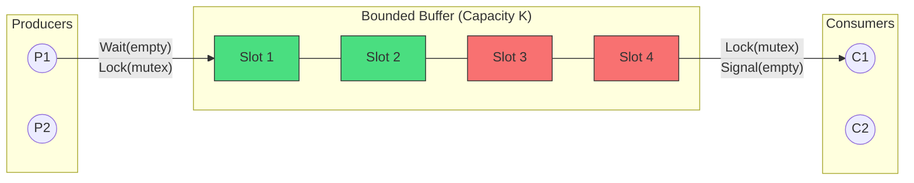
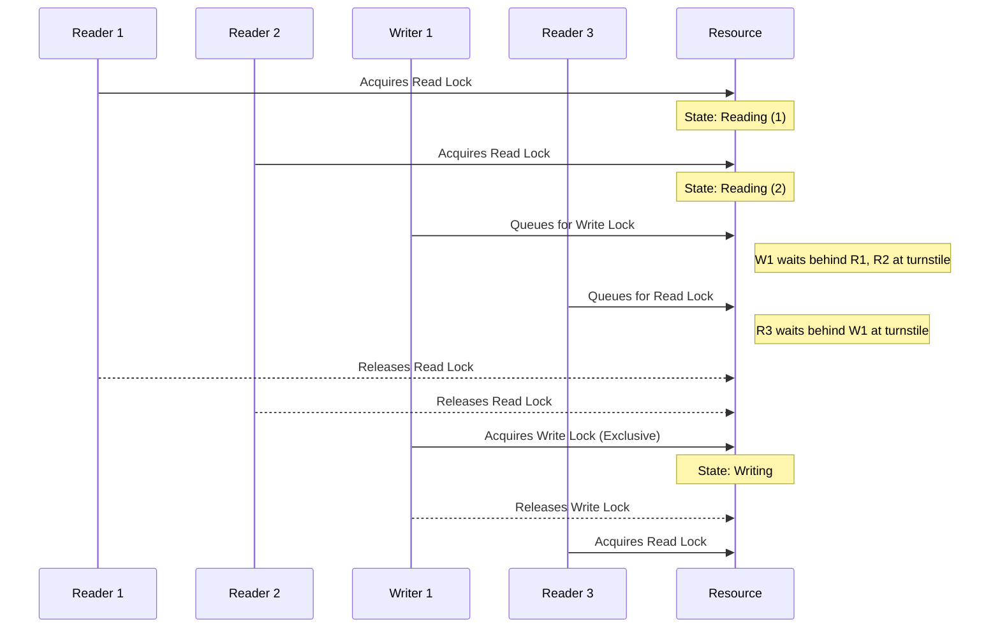
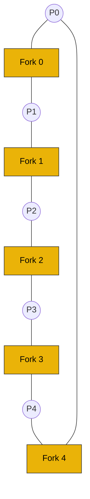

Concurrency isn't just about making things run faster; it's fundamentally about managing shared state without corrupting it or locking up the system. When computer scientists first wrestled with these challenges in the 1960s and 70s, they distilled the chaotic realities of real-world systems into a set of elegant, abstract puzzles. These are the **Classic Synchronization Problems**.

Why do these problems matter? Because they are the DNA of every modern concurrency pattern. Every time you push an event to a message broker like Kafka, you're interacting with a Producer-Consumer problem. Every time you grab a read-lock on a database row, you're navigating the Readers-Writers problem. Every time multiple microservices contend for a shared pool of resources and gridlock the system, you're experiencing the Dining Philosophers problem.

These aren't just academic exercises; they appear in every OS textbook, every rigorous systems engineering interview, and inside the kernel of every operating system on Earth. Mastering them teaches you how to orchestrate complex thread interactions, reason about deadlock and starvation, and wield foundational primitives like semaphores, mutexes, and condition variables with mathematical precision.

---

## 1. Producer-Consumer (Bounded Buffer)

The **Producer-Consumer** (or Bounded Buffer) problem involves two classes of processes sharing a fixed-size buffer of capacity $K$. **Producers** generate data items and place them into the buffer. **Consumers** remove data items from the buffer and process them.

### Problem Constraints

1.  **Mutual Exclusion**: Producers and consumers must not concurrently manipulate the buffer's internal state (e.g., indices, pointers) in a way that causes race conditions.
2.  **No Buffer Overrun**: A producer must block (wait) if the buffer is entirely full ($N = K$).
3.  **No Buffer Underrun**: A consumer must block if the buffer is entirely empty ($N = 0$).

### Solution 1: Semaphores

We can elegantly solve this using three semaphores:
-   `mutex` (binary semaphore / lock, initialized to 1): Protects the critical section (buffer manipulation).
-   `empty` (counting semaphore, initialized to $K$): Tracks the number of available empty slots.
-   `full` (counting semaphore, initialized to 0): Tracks the number of filled slots ready to be consumed.

```c
// Semaphore initialization
sem_t mutex = 1;
sem_t empty = K;
sem_t full = 0;

void producer() {
    while (true) {
        item_t item = produce_item();
        
        sem_wait(&empty);  // Wait for at least one empty slot
        sem_wait(&mutex);  // Enter critical section
        
        insert_into_buffer(item);
        
        sem_post(&mutex);  // Leave critical section
        sem_post(&full);   // Increment full slots
    }
}

void consumer() {
    while (true) {
        sem_wait(&full);   // Wait for at least one filled slot
        sem_wait(&mutex);  // Enter critical section
        
        item_t item = remove_from_buffer();
        
        sem_post(&mutex);  // Leave critical section
        sem_post(&empty);  // Increment empty slots
        
        consume_item(item);
    }
}
```

### Solution 2: Mutex + Condition Variables

In modern systems, condition variables are often preferred over counting semaphores for complex state management.

```c
pthread_mutex_t mutex = PTHREAD_MUTEX_INITIALIZER;
pthread_cond_t not_empty = PTHREAD_COND_INITIALIZER;
pthread_cond_t not_full = PTHREAD_COND_INITIALIZER;
int count = 0; // Number of items currently in buffer

void producer() {
    while (true) {
        item_t item = produce_item();
        
        pthread_mutex_lock(&mutex);
        
        // MUST use a while loop to protect against spurious wakeups
        while (count == K) {
            pthread_cond_wait(&not_full, &mutex);
        }
        
        insert_into_buffer(item);
        count++;
        
        pthread_cond_signal(&not_empty); // Wake up a blocked consumer
        pthread_mutex_unlock(&mutex);
    }
}

void consumer() {
    while (true) {
        pthread_mutex_lock(&mutex);
        
        while (count == 0) {
            pthread_cond_wait(&not_empty, &mutex);
        }
        
        item_t item = remove_from_buffer();
        count--;
        
        pthread_cond_signal(&not_full); // Wake up a blocked producer
        pthread_mutex_unlock(&mutex);
        
        consume_item(item);
    }
}
```

### Bounded Buffer Architecture


*(Green = Full slots, Red = Empty slots)*

**Real-world relevance**: This is the basis for Kafka partitions, Go channels (`make(chan int, K)`), Java's `ArrayBlockingQueue`, and thread pool task queues in asynchronous web servers.

---

## 2. Readers-Writers Problem

The **Readers-Writers** problem models access to a database, file, or data structure where multiple threads can read safely concurrently, but any thread writing to the data must have exclusive access.

**Constraints:**
-   Multiple readers can access the data simultaneously.
-   A writer must have exclusive access (no other writers, no other readers).

This problem has several variants based on prioritization.

### Variant 1: Reader Preference (First Readers-Writers)

In this variant, no reader should wait simply because a writer is waiting. Readers are prioritized. **Danger**: This can lead to **writer starvation** if a continuous stream of readers keeps arriving.

```c
int read_count = 0;
sem_t mutex = 1;      // Protects read_count
sem_t rw_lock = 1;    // Protects the shared data

void reader() {
    sem_wait(&mutex);
    read_count++;
    if (read_count == 1) {
        sem_wait(&rw_lock); // First reader locks out writers
    }
    sem_post(&mutex);
    
    // PERFORM READING...
    
    sem_wait(&mutex);
    read_count--;
    if (read_count == 0) {
        sem_post(&rw_lock); // Last reader lets writers in
    }
    sem_post(&mutex);
}

void writer() {
    sem_wait(&rw_lock);
    // PERFORM WRITING...
    sem_post(&rw_lock);
}
```

### Variant 2: Writer Preference (Second Readers-Writers)

Here, if a writer is waiting, no new readers may start reading. The system prioritizes getting writers through as quickly as possible. **Danger**: This can lead to **reader starvation**.

```c
int read_count = 0;
int write_count = 0;
sem_t r_mutex = 1;    // Protects read_count
sem_t w_mutex = 1;    // Protects write_count
sem_t read_try = 1;   // Indicates a reader is trying to enter
sem_t resource = 1;   // Protects the actual resource

void reader() {
    sem_wait(&read_try);   // Check if writers are blocking readers
    sem_wait(&r_mutex);
    read_count++;
    if (read_count == 1) sem_wait(&resource);
    sem_post(&r_mutex);
    sem_post(&read_try);
    
    // PERFORM READING...
    
    sem_wait(&r_mutex);
    read_count--;
    if (read_count == 0) sem_post(&resource);
    sem_post(&r_mutex);
}

void writer() {
    sem_wait(&w_mutex);
    write_count++;
    if (write_count == 1) sem_wait(&read_try); // Block new readers
    sem_post(&w_mutex);
    
    sem_wait(&resource);
    // PERFORM WRITING...
    sem_post(&resource);
    
    sem_wait(&w_mutex);
    write_count--;
    if (write_count == 0) sem_post(&read_try); // Allow new readers
    sem_post(&w_mutex);
}
```

### Variant 3: Fair / Starvation-Free (Third Readers-Writers)

To prevent both reader and writer starvation, we can use a FIFO turnstile. Every thread (reader or writer) must pass through a single turnstile semaphore, ensuring strictly ordered entry.

```c
int read_count = 0;
sem_t turnstile = 1;  // Preserves FIFO ordering
sem_t mutex = 1;      // Protects read_count
sem_t resource = 1;   // Protects the shared data

void reader() {
    sem_wait(&turnstile); // Wait in line
    sem_wait(&mutex);
    read_count++;
    if (read_count == 1) sem_wait(&resource);
    sem_post(&mutex);
    sem_post(&turnstile); // Let the next thread in line proceed
    
    // PERFORM READING...
    
    sem_wait(&mutex);
    read_count--;
    if (read_count == 0) sem_post(&resource);
    sem_post(&mutex);
}

void writer() {
    sem_wait(&turnstile); // Wait in line
    sem_wait(&resource);  // Request exclusive access
    sem_post(&turnstile); // Step out of the line, keeping lock
    
    // PERFORM WRITING...
    
    sem_post(&resource);  // Release exclusive access
}
```

### Execution Interleaving (Fair Variant)



**Real-world relevance**: Database transaction isolation levels, Go's `sync.RWMutex`, Java's `ReentrantReadWriteLock`. In the Linux kernel, a highly optimized, lock-free variant of this concept called **RCU (Read-Copy-Update)** is used extensively for read-heavy data structures.

---

## 3. Dining Philosophers

Formulated by Dijkstra, the Dining Philosophers problem models resource allocation deadlock.

**Problem Statement:**
Five philosophers sit around a circular table. In front of each is a bowl of spaghetti. Between each philosopher is a single fork (5 forks total). To eat, a philosopher must acquire *both* the left and right forks.

### The Naive Deadlock

If every philosopher executes:
1. Grab left fork.
2. Grab right fork.
3. Eat.
4. Put down left fork.
5. Put down right fork.

If all 5 philosophers grab their left fork simultaneously, the system deadlocks. Everyone is holding one fork, waiting indefinitely for the right fork.

### Solution 1: Asymmetric Ordering (Breaking Symmetry)

One philosopher (e.g., philosopher 4) is left-handed and grabs the right fork first.
This breaks the circular wait condition of deadlock (Coffman conditions).

### Solution 2: Resource Hierarchy

Assign a globally unique ID (e.g., 0 to 4) to every fork. A rule is established: A philosopher must always pick up the lower-numbered fork first, then the higher-numbered fork.
Philosopher 4, sitting between fork 4 and fork 0, will pick up fork 0 first, naturally breaking the deadlock cycle. This total ordering is a universal strategy for deadlock prevention in large systems.

### Solution 3: Limiting Concurrency

Introduce a semaphore `room` initialized to 4.
Only 4 philosophers are allowed to sit at the table simultaneously. By the Pigeonhole Principle, if 4 philosophers try to acquire 5 forks, at least one philosopher will successfully acquire two forks, guaranteeing progress.

### Solution 4: Chandy-Misra / Monitor State Checking

Instead of focusing on forks, we focus on the *state* of the philosopher: `THINKING`, `HUNGRY`, or `EATING`. A philosopher can only move to `EATING` if both neighbors are not `EATING`. We protect this state array with a mutex and use condition variables to wait.

```c
enum { THINKING, HUNGRY, EATING } state[5];
pthread_mutex_t mutex = PTHREAD_MUTEX_INITIALIZER;
pthread_cond_t cond[5];

void test(int i) {
    if (state[i] == HUNGRY && state[LEFT(i)] != EATING && state[RIGHT(i)] != EATING) {
        state[i] = EATING;
        pthread_cond_signal(&cond[i]);
    }
}

void take_forks(int i) {
    pthread_mutex_lock(&mutex);
    state[i] = HUNGRY;
    test(i);
    while (state[i] != EATING) {
        pthread_cond_wait(&cond[i], &mutex);
    }
    pthread_mutex_unlock(&mutex);
}

void put_forks(int i) {
    pthread_mutex_lock(&mutex);
    state[i] = THINKING;
    test(LEFT(i));  // Check if left neighbor can now eat
    test(RIGHT(i)); // Check if right neighbor can now eat
    pthread_mutex_unlock(&mutex);
}
```

### Table Layout



---

## 4. Monitors & Condition Variable Semantics (Hoare vs Mesa)

A **Monitor** is a high-level synchronization construct (originally defined by Hoare and Brinch Hansen). It consists of:
1. Encapsulated private state.
2. A mutex lock that ensures only one thread is active inside the monitor at a time.
3. Condition variables allowing threads to yield the CPU and wait for a specific state change.

When a thread calls `signal()` on a condition variable to wake up a waiting thread, what happens to the mutex lock? This leads to two conflicting semantics.

### Hoare Semantics (Signal-and-Wait)
In Hoare semantics, when Thread A signals Thread B, **Thread A immediately yields the lock to Thread B**. Thread B wakes up and executes immediately. When B finishes or blocks, A resumes.
- **Pro**: When B wakes up, the condition it waited for is *guaranteed* to still be true.
- **Con**: Highly inefficient. Requires excessive context switching.

### Mesa Semantics (Signal-and-Continue)
In Mesa semantics (developed at Xerox PARC), when Thread A signals Thread B, **Thread A keeps the lock and continues executing**. Thread B is simply moved from the condition variable's waiting queue to the mutex's ready queue. Thread B will only run when Thread A eventually drops the lock and the OS scheduler schedules B.
- **Pro**: Extremely efficient. No forced context switches.
- **Con**: Between the time A signaled and B actually acquires the lock and runs, a completely different Thread C might have grabbed the lock and changed the state.

**Modern Reality**: Virtually all modern threading libraries (POSIX `pthreads`, Java `synchronized`/`wait`/`notify`, Go `sync.Cond`) use **Mesa semantics**. 

Because of Mesa semantics, the condition might have changed between being signaled and waking up. This is called a **spurious wakeup** (which can also occur due to underlying OS signal interruptions). Therefore, **you must always wrap `wait()` in a `while` loop, never an `if` statement.**

```c
// WRONG (Assumes Hoare Semantics)
if (!condition) {
    wait(cond, mutex);
}
// If another thread modified state before we ran, we crash.

// CORRECT (Required for Mesa Semantics)
while (!condition) {
    wait(cond, mutex);
}
```

---

## 5. Practical Investigation & Concurrency Debugging

Real-world concurrency debugging relies on dynamic analysis tools.

### Go Race Detector
Go includes a powerful data race detector built into the compiler.
```bash
go run -race myprogram.go
```
If two goroutines access the same variable concurrently and at least one is writing, the race detector will immediately print a stack trace.

### Valgrind Helgrind
For C/C++, Helgrind detects POSIX pthreads synchronization errors (race conditions, deadlock potential, incorrect API usage).
```bash
valgrind --tool=helgrind ./myprogram
```

### ThreadSanitizer (TSan)
Integrated into Clang/GCC, TSan instruments your code to catch data races at runtime with lower overhead than Valgrind.
```bash
clang -fsanitize=thread -g -O1 myprogram.c
./a.out
```

---

## 6. Real-World Mental Anchors

- **The Obvious Case (Simple Queues)**: A UI thread pushing click events into a queue, while a background worker thread pops and processes them. Standard producer-consumer.
- **The Counter-Intuitive Case (Go Channel Deadlock)**: Unbuffered channels in Go (`make(chan int)`) require both producer and consumer to be ready simultaneously. If you write to an unbuffered channel in the same goroutine that reads it, you immediately deadlock—a single-thread variant of a producer-consumer synchronization stall.
- **The Failure Mode (Priority Inversion in Readers-Writers)**: If a low-priority reader holds a lock, a high-priority writer waits for it, but a medium-priority CPU-bound thread preempts the reader. The high-priority writer is now effectively blocked by a medium-priority thread. (Mars Pathfinder famously suffered from priority inversion!).

---

## 7. ✕ What people get wrong

1. **"Condition variables remember that they were signaled."** False. If you call `signal()` when no thread is `wait()`ing, the signal is lost forever into the void. This differs from Semaphores, which *do* remember (they increment a counter).
2. **"Signaling immediately hands execution to the waiting thread."** False (under modern Mesa semantics). Signaling just moves the thread from the condition variable queue to the lock contention queue.
3. **"Deadlock requires a malicious or highly complex system."** False. Dining Philosophers shows that even a perfectly symmetric system executing the exact same code can easily deadlock if resource ordering isn't enforced.

---

## 8. Why this matters

The Classic Synchronization Problems abstract away the noise of modern software to expose the fundamental laws of concurrent physics. Whether you are writing a lock-free data structure for a high-frequency trading firm, debugging a microservice latency spike in AWS, or answering systems design questions at a FAANG interview, your ability to map the real-world bug to its canonical synchronization problem determines how quickly you can architect the solution.

### Key Takeaways
- **Producer-Consumer** teaches bounded resource management and blocking on capacity limits.
- **Readers-Writers** teaches prioritization, starvation, and fair access to shared memory.
- **Dining Philosophers** teaches total resource ordering to prevent circular-wait deadlocks.
- Always use `while(!condition) wait()` due to Mesa semantics and spurious wakeups.

---

**Links to:** [Deadlock Avoidance & Detection — Banker's Algorithm](/docs/operating-system/02-scheduling-and-concurrency/04-deadlock-avoidance)
