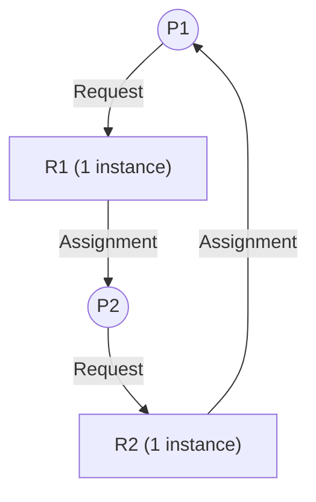
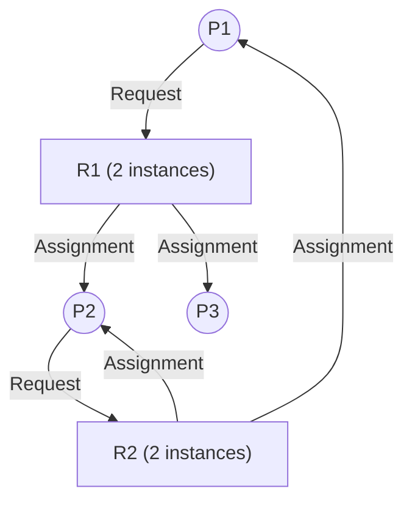
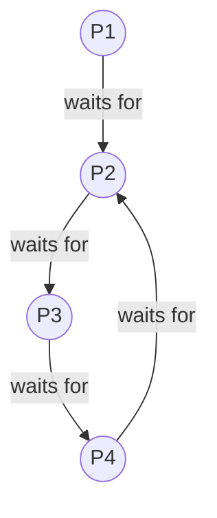

## The Illusion of Infinite Resources

In the previous lesson, we examined the four Coffman conditions necessary for a deadlock to occur. It's tempting to think that simply breaking one of these conditions—such as disallowing "Hold and Wait" or "Circular Wait"—is the ideal solution to the deadlock problem. This approach, known as **Deadlock Prevention**, is deterministic but extremely restrictive. It forces rigid allocation rules that destroy resource utilization, severely limit concurrency, and often require processes to predict all their resource needs at launch time.

Modern operating systems and complex software architectures require a more nuanced approach. Instead of structurally prohibiting the conditions that make deadlocks possible, what if the system actively monitored resource requests at runtime and dynamically denied requests that *might* lead to a deadlock? This is **Deadlock Avoidance**.

Alternatively, what if we acknowledge that strict avoidance algorithms are too computationally expensive to run on every memory allocation or lock acquisition? In this scenario, we allow the system to potentially enter a deadlocked state, periodically check for cycles, and forcibly resolve them when found. This is **Deadlock Detection and Recovery**. In this masterclass, we will explore the mathematical foundations of these strategies, moving from abstract graph theory to Edsger Dijkstra's famous Banker's Algorithm, and finally down to modern implementations in databases and the Linux kernel.

## Resource Allocation Graphs (RAG)

Before we can avoid or detect deadlocks, we need a formal mathematical model to represent the state of processes and resources in the system. The **Resource Allocation Graph (RAG)** is a directed graph consisting of a set of vertices $V$ and a set of edges $E$.

- **Vertices ($V$)**: Partitioned into two types:
  - $P = \{P_1, P_2, \dots, P_n\}$: The set of all active processes in the system.
  - $R = \{R_1, R_2, \dots, R_m\}$: The set of all resource types in the system (e.g., CPU, memory, printers). A resource type can have multiple instances.
- **Edges ($E$)**:
  - **Request Edge ($P_i \rightarrow R_j$)**: Process $P_i$ has requested an instance of resource type $R_j$ and is currently waiting for that resource.
  - **Assignment Edge ($R_j \rightarrow P_i$)**: An instance of resource type $R_j$ has been allocated to process $P_i$.

### Cycle Semantics: Single vs. Multi-Instance

The presence of a cycle in the RAG is intimately tied to the existence of a deadlock, but the exact relationship depends on the nature of the resources.

**Single-Instance Resources:** If every resource type in the system has exactly one instance, then a cycle in the RAG is both **necessary and sufficient** for a deadlock to exist. If there's a cycle, there's a deadlock.

**Multi-Instance Resources:** If resource types can have multiple instances, a cycle in the RAG is **necessary but NOT sufficient** to prove a deadlock. A cycle indicates a *potential* deadlock, but another process holding an instance of the contested resource might finish and release it, breaking the cycle.

*In the diagram above, a cycle exists ($P_1 \rightarrow R_1 \rightarrow P_2 \rightarrow R_2 \rightarrow P_1$). However, there is no deadlock. $P_3$ is holding an instance of $R_1$ but is not waiting on anything. $P_3$ can finish execution, release its instance of $R_1$, allowing $P_1$ to acquire it and break the cycle.*

## The Banker's Algorithm (Edsger Dijkstra)

When dealing with multi-instance resources, graph cycle detection is insufficient for avoidance. In 1965, Edsger Dijkstra developed the **Banker's Algorithm**, an avoidance strategy based on simulating allocations to guarantee that the system never enters an "unsafe" state.

### The Banking Analogy: Safe vs. Unsafe States

Imagine a small town bank with a limited reserve of cash. The banker extends lines of credit to various contractors. The banker knows that not all contractors will demand their maximum credit line simultaneously.

- **Safe State:** A state is safe if there exists a sequence of all processes $\langle P_1, P_2, \dots, P_n \rangle$ such that for each $P_i$, the resources that $P_i$ can still request can be satisfied by the currently available resources plus the resources held by all previously finished processes ($P_j$ where $j < i$). If the system is in a safe state, deadlock is impossible.
- **Unsafe State:** A state where no such sequence exists. **Crucially, an unsafe state is NOT necessarily a deadlock.** An unsafe state simply means that *if* all processes suddenly requested their maximum needs, the system *would* deadlock. The Banker's Algorithm ensures the system never enters an unsafe state.

### Data Structures

Let $n$ be the number of processes and $m$ be the number of resource types.

- `Available`: Vector of length $m$. `Available[j] = k` means there are $k$ instances of resource type $R_j$ currently unallocated.
- `Max`: An $n \times m$ matrix. `Max[i][j] = k` means process $P_i$ may request at most $k$ instances of $R_j$.
- `Allocation`: An $n \times m$ matrix. `Allocation[i][j] = k` means process $P_i$ is currently allocated $k$ instances of $R_j$.
- `Need`: An $n \times m$ matrix indicating remaining resource needs. `Need[i][j] = Max[i][j] - Allocation[i][j]`.

### Mathematical Worked Example

Consider a system with 5 processes ($P_0$ through $P_4$) and 3 resource types: $A$ (10 instances), $B$ (5 instances), $C$ (7 instances).

**Initial Snapshot at time $T_0$:**

| Process | Allocation (A, B, C) | Max (A, B, C) | Need (Max - Alloc) | Available (A, B, C) |
| :--- | :--- | :--- | :--- | :--- |
| $P_0$ | 0, 1, 0 | 7, 5, 3 | 7, 4, 3 | 3, 3, 2 |
| $P_1$ | 2, 0, 0 | 3, 2, 2 | 1, 2, 2 | |
| $P_2$ | 3, 0, 2 | 9, 0, 2 | 6, 0, 0 | |
| $P_3$ | 2, 1, 1 | 2, 2, 2 | 0, 1, 1 | |
| $P_4$ | 0, 0, 2 | 4, 3, 3 | 4, 3, 1 | |

*Calculation of Available: Total (10,5,7) - Sum of Allocation (7,2,5) = (3,3,2).*

#### The Safety Algorithm Step-by-Step

We must find a safe sequence.
1. Initialize `Work = Available = (3, 3, 2)` and `Finish = [false, false, false, false, false]`.
2. Find an $i$ such that `Finish[i] == false` and `Need[i] <= Work`.
   - Try $P_0$: `Need` (7, 4, 3) $\not\le$ `Work` (3, 3, 2). Skip.
   - Try $P_1$: `Need` (1, 2, 2) $\le$ `Work` (3, 3, 2). **Match.**
3. Simulate $P_1$ completing: `Work = Work + Allocation[P_1] = (3,3,2) + (2,0,0) = (5,3,2)`. Set `Finish[1] = true`.
4. Next iteration:
   - Try $P_2$: `Need` (6, 0, 0) $\not\le$ `Work` (5, 3, 2). Skip.
   - Try $P_3$: `Need` (0, 1, 1) $\le$ `Work` (5, 3, 2). **Match.**
   - `Work = (5,3,2) + (2,1,1) = (7,4,3)`. Set `Finish[3] = true`.
5. Next iteration:
   - Try $P_4$: `Need` (4, 3, 1) $\le$ `Work` (7, 4, 3). **Match.**
   - `Work = (7,4,3) + (0,0,2) = (7,4,5)`. Set `Finish[4] = true`.
6. Go back to skipped processes:
   - Try $P_0$: `Need` (7, 4, 3) $\le$ `Work` (7, 4, 5). **Match.**
   - `Work = (7,4,5) + (0,1,0) = (7,5,5)`. Set `Finish[0] = true`.
7. Finally:
   - Try $P_2$: `Need` (6, 0, 0) $\le$ `Work` (7, 5, 5). **Match.**
   - `Work = (7,5,5) + (3,0,2) = (10,5,7)`. Set `Finish[2] = true`.

Since all `Finish[i] == true`, the sequence $\langle P_1, P_3, P_4, P_0, P_2 \rangle$ satisfies safety. The system is in a safe state.

#### The Resource-Request Algorithm

Suppose $P_1$ requests 1 instance of $A$ and 2 instances of $C$. `Request_1 = (1, 0, 2)`.

1. Check `Request_1 <= Need_1`: `(1,0,2) <= (1,2,2)`. True (Process isn't requesting more than its stated Max).
2. Check `Request_1 <= Available`: `(1,0,2) <= (3,3,2)`. True (Resources are currently available).
3. Pretend to allocate the resources to $P_1$ and modify state:
   - `Available = Available - Request_1 = (3,3,2) - (1,0,2) = (2,3,0)`
   - `Allocation_1 = Allocation_1 + Request_1 = (2,0,0) + (1,0,2) = (3,0,2)`
   - `Need_1 = Need_1 - Request_1 = (1,2,2) - (1,0,2) = (0,2,0)`

Now, we run the **Safety Algorithm** on this hypothetical new state to see if a safe sequence still exists.
- `Work = (2,3,0)`.
- $P_0$: `Need` (7,4,3) $\not\le$ (2,3,0)
- $P_1$: `Need` (0,2,0) $\le$ (2,3,0). $P_1$ finishes. `Work = (2,3,0) + (3,0,2) = (5,3,2)`.
- $P_3$: `Need` (0,1,1) $\le$ (5,3,2). $P_3$ finishes. `Work = (5,3,2) + (2,1,1) = (7,4,3)`.
- $P_4$: `Need` (4,3,1) $\le$ (7,4,3). $P_4$ finishes. `Work = (7,4,3) + (0,0,2) = (7,4,5)`.
- $P_0$: `Need` (7,4,3) $\le$ (7,4,5). $P_0$ finishes. `Work = (7,4,5) + (0,1,0) = (7,5,5)`.
- $P_2$: `Need` (6,0,0) $\le$ (7,5,5). $P_2$ finishes. `Work = (7,5,5) + (3,0,2) = (10,5,7)`.

The sequence $\langle P_1, P_3, P_4, P_0, P_2 \rangle$ still works! The new state is safe, so the Operating System grants $P_1$'s request immediately.
*(Time complexity for the algorithm is $O(m \times n^2)$).*

## Deadlock Detection Algorithms

Because the Banker's algorithm is $O(m \times n^2)$ and requires processes to declare maximum usage upfront, standard OS kernels (like Linux or Windows) do **not** use it for general process resource allocation. Instead, systems often adopt a "hope for the best" approach combined with **Deadlock Detection**.

### Detection in Single-Instance Systems: Wait-For Graphs

If all resources have a single instance, we can simplify the Resource Allocation Graph into a **Wait-For Graph**. We remove the resource nodes and collapse the edges to show direct dependencies between processes. An edge $P_i \rightarrow P_j$ exists if $P_i$ is waiting for a resource held by $P_j$.

We run a standard Depth First Search (DFS) on the Wait-For graph to detect cycles in $O(V + E)$ time. In the diagram above, the cycle $P_2 \rightarrow P_3 \rightarrow P_4 \rightarrow P_2$ represents a detected deadlock.

### Detection in Multi-Instance Systems

For multi-instance systems, the detection algorithm is a variant of the Banker's Safety Algorithm, but it looks at current unfulfilled requests instead of declared maximums.
- `Available` vector and `Allocation` matrix remain the same.
- We replace the `Need` matrix with a `Request` matrix (what processes are actively waiting for right now).
- The algorithm attempts to simulate execution of processes whose active `Request <= Available`. If it finishes, it adds its `Allocation` back to `Available`. If some processes are left unable to finish, those processes are deadlocked.

## Deadlock Recovery Strategies

Once a deadlock is detected, the system must recover. There are two primary approaches: Process Termination and Resource Preemption.

### 1. Process Termination

- **Abort all deadlocked processes:** Fast, brutal, and guarantees breaking the cycle. However, this destroys potentially hours of computed state.
- **Abort one process at a time until cycle is eliminated:** Requires re-running the cycle detection algorithm after each kill. The OS must select a "victim."
  - **Victim Selection Criteria:** Priority of the process, compute time already spent (don't kill old processes), number of resources held (kill the richest process to free up maximum resources), and whether the process is interactive or batch.

### 2. Resource Preemption

Instead of terminating a process, the OS forcibly takes a resource away from a process and gives it to another.
- **Rollback:** If a resource is preempted, the victim process cannot normally continue. The system must rollback the process to a safe checkpoint state.
- **Starvation Risk:** If the system always picks the same low-priority process as the victim for preemption, that process will starve. Implementations must include an **aging factor** (e.g., adding the number of rollbacks to the cost calculation so a process eventually avoids victimization).

## Practical Investigation & Database Deadlocks

While OS kernels generally ignore deadlocks for standard memory allocations (leaving it to the OOM Killer when memory runs out entirely, which is slightly different than a pure deadlock), specific kernel subsystems and application-level software heavily utilize these concepts.

### Relational Databases (PostgreSQL)

Databases are the most common place engineers encounter deadlocks. Two transactions modifying the same tables in reverse order will trigger one.
- PostgreSQL implements deadlock detection via cycle hunting in its lock dependency graph.
- It doesn't run detection immediately on a lock wait (as that is expensive). Instead, it waits for `deadlock_timeout` (default 1 second). If a transaction is still waiting after 1 second, Postgres fires up the cycle detector.
- If a cycle is found, it aborts one transaction (rolling back the transaction) and raises the famous `ERROR: deadlock detected` exception.
- You can monitor lock contention using the `pg_stat_activity` view and by enabling `log_lock_waits = on` in `postgresql.conf`.

### Linux Kernel Lockdep

The Linux kernel has a built-in lock validator called `lockdep` (`CONFIG_PROVE_LOCKING`). Rather than detecting deadlocks after they happen, lockdep analyzes the *order* in which locks (spinlocks, mutexes) are acquired across the entire kernel. If it sees lock A acquired before lock B in one subsystem, and lock B acquired before lock A in another, it flags an immediate warning (a potential deadlock), even if a deadlock hasn't mathematically occurred yet.

### Java Thread Dump Analysis

In user-space applications (like JVM microservices), detecting deadlocks often involves taking a thread dump. Using `jcmd` or `jstack <pid>`, you can dump the state of all threads. The JVM automatically runs a deadlock detection algorithm on object monitors (`synchronized` blocks) and `java.util.concurrent` locks, explicitly printing "Found one Java-level deadlock:" in the dump output.

## Real-World Mental Anchors / Examples

- **The Obvious Case:** Two microservices. Service A locks User Table, calls Service B. Service B locks Order Table, calls Service A. Deadlock via HTTP timeout.
- **The Counter-Intuitive Case:** Databases *intentionally* allow deadlocks to occur rather than preventing them. Running avoidance (Banker's Algorithm) on thousands of concurrent SQL queries is far too slow. It's much faster to allow high concurrency, accept that deadlocks will occasionally happen, and rely on fast detection and transaction rollbacks to fix them.
- **The Failure Mode / Edge Case:** **Distributed Deadlocks.** In a microservice architecture communicating via RPC, a cycle of dependencies might exist across multiple physical machines. No single node has a full Wait-For Graph. Resolving this requires distributed deadlock detection algorithms (like edge-chasing protocols or time-based wound-wait algorithms), which are notoriously complex to implement correctly.

## ✕ What people get wrong

- **"An Unsafe State means the system is deadlocked."**
  - **False.** An unsafe state just means the mathematical guarantee of avoiding deadlock is broken. The system *might* deadlock in the future, but it isn't deadlocked yet.
- **"Operating Systems run the Banker's Algorithm when I call malloc()."**
  - **False.** The Banker's Algorithm requires knowing a process's `Max` resources ahead of time, which is impossible for general-purpose applications. OS kernels generally use the "Ostrich Algorithm" (sticking their head in the sand and ignoring the problem) for general resources, delegating deadlock handling to the application layer (e.g., database transaction managers).

## Why this matters

In backend engineering, database deadlocks are an everyday occurrence. Understanding that Postgres resolves these by selectively rolling back transactions (Victim Selection/Recovery) informs how you write your code: your application must be prepared to catch deadlock exceptions and retry the transaction. Furthermore, understanding RAGs and Wait-For graphs is essential for debugging multithreaded code using tools like `jstack` or kernel lock analyzers.

## Key Takeaways

1. **Avoidance vs. Detection:** Avoidance (Banker's Algorithm) prevents the system from entering unsafe states by validating requests against future needs. Detection allows deadlocks to happen but finds cycles in Wait-For graphs to resolve them later.
2. **Cycle Semantics:** In a Resource Allocation Graph, a cycle guarantees a deadlock ONLY if all resources are single-instance. For multi-instance resources, a cycle is necessary but not sufficient.
3. **Database Reality:** Modern systems (like Postgres) favor Deadlock Detection and Recovery over Avoidance because it provides significantly higher throughput, handling cycles by rolling back victim transactions.

**Links to:** [Inter-Process Communication (IPC)](/docs/operating-system/02-scheduling-and-concurrency/05-ipc-mechanisms)
