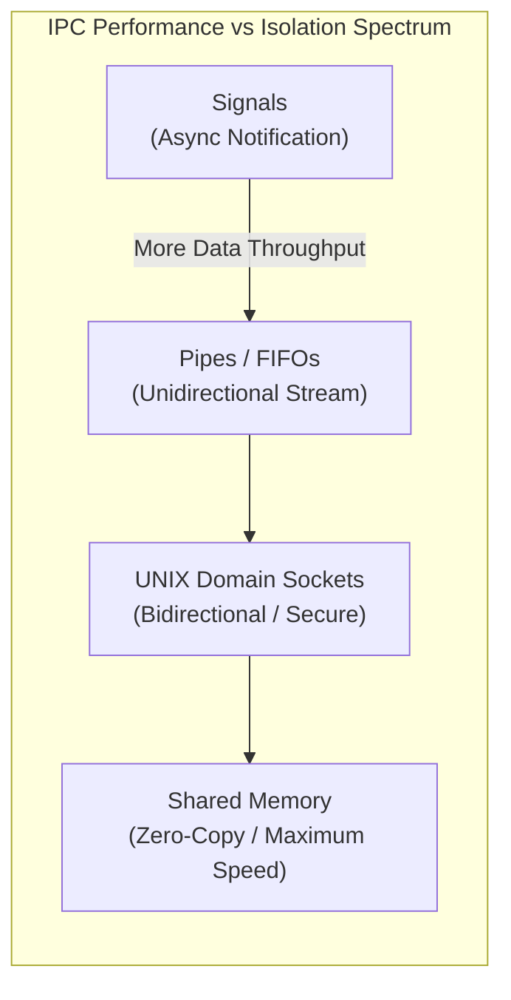
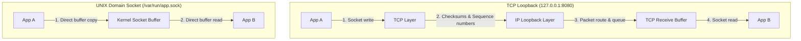
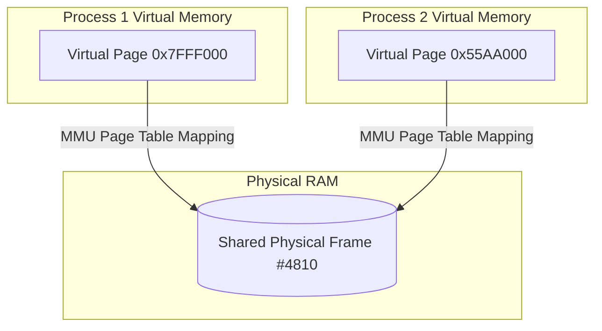

## Isolated by default, collaborative by design

Lesson 01 and Lesson 02 established the cardinal rule of operating systems: **processes are strictly isolated**. Process A cannot read Process B's memory. If it tries, the MMU fires a hardware fault and the kernel terminates Process A with a Segmentation Fault (`SIGSEGV`).

Yet modern software is composed of cooperating processes:
- Web servers (Nginx/Envoy) forwarding requests to application workers (Node, Gunicorn, Puma).
- Databases (PostgreSQL) coordinating background writers, WAL flushers, and client backends.
- Browsers (Chrome) streaming audio and video from media decoder sandboxes to the audio output service.

To achieve this without sacrificing security or isolation, the operating system provides **Inter-Process Communication (IPC)** mechanisms.

---

## 1. The IPC Spectrum: Trade-Offs

Different IPC mechanisms optimize for either **convenience**, **security boundaries**, or **raw throughput**:



| Mechanism | Model | Buffer Location | Copy Count | Typical Use Case |
| :--- | :--- | :--- | :--- | :--- |
| **Signals** | Asynchronous interrupts | Kernel signal queue | 0 bytes payload (just signal #) | Process termination, configuration reload (`SIGHUP`). |
| **Pipes & FIFOs** | Byte stream (unidirectional) | Kernel pipe buffer (~64KB) | 2 copies (User $\to$ Kernel $\to$ User) | Shell pipelines (`grep \| sort`), parent-child streams. |
| **UNIX Domain Sockets** | Stream or datagram | Kernel socket buffer (`sk_buff`) | 2 copies (bypass network stack) | Microservices on same host, Docker daemon, systemd. |
| **Shared Memory** | Direct address space mapping | Physical RAM mapped to both processes | **0 copies** (Direct RAM access) | High-performance trading, video processing, database cache. |

---

## 2. Pipes and FIFOs

- **Anonymous Pipe (`pipe()`)**: Exists only in RAM. Unidirectional: Process A writes to `fd[1]`, Process B reads from `fd[0]`. Inherited across `fork()`.
- **Named Pipe (`mkfifo`)**: Exists as an entry in the filesystem (`prw-r--r--`), allowing unrelated processes to connect without parent-child inheritance.

### How Pipes Work Under the Hood
A pipe is simply a circular ring buffer in kernel memory (typically 64KB on Linux). If the buffer fills up, `write()` blocks until the reader drains data. If the buffer is empty, `read()` blocks until the writer produces bytes.

---

## 3. UNIX Domain Sockets vs TCP Loopback

Many backend engineers mistakenly configure microservices on the same host to talk via TCP loopback (`localhost:8080` or `127.0.0.1:8080`).

Using a **UNIX Domain Socket (`/var/run/app.sock`)** is dramatically faster and safer:



### Why UNIX Domain Sockets Win:
1. **No Network Stack Overhead**: Bypasses TCP checksum computation, packet sequencing, flow control acknowledgments (ACKs), and routing tables.
2. **Lower Latency & Higher Throughput**: Achieves roughly **2x the throughput** and significantly lower p99 latency than TCP loopback.
3. **Filesystem Permissions**: You can secure a socket using standard Linux file permissions (`chmod 0600`), restricting access to specific system users (impossible with open TCP ports).
4. **Credential Passing**: The kernel passes the caller's real UID/GID (`SO_PEERCRED`), preventing authentication forgery.

### Passing File Descriptors with `SCM_RIGHTS`
UNIX Domain Sockets have a superpower: they can transmit open file descriptors across process boundaries via ancillary messages (`SCM_RIGHTS`).
- Master process opens a privileged network port (e.g. port 80).
- Master drops privileges and forks worker processes.
- Master sends the listening socket's `fd` directly to worker processes over a UNIX domain socket!

---

## 4. Shared Memory: Zero-Copy Performance

When transferring gigabytes of data per second (e.g., shared machine learning models, database shared buffers, raw video frames), copying bytes through kernel buffers is too slow.

**POSIX Shared Memory (`shm_open()` + `mmap()`)** configures the page tables of two distinct processes to point to the exact same physical RAM frames:



- **Zero-Copy**: Process 1 writes to `0x7FFF000`, and the data is immediately visible at Process 2's `0x55AA000` with zero system calls and zero memory copies.
- **The Responsibility**: The OS provides no synchronization. You must coordinate reads and writes using **POSIX semaphores** or **shared-memory futexes** (`PTHREAD_PROCESS_SHARED`).

---

## 5. Signals: The Asynchronous Interrupts

A **signal** is a software notification sent by the kernel to a process to inform it of an event:
- `SIGINT` (2): Ctrl+C terminal interrupt.
- `SIGTERM` (15): Polite request to shut down gracefully.
- `SIGKILL` (9): Immediate, uncatchable termination by the kernel.
- `SIGSEGV` (11): Illegal memory access fault.
- `SIGCHLD` (17): Sent to parent when a child process exits (prevents zombies if reaped).

### Signal Safety, sigaction & signalfd
When a signal arrives, the kernel interrupts the user thread wherever it is executing, pushes the current context onto the stack, and runs the registered **Signal Handler function**.

> [!WARNING]
> Because a signal can interrupt code inside `malloc()` or `printf()`, calling non-reentrant functions inside a signal handler causes instant deadlock or memory corruption. Signal handlers must only call **Async-Signal-Safe functions** (like `write()` or setting a `volatile sig_atomic_t` flag).

In production software, avoid legacy `signal()` in favor of **`sigaction()`**:
- `sigaction` lets you specify a **signal mask** (`sa_mask`) to block other signals while the handler executes, preventing nested handler reentrancy bugs.
- **The Self-Pipe Trick & `signalfd`**: To handle signals cleanly inside non-blocking event loops (`epoll`), modern Linux programs call `signalfd()`. This creates a standard file descriptor that produces readable bytes whenever a signal arrives, allowing signal handling to be processed synchronously alongside network sockets without asynchronous interruption!

### Process Groups, Sessions & Daemons
- **Process Group (PGRP)**: A collection of processes that share a `pgid` and receive terminal signals together (e.g. typing Ctrl+C in a shell pipeline `cat file | grep word` sends `SIGINT` to the entire foreground process group).
- **Session**: A collection of process groups tied to a single controlling terminal.
- **Daemonizing with `setsid()`**: To decouple a server process from the terminal so it survives shell logout, a daemon forks, the parent exits, and the child calls `setsid()` to become the leader of a new session and process group with no controlling terminal.

---

## 6. Practical Investigation & Debugging Tools

### Inspect Active UNIX Domain Sockets
```bash
# List all active UNIX domain sockets and the processes connected to them
ss -x -a -p
```

### Inspect and Manage Shared Memory Segments
```bash
# View all active System V shared memory and semaphores
ipcs -m -s

# View POSIX shared memory mapped files
ls -la /dev/shm
```

### Trace IPC Traffic with `lsof`
```bash
# Inspect all pipes, sockets, and files held open by a process
lsof -p <pid>
```

---

## Summary & What's Next

- Use **Pipes** for simple stream processing.
- Use **UNIX Domain Sockets** for local IPC microservices and file descriptor sharing.
- Use **Shared Memory** when memory copy bandwidth is the primary bottleneck.
- Use **`signalfd`** to convert asynchronous signals into synchronous event loop notifications.

---

Links to: **[Segmentation, Memory Fragmentation & Address Translation](/docs/operating-system/03-memory-management/01-segmentation-fragmentation)** (how operating systems partition and protect physical RAM).

