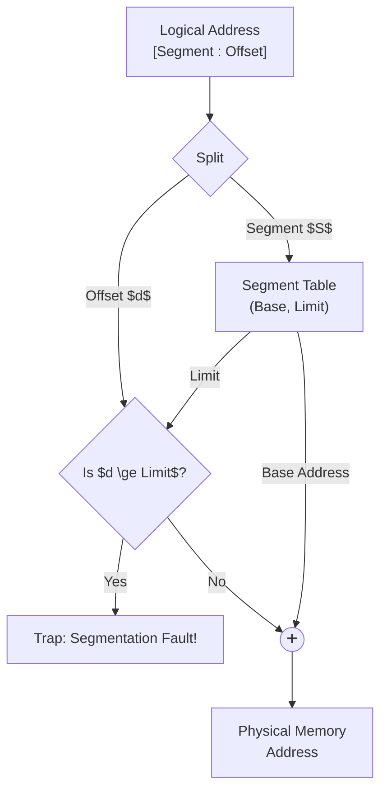
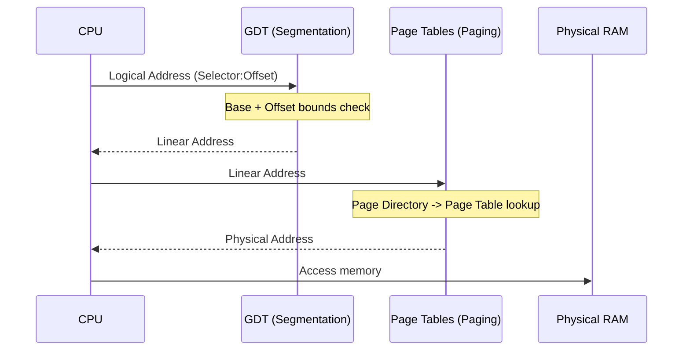

When programmers visualize how their code runs, they naturally think in terms of logical modules. We envision a block of executable instructions (a function), a global symbol table for variables, a dynamic heap growing upwards for `malloc` or `new`, and a call stack growing downwards. These are distinct, semantically meaningful entities. However, physical RAM is brutally simple: it is just a flat, contiguous, linear array of bytes from address 0 to $N-1$. 

In the early days of operating systems, bridging this semantic gap between the programmer's logical view and the hardware's linear reality birthed **Segmentation**. Instead of forcing the entire process into one monolithic chunk of physical memory, the OS allowed a program to be divided into these logical "segments" (Code, Data, Heap, Stack). Each segment could be mapped to a different physical location in RAM. 

This abstraction was powerful—it provided isolation, sharing, and logical organization. But mapping variable-sized segments into a fixed physical space created a pervasive, system-killing disease: **Memory Fragmentation**. Understanding how systems originally combatted fragmentation via segmentation, and why this ultimately paved the way for modern paging, is crucial for any systems engineer working near the metal.

## 1. The Concept of Segmentation

Segmentation organizes a program's memory into variable-sized contiguous blocks called segments. Every memory reference in a segmented system requires a two-dimensional logical address format: `<Segment Number, Offset>`.

To translate this logical address into a physical address, the CPU's Memory Management Unit (MMU) uses a **Segment Table**. Each entry in this table corresponds to a segment and contains two vital pieces of information:
- **Base**: The starting physical address where the segment resides in RAM.
- **Limit**: The maximum length (or size) of the segment.

When a memory access occurs, the hardware automatically extracts the Segment Number to index into the Segment Table. It then performs a bounds check: if the requested `Offset` is greater than or equal to the `Limit`, the hardware immediately raises a trap (often called a **Segment Fault** or General Protection Fault). If the offset is valid, the physical address is calculated as: `Physical Address = Base + Offset`.



## 2. Memory Fragmentation: Internal vs External

When an OS repeatedly allocates and deallocates variable-sized segments, holes of free memory begin to appear between occupied segments. This leads to fragmentation, which comes in two distinct flavors.

### External Fragmentation
External fragmentation occurs when the total available free memory in the system is large enough to satisfy an allocation request, but this free memory is broken up into small, non-contiguous holes scattered across RAM. Because a segment must be allocated as a contiguous block of physical memory, the allocation request fails.

### Internal Fragmentation
Internal fragmentation happens when the OS or memory allocator provides a block of memory that is larger than what the program actually requested. The excess memory *inside* the allocated partition is wasted because the allocator cannot dole it out to anyone else. For example, if you request 35 bytes from an allocator that only operates in fixed 64-byte chunks, you waste 29 bytes to internal fragmentation.

| Feature | External Fragmentation | Internal Fragmentation |
|---------|------------------------|------------------------|
| **Definition** | Free memory exists but is non-contiguous. | Allocated memory is larger than requested. |
| **Where it occurs** | Between allocated memory segments/blocks. | Inside allocated memory segments/blocks. |
| **Primary Cause** | Variable-sized allocations and deallocations. | Fixed-sized partitions or alignment constraints. |
| **Solution** | Compaction, Paging (allowing non-contiguous mapping). | Better allocator sizing (e.g., slab allocation), smaller block sizes. |

### The Compaction Problem
The naive theoretical solution to external fragmentation is **Compaction** (or memory defragmentation). The OS suspends all running processes, slides their memory contents tightly together to consolidate all free space into one large contiguous block, and then resumes execution. 

In practice, compaction is prohibitively expensive. Moving gigabytes of memory takes significant time, freezing all threads. Furthermore, if physical addresses change, every single base register and segment table in the system must be meticulously updated.

## 3. Dynamic Memory Placement Strategies

When an OS needs to allocate a segment of size $S$ from a list of free holes, it must choose which hole to use. The three classic placement algorithms are:

1. **First-Fit**: Search the free list from the beginning and allocate the first hole that is $\ge S$. 
   - *Pros*: Very fast.
   - *Cons*: Tends to concentrate allocations at the front of memory, leaving small, unusable slivers.
2. **Best-Fit**: Search the *entire* list for the smallest hole that is $\ge S$.
   - *Pros*: Minimizes the leftover wasted space for that specific allocation.
   - *Cons*: Creates tiny, useless leftover fragments (the "sliver" problem) and is computationally slower.
3. **Worst-Fit**: Allocate the largest available hole in the entire list.
   - *Pros*: Leaves behind a large enough chunk that can likely be used by subsequent allocations.
   - *Cons*: Ruins large contiguous blocks, making it impossible to satisfy very large allocations later; slow to search.

### The 50-Percent Rule
Statistical analysis (often attributed to Knuth) provides a sobering mathematical truth about external fragmentation: if allocation and deallocation occur randomly, for every $N$ allocated blocks, approximately $0.5N$ blocks are lost to external fragmentation. This means that, statistically, one-third of memory may be unusable at any given time. This math proved that pure variable-sized segmentation was unsustainable.

## 4. Segmentation with Paging: The x86 Protected Mode Reality

Because variable-sized segments made external fragmentation inevitable, engineers realized they needed a system that mapped logical memory to physical memory in fixed-size blocks (pages) to eliminate external fragmentation entirely. 

However, early Intel x86 architectures (like the 80286 and 80386) had already heavily committed to segmentation. To bridge the gap, the 32-bit x86 architecture introduced a hybrid, two-stage translation mechanism:

1. **Logical to Linear (Segmentation)**: A Logical Address `[Segment Selector : Offset]` is translated via the **Global Descriptor Table (GDT)** or Local Descriptor Table (LDT) into a Linear Address.
2. **Linear to Physical (Paging)**: The Linear Address is then passed through the Page Tables to find the actual Physical Address.

Segment Selectors are held in dedicated CPU registers: `CS` (Code), `DS` (Data), `SS` (Stack), and `ES` (Extra). 



### Why 64-bit x86-64 Flat-Lined Segmentation
When AMD designed the 64-bit extension (x86-64), they recognized that OS developers hated managing segments, preferring a "flat memory model" where memory is one continuous linear space translated exclusively by paging. 

In 64-bit mode, hardware segmentation is almost entirely disabled. The `CS`, `DS`, `ES`, and `SS` segment base addresses are forcibly treated as `0` by the hardware, and limit checks are bypassed. The only exceptions are the `FS` and `GS` segment registers, which were retained to provide a hardware-accelerated way to point to Thread Local Storage (TLS).

## 5. Practical Investigation & Memory Layout Inspection

Even though hardware segmentation is mostly flat in modern OSs, the *logical* concept of segments remains deeply embedded in binary formats like ELF (Executable and Linkable Format).

You can inspect the segments (Program Headers) the OS loader maps into memory using `readelf`:

```bash
# View program headers (segments) in a binary
readelf -l /bin/ls

# Typical Output snippet:
# Type           Offset   VirtAddr   PhysAddr   FileSiz MemSiz  Flg Align
# LOAD           0x000000 0x00400000 0x00400000 0x1d3d4 0x1d3d4 R E 0x200000  <-- CODE
# LOAD           0x01e000 0x0061e000 0x0061e000 0x00408 0x00458 RW  0x200000  <-- DATA/BSS
```

When the process runs, the kernel maps these logical segments into the virtual address space, which you can see dynamically:

```bash
cat /proc/self/maps
```
*(You'll see distinct regions for the executable code, heap, loaded shared libraries like `libc`, and the stack.)*

### Thread Local Storage via the FS Register
In modern Linux, the `FS` segment register is utilized to point to the Thread Control Block (TCB). You can see this in `gdb` when debugging a C program or Go binary:

```gdb
(gdb) info registers fs
(gdb) x/1xg $fs_base
```
The OS swaps the `FS` base register on every thread context switch, allowing thread-local variables to be quickly accessed as offsets from `%fs:0x0` without requiring complex pointer arithmetic.

## 6. Real-World Mental Anchors

- **The Obvious Case**: A buffer overflow occurs because a program writes past the end of a logically allocated array. In a purely segmented system, if the write crosses the segment limit, the hardware MMU catches it instantly (Segment Fault).
- **The Counter-Intuitive Case**: Segmentation hardware isn't actually dead in x86-64. Go goroutines and `glibc` pthreads rely explicitly on the `FS` and `GS` segment registers. When a thread accesses a TLS variable like `errno`, it is translated in hardware relative to the segment register.
- **The Failure Mode / Edge Case**: Memory fragmentation can still crash systems today even with paging. Over time, physical memory can suffer external fragmentation of *huge pages* (2MB/1GB pages). If an application requests a 2MB contiguous huge page, but physical RAM is heavily fragmented into 4KB chunks, the kernel must perform expensive memory compaction (often seen as sudden latency spikes in databases).

## 7. ✕ What People Get Wrong

- **"Segmentation and Paging are the same thing."** No. Segmentation maps logical, variable-sized units (code, stack) to memory. Paging maps arbitrary fixed-sized blocks (usually 4KB) purely to solve physical fragmentation.
- **"Segmentation faults (segfaults) in Linux mean a segment limit was violated."** In modern 64-bit Linux, a "Segmentation Fault" (SIGSEGV) is actually a *Page Fault* that couldn't be resolved (e.g., dereferencing a NULL pointer or an unmapped page). The name "segfault" is a historical artifact from the POSIX standard.

## 8. Why This Matters

For systems and latency engineers, understanding fragmentation is vital. Writing highly optimized, low-latency code (like high-frequency trading platforms or database engines) often involves bypassing the OS's general-purpose allocators and building custom memory pools or slab allocators to strictly control internal and external fragmentation. Knowing how hardware translates these addresses informs how you align structs to cache lines and page boundaries to maximize TLB (Translation Lookaside Buffer) efficiency.

## 9. Key Takeaways

- **Segmentation** divides memory into logical, variable-sized chunks based on program semantics (Code, Data, Stack).
- **External Fragmentation** is the deadly flaw of variable-sized allocation, leaving unusable gaps in memory, while **Internal Fragmentation** is wasted space inside fixed-size allocations.
- **Modern x86-64** flat-lines segmentation for general memory, relying entirely on Paging, but retains the `FS`/`GS` segment registers specifically for lightning-fast Thread Local Storage.

---

**Links to:**
[Virtual Memory & Address Translation](/docs/operating-system/03-memory-management/02-virtual-memory)
