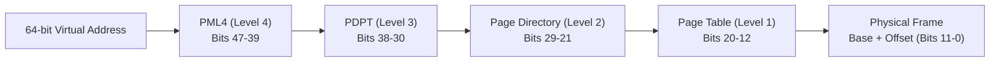
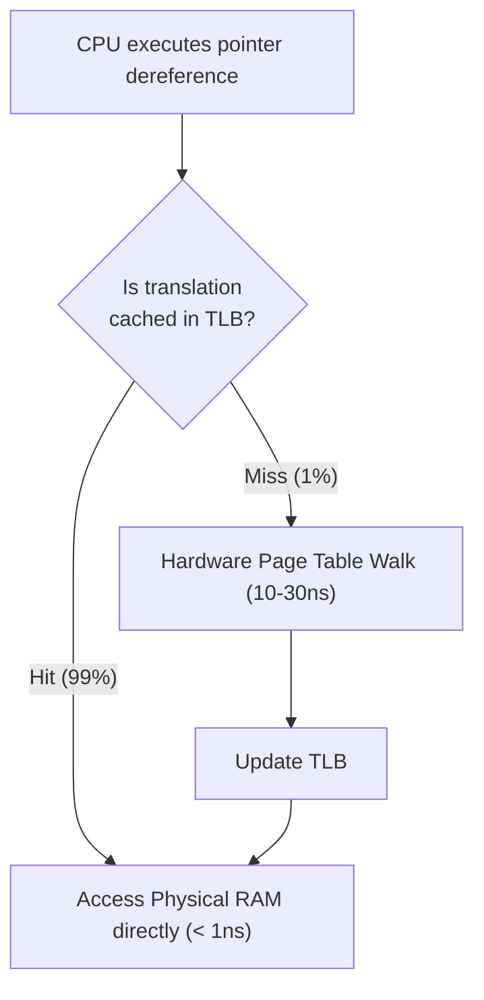
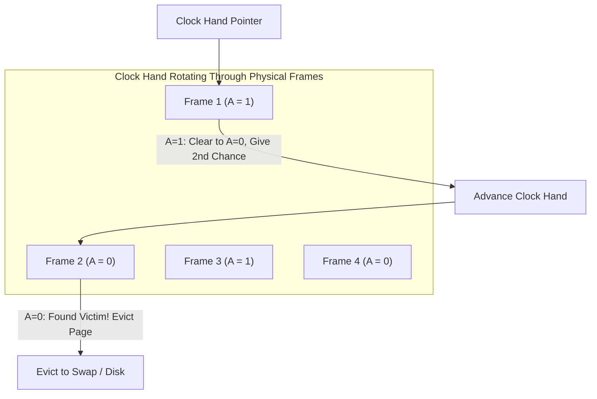

## Every process gets its own private memory — virtually

**Virtual memory** is one of the greatest illusions in computer science. It lets every process operate as if it owns a private, contiguous, 128-terabyte address space — even though physical RAM is shared with hundreds of other processes and may be only 8GB or 16GB in total.

When your code dereferences a pointer (e.g., `*ptr = 42` at address `0x7fff5fbff820`), that address is entirely **virtual**. Between the CPU execution pipeline and physical RAM sits the **Memory Management Unit (MMU)** — a hardware component that translates virtual addresses to physical frames on every single instruction.

---

## 1. Multi-Level Page Tables (x86-64 Paging)

Memory is divided into fixed-size chunks called **pages** (standard size: 4KB). Physical RAM is divided into matching **page frames**.

If the OS used a flat, single-level lookup table to map 64-bit addresses, a 48-bit address space would require $2^{36}$ entries. At 8 bytes per entry, every single process would need **512 gigabytes of RAM just for its page table**!

### The Multi-Level Tree Solution
Modern architectures solve this using a hierarchical multi-level radix tree (4 levels on standard x86-64, 5 levels on 57-bit paging systems):



### Why Multi-Level Tables Save Memory:
In real programs, 99.9% of the virtual address space is unused (the vast gulf between the heap and the stack). If an entire region is empty, the parent directory entry is simply marked `null` (not present). The entire subtree below it is never allocated.

---

## 2. Anatomy of a Page Table Entry (PTE)

Each 64-bit Page Table Entry contains vital hardware flags:

| Bit Flag | Name | Function & Purpose |
| :--- | :--- | :--- |
| **P (Present)** | Resident Flag | `1` = page is in physical RAM. `0` = page is on disk (swap) or unallocated. Triggers a **Page Fault** if accessed while `0`. |
| **R/W** | Read/Write | `0` = Read-only (e.g. executable code `.text`). `1` = Read-write (heap, stack). Writing to `0` raises a Segmentation Fault. |
| **U/S** | User/Supervisor | `0` = Kernel mode only. `1` = User-mode processes can access. Prevents user code from tampering with kernel data. |
| **A (Accessed)** | Reference Bit | Hardware sets to `1` whenever this page is read or written. Used by the OS eviction algorithm to track recently used pages. |
| **D (Dirty)** | Modified Bit | Hardware sets to `1` when written to. If `1`, the OS must write changes to disk before evicting the page. If `0`, it can be safely discarded. |
| **NX / XD** | No-Execute | Hardware security bit: blocks executing instructions from data memory (prevents buffer-overflow exploits). |

---

## 3. The TLB (Translation Lookaside Buffer) & Shootdowns

Walking a 4-level page table requires **4 sequential memory reads** for every single instruction — which would make computers 400% slower!

To prevent this, the CPU caches recent translations in a super-fast hardware cache: the **TLB (Translation Lookaside Buffer)**.
- **TLB Hit**: Address translation completes in **< 1 nanosecond**.
- **TLB Miss**: CPU hardware page walker traverses PML4 $\to$ PDPT $\to$ PD $\to$ PTE in memory (~10–30 nanoseconds), then caches the result in the TLB.



### Multi-Core Invalidation: TLB Shootdowns
When the kernel modifies a page table (e.g., freeing memory or swapping out a page), cached entries on other CPU cores become invalid.
The kernel sends **Inter-Processor Interrupts (IPIs)** to all other cores, forcing them to flush their local TLBs. Under high memory churn on massive multi-socket servers, **TLB shootdown storms** can consume significant CPU time.

---

## 4. Minor vs Major Page Faults

When a thread accesses an address where the PTE has Present = `0`, the CPU raises an interrupt: a **Page Fault**.

Not all page faults are errors; most are the normal mechanism of demand-driven computing:

### Minor Page Fault (Soft Fault)
- The requested data is **already in physical RAM**, but the process's page table has not yet been mapped to it.
- **Examples**:
  - *Lazy Allocation*: When you call `malloc(1GB)`, the kernel gives you virtual space, but allocates zero physical RAM. When you first write to a byte, a minor page fault fires, the kernel grabs a free frame from the Buddy Allocator, writes the PTE, and resumes your code in microseconds.
  - *Copy-on-Write (CoW)*: During `fork()`, parent and child share read-only pages. When one writes, a minor fault clones just that single 4KB page.

### Major Page Fault (Hard Fault)
- The requested page is **not in physical RAM** — it was swapped out to an SSD/disk, or must be read from a file on disk (memory-mapped files via `mmap`).
- **Cost**: The thread blocks while the kernel initiates disk I/O. Takes **thousands to millions of nanoseconds** (~5–10 milliseconds).

---

## 5. Page Eviction: The Clock Algorithm

When physical RAM is completely full and a new page is demanded, the kernel must choose an existing page to evict. The theoretical ideal is Belady's Optimal Algorithm (evict the page that won't be used for the longest time in the future), but the OS cannot predict the future.

Modern OSes approximate Least Recently Used (LRU) using the **Clock (Second-Chance) Algorithm**:



1. Frames are arranged in a circular buffer with a sweeping clock hand pointer.
2. If the current frame has Accessed = `1`, the OS clears it to `0` ("giving it a second chance") and advances the hand.
3. If the hand encounters a frame with Accessed = `0`, that frame has not been referenced since the last sweep: it is selected as the **victim** and evicted!

---

## 6. Diagnostic & Debugging Toolchain

### Monitor Page Faults with `sar` and `vmstat`
```bash
# Monitor minor faults (fault/s) and major faults (majflt/s) every second
sar -B 1

# Check swap in (si) and swap out (so)
vmstat 1
```

### Profile TLB Cache Misses with `perf`
```bash
# Measure data TLB loads vs misses during application execution
perf stat -e dTLB-loads,dTLB-load-misses ./my-workload
```

---

## Key Takeaways

1. **Virtual memory is an active hardware contract**: Every memory access is translated by the MMU using multi-level page tables.
2. **`malloc()` allocates address space, not RAM**: Physical RAM is populated lazily upon write via minor page faults.
3. **Major page faults are performance killers**: Keep working sets in resident RAM to avoid blocking on disk I/O.

---

Links to: **[Thrashing, Page Replacement Algorithms & The Working Set](/docs/operating-system/03-memory-management/03-thrashing-page-replacement)** (what happens when memory demands exceed physical RAM).

