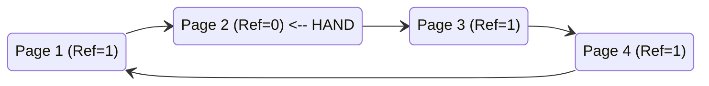
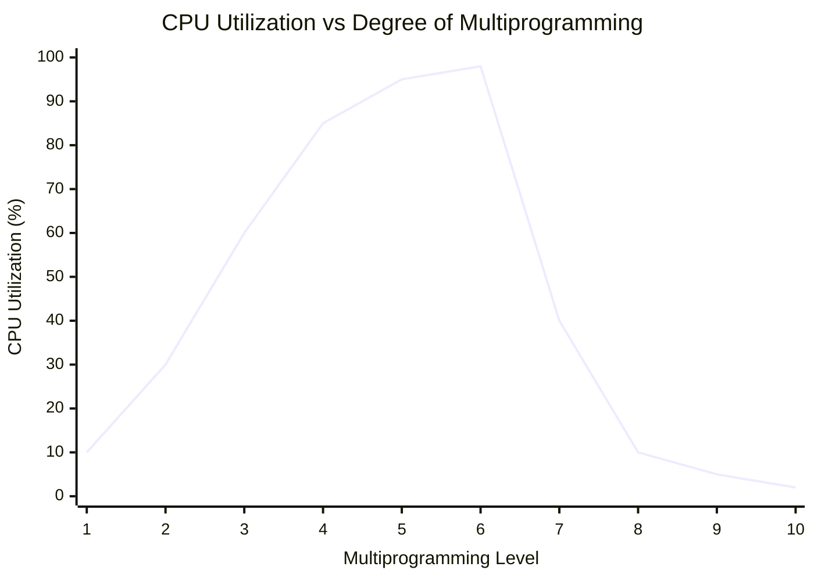

The illusion of infinite RAM is one of the most elegant fictions engineered into modern operating systems. Virtual memory allows processes to believe they own vast, contiguous expanses of memory, oblivious to the fact that they are sharing a strictly limited pool of physical silicon. As long as the active footprint of all running processes fits within the physical memory, the system operates seamlessly.

But abstractions inevitably leak when pushed to their limits. When the total memory actively demanded by running programs exceeds the available physical page frames, the operating system must constantly swap pages in and out of secondary storage. This leads to a catastrophic performance collapse known as **thrashing**.

Understanding how the OS decides which pages to keep in memory (page replacement algorithms), how to model memory demand (the working set), and how to detect when the system is collapsing under memory pressure is crucial for any engineer building high-performance or latency-sensitive applications.

---

## 1. Demand Paging & Effective Access Time (EAT)

Modern operating systems do not load an entire program into RAM upon execution. Instead, they use **demand paging**, a form of lazy evaluation. When a process starts, its pages are mapped into the virtual address space but marked as "not present" in the page tables. 

The physical memory (RAM) is allocated only when the process actually tries to read from or write to a page, triggering a hardware interrupt known as a **page fault**.

### Minor vs. Major Page Faults
- **Minor Fault (Soft Fault):** The page is already in physical memory but not yet mapped in the process's page table (e.g., shared libraries, or reclaimed pages still in the page cache). Resolving this is cheap, requiring only a page table update.
- **Major Fault (Hard Fault):** The page is entirely missing from physical memory and must be fetched from the disk (swap space or memory-mapped file). This involves a blocking I/O operation and context switch, making it orders of magnitude slower.

### The Mathematics of Effective Access Time
Because major page faults are so expensive, even a microscopic probability of a fault drastically degrades the average memory access time. This is modeled as **Effective Access Time (EAT)**:

$$EAT = (1 - p) \times t_{mem} + p \times t_{fault}$$

Where:
- $p$ is the probability of a page fault ($0 \le p \le 1$).
- $t_{mem}$ is the memory access time (e.g., $100$ ns).
- $t_{fault}$ is the page fault service time (disk I/O latency, e.g., $8$ ms).

**Worked Calculation:**
Let's assume a memory access time of $t_{mem} = 100$ ns, and a highly optimized NVMe disk yielding a fault time of $t_{fault} = 8$ ms ($8,000,000$ ns). 

Suppose the page fault rate is just $p = 0.0001$ (one fault per 10,000 accesses).

$$EAT = (1 - 0.0001) \times 100 + 0.0001 \times 8,000,000$$
$$EAT \approx 100 + 800 = 900 \text{ ns}$$

Even at a remarkably low fault rate of 0.01%, the effective memory access time degrades from $100$ ns to $900$ ns — an **800% degradation**. If the disk were a traditional HDD with a $20$ ms latency, performance would drop into the abyss. This math proves why operating systems go to extreme lengths to minimize page faults.

---

## 2. Page Replacement Algorithms

When a page fault occurs and physical memory is completely full, the OS must evict an existing page to make room. If the evicted page was modified (dirty), it must first be written back to disk. The strategy used to pick the victim page is the **page replacement algorithm**.

Let's evaluate the primary algorithms using a standard reference string (the sequence of pages accessed by a program):
`7, 0, 1, 2, 0, 3, 0, 4, 2, 3, 0, 3, 2, 1, 2, 0, 1, 7, 0, 1`
Assume a physical memory size of **3 frames**.

### FIFO (First-In, First-Out)
FIFO is the simplest approach: the OS maintains a queue of all pages in memory. The oldest page is replaced first, regardless of how often it's used.

**Trace (excerpt):**
| Ref | 7 | 0 | 1 | 2 | 0 | 3 | 0 | 4 | 2 | 3 |
|---|---|---|---|---|---|---|---|---|---|---|
| F1| 7 | 7 | 7 | **2** | 2 | 2 | 2 | **4** | 4 | 4 |
| F2|   | 0 | 0 | 0 | 0 | **3** | 3 | 3 | **2** | 2 |
| F3|   |   | 1 | 1 | 1 | 1 | **0** | 0 | 0 | **3** |
|Fault| * | * | * | * |   | * | * | * | * | * |

*Total faults for full string: 15.*
FIFO is blind to usage patterns. Heavily used variables initialized early (like a global loop counter) will be continuously swapped out and back in.

### Optimal (OPT / Belady's Min)
The optimal algorithm replaces the page that will not be used for the **longest period of time in the future**. It requires prophetic knowledge of future memory accesses, making it impossible to implement in real operating systems. However, it serves as the absolute benchmark for evaluating other algorithms.

**Trace (excerpt):**
| Ref | 7 | 0 | 1 | 2 | 0 | 3 | 0 | 4 | 2 | 3 |
|---|---|---|---|---|---|---|---|---|---|---|
| F1| 7 | 7 | 7 | 2 | 2 | 2 | 2 | 2 | 2 | 2 |
| F2|   | 0 | 0 | 0 | 0 | 0 | 0 | 4 | 4 | 4 |
| F3|   |   | 1 | 1 | 1 | 3 | 3 | 3 | 3 | 3 |
|Fault| * | * | * | * |   | * |   | * |   |   |

*Total faults for full string: 9.*

### Least Recently Used (LRU)
Since the OS cannot predict the future, it uses the past as a proxy. LRU replaces the page that has not been used for the longest period of time. This exploits **temporal locality** — the principle that recently accessed data is likely to be accessed again.

Implementing pure LRU is expensive. It requires either attaching a timestamp to every memory access (massive hardware overhead) or maintaining a doubly-linked list (stack) of pages that must be updated on *every single memory reference*.

*Total faults for full string: 12.*

### Clock / Second-Chance Algorithm
Because pure LRU is too slow, modern OS kernels approximate it using the Clock algorithm. 
- The hardware sets a **Reference Bit (A)** to `1` whenever a page is accessed.
- The OS arranges page frames in a circular queue with a sweeping pointer ("clock hand").
- When a page must be replaced, the OS sweeps the hand:
  - If the bit is `1`, the OS clears it to `0` (giving it a "second chance") and moves to the next page.
  - If the bit is `0`, the page is evicted.



### Master Comparison Table

| Algorithm | Fault Rate | Hardware Overhead | Implementation Complexity | Used in Production? |
| :--- | :--- | :--- | :--- | :--- |
| **FIFO** | High | Low | Low (Simple Queue) | No (Terrible performance) |
| **OPT** | Absolute Minimum | N/A | Impossible | No (Theoretical benchmark) |
| **LRU** | Low | Very High | High (Stacks/Counters) | Rarely (Too expensive) |
| **Clock/Approximations** | Low | Moderate (Ref bits) | Moderate | **Yes** (Linux, Windows, macOS) |

---

## 3. Belady's Anomaly

Intuition suggests that giving a computer more physical memory (RAM) will always result in fewer page faults. In 1969, Laszlo Belady proved this intuition wrong.

**Belady's Anomaly** is the phenomenon where increasing the number of physical page frames actually *increases* the number of page faults under certain algorithms (like FIFO).

Let's use the reference string: `1, 2, 3, 4, 1, 2, 5, 1, 2, 3, 4, 5`.

**With 3 Frames (FIFO):**
Faults occur at accesses: `1, 2, 3, 4, 1, 2, 5, (hit 1, hit 2), 3, 4, 5`. 
Total Faults = **9**.

**With 4 Frames (FIFO):**
Faults occur at accesses: `1, 2, 3, 4, (hit 1, hit 2), 5, 1, 2, 3, 4, 5`. 
Total Faults = **10**.

We added 33% more memory, but performance got strictly worse!

### Why does this happen? (Stack Algorithms)
Belady's anomaly occurs in algorithms that lack the **inclusion property**. 
According to **Mattson's Theorem**, an algorithm is a *Stack Algorithm* if the set of pages in memory with $N$ frames is always a strict subset of the pages in memory with $N+1$ frames at any given time $t$:
$$S_t(n) \subseteq S_t(n+1)$$

LRU and OPT possess this property. If you increase the cache size, everything that was in the smaller cache is guaranteed to still be in the larger cache. FIFO does *not* guarantee this; adding a frame shifts the entire timeline of evictions, potentially flushing out highly accessed pages right before they are needed.

---

## 4. Thrashing — The Memory Wall

When memory is overcommitted, the system enters a death spiral called **thrashing**.

**The Vicious Feedback Loop:**
1. A process page faults and blocks on disk I/O.
2. Because processes are blocked, CPU utilization drops.
3. The OS scheduler sees low CPU utilization and assumes the system is underloaded. It increases the **degree of multiprogramming** by dispatching more processes.
4. These new processes need memory, forcing more evictions of active pages.
5. Processes page fault even more frequently.
6. The disk queue saturates. CPU utilization collapses near 0%, but the system is completely unresponsive.


*(The sharp drop after level 6 represents the onset of thrashing).*

---

## 5. The Working Set Model & Page Fault Frequency

To prevent thrashing, the OS must answer one question: *Exactly how much memory does a process actually need right now?*

### Peter Denning's Working Set Model
A process does not access its entire address space uniformly. It moves through phases, clustering its accesses around specific sets of pages (e.g., executing a loop, then moving to a sorting function).

The **Working Set $W(t, \Delta)$** is the set of pages heavily referenced by a process at time $t$ over a backward-looking time window $\Delta$.

**The Balance Condition:**
For a system to remain stable and avoid thrashing, the sum of all working sets must be strictly less than the total physical memory:
$$\sum |W_i| < \text{Total RAM}$$

If this condition is violated, the OS must ruthlessly suspend (swap out entirely) one or more processes to free up frames for the others.

### Page Fault Frequency (PFF)
Calculating the exact working set in real-time is too expensive. Instead, operating systems use **Page Fault Frequency (PFF)** as a proxy.
- The OS establishes an **Upper Bound** and **Lower Bound** for acceptable fault rates per process.
- If a process's fault rate exceeds the upper bound, it is aggressively demanding memory; the OS allocates it more frames.
- If the rate drops below the lower bound, the process has too much idle memory; the OS reclaims frames from it.

---

## 6. Practical Investigation & Kernel Telemetry

When investigating a sluggish Linux server, systems engineers use specific tools to diagnose memory pressure and thrashing.

### 1. `vmstat 1`
Monitors virtual memory statistics every 1 second.
Look at the `si` (swap in) and `so` (swap out) columns. If these are consistently non-zero, the system is actively swapping, and thrashing is imminent.

### 2. `sar -B 1`
Reports paging statistics. Watch `fault/s` (minor faults) and especially `majflt/s` (major faults requiring disk I/O). A spike in `majflt/s` correlates directly with latency spikes.

### 3. Linux PSI (Pressure Stall Information)
Modern Linux kernels expose memory pressure directly via `/proc/pressure/memory`.
```bash
cat /proc/pressure/memory
some avg10=2.34 avg60=1.12 avg300=0.45 total=145678
full avg10=0.00 avg60=0.00 avg300=0.00 total=2345
```
- `some`: Percentage of time *some* tasks were delayed waiting for memory.
- `full`: Percentage of time *all* non-idle tasks were blocked waiting for memory (pure thrashing).

### 4. `perf` Counters
To profile a specific binary's memory behavior:
```bash
perf stat -e page-faults,major-faults,minor-faults ./my_application
```

---

## 7. Real-World Mental Anchors

- **The Obvious Case:** Running a massive machine learning matrix multiplication in Python that requires 64GB of RAM on a laptop with 16GB. The OS relies heavily on the disk swap file, and the program takes weeks instead of minutes.
- **The Counter-Intuitive Case:** Caching engines. If you give a caching engine (which uses FIFO-like eviction) *slightly* more memory in a container, you might trigger Belady's Anomaly under specific workload patterns, actually decreasing cache hit rates and slowing down the API.
- **The Failure Mode / Edge Case:** Redis swapping. Redis is designed to be purely in-memory. If the OS swaps even a few Redis pages to disk, an operation that normally takes 0.1ms suddenly takes 10ms (a major fault). This 100x latency spike causes upstream API timeouts and cascading microservice failures.

---

## 8. ✕ What People Get Wrong

- **"Adding more RAM always makes programs faster."**
  *False.* If a program's working set already fits entirely in physical memory, adding 64GB more RAM will not speed up its execution by a single nanosecond. More RAM only helps if the system was previously thrashing or if the extra RAM is utilized by the OS page cache for file I/O.
- **"Swap space should always be double your physical RAM."**
  *False.* This is an antiquated rule from the 1990s when servers had 128MB of RAM. If a modern database server with 256GB of RAM runs out of memory, having 512GB of slow disk swap will simply guarantee that the server enters a thrashing death spiral that takes days to recover from. Modern cloud infrastructure often disables swap entirely, preferring the OOM (Out Of Memory) killer to rapidly terminate rogue processes and maintain overall node health.

---

## 9. Why This Matters

For software engineers, understanding page replacement and thrashing bridges the gap between application code and physical hardware limitations. 

In high-frequency trading, cloud architecture, and database engineering, a major page fault is considered a catastrophic latency event. By understanding the Working Set model, engineers can architect applications that respect memory locality (e.g., using arena allocators or data-oriented design) ensuring that hot paths never trigger the OS's eviction mechanisms.

**Key Takeaways:**
1. **Major page faults are lethally slow.** A disk I/O operation is orders of magnitude slower than a RAM lookup; even a tiny fraction of page faults will destroy application throughput.
2. **LRU rules, but Clock approximates.** True Least Recently Used algorithms are too computationally expensive for hardware. Modern operating systems rely on reference bits and sweeping clock algorithms to approximate LRU efficiently.
3. **Thrashing is a systemic collapse.** When active working sets exceed physical memory, the OS wastes all its CPU cycles swapping pages instead of doing useful work.

---

**Links to:** [Memory Allocators, Huge Pages & The OOM Killer](/docs/operating-system/03-memory-management/04-memory-allocators-oom)
