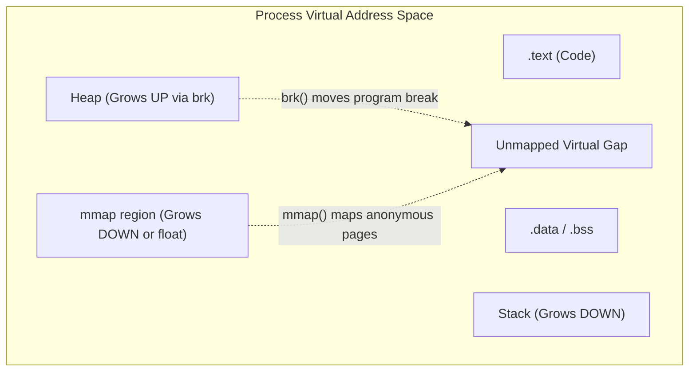
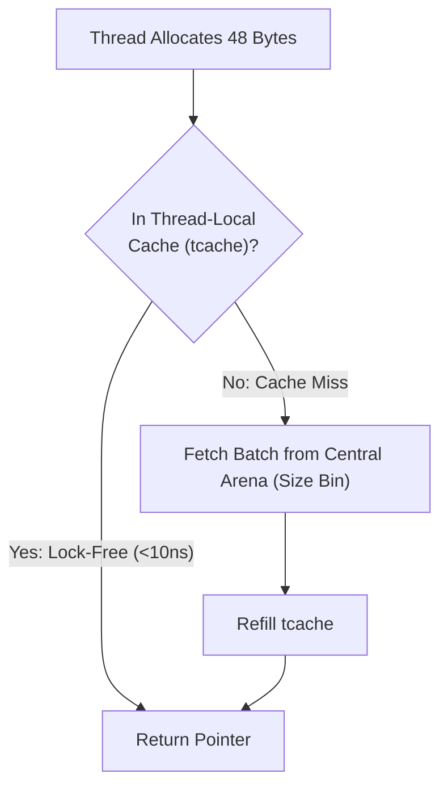
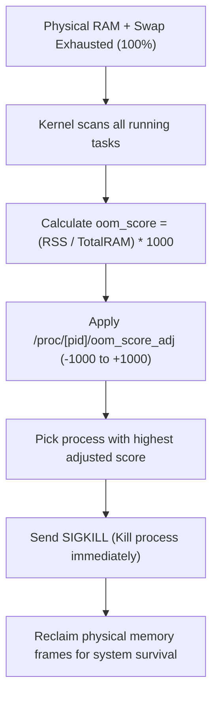

## Where does malloc() actually get its bytes?

In high-level languages, developers allocate memory without a second thought: `new Object()`, `[]byte`, or `malloc(1024)`. But the operating system kernel does not know what a "string" or a "struct" is. The kernel only understands **pages** (typically 4,096 bytes at a time).

If your program asked the kernel for a page every time you allocated a 32-byte object, the overhead of system calls and internal page fragmentation would grind the machine to a halt.

Between application code and the kernel sits the **User-Space Memory Allocator** (`glibc ptmalloc`, `jemalloc`, `tcmalloc`, or Go's runtime allocator). Its job is to request large chunks of address space from the kernel and subdivide them into tiny, high-speed allocations.

---

## 1. The Kernel Memory Primitives: brk() vs mmap()

The allocator interacts with the Linux kernel using two primary system calls:



### 1. `brk()` / `sbrk()` (Heap Expansion)
- The heap starts immediately above the `.data` segment.
- A pointer called the **program break** marks the current top of the heap.
- The allocator invokes `brk(new_address)` to tell the kernel to move the break up, expanding the continuous heap.
- **Drawback**: Deallocation must be LIFO (Last-In, First-Out). If you allocate 100MB and then allocate 1KB on top, you cannot release the 100MB back to the OS until the 1KB at the very top is freed!

### 2. `mmap()` (Memory Mapping)
- Requests arbitrary page-aligned chunks anywhere in the unallocated address space (`MAP_ANONYMOUS | MAP_PRIVATE`).
- For large allocations (typically > 128KB in glibc), allocators use `mmap()`.
- **Advantage**: Can be unmapped (`munmap()`) at any time, returning address space directly to the kernel regardless of allocation order.

---

## 2. Modern Allocators: ptmalloc vs jemalloc vs tcmalloc

Why do production systems like Redis, MySQL, and Kubernetes binaries often replace the default glibc allocator with **jemalloc** or Google's **tcmalloc**?

### The glibc Default: `ptmalloc`
- Divides memory into multiple **arenas** to reduce lock contention across threads (up to 8 times the CPU core count).
- **Weakness**: Heavy multithreaded allocations cause severe **heap fragmentation**. Memory freed by your application is frequently trapped inside arenas and cannot be returned to the OS, leading to runaway RSS memory bloat.

### jemalloc (FreeBSD, Redis, Meta) & tcmalloc (Google)
Modern high-performance allocators eliminate lock contention and fragmentation through three architectural breakthroughs:
1. **Thread-Local Caching (`tcache`)**: Each thread has its own private lock-free cache of small objects. Most allocations cost **zero synchronization**.
2. **Segregated Size Classes**: Allocations are rounded to strict bin sizes (e.g., 8, 16, 32, 48, 64 bytes). Objects of the same size share contiguous slabs, virtually eliminating internal fragmentation.
3. **Active Page Purging**: Regularly calls `madvise(MADV_DONTNEED)` to tell the kernel: *"I don't need the physical RAM for these pages right now; keep the virtual address space, but drop the physical frames."*



---

## 3. Huge Pages: Transparent Huge Pages (THP)

As explored in Lesson 08, the CPU relies on the TLB to cache page translations. Standard pages are 4KB. A server running a 64GB in-memory database (like Redis or Postgres) requires **16 million page table entries**! The hardware TLB (which holds only a few thousand entries) misses constantly.

### Enter 2MB and 1GB Huge Pages
- **Huge Page**: Combines 512 standard 4KB pages into a single **2MB** entry (or 1GB).
- A 64GB database now needs only **32,768 entries** — fitting effortlessly into CPU caches and reducing TLB miss latency by 80–90%.

### The Double-Edged Sword of THP
Linux includes **Transparent Huge Pages (THP)** to automatically group 4KB pages into 2MB chunks in the background (`khugepaged`).
> [!WARNING]
> While great for machine learning and scientific computing, **THP can cause latency spikes in databases**. When memory is fragmented, `khugepaged` triggers aggressive **memory compaction stalls** (freezing client requests for tens of milliseconds). This is why Redis and MongoDB documentation recommend disabling THP in production:
> ```bash
> echo never > /sys/kernel/mm/transparent_hugepage/enabled
> ```

---

## 4. The Linux OOM (Out-of-Memory) Killer

Because Linux allows **memory overcommit** (processes can reserve more virtual address space than physical RAM exists), a catastrophic condition can occur: every process suddenly writes to its pages, and physical RAM + Swap hits **100% capacity**.

The kernel cannot fulfill new memory allocations. To prevent the entire machine from kernel-panicking, the **OOM Killer** wakes up, selects a sacrificial process, and executes `SIGKILL` (signal 9) without warning.

### How the OOM Killer Picks Its Victim: Badness Heuristic
The kernel computes an `oom_score` (0 to 1000) for every process based on:
1. **Total Resident Memory (RSS)**: Processes consuming the most RAM get the highest scores.
2. **Short Lifetime**: Long-running background daemons receive slight forgiveness over new processes.
3. **Non-Root Status**: Root processes get minor score discounts.



### Protecting Critical Daemons
You can manually insulate critical services (like `sshd`, your primary database, or monitoring agents) from ever being killed by writing to `/proc/[pid]/oom_score_adj`:

```bash
# Range is -1000 (NEVER kill) to +1000 (ALWAYS kill first)
# Completely immune to OOM Killer:
echo -1000 > /proc/<pid>/oom_score_adj

# Mark a batch worker as first to be sacrificed:
echo 800 > /proc/<pid>/oom_score_adj
```

---

## 5. Diagnostic & Profiling Toolchain

### Inspect Detailed Process Memory Footprint
```bash
# View RSS, PSS (Proportional Set Size), and dirty memory
cat /proc/<pid>/smaps_rollup
```

### Check OOM Kill Vulnerability
```bash
# View the calculated badness score of any running process
cat /proc/<pid>/oom_score

# Check system logs for past OOM kills
dmesg -T | grep -i -E "oom[-_]killer|out of memory"
```

### Profile Heap Allocation and Leaks with jemalloc
```bash
# Launch application with jemalloc profiling enabled
MALLOC_CONF="prof:true,prof_prefix:jeprof.out" LD_PRELOAD=/usr/lib/libjemalloc.so ./my-app
```

---

## Key Takeaways

1. **Allocators bridge granularity**: `brk` and `mmap` allocate whole pages from the kernel; `jemalloc`/`tcmalloc` allocate exact byte slices in user space.
2. **Tune THP with care**: 2MB Huge Pages slash TLB misses for big workloads, but cause compaction stalls in latency-sensitive databases.
3. **Control your OOM destiny**: Always configure `oom_score_adj` in systemd units or Kubernetes container manifests for mission-critical workloads.

---

Links to: **[NUMA Architecture & Memory-Mapped I/O](/docs/operating-system/03-memory-management/05-numa-mmap)** (multi-socket memory bus topology and zero-copy mmap).

