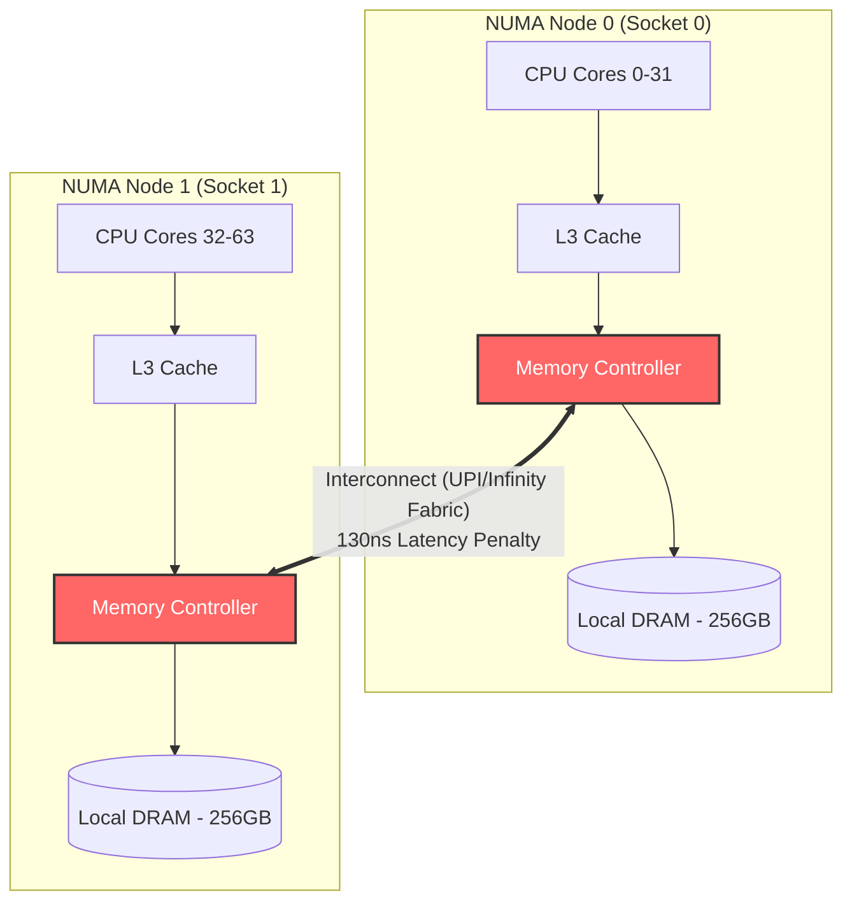
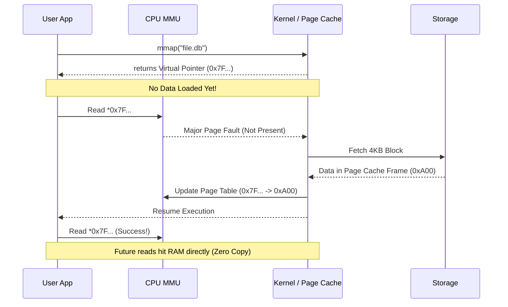

On multi-socket enterprise servers with 64+ CPU cores, physical RAM is **NOT** uniform. When a thread running on CPU core 0 (located on CPU Socket 0) tries to read an array in memory, you might expect the memory controller to just fetch it instantly. But what if that memory array physically lives on the DIMM slots attached to CPU Socket 1?

Accessing memory attached to Socket 0 takes roughly 70ns from Socket 0, but reading that exact same memory from Socket 1 over the inter-socket interconnect (like Intel UPI or AMD Infinity Fabric) takes ~130ns to 180ns. Welcome to the invisible performance killer of modern big-iron systems: **Non-Uniform Memory Access (NUMA)**.

In this masterclass, we will dive deep into the hardware reality of NUMA topology, how the Linux kernel schedules and migrates memory to hide these latency penalties, and how applications bypass standard I/O entirely using `mmap()` (Memory-Mapped Files) to let the kernel's Virtual Memory subsystem handle disk I/O as if it were RAM.

---

## 1. The Silicon Architecture of NUMA

Historically, servers used a **Symmetric Multiprocessing (SMP / UMA - Uniform Memory Access)** design. All CPUs shared a single Front-Side Bus (FSB) leading to a centralized Memory Controller Hub (Northbridge). Every CPU had identical access latency to all of RAM. However, as core counts exploded, this single bus became a massive bottleneck, completely saturated by memory traffic.

### The NUMA Solution
To scale memory bandwidth linearly with CPU cores, chipmakers decentralized the memory controllers. 
In a **NUMA Architecture**, each CPU socket (or sometimes chiplet die) contains its own Integrated Memory Controller (IMC) directly wired to its own local DRAM channels. 
Multiple sockets are stitched together using ultra-high-speed coherent interconnects (Intel **UPI** - Ultra Path Interconnect / AMD **Infinity Fabric**).

### NUMA Nodes and the NUMA Factor
A **NUMA Node** is generally defined as a grouping of CPU cores and their directly attached memory. 
- **Local Memory Access**: A CPU fetching memory attached to its own local node. Fastest, highest bandwidth.
- **Remote Memory Access**: A CPU fetching memory attached to a different node. The request must traverse the inter-socket interconnect.

The performance penalty of crossing the interconnect is known as the **NUMA Factor**—typically a 1.5x to 2.5x increase in latency, and a substantial reduction in available throughput.



---

## 2. Linux Kernel NUMA Management & Policies

The Linux kernel is aggressively NUMA-aware. It boots up, queries the ACPI SRAT (System Resource Affinity Table), and constructs a **Node Distance Matrix**. 

You can view this matrix using `numactl -H`:

```bash
$ numactl -H
available: 2 nodes (0-1)
node 0 cpus: 0 1 2 3 ... 31
node 0 size: 262144 MB
node 1 cpus: 32 33 34 35 ... 63
node 1 size: 262144 MB
node distances:
node   0   1
  0:  10  21
  1:  21  10
```
*(A distance of 10 implies local access, 21 implies remote access taking ~2.1x longer).*

### NUMA Memory Allocation Policies
When your application calls `malloc()`, Linux hasn't allocated physical RAM yet. Only upon the first page fault does the kernel decide *which* NUMA node to allocate the physical frame from. Linux supports four primary allocation policies (set via `mbind()` or `numactl`):

| Policy | Behavior | Best Used For |
|--------|----------|---------------|
| `MPOL_DEFAULT` | Allocates memory on the local node of the CPU executing the faulting instruction. | General purpose, single-threaded or independent worker processes. |
| `MPOL_BIND` | Strictly allocates only from the specified node mask. Fails (OOM) if the target node is full. | Hard real-time latency-critical trading systems heavily pinned to specific CPUs. |
| `MPOL_INTERLEAVE` | Allocates pages in a round-robin fashion across specified nodes (e.g., Page 1 on Node 0, Page 2 on Node 1). | Large shared-memory databases (Redis, Memcached) to prevent single-node bus saturation. |
| `MPOL_PREFERRED` | Attempts local allocation first, but falls back to remote nodes if local is full. | The safe default fallback. |

### Automatic NUMA Balancing (Autonuma)
What happens if a thread allocates memory on Node 0, but the OS scheduler migrates the thread to Node 1 for load balancing? Suddenly, all its local memory accesses become remote!
Linux handles this via **Automatic NUMA Balancing**. The kernel periodically unmaps a process's pages (clearing the Present bit). When the thread faults on those pages again, the kernel intercepts the fault, checks the thread's current CPU node, and if it's remote, **migrates the physical memory page** to the new local node.

---

## 3. Memory-Mapped Files (`mmap`): The Zero-Copy Alternative

Understanding NUMA sets the stage for advanced memory manipulation. The most powerful tool in the systems programmer's arsenal is `mmap()`: letting the Virtual Memory system handle disk I/O.

### The Traditional I/O Tax
When you call `read()` to read a file, a massive amount of overhead occurs:
1. **Context Switch**: User space to Kernel space.
2. **DMA Copy**: Disk hardware copies blocks into the Kernel's Page Cache.
3. **CPU Copy**: Kernel copies data from the Page Cache into your user-space buffer `char buf[1024]`.
4. **Context Switch**: Kernel space back to User space.

### How `mmap()` works
`mmap()` asks the kernel to map a file directly into the process's virtual address space. 

```c
// Map 1GB file entirely into virtual memory
int fd = open("huge_data.bin", O_RDONLY);
void *mapped_data = mmap(NULL, 1024*1024*1024, PROT_READ, MAP_SHARED, fd, 0);

// Just read it like an array! No read() syscalls.
char first_byte = ((char*)mapped_data)[0]; 
```

**What happens under the hood?**
1. `mmap()` returns immediately. It only allocates Virtual Address Space. No disk I/O happens yet.
2. When the app dereferences the pointer (`((char*)mapped_data)[0]`), the MMU triggers a **Page Fault**.
3. The Kernel Page Fault Handler steps in, realizes this virtual address maps to an offset in `huge_data.bin`.
4. The kernel fetches the 4KB block from disk into the Kernel Page Cache.
5. The kernel updates the process's Page Table to point *directly* at the Page Cache frame.
6. The user-space app reads directly from the kernel memory. **Zero CPU copies. Zero `read()` syscalls.**



---

## 4. The Pitfalls & Realities of `mmap()` in Production

`mmap()` sounds like a silver bullet, and it heavily powers embedded databases like SQLite, LMDB, BoltDB, and Kafka's index files. But in massive enterprise databases, `mmap()` hides terrifying failure modes.

### The Dark Side of `mmap()`
1. **Hidden Blocking I/O**: A memory dereference (`*ptr`) is supposed to take 1 nanosecond. If that page isn't in RAM, it triggers a Major Page Fault. Your thread is put to sleep for *milliseconds* while the disk spins. You cannot use asynchronous/non-blocking I/O (`epoll`) on memory dereferences. 
2. **SIGBUS Fatal Errors**: If another process truncates the file while you have it mapped, and you try to access the mapped region past the new EOF, the kernel sends a `SIGBUS` signal, immediately crashing your program.
3. **TLB Shootdown Overhead**: For massive mappings (100GB+), the OS struggles to manage the Page Tables. When the kernel needs to evict a page from the Page Cache, it must aggressively acquire locks and invalidate TLB entries across all CPU cores (TLB Shootdowns), stalling the entire machine.

Because of this, modern heavy-duty databases (ScyllaDB, modern PostgreSQL, MongoDB WiredTiger) actively avoid `mmap()`, preferring explicit asynchronous I/O (`io_uring`) combined with Direct I/O (`O_DIRECT`), bypassing the OS Page Cache entirely to manage their own buffers.

---

## 5. Practical Investigation & Profiling Toolchain

You can profile NUMA and memory-maps on Linux using standard tools:

**Monitor NUMA Cache Hits vs Misses:**
```bash
# View memory allocations per node for a process
$ numastat -c -p <pid>

# Pin a process aggressively to Node 0 CPU and Memory
$ numactl --cpunodebind=0 --membind=0 ./my-low-latency-app
```

**Trace `mmap` Page Faults using `perf`:**
```bash
# Count major page faults (disk I/O) vs minor (already in RAM)
$ perf stat -e page-faults,major-faults,minor-faults ./app
```

**View process memory maps (`smaps`):**
```bash
$ cat /proc/1234/smaps | grep -i numa
# Shows how many pages of a specific mapping live on Node 0 vs Node 1
```

---

## 6. Real-World Mental Anchors / Examples

### The Obvious Case
A high-frequency trading application pins its networking thread to CPU Core 2 (Node 0) and forces all its ring-buffer memory allocations to `membind=0`. It ensures it never pays the UPI interconnect latency tax, squeezing out microsecond-level determinism.

### The Counter-Intuitive Case: Interleaving for JVMs
You have a 512GB server (256GB on Node 0, 256GB on Node 1). You boot a massive Java application with `-Xmx400G`. If the JVM boots and hits Node 0 hard, it might fill all 256GB of Node 0. Linux, trying to respect local allocation, might start swapping Node 0 to disk, causing the JVM to OOM or freeze, *even though Node 1 has 256GB completely empty!*
**The Fix:** Start the JVM with `numactl --interleave=all java ...`. This forces the JVM to stripe its memory evenly across both sockets. Memory access is slightly slower on average, but you completely avoid single-node OOM saturation.

### The Failure Mode: Thread Migration Latency
A multi-threaded C++ app allocates a massive 10GB graph struct on Node 0. It spawns 16 worker threads. The OS scheduler balances 8 threads to Node 0, and 8 to Node 1. The 8 threads on Node 1 now suffer a permanent 2x latency penalty because they are constantly fetching graph pointers across the NUMA interconnect, completely obliterating cache coherence.

---

## 7. ✕ What people get wrong

- **"RAM access speed is identical everywhere."** False. In a modern multi-socket server, accessing remote memory is significantly slower and competes for interconnect bandwidth.
- **"`mmap()` is always faster than `read()`."** False. `mmap()` is incredible for random reads on static data or smaller datasets that fit in RAM. But for sequential scans of massive files, `read()` with kernel read-ahead logic, or `io_uring`, often massively outperforms the page-fault overhead of `mmap()`.
- **"I don't need to care about NUMA on AWS/Cloud."** False. Large cloud instances (like AWS `m5.24xlarge`) are 2-socket NUMA machines. If you rent a huge EC2 instance and run a heavy database, NUMA topology dictates your P99 tail latency.

---

## 8. Why this matters & Key Takeaways

Understanding NUMA and memory mapping bridges the gap between hardware architecture and kernel software engineering. It is the defining line between a senior developer and a staff/principal systems engineer.

### Key Takeaways:
1. **NUMA dictates multi-socket latency**: Cross-socket memory access introduces a massive "NUMA Factor" latency penalty. Use `numactl` to pin CPU and memory affinity for extreme performance.
2. **`mmap()` enables Zero-Copy I/O**: By leveraging Virtual Memory Page Faults, applications can read files directly out of the Kernel Page Cache without the context-switch and copying overhead of `read()`.
3. **Control your Page Faults**: `mmap()` relies entirely on the OS hiding disk I/O behind memory dereferences. If the data isn't in RAM, your thread blocks uncontrollably on disk reads.

---
### Links to:
[The Virtual File System & Page Cache](/docs/operating-system/04-storage-and-io/01-vfs-and-page-cache)
