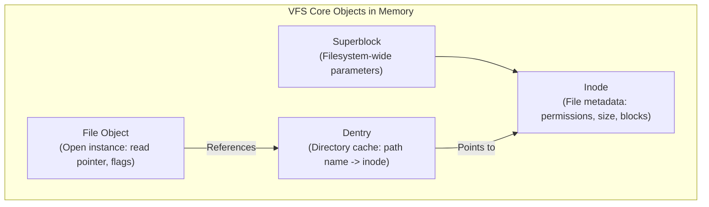
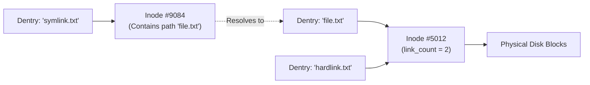
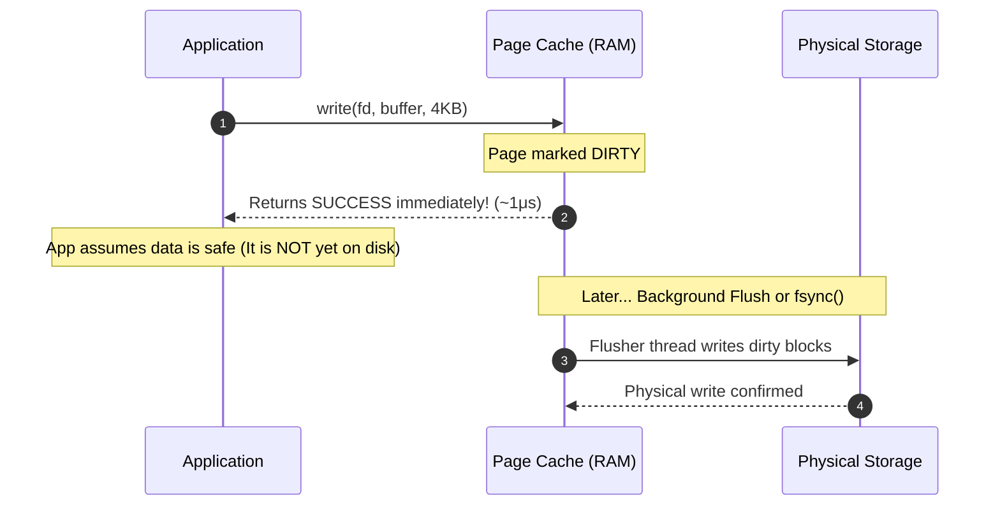

## "Everything is a file" — The VFS abstraction

One of Unix's most powerful architectural patterns is the abstraction: **everything is a file**. Whether you are reading bytes from a local NVMe drive, an ext4 partition, a network share (NFS), an in-memory pseudo-filesystem (`/proc`, `/sys`), or even a network socket — your application uses the exact same POSIX API: `open()`, `read()`, `write()`, and `close()`.

This works because the kernel does not let applications interact with physical storage drivers directly. Instead, all operations go through the **Virtual File System (VFS)**.

---

## 1. The Four Primary VFS Objects

The VFS defines a clean, object-oriented interface implemented in C using function pointer tables (`file_operations`, `inode_operations`):



1. **Superblock**: Represents an entire mounted filesystem (e.g. `/dev/sda1` mounted at `/`). Tracks block size, total free blocks, and filesystem status.
2. **Inode (Index Node)**: Represents the unique identity and metadata of a file. Stores file size, owner UID/GID, access permissions, timestamps, and pointers to the physical disk blocks containing the content. **Crucial detail**: The inode does *not* contain the file's name!
3. **Dentry (Directory Entry)**: Maps human-readable path strings to Inodes (e.g., `"app"` $\to$ Inode `74819`). The kernel caches dentries in the **dentry cache (dcache)** in RAM so looking up paths like `/var/log/nginx/access.log` does not require querying the disk on every access.
4. **File Object**: Represents an *open instance* of a file created by `open()`. Stores the current read/write offset, access mode (`O_RDONLY`, `O_WRONLY`), and references the underlying dentry. If two processes open the same file, they get separate `file` objects (independent file offsets), but share the same `dentry` and `inode`.

---

## 2. Hard Links vs Symbolic (Soft) Links

Because file names live in dentries while file data lives in inodes:



- **Hard Link**: A new dentry pointing to an *existing inode*. Increments the inode's `link_count`. Deleting `file.txt` just decrements the count; data is only destroyed when `link_count` reaches `0`. Cannot span across different filesystems.
- **Symbolic Link (Symlink)**: An entirely new inode containing the text string of a target path. If the target file is renamed or deleted, the symlink breaks ("dangling link"). Can span across different filesystems.

---

## 3. Directory Structures: Logical File Organization

Operating systems organize files into directory structures that balance lookup performance, naming isolation, and sharing:

1. **Single-Level Directory**: All files exist in a single directory. Simple, but suffers from severe name collisions and zero user isolation.
2. **Two-Level Directory**: Each user gets a dedicated directory. Solves name collisions between users, but prevents easy file sharing between collaborators.
3. **Tree-Structured Directory**: The standard hierarchical filesystem (Unix `/` root). Arbitrary subdirectory depth; files identified by absolute or relative pathnames.
4. **Acyclic-Graph Directory**: Allows directories to share subdirectories and files without cycles (achieved via Unix hard links and symlinks). Requires reference counting (`link_count`) to ensure data is only freed when the last link is deleted.
5. **General Graph Directory**: If symlinks create circular loops (e.g. `/a/b` links to `/a`), filesystem traversals (`find`, backup scanners) can loop infinitely. Solved via cycle detection algorithms and path traversal depth limits (`ELOOP` error).

---

## 4. The Page Cache: RAM as a Disk Shield


Disks (even modern NVMe SSDs) are thousands of times slower than DDR5 RAM. To make I/O fast, Linux intercepts all file reads and writes using the **Page Cache**.

### Read Path & Readahead
When your code calls `read(fd, buf, 4096)`:
1. Kernel checks if the 4KB page is already in the Page Cache in RAM.
2. **Page Cache Hit**: Data is copied directly from kernel RAM to your user buffer (~1 microsecond). Zero disk I/O occurs!
3. **Page Cache Miss**: Kernel blocks the thread, reads the page from disk into the Page Cache, copies it to the user, and initiates **readahead** (pre-fetching subsequent pages into RAM anticipating sequential reads).

### Write Path & Dirty Pages
When your code calls `write(fd, buf, 4096)`:
1. The kernel copies bytes from user space into a Page Cache page in RAM.
2. The page is marked **Dirty** in its Page Table Entry.
3. The `write()` system call **returns immediately**! The data is not yet on physical storage.
4. Background kernel threads (`kworker` flusher threads) periodically write dirty pages back to the physical drive.



---

## 4. Durability Semantics: write() vs fsync() vs O_DIRECT

Because `write()` returns while data is only in volatile RAM, **if the power cord is unplugged, your data is permanently lost**.

For systems like PostgreSQL, SQLite, and Kafka that require strict ACID durability, Linux provides control over when bytes actually hit non-volatile silicon:

| System Call | Persistence Guarantee | Latency Cost | Common Usage |
| :--- | :--- | :--- | :--- |
| `write()` | **Zero guarantee**. Data sits in volatile Page Cache until flushed (up to 30 seconds). | ~1–2 μs | Web applications, log appenders, text editors. |
| `fdatasync()` | Flushes data pages to disk. Flushes metadata *only* if required to read data (e.g. file size changed). | ~1–10 ms | High-performance databases (Postgres WAL commit). |
| `fsync()` | Flushes data pages **and all inode metadata** (timestamps, permissions, block maps) to non-volatile storage. | ~2–15 ms | Critical financial transaction logs. |
| `open(..., O_DIRECT)` | **Bypasses Page Cache completely**. Direct DMA transfer between user-space buffer and storage controller. | Hardware bound | Custom database engines managing their own buffer pools (e.g. Oracle, ScyllaDB). |

---

## 5. Kernel Flush Tunables

The kernel balances memory pressure and durability through `sysctl` knobs:
- `vm.dirty_background_ratio` (default ~10%): When dirty pages exceed this percentage of available RAM, background flusher threads start writing to disk asynchronously.
- `vm.dirty_ratio` (default ~20%): When dirty pages hit this threshold, **all writes block synchronously**. Any process calling `write()` is forced to flush dirty pages itself before continuing.

---

## 6. Practical Investigation & Performance Tools

### Inspect Real-Time Page Cache and Dirty Memory
```bash
# Check current Cached, Buffers, Dirty, and Writeback memory
cat /proc/meminfo | grep -E "Cached|Buffers|Dirty|Writeback"
```

### Flush and Clear Caches (For Reproducible Benchmarks)
```bash
# Flush dirty pages to disk, then drop clean page cache entries
sync && echo 3 > /proc/sys/vm/drop_caches
```

### Benchmark True Storage fsync Latency with `fio`
```bash
# Measure random write latency with strict fsync on every write
fio --name=fsync-test --ioengine=sync --rw=randwrite --bs=4k --fsync=1 --size=256M --filename=/tmp/fio_test.dat
```

---

## Key Takeaways

1. **Inodes don't have names**: Dentries link human paths to inode numbers; multiple dentries pointing to one inode are hard links.
2. **`write()` writes to RAM, not disk**: Unless you invoke `fsync()`, data is vulnerable to power failure.
3. **Free RAM is wasted RAM**: Linux aggressively fills unused memory with the Page Cache, automatically shrinking it when applications need heap space.

---

Links to: **[File Systems, Journaling & NVMe Storage](/docs/operating-system/04-storage-and-io/02-file-systems-storage)** (crash consistency, write-ahead logging, and SSD flash physics).

