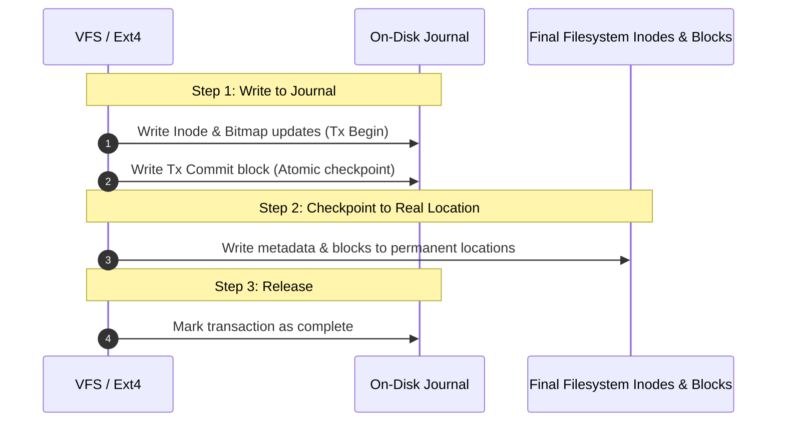
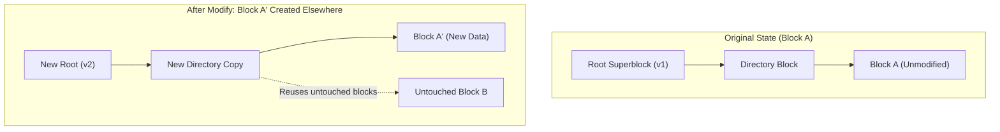

## The crash consistency problem

Imagine an application appending data to a file. To complete this operation, the filesystem must update three distinct disk structures:
1. **Data Block**: Write the actual payload bytes to a new disk block.
2. **Inode**: Update the file size and add a pointer to the new block.
3. **Data Bitmap**: Mark the newly used block as "allocated".

What happens if the power dies after Step 1, but before Step 2 and 3? The new block is filled with data, but the filesystem doesn't know it exists.
What if Step 2 succeeds, but Step 1 was not written? The inode points to garbage bytes on disk!
This is the **Crash Consistency Problem**.

---

## 1. Ext4 Journaling: Write-Ahead Logging (WAL)

To prevent filesystem corruption during sudden power losses, modern filesystems like **Ext4** and **NTFS** use **Journaling** (borrowed from database Write-Ahead Logging):



If the system crashes at any second:
- **On Reboot**: The kernel runs a quick recovery scan over the tiny journal. If a transaction has a `Tx Commit` block, it re-applies it (replaying). If incomplete, it discards it.
- **Result**: No lengthy `fsck` scans across 10-terabyte disks! The filesystem is consistent in milliseconds.

### Ext4 Journaling Modes
You can tune Ext4 durability vs speed using mount options:
- `data=journal`: Both file data and metadata are written to the journal before the filesystem. Maximum durability, but halves write throughput (data written twice).
- `data=ordered` (**Default**): Data is written directly to disk *first*, then metadata is written to the journal. Prevents files from pointing to garbage data if a crash happens.
- `data=writeback`: Metadata is journaled, but data can be written in any order. Fastest, but old deleted data may reappear in files after a crash.

---

## 2. Copy-on-Write (CoW) Filesystems: ZFS & Btrfs

Modern next-generation filesystems (ZFS, Btrfs, APFS) discard the traditional overwrite-in-place model completely.

Under **Copy-on-Write (CoW)**:
- Data is **never overwritten in place**.
- When modifying block $X$, the filesystem writes modified data to a completely new block $X'$, updates the parent tree pointers to point to $X'$, and atomically flips the root pointer.



### Superpowers of CoW:
1. **Instantaneous Snapshots**: Creating a snapshot costs $O(1)$ time and 0 bytes — it simply saves a reference to the existing root tree.
2. **End-to-End Checksums**: ZFS and Btrfs store cryptographic checksums alongside block pointers. If bit-rot or silent SSD degradation flips a bit, the filesystem detects it and repairs it automatically from RAID parity.

---

## 3. Physical Silicon Reality: SSDs & NVMe

Software engineers often treat SSDs as "fast magnetic hard drives with no seek time." In physical reality, flash memory behaves completely differently:

### The Flash Rules: Pages vs Blocks
- **Read / Write** granularity = **Page** (typically 4KB to 16KB).
- **Erase** granularity = **Block** (typically 128 to 512 pages, ~2MB to 8MB).
- **The Golden Rule**: *You cannot overwrite a page in flash without first erasing its entire containing block!*

### The Flash Translation Layer (FTL) & Write Amplification
Inside every SSD sits an embedded microcontroller running the **FTL**:
1. When you "overwrite" 4KB at logical block 100, the SSD marks the old page "invalid" and writes the new data to a free erased page elsewhere.
2. Eventually, blocks fill up with scattered invalid pages. The SSD runs **Garbage Collection (GC)**: it reads surviving valid pages, copies them to a clean block, and erases the old block.
3. **Write Amplification Factor (WAF)**: Writing 1GB of user data might cause the drive to physically write 3GB internally due to garbage collection copies.

### Why the TRIM Command Matters
When you delete a file in Linux (`rm bigfile.iso`), the OS frees the inode, but does not notify the SSD hardware. The drive continues moving those dead blocks around during garbage collection, destroying SSD endurance!
- The **TRIM / Deallocate command** informs the SSD controller that specific sector ranges are dead, allowing the FTL to skip them during GC.

---

## 4. Storage Protocols: SATA/AHCI vs NVMe

For decades, storage controllers used the legacy **AHCI** protocol (designed for spinning disks):

| Feature | Legacy AHCI (SATA) | Modern NVMe (PCIe) |
| :--- | :--- | :--- |
| **Interface** | SATA cable (max ~550 MB/s) | Direct PCIe Gen 4/5 bus (7,000+ MB/s) |
| **Queue Depth** | 1 command queue, max 32 commands | **Up to 64,000 parallel queues** |
| **Commands per Queue** | 32 commands total | **Up to 64,000 commands per queue** |
| **CPU Core Affinity** | All CPU cores bottleneck on 1 queue lock | **Each CPU core gets its own private queue** (Zero lock contention!) |

```mermaid
flowchart TD
    subgraph AHCI["Legacy AHCI Bottleneck"]
        C1[Core 0] & C2[Core 1] & C3[Core 2] -->|Compete for 1 lock| SQ[Single Queue: Depth 32]
        SQ --> SATA[SATA Controller]
    end

    subgraph NVMe["NVMe Parallel Architecture"]
        NC1[Core 0] --> Q0[Queue 0]
        NC2[Core 1] --> Q1[Queue 1]
        NC3[Core 2] --> Q2[Queue 2]
        Q0 & Q1 & Q2 --> NVME_CTRL[NVMe Hardware Controller (PCIe)]
    end
```

---

## 5. Practical Investigation & Diagnostics

### Monitor Disk Throughput and Latency with `iostat`
```bash
# Display disk utilization (%util), average wait time (await), and queue size
iostat -xz 1
```
*Look for: `%util` approaching 100%, or `await` (latency) climbing from < 1ms to > 20ms.*

### Inspect Ext4 Filesystem Parameters
```bash
# View inode counts, block sizes, and journaling state
tune2fs -l /dev/nvme0n1p1
```

### Check NVMe Health & Wear Level with `nvme-cli`
```bash
# Read SMART telemetry: temperature, wear percentage, available spare
nvme smart-log /dev/nvme0
```

---

## Key Takeaways

1. **Journaling enables instant crash recovery**: Ext4 uses Write-Ahead Logging to avoid hours-long `fsck` disk checks.
2. **CoW transforms snapshots and data integrity**: ZFS/Btrfs never overwrite in place, providing instantaneous snapshots and bit-rot self-healing.
3. **NVMe matches multi-core architectures**: Dedicated hardware queues per core eliminate host serialization bottlenecks.

---

Links to: **[Disk Scheduling Algorithms, RAID & File Allocation](/docs/operating-system/04-storage-and-io/03-disk-scheduling-raid)** (seek latency optimization, RAID configurations, and free space management).

