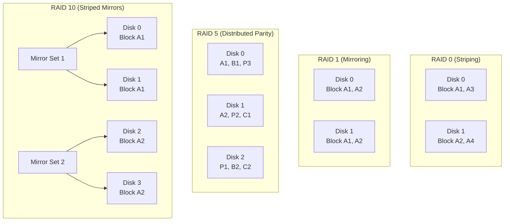
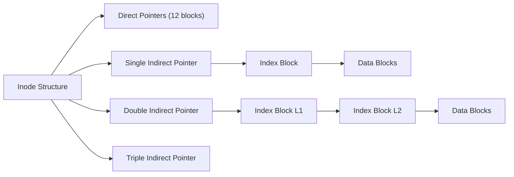

## The Physics of Mechanical Disk Access

For decades, the foundation of persistent storage was the Hard Disk Drive (HDD). To retrieve data from a spinning magnetic platter, the OS must issue physical commands to move a mechanical actuator arm to the correct track (cylinder) and wait for the platter to rotate the desired sector under the read/write head.

Total Disk Access Time is defined by three components:
$$T_{access} = T_{seek} + T_{rotation} + T_{transfer}$$

1. **Seek Time ($T_{seek}$):** The time required to physically move the read/write head across the platters to the target cylinder. This is the slowest component, often measured in milliseconds ($ms$).
2. **Rotational Latency ($T_{rotation}$):** The time spent waiting for the correct sector to rotate directly beneath the read/write head. On a 7200 RPM drive, a half rotation takes about $4.17 ms$.
3. **Transfer Time ($T_{transfer}$):** The time it takes to magnetically read the bits and transmit them over the SATA/SAS bus.

Because mechanical seek time is roughly $10^6$ times slower than CPU operations, optimizing the order in which disk I/O requests are serviced became one of the most heavily studied problems in early OS design. **Disk Scheduling Algorithms** were created to minimize total head movement, maximizing throughput by reducing the distance the physical arm has to swing back and forth.

---

## Disk Scheduling Algorithms

Imagine a disk with 200 tracks (cylinders), numbered $0$ to $199$. 
An I/O queue holds requests for blocks on the following cylinders: 
`98, 183, 37, 122, 14, 124, 65, 67`

The disk head is currently positioned at cylinder **`53`**. Let's examine how different scheduling algorithms process this queue.

### 1. FCFS (First Come, First Served)
Requests are serviced strictly in the order they arrived.
- **Path:** 53 $\rightarrow$ 98 $\rightarrow$ 183 $\rightarrow$ 37 $\rightarrow$ 122 $\rightarrow$ 14 $\rightarrow$ 124 $\rightarrow$ 65 $\rightarrow$ 67
- **Calculation:** $|98 - 53| + |183 - 98| + |37 - 183| + \dots = 45 + 85 + 146 + 85 + 108 + 110 + 59 + 2 = \mathbf{640 \text{ cylinders}}$
- **Verdict:** Highly inefficient. The head wildly swings back and forth across the platter ("arm thrashing"), maximizing seek times.

### 2. SSTF (Shortest Seek Time First)
Selects the pending request closest to the current head position. 
- **Path:** 53 $\rightarrow$ 65 $\rightarrow$ 67 $\rightarrow$ 37 $\rightarrow$ 14 $\rightarrow$ 98 $\rightarrow$ 122 $\rightarrow$ 124 $\rightarrow$ 183
- **Calculation:** $|65-53| + |67-65| + |37-67| + |14-37| + |98-14| + |122-98| + |124-122| + |183-124| = 12 + 2 + 30 + 23 + 84 + 24 + 2 + 59 = \mathbf{236 \text{ cylinders}}$
- **Verdict:** Massive reduction in head movement. However, it introduces a critical danger: **Starvation**. If a constant stream of requests arrives for middle tracks, requests at the edges ($0$ or $199$) will never be serviced.

### 3. SCAN (The Elevator Algorithm)
The head starts at one end, sweeps towards the other servicing requests along the way, and reverses direction when it hits the physical edge ($0$ or $199$).
- Assuming initial direction is **Up** (towards 199).
- **Path:** 53 $\rightarrow$ 65 $\rightarrow$ 67 $\rightarrow$ 98 $\rightarrow$ 122 $\rightarrow$ 124 $\rightarrow$ 183 $\rightarrow$ 199 (edge limit) $\rightarrow$ 37 $\rightarrow$ 14
- **Verdict:** Prevents starvation. However, when it turns around at the edge, the tracks immediately adjacent were just serviced, meaning requests for those tracks are sparse. The densest cluster of unserviced requests is at the opposite end of the disk.

### 4. C-SCAN (Circular SCAN)
Like SCAN, but instead of reversing direction at the edge, it immediately returns to the beginning ($0$) without servicing requests, creating a one-way sweep.
- **Path:** 53 $\rightarrow$ 65 $\rightarrow$ 67 $\rightarrow$ 98 $\rightarrow$ 122 $\rightarrow$ 124 $\rightarrow$ 183 $\rightarrow$ 199 (jump) $\rightarrow$ 0 $\rightarrow$ 14 $\rightarrow$ 37
- **Verdict:** Provides highly **uniform wait times**. The jump back to 0 takes only a single long seek, after which requests are serviced sequentially again.

### 5. LOOK & C-LOOK
Optimization over SCAN/C-SCAN: instead of traveling all the way to the physical edge ($199$ or $0$), the head stops and reverses (or jumps) at the **last requested cylinder** in that direction. 
- **C-LOOK Path:** 53 $\rightarrow$ 65 $\dots$ $\rightarrow$ 183 (last request, jump) $\rightarrow$ 14 (first request) $\rightarrow$ 37.

### Visualizing SCAN vs C-SCAN

```mermaid
flowchart TD
    subgraph SCAN["SCAN (Elevator) - Sweeps Up, then Down"]
        direction LR
        S53((53))-->S65(65)-->S67(67)-->S98(98)-->S122(122)-->S124(124)-->S183(183)-->S199[199 - Turnaround]
        S199-->S37(37)-->S14(14)
    end
    
    subgraph C_SCAN["C-SCAN - Sweeps Up, Jumps to 0, Sweeps Up"]
        direction LR
        C53((53))-->C65(65)-->C67(67)-->C98(98)-->C122(122)-->C124(124)-->C183(183)-->C199[199 - Jump]
        C199-. Fast Seek .->C0[0]
        C0-->C14(14)-->C37(37)
    end
```



### Disk Scheduling Comparison

| Algorithm | Head Movement Efficiency | Risk of Starvation | Best Used For |
| :--- | :--- | :--- | :--- |
| **FCFS** | Very Low | None | Very light loads where seek times are negligible |
| **SSTF** | Very High | **High** | Batch jobs without strict latency SLAs |
| **SCAN** | High | None | Heavy general-purpose loads |
| **C-SCAN** | High | None | Environments requiring uniform latency |
| **C-LOOK** | Excellent | None | Most optimized traditional HDD scheduling |

---

## RAID: Redundant Array of Independent Disks

To bypass the mechanical limits of a single drive, engineers group multiple disks into arrays that the OS sees as a single large logical volume. RAID aims to improve performance (via parallel I/O) and reliability (via redundancy).



### 1. RAID 0 (Block Striping)
Data is broken into blocks (stripes) and spread evenly across all disks. 
- **Performance:** Read/Write speeds multiply linearly by $N$ (number of disks).
- **Fault Tolerance:** None. A single drive failure destroys the entire array.
- **MTTF (Mean Time To Failure):** If one disk has an MTTF of 10 years, a RAID 0 of two disks has an MTTF of just 5 years.

### 2. RAID 1 (Disk Mirroring)
Exact copies of data are written to multiple disks simultaneously.
- **Performance:** Read speeds can be $2\times$ (parallel reads), but write speeds are strictly $1\times$.
- **Fault Tolerance:** Survives $N-1$ disk failures.
- **Overhead:** High. 50% storage capacity is lost to duplication.

### 3. RAID 5 (Block Striping with Distributed Parity)
Data is striped, but a parity block is calculated (using bitwise XOR) and written. The parity blocks are distributed across all drives to avoid a parity write bottleneck.
- **XOR Logic:** If Data $A=1010$ and $B=1100$, Parity $P = A \oplus B = 0110$. If $A$ dies, $A = B \oplus P$.
- **Fault Tolerance:** Survives exactly 1 disk failure. 
- **The Write Penalty:** Modifying a single block requires 4 disk operations: 
  1. Read old data 
  2. Read old parity 
  3. Write new data 
  4. Write new parity. 

### 4. RAID 6 (Double Distributed Parity)
Uses more complex math (like Reed-Solomon coding) to calculate two independent parity blocks per stripe.
- **Fault Tolerance:** Survives exactly 2 simultaneous failures.
- **Vulnerability:** Large modern HDDs take days to rebuild. During a RAID 5 rebuild, a second disk failing via Unrecoverable Read Error (URE) destroys the array. RAID 6 mitigates this.

### 5. RAID 10 (1+0 Striped Mirrors)
Combines RAID 1 redundancy with RAID 0 performance. You stripe data across multiple mirrored sets.
- **Performance:** Superb. Enterprise databases heavily rely on RAID 10 because it avoids the RAID 5/6 parity calculation overhead on writes.

### RAID Comparison Table

| Level | Usable Capacity | Min Disks | Fault Tolerance | Read Speed | Write Speed |
| :--- | :--- | :--- | :--- | :--- | :--- |
| **0** | $N \times Size$ | 2 | 0 | $N\times$ | $N\times$ |
| **1** | $1 \times Size$ | 2 | $N-1$ | $N\times$ | $1\times$ |
| **5** | $(N-1) \times Size$ | 3 | 1 disk | $(N-1)\times$ | $(N-1)\times$ (minus penalty) |
| **6** | $(N-2) \times Size$ | 4 | 2 disks | $(N-2)\times$ | $(N-2)\times$ (minus high penalty) |
| **10** | $(N/2) \times Size$ | 4 | 1 per mirror | $N\times$ | $(N/2)\times$ |

---

## File Allocation Methods

How does the OS map logical files into physical blocks on a disk?

### 1. Contiguous Allocation
The directory simply points to the start block and the length (e.g., File A: Start 50, Length 6 blocks).
- **Pros:** Phenomenally fast sequential I/O. Reading the whole file requires only one seek.
- **Cons:** Sufferers from severe **external fragmentation**. Also, if a file grows past its contiguous bounds, the OS must find a new, larger gap and move the entire file.

### 2. Linked Allocation
Each file block contains a pointer to the next block in the file.
- **Pros:** Completely eliminates external fragmentation. Files can grow indefinitely. 
- **Cons:** Terrible random access. Finding block 500 requires traversing $O(N)$ pointers from block 0. Also vulnerable to pointer corruption.
- **Evolution:** The **FAT (File Allocation Table)** filesystem moved all these pointers into a centralized table loaded in RAM, speeding up traversal significantly.

### 3. Indexed Allocation (The Inode Approach)
Each file gets an **Index Block** (in UNIX-like systems, the `inode`). This block acts as an array of direct pointers to the file's data blocks.

To handle massive files, Unix inodes use a multi-level index:
- **Direct Pointers:** Point directly to data blocks.
- **Single Indirect Pointer:** Points to a block containing pointers to data blocks.
- **Double Indirect Pointer:** Points to a block containing pointers to blocks containing pointers...



---

## Free Space Management

How does the OS track empty blocks for new allocations?

1. **Bit Vector (Bitmap):** Each block on disk is represented by $1$ bit. 
   - $1$ = free, $0$ = allocated. 
   - Extremely memory efficient. Finding the first free block relies on bitwise CPU instructions like `ffs` (find first set).
2. **Linked Free List:** Every free block contains a pointer to the next free block. Takes zero extra memory, but traversing it to find contiguous space is slow.
3. **Grouping and Counting:** A modified linked list where a block stores pointers to $N$ free blocks, or stores the address of a free block and a count of how many contiguous free blocks follow it.

---

## Practical Investigation & Linux Block Layer Tools

You can inspect the underlying mechanics of your Linux block storage right from the terminal.

**1. Inspecting Hardware I/O Schedulers:**
View what scheduler your OS is using for a specific disk `sda`:
```bash
cat /sys/block/sda/queue/scheduler
# Output might be: [mq-deadline] kyber bfq none
```

**2. Software RAID Status:**
Check the state, sync speed, and health of Linux `mdadm` arrays:
```bash
cat /proc/mdstat
mdadm --detail /dev/md0
```

**3. Storage Queue Depth & Telemetry:**
Use `iostat` to view real-time latency and queue sizes. If `await` (wait time) is sky-high, you have an I/O bottleneck.
```bash
iostat -xz 1
```

---

## Real-World Mental Anchors

- **The Obvious Case:** A database sequential backup job. Contiguous allocation or C-LOOK scheduling allows the disk arm to smoothly stream data off the platters at maximum hardware throughput.
- **The Counter-Intuitive Case:** **SSDs do not use SCAN or LOOK.** Because solid state drives have zero moving parts, there is no $T_{seek}$ penalty. Reordering I/O requests actually wastes CPU cycles! For NVMe SSDs, Linux uses the `none` scheduler (or `mq-deadline`), simply passing requests straight to the incredibly parallel flash controllers.
- **The Failure Mode / Edge Case:** **The RAID 5 Rebuild Trap**. You have a 10TB RAID 5 array. One drive dies. You swap it and the rebuild starts. During the 48-hour rebuild, all remaining drives are stressed at 100% read capacity. If a single bad sector (Unrecoverable Read Error) is found on any surviving drive, the rebuild crashes, and the entire array's data is permanently lost.

---

## ✕ What people get wrong

- **"RAID is a backup."** It absolutely is not. RAID protects against hardware downtime. If you `rm -rf /`, get infected by ransomware, or experience a power surge, RAID instantly perfectly mirrors the destruction across all drives. You still need off-site backups.
- **"SSTF is always better than FCFS."** While it reduces total head movement, the starvation vulnerability makes pure SSTF unusable in production OS kernels unless wrapped in strict latency-deadline checks.

---

## Why this matters
Storage architectures form the foundation of cloud engineering. If you understand why RAID 5 write penalties destroy database performance, or why massive external fragmentation ruins contiguous allocation, you can design systems that avoid catastrophic latency walls. In FAANG system design interviews, knowing whether to choose a striped mirror (RAID 10) vs parity (RAID 5) for a caching layer vs cold storage is a mandatory check.

### Key Takeaways
1. Total disk latency relies heavily on the physical seek time of the mechanical arm; algorithms like C-SCAN and C-LOOK drastically reduce this overhead.
2. SSDs do not suffer from seek time and therefore skip traditional mechanical scheduling, relying instead on highly parallel multi-queue (`blk-mq`) pipelines.
3. RAID 5 provides efficient redundancy but incurs massive write penalties, making RAID 10 the standard for high-throughput transactional databases.

---

**Links to:** `[I/O Architectures — From Interrupts to epoll](/docs/operating-system/04-storage-and-io/04-io-multiplexing-epoll)`
