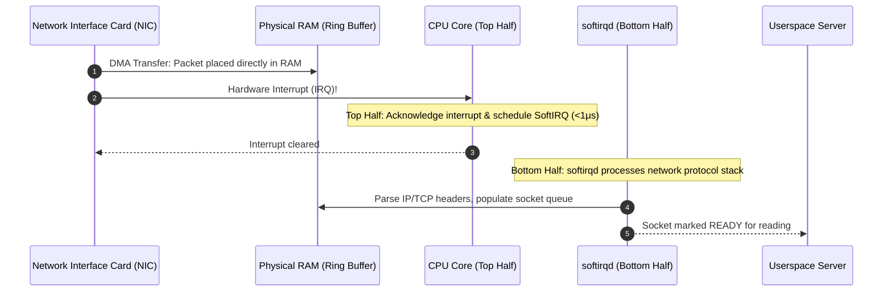
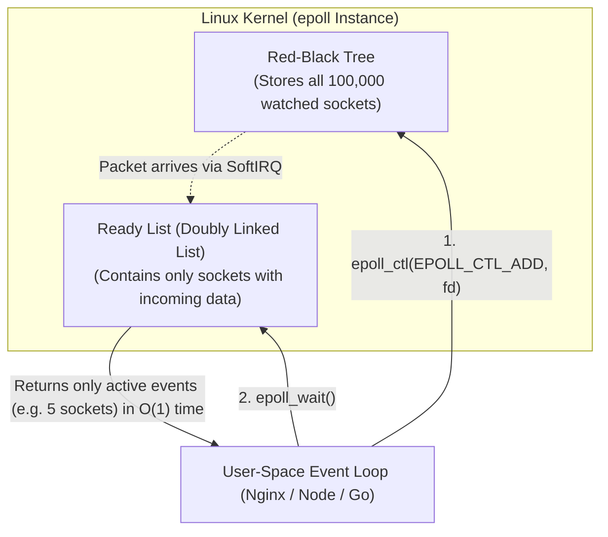

## The C10K problem: Why one thread per connection fails

In early internet architecture (Apache HTTP Server 1.x, traditional Java Servlets), concurrency was handled naively: **one thread per client connection**.

When a client connected, the server spawned a thread:
```c
// Thread per client:
void* handle_client(void* socket_fd) {
    char buffer[4096];
    while (read(socket_fd, buffer, sizeof(buffer)) > 0) {
        process_request(buffer);
    }
}
```

This model collapsed when web traffic exploded in the 2000s — a dilemma named the **C10K problem** (handling 10,000 concurrent connections on a single machine):
1. **Memory Exhaustion**: In Linux, a thread stack defaults to 8MB (or ~2MB minimum). 10,000 threads consume **20 to 80 gigabytes of RAM** just for empty call stacks!
2. **Context Switching Thrashing**: If 10,000 threads are constantly waking up and blocking, the CPU spends 90% of its cycles saving and restoring registers rather than running user code.
3. **The Idle Waste**: On a real server (e.g. chat app, WebSocket server), 99% of connections are idle at any given second, waiting for data from the network. Keeping a thread parked on each idle socket is an enormous waste.

---

## 1. Hardware Foundations: Interrupts, SoftIRQs & DMA

To understand how modern servers solve this, look at how data travels from a physical Ethernet cable to user code:



1. **Direct Memory Access (DMA)**: The Network Interface Card (NIC) writes incoming network packets directly into system RAM without involving the CPU.
2. **Top-Half Interrupt**: The NIC signals a hardware interrupt. The CPU executes a tiny Interrupt Service Routine (ISR) that acknowledges the hardware and schedules deferred work.
3. **Bottom-Half (`softirqd`)**: The Linux kernel daemon (`ksoftirqd/X`) processes TCP/IP headers, computes checksums, and places packets into socket receive buffers.

---

## 2. The Evolution of I/O Multiplexing

If we only run a small pool of worker threads (e.g. 1 thread per CPU core), how does one thread manage 100,000 open sockets?

### 1. `select()` ($O(N)$ Scanning)
Introduced in BSD Unix. You pass an array of file descriptor bitmasks.
- **Flaw 1**: Hard-coded limit of 1,024 file descriptors (`FD_SETSIZE`).
- **Flaw 2 ($O(N)$)**: Every time `select()` returns, user code must loop through all 1,024 descriptors to check which one is ready.
- **Flaw 3**: Every single call copies the entire array back and forth between user-space and kernel memory.

### 2. `poll()` ($O(N)$ with no limit)
Eliminated the 1,024 descriptor limit by using dynamic pollfd arrays, but still suffered from $O(N)$ linear scanning and continuous array copying into the kernel.

---

## 3. The Linux Solution: epoll ($O(1)$ Event Notification)

In Linux 2.6, kernel engineers introduced **`epoll`** (mirrored by **`kqueue`** on BSD/macOS).

Instead of passing an array of sockets into the kernel on every call, `epoll` maintains state **inside the kernel**:



### The Three epoll System Calls:
1. `int epoll_create1(0)`: Allocates an epoll instance in the kernel.
2. `int epoll_ctl(epfd, EPOLL_CTL_ADD, socket_fd, &event)`: Adds a socket to the kernel's **Red-Black Tree**. You register a socket once, and the kernel remembers it.
3. `int epoll_wait(epfd, events, maxevents, timeout)`: **Blocks until at least one event occurs**. When it returns, it yields *only the sockets that are actually ready* in an array of length $K$.
- **Complexity**: $O(1)$ with respect to total connections! Whether you monitor 1,000 or 1,000,000 sockets, `epoll_wait` only processes the active connections.

---

## 4. Level-Triggered (LT) vs Edge-Triggered (ET)

When configuring `epoll_ctl`, you choose the notification trigger:

| Mode | Trigger Condition | Behavior & Traps |
| :--- | :--- | :--- |
| **Level-Triggered (LT)** *(Default)* | Fires repeatedly as long as there is unread data in the buffer. | **Safe & Easy**: If you only read 2KB of a 4KB packet, `epoll_wait` will immediately wake you up again on the next loop. |
| **Edge-Triggered (ET)** (`EPOLLET`) | Fires **only once** on the transition from "no data" to "data available". | **Maximum Performance, High Danger**: You **must** drain the socket in a loop with non-blocking reads until `read()` returns `EAGAIN` or `EWOULDBLOCK`. If you leave 1 byte in the buffer, `epoll_wait` will never fire again for that socket — causing silent connection hangs! |

---

## 5. Modern Event Loops: The Reactor Pattern

`epoll` is the foundation of almost every high-performance network engine in production:
- **Node.js**: libuv uses `epoll` on Linux and `kqueue` on macOS.
- **Go Runtime**: The Go `netpoller` integrates goroutines with `epoll`, allowing you to write sequential-looking Go code that runs on non-blocking event multiplexing under the hood.
- **Nginx, Envoy & Redis**: Run single-threaded (or thread-per-core) event loops calling `epoll_wait` in a tight loop.

---

## 6. Practical Investigation & Debugging Tools

### Monitor Hardware and Software Interrupts
```bash
# Check if packet processing (NET_RX) is evenly distributed across CPU cores
cat /proc/softirqs | grep NET_RX
```

### Trace Event Loop Operations with `strace`
```bash
# Watch Nginx or Node.js processing epoll events in real time
strace -f -e trace=epoll_create1,epoll_ctl,epoll_wait -p <pid>
```

### Inspect Sockets and Network Buffers with `ss`
```bash
# Inspect socket internal buffers (Recv-Q, Send-Q, round-trip latency)
ss -t -i -a
```

---

## Key Takeaways

1. **Thread-per-connection fails at scale**: Memory footprint and context switching overhead cap traditional architectures.
2. **`epoll` decouples registration from waiting**: The kernel tracks watched sockets in a Red-Black Tree and returns active events in $O(1)$ time via a ready list.
3. **Non-blocking I/O is mandatory**: All sockets registered with `epoll` must be marked with `O_NONBLOCK` to prevent blocking the entire event loop.

---

Links to: **[The Modern I/O Revolution — io_uring & Zero-Copy](/docs/operating-system/04-storage-and-io/05-modern-io-uring-zerocopy)** (why completion queues beat readiness loops, SQPOLL zero-syscall mode, and zero-copy transfers).

