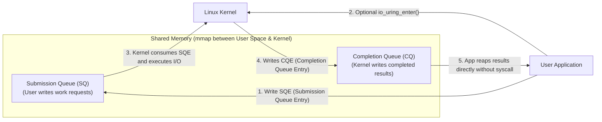
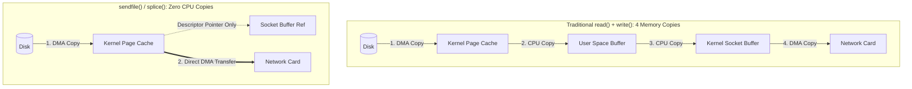

## The limits of epoll

For nearly two decades, `epoll` was the undisputed king of Linux I/O. But as NVMe storage and 100GbE networks became standard, `epoll` hit two fundamental architectural ceilings:

1. **Readiness vs Completion Overhead**: `epoll` is a **readiness** model. It wakes you up to say: *"Socket 4 is ready to be read."* You must then make a second system call — `read(4, buf, ...)` — to actually transfer the bytes. Crossing the user/kernel boundary twice per operation wastes millions of CPU cycles.
2. **File I/O Incompatibility**: **`epoll` does not support regular disk files!** Files are always considered "ready" by the kernel, meaning any `read()` from disk can block the entire event loop thread while waiting on storage hardware. Linux's old asynchronous interface (`libaio`) was notorious: it only worked with `O_DIRECT`, silently fell back to blocking in dozens of edge cases, and had massive overhead.

In 2019 (Linux 5.1), kernel maintainer **Jens Axboe** created **`io_uring`** — the most significant transformation to Linux systems programming in twenty years.

---

## 1. The io_uring Architecture: Lock-Free Ring Buffers

Instead of making system calls, user-space applications communicate with the kernel using **two lock-free circular ring buffers** created in shared memory (`mmap`):



### The Two Queues:
- **Submission Queue (SQ)**: The application fills out **Submission Queue Entries (SQEs)** describing what work to perform (e.g. read 4KB from file A, write 1KB to socket B, accept new connection on socket C).
- **Completion Queue (CQ)**: When the hardware completes the operation, the kernel posts a **Completion Queue Entry (CQE)** containing the return value (`res`) and status.

### Why It Obliterates Syscall Overhead:
The application can enqueue **1,000 read and write operations** into the Submission Queue and submit them all using a **single `io_uring_enter()` system call**!

---

## 2. Zero-Syscall Mode: SQPOLL

Can we do I/O with **literally zero system calls**?

Yes. When initialized with the `IORING_SETUP_SQPOLL` flag, the kernel spawns a dedicated background kernel thread (`io_uring-sq`).
1. The kernel thread constantly polls the Submission Queue ring buffer.
2. The user application writes new SQEs directly into the ring buffer in RAM and advances the queue head pointer.
3. The kernel thread spots the new entry immediately and submits it to hardware.
4. The kernel thread posts the result into the Completion Queue.
5. The user application reads the result from RAM.

**Result**: High-throughput file and network I/O executes continuously with **zero context switches and zero system calls** during steady state!

---

## 3. The Zero-Copy Data Transfer Revolution

In a traditional web server serving static files or video (e.g., streaming MP4 files):



### 1. `sendfile()` & `splice()`
- Eliminates user-space copying completely.
- Data transfers directly from the kernel Page Cache to the network card via DMA.
- Used by Nginx, Apache, and Kafka to achieve saturating 40Gbps+ network links at near-zero CPU utilization.

### 2. Modern True Zero-Copy: `IORING_OP_SEND_ZC`
In Linux 6.0+, `io_uring` added **True Zero-Copy Send (`IORING_OP_SEND_ZC`)**:
- Allows user-space application memory buffers to be transmitted directly to the NIC hardware via DMA without even copying bytes into kernel socket buffers (`sk_buff`).
- Uses Completion Queue events to notify user-space when the network hardware has finished reading the user buffer, so the application knows when it is safe to reuse or free the memory.

---

## 4. Comparing the Three Generations of Linux I/O

| Capability | Generation 1: `select` / `poll` | Generation 2: `epoll` | Generation 3: `io_uring` |
| :--- | :--- | :--- | :--- |
| **Model** | Readiness | Readiness | **Completion** |
| **Storage (Disk) I/O** | Blocking | Blocking | **Fully Asynchronous** |
| **Network Sockets** | Supported | Supported | **Supported** |
| **Syscall Cost** | 1 syscall per check ($O(N)$) | 1 syscall per batch ($O(1)$) | **0 to 1 syscall for 1,000 ops** |
| **Zero-Copy Support** | None | Manual (`sendfile`) | **Native (`IORING_OP_SEND_ZC`)** |
| **Kernel Interface** | Array passing | Red-Black Tree | **Shared-Memory Ring Buffers** |

---

## 5. Practical Investigation & Performance Profiling

### Verify io_uring Activity with `bpftrace`
```bash
# Count io_uring submissions across all applications on the host
bpftrace -e 'tracepoint:io_uring:io_uring_submit_sqe { @[comm] = count(); }'
```

### Inspect Kernel io_uring Worker Threads
```bash
# Check if SQPOLL worker threads are running
ps aux | grep -i "iou-sqp"
```

### Monitor Context Switches During Heavy I/O
```bash
# Compare voluntarily vs involuntarily context switches (should drop drastically with io_uring)
pidstat -w -p <pid> 1
```

---

## Key Takeaways

1. **`epoll` is readiness; `io_uring` is completion**: Asking if data is ready requires extra syscalls; having the kernel complete the I/O directly eliminates them.
2. **Shared-memory ring buffers eliminate the syscall boundary**: The SQ and CQ ring buffers allow lock-free, zero-syscall request submission.
3. **Zero-copy maximizes bandwidth**: Techniques like `sendfile` and `IORING_OP_SEND_ZC` route data directly from cache/memory to hardware controllers via DMA.

---

Links to: **[The Kernel Networking Stack — TCP/IP, Netfilter & XDP](/docs/operating-system/05-networking-and-virtualization/01-kernel-networking)** (how packets traverse kernel socket buffers, netfilter hooks, and driver XDP programs).

