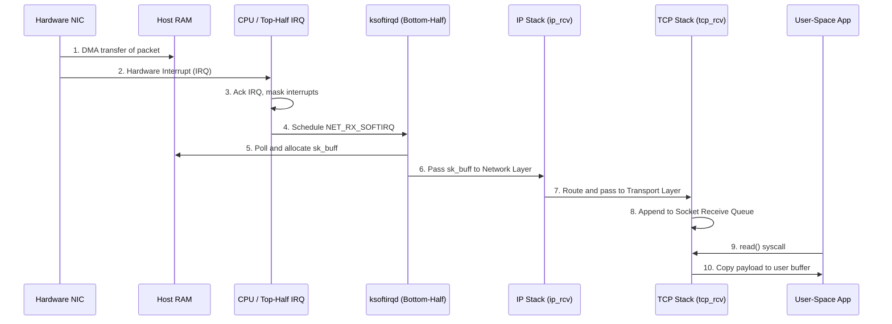
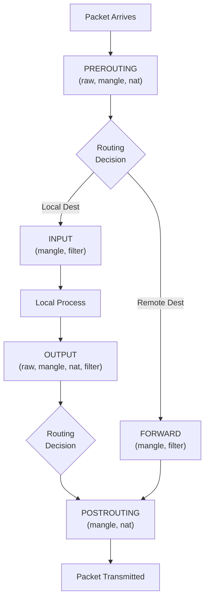

A network packet arrives at the physical Ethernet port at 100Gbps. Millions of these frames hit the silicon every single second, carrying everything from streaming video payloads to microservice API requests. But the physical wire knows nothing of IP addresses, TCP streams, or user-space applications. How does the Linux kernel take this chaotic firehose of electrical impulses, inspect it, route it, filter out malicious traffic, and perfectly reconstruct it into a sequence of bytes waiting for a user-space application's `read()` system call?

The Linux kernel networking stack is one of the most mature, heavily battered, and heavily optimized pieces of software in existence. For decades, it has served as the backbone of the internet, smoothly mediating the gap between raw hardware and high-level applications. However, modern network speeds—pushing 100Gbps to 400Gbps line rates—have stretched traditional kernel paradigms to their breaking point.

In this lesson, we will dissect the journey of a packet through the Linux kernel. We will explore the critical `sk_buff` data structure, examine how Netfilter constructs firewalls, decode how network namespaces power containerization, and ultimately discover how eBPF, XDP, and DPDK allow us to bypass traditional kernel bottlenecks entirely to process millions of packets per second.

---

## 1. Packet Journey Through the Linux Kernel

The moment an Ethernet frame arrives on the wire, a complex, meticulously orchestrated sequence of hardware and software events kicks off to transport that data to user space.

### From Silicon to RAM: DMA and IRQs
1. **NIC RX Ring Buffer:** The Network Interface Card (NIC) receives the electrical signal, decodes the Ethernet frame, and places it into an internal hardware queue.
2. **Direct Memory Access (DMA):** The NIC does not ask the CPU to copy the data. Instead, it uses DMA to write the packet data directly into a pre-allocated region of the host's main RAM.
3. **Hardware Interrupt (IRQ):** Once the data is in RAM, the NIC asserts a hardware interrupt to notify the CPU that a new packet is waiting.
4. **Top-Half ISR (Interrupt Service Routine):** The CPU drops what it's doing and executes the NIC driver's interrupt handler. To minimize latency and avoid blocking other hardware, this handler does almost nothing—it simply acknowledges the interrupt, disables further NIC interrupts temporarily, and schedules a software interrupt (SoftIRQ) for the actual processing.
5. **SoftIRQ (`NET_RX_SOFTIRQ`):** The kernel worker thread `ksoftirqd` wakes up and begins draining packets from the memory ring buffers (using the NAPI—New API—polling mechanism). 

### The Socket Buffer (`sk_buff`)
At the core of the Linux networking stack is the `sk_buff` (socket buffer) struct. Allocating memory for every packet is extremely slow, so the kernel uses `sk_buff` as a metadata wrapper that points to the actual packet data in memory. 

To support zero-copy protocol encapsulation/decapsulation, the `sk_buff` maintains four crucial pointers:
- `head` and `end`: The absolute boundaries of the allocated memory buffer.
- `data` and `tail`: The boundaries of the actual packet payload.

As a packet traverses up the stack, the kernel strips headers (Ethernet, then IP, then TCP) by simply moving the `data` pointer forward. It doesn't copy the payload. Space left at the beginning is called *headroom*, and space at the end is *tailroom*.

### Protocol Demultiplexing
Once an `sk_buff` is prepared, it is handed to the protocol stack:
- **Ethernet Layer:** Validates the MAC address and strips the Ethernet header.
- **IP Layer (`ip_rcv`):** Validates checksums, handles routing (is this packet for us, or do we forward it?), and handles IP fragmentation.
- **TCP/UDP Layer (`tcp_v4_rcv`):** Looks up the connection state, handles sequence numbers and acknowledgments, and appends the payload to the specific socket's receive queue.
- Finally, the user-space application calling `recv()` or `read()` is woken up to copy the payload from kernel space to user space.



---

## 2. Netfilter, iptables & nftables

The Linux kernel does not just route packets; it aggressively filters, modifies, and tracks them. This is powered by **Netfilter**, a framework that provides hooks inside the Linux kernel networking stack.

### The 5 Netfilter Hooks
As a packet traverses the kernel, it passes through specific checkpoints where kernel modules can register callback functions to inspect or drop the packet:

1. `NF_INET_PRE_ROUTING`: Before any routing decisions are made.
2. `NF_INET_LOCAL_IN`: Packet is destined for the local machine.
3. `NF_INET_FORWARD`: Packet is being routed through this machine to somewhere else.
4. `NF_INET_LOCAL_OUT`: Packet was locally generated and is heading out.
5. `NF_INET_POST_ROUTING`: Right before the packet hits the wire.

### Tables and Chains (iptables)
The legacy `iptables` tool maps directly onto these hooks. Rules are organized into:
- **Tables:** Group rules by purpose (`filter` for dropping, `nat` for Network Address Translation, `mangle` for altering packet headers, `raw` for bypassing tracking).
- **Chains:** Correspond to the Netfilter hooks (e.g., the `INPUT` chain attaches to `LOCAL_IN`).

### Connection Tracking (`conntrack`)
TCP is stateful, and firewalls must be too. Netfilter's `conntrack` module inspects packets and maintains an in-kernel state table of all active connections. This allows a firewall rule like "allow all packets associated with an ESTABLISHED connection" to work.
- **The Bottleneck:** Under a DDoS attack, the `conntrack` table rapidly fills up with spoofed connections. Once `nf_conntrack_max` is hit, the kernel drops *all* new packets, taking the server offline even if the CPU is mostly idle.

### The Modern Replacement: nftables
Because `iptables` rules are evaluated sequentially, having 10,000 rules means worst-case $O(N)$ evaluation time per packet. `nftables` replaces the linear chains with a highly optimized, in-kernel bytecode virtual machine (often backed by sets and hash tables), making rule evaluation exceptionally fast.



---

## 3. Network Namespaces & Container Networking

How do Docker containers have their own IP addresses, `eth0` interfaces, and iptables rules while running on the same host kernel? The answer is **Network Namespaces**.

### Isolation via `CLONE_NEWNET`
When a process is spawned with the `CLONE_NEWNET` flag, the kernel creates an entirely isolated network stack. This namespace gets its own:
- Private routing table.
- Private Netfilter / iptables rules.
- Private loopback interface (`lo`).
- Private list of network devices.

### Virtual Ethernet (`veth`) Pairs
To allow a container to talk to the outside world, we need a wire. In Linux, this is a **veth pair**—a virtual Ethernet cable. 
- One end of the pair (`eth0`) is placed inside the container's network namespace.
- The other end (`veth1234`) remains in the host's default namespace and is plugged into a virtual switch (a Linux Bridge, e.g., `docker0`).

### Packet Routing Across Containers
When a container pings the internet:
1. The packet leaves the container via its `eth0`.
2. It instantly appears on the host bridge `docker0`.
3. The host kernel's routing table directs it to the physical `eth0`.
4. A Netfilter NAT (Masquerading) rule rewrites the source IP from the container's private IP (e.g., `172.17.0.2`) to the host's public IP before it hits the wire.

---

## 4. The High-Speed Revolution: XDP & eBPF

### The Problem with the Standard Stack
The traditional kernel stack is feature-rich but heavy. At 100Gbps, minimum-sized Ethernet frames arrive at a rate of **148.8 million packets per second (Mpps)**. That leaves the CPU with less than 7 nanoseconds per packet. 
Allocating an `sk_buff`, context switching, tracking connection state, and traversing iptables chains at 148 Mpps will saturate a modern multi-core CPU entirely, dropping packets on the floor.

### eXpress Data Path (XDP)
XDP provides a revolutionary solution. It allows developers to attach **eBPF (Extended Berkeley Packet Filter)** programs directly inside the NIC driver, *before* the kernel allocates an `sk_buff` and *before* Netfilter is invoked.

Because eBPF programs are JIT-compiled to native machine code and verified for safety by the kernel, they run at near wire-speed.

### XDP Actions
An XDP program inspects the raw packet bytes in memory and returns a simple verdict:
- `XDP_DROP`: Instantly discard the packet (e.g., dropping malicious traffic at 100Gbps using minimal CPU).
- `XDP_TX`: Bounce the packet back out the same NIC it arrived on (perfect for high-speed load balancers).
- `XDP_REDIRECT`: Send the packet to a different NIC, or directly into a specialized user-space memory buffer (AF_XDP) bypassing the kernel entirely.
- `XDP_PASS`: Allow the packet to continue normally up the standard Linux network stack.

*Real-World Case Study:* Cloudflare abandoned custom hardware and iptables to mitigate terabit-scale DDoS attacks. They use XDP to inspect incoming packets, check them against a BPF hash map of malicious IPs, and issue `XDP_DROP`, effectively neutralizing massive volumetric attacks using standard Linux servers.

---

## 5. Kernel Bypass: DPDK (Data Plane Development Kit)

For absolute maximum throughput (e.g., telecom core routers, high-frequency trading), even XDP has overhead. The ultimate solution is **Kernel Bypass**.

**DPDK** is a set of libraries that allow a user-space application to take exclusive control of a physical NIC. 
- **Zero Interrupts:** DPDK applications disable hardware interrupts. Instead, they use Poll Mode Drivers (PMDs). A CPU core spins in a tight loop (`while(true)`), constantly reading directly from the NIC's PCIe memory space.
- **Zero Kernel Crossings:** No syscalls, no context switches.
- **Zero Copies:** Data goes directly from the wire into application memory.

**Trade-offs:** 
Because DPDK bypasses the kernel, you lose everything the kernel provides. You lose the TCP/IP stack (you must write or bundle your own user-space TCP stack). You lose `iptables`. You lose routing tables. Furthermore, DPDK Poll Mode Drivers pin CPU cores at 100% utilization constantly, even if no traffic is flowing, burning massive amounts of power.

---

## 6. Practical Investigation & Network Tuning

Systems engineers must constantly observe and tune the network stack. Here are the tools of the trade:

### Inspecting Sockets and Buffers
```bash
# View active TCP sockets, including timer information and memory usage (-m)
ss -t -i -m
```

### Tracing Packet Drops
Why are packets vanishing? Is it the firewall, the routing table, or a full buffer?
```bash
# Watch the kernel functions where packets are being dropped in real-time
dropwatch -l kas

# Use perf to trace exactly when and where the kernel frees a socket buffer
perf record -e skb:kfree_skb -g
```

### Netfilter and Conntrack
```bash
# View the current number of tracked connections
cat /proc/sys/net/netfilter/nf_conntrack_count

# View the maximum allowed connections (if count hits max, packets are dropped)
cat /proc/sys/net/netfilter/nf_conntrack_max
```

### TCP Tuning Parameters
Kernel default buffer sizes are often too small for high-bandwidth, high-latency links (Long Fat Networks).
```bash
# Increase max receive buffer size to 16MB
sysctl -w net.core.rmem_max=16777216
# Tune TCP memory limits (min, default, max)
sysctl -w net.ipv4.tcp_rmem="4096 87380 16777216"
# Switch to Google's BBR congestion control algorithm for better throughput
sysctl -w net.ipv4.tcp_congestion_control=bbr
```

---

## 7. Real-World Mental Anchors

### The Obvious Case: Standard Web Server
For a standard Nginx or Node.js web server handling 5,000 requests per second, the default Linux network stack is perfect. The overhead of allocating `sk_buff`s and traversing `iptables` is negligible, and relying on the kernel's heavily tested TCP state machine is the safest, most stable choice.

### The Counter-Intuitive Case: Disabling Conntrack
If you are running a massive layer-4 load balancer (like HAProxy or IPVS) that handles millions of concurrent connections, the Netfilter `conntrack` table will become your biggest enemy. It will exhaust memory, increase latency due to lock contention, and ultimately drop packets. In these scenarios, engineers often use `iptables -t raw` to explicitly flag traffic with `NOTRACK`, bypassing connection tracking entirely, dramatically increasing throughput at the cost of losing stateful firewall capabilities.

### The Failure Mode: SYN Flood Exhausting Listen Backlog
An attacker sends thousands of TCP SYN packets per second but never completes the handshake (no ACK). The kernel opens a "half-open" connection state for each SYN and places it in the SYN backlog queue. Once this queue fills, the kernel drops new connection requests, effectively taking the service offline. Mitigating this involves tuning `net.ipv4.tcp_max_syn_backlog` and enabling TCP SYN Cookies (`net.ipv4.tcp_syncookies = 1`), allowing the kernel to verify the client without allocating state memory.

---

## 8. ✕ What people get wrong

- **"iptables is a daemon running in userspace."** 
  False. `iptables` is just a command-line tool used to configure rules. The actual packet filtering happens entirely in kernel space via the Netfilter framework. If you uninstall the `iptables` CLI tool, the firewall keeps running perfectly.
- **"The Linux kernel network stack is too slow for modern servers."** 
  Context matters. For raw packet forwarding at 100Gbps, yes, standard `sk_buff` allocation is too slow. But for 99.9% of application servers, the standard kernel stack easily saturates 10Gbps and 25Gbps links, providing unmatched stability and security.
- **"DPDK and XDP are the same thing."**
  False. XDP executes eBPF code *inside* the kernel (in the NIC driver) and integrates gracefully with the standard stack. DPDK bypasses the kernel entirely, reading memory from userspace, requiring you to rebuild the entire networking stack from scratch in your application.

---

## 9. Why this matters

Understanding the kernel networking stack separates application developers from systems engineers. If your microservices suffer from high tail-latency during traffic spikes, knowing how to trace `sk_buff` drops, tune socket memory limits, and avoid `conntrack` exhaustion is the only way to diagnose the problem. 

Furthermore, as cloud infrastructure shifts toward 100G+ networks, technologies like XDP and eBPF are becoming standard. FAANG companies no longer rely on traditional iptables for edge security; they rely on XDP. Understanding this evolution is crucial for designing modern, hyper-scalable network architecture.

---

## Key Takeaways
- The `sk_buff` is the fundamental kernel data structure for packets, enabling zero-copy traversal up and down the protocol stack by manipulating pointers.
- Netfilter provides 5 hooks into the kernel routing path, powering tools like `iptables`, `nftables`, and stateful firewalls (`conntrack`).
- eBPF and XDP allow safe, user-defined programs to run directly in the NIC driver, dropping or routing packets at wire-speed before the overhead of standard kernel processing.

***

**Links to:** [Virtualization — Hypervisors, KVM & Hardware Isolation](/docs/operating-system/05-networking-and-virtualization/02-virtualization-hypervisors)
