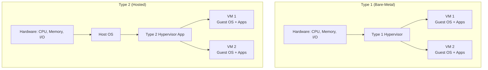
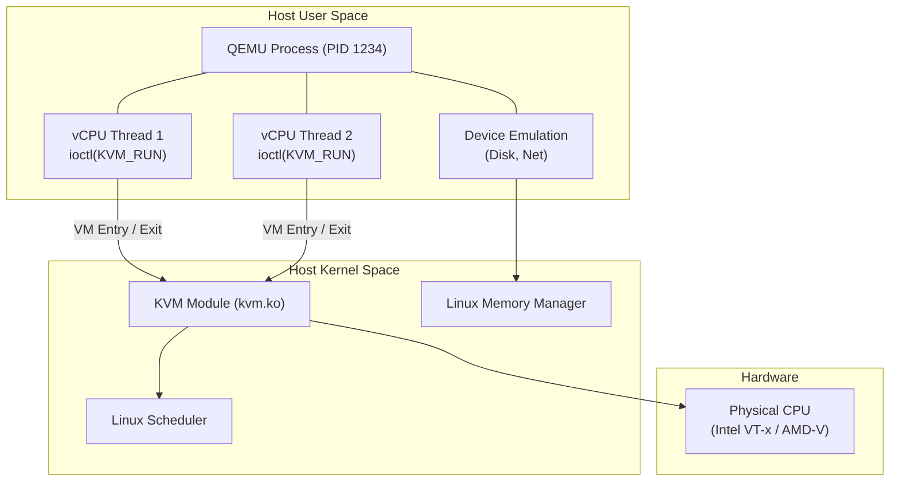

Running a full, unmodified operating system inside another operating system sounds like an impossible illusion. The CPU was fundamentally designed under the assumption that only one master—the OS kernel—has absolute control over hardware registers, memory management units (MMU), and interrupts. If a "guest" operating system tries to execute a privileged instruction, it should either crash the host or be rejected by the CPU.

Yet, modern cloud infrastructure relies entirely on slicing monolithic physical servers into dozens of perfectly isolated, secure Virtual Machines (VMs), each running its own kernel. To achieve this, we had to fundamentally alter CPU silicon to support a new layer of software: the **Hypervisor** (or Virtual Machine Monitor, VMM). 

The hypervisor acts as a "kernel for kernels," multiplexing physical hardware across multiple guest operating systems. This lesson explores the taxonomy of hypervisors, the hardware extensions that make them efficient, and the architectural brilliance of KVM, which transforms standard Linux into an enterprise-grade Type 1 hypervisor.

---

## 1. Hypervisor Taxonomy: Type 1 vs Type 2

Hypervisors are traditionally classified by where they sit in the software stack.

### Type 1 (Bare-Metal / Native)
A Type 1 hypervisor runs directly on the physical hardware, replacing a traditional host operating system. Its sole purpose is to manage VMs and allocate hardware resources. Because there is no intermediary host OS, Type 1 hypervisors offer minimal footprint, high performance, and near-zero latency. 
*Examples: VMware ESXi, Xen, Microsoft Hyper-V, AWS Nitro.*

### Type 2 (Hosted)
A Type 2 hypervisor runs as a standard user-space application process on top of a conventional host operating system (like Windows, macOS, or Linux). The host OS manages the physical hardware, and the hypervisor translates guest hardware requests into host OS system calls. This introduces significant overhead but is incredibly convenient for desktop development.
*Examples: Oracle VirtualBox, VMware Workstation, QEMU (without KVM).*



---

## 2. Hardware-Assisted Virtualization (Intel VT-x & AMD-V)

In 1974, Gerald Popek and Robert Goldberg published their virtualization requirements theorem. It stated that an architecture is virtualizable only if all "sensitive" instructions (those that affect hardware state) are also "privileged" (they trap to the hypervisor if executed in user mode).

### Why x86 was originally not virtualizable
Early x86 CPUs violated this theorem. There were around 17 instructions (like `POPF` or `SGDT`) that were sensitive but *not* privileged. If a guest OS executed them in user mode (Ring 3), they failed silently or returned host hardware state rather than trapping to the hypervisor. Early hypervisors (like VMware's binary translation) had to dynamically scan and rewrite guest kernel code on the fly to intercept these instructions—a massive performance penalty.

### CPU Silicon Modifications: VMX Root vs Non-Root
To fix this, Intel introduced **VT-x** (and AMD introduced **AMD-V**) in the mid-2000s. Instead of just adding a "Ring -1", they created two completely new CPU operation modes:
- **VMX Root Operation:** Where the hypervisor runs (retains Rings 0-3).
- **VMX Non-Root Operation:** Where the guest VM runs (retains Rings 0-3).

When the guest OS is in VMX Non-Root mode, it genuinely runs its kernel in Ring 0. However, when it executes a sensitive instruction, the CPU hardware triggers a **VM Exit**, trapping directly to the hypervisor in VMX Root mode.

### VM Entries, VM Exits, and VMCS
- **VM Entry:** Hypervisor transitions CPU to Guest (Root -> Non-Root).
- **VM Exit:** Guest traps back to Hypervisor (Non-Root -> Root).
- **VMCS (Virtual Machine Control Structure):** A hardware-managed memory region that stores the state of both the host and the guest. During a VM Exit, the CPU automatically saves guest registers to the VMCS and loads host registers from the VMCS.

---

## 3. KVM (Kernel-based Virtual Machine) — Linux as a Hypervisor

KVM is a masterpiece of pragmatic engineering. Rather than writing a massive bare-metal hypervisor from scratch, KVM's creators realized that Linux already had excellent CPU scheduling, memory management, and device drivers. 

By simply adding a kernel module (`kvm.ko`), they enabled Linux to utilize Intel VT-x / AMD-V. KVM effectively transforms the standard Linux kernel into a Type 1 hypervisor.

### The Division of Labor
- **Kernel Space (KVM):** Exposes `/dev/kvm`. Handles CPU virtualization (VMCS management, VM Entries/Exits) and memory virtualization.
- **User Space (QEMU):** Handles device emulation (disk, network, USB).

### A VM is Just a Linux Process
In KVM, a virtual machine is not a magical black box; it is merely a standard Linux process (typically `qemu-system-x86_64`). 
- The guest RAM is just `mmap()`'d memory in the QEMU process.
- Each virtual CPU (vCPU) is just a standard POSIX thread (`pthread`).

The QEMU vCPU thread simply runs a loop calling `ioctl(vcpu_fd, KVM_RUN)`. The kernel takes over, triggers a VM Entry, and the hardware runs guest code until a VM Exit occurs. The kernel handles the exit, and if it's a device I/O request, passes it up to user-space QEMU.



---

## 4. Memory Virtualization: EPT and Shadow Page Tables

Virtualizing memory is complex because of a two-dimensional translation problem. In a VM, we must translate:
1. **Guest Virtual Address (GVA)** to **Guest Physical Address (GPA)** (managed by Guest OS).
2. **Guest Physical Address (GPA)** to **Host Physical Address (HPA)** (managed by Hypervisor).

### Shadow Page Tables (Software-based)
Before hardware support, hypervisors used shadow page tables. The hypervisor write-protected the guest's page tables. Every time the guest OS updated a page table, it caused a page fault (VM Exit). The hypervisor would then manually compute the GVA-to-HPA translation and update a hidden "shadow" page table that the physical CPU MMU actually used. The VM-exit overhead for memory-intensive workloads was catastrophic.

### Extended Page Tables (Intel EPT / AMD NPT)
Hardware engineers added a 2D page walker to the CPU MMU. With Intel EPT, the hardware natively understands both translations. 
When the guest CPU accesses a GVA, the MMU simultaneously walks the guest page tables (GVA->GPA) and the EPT (GPA->HPA).

**The Performance Catch:** A single TLB miss in the guest can result in a "2D page walk." Since each step in a 4-level guest page walk requires traversing a 4-level EPT, a worst-case miss requires $4 \times 4 + 4 = 24$ memory references! 

> [!TIP]
> **Huge Pages:** This is why using 1GB Huge Pages on virtualization hosts is critical. By flattening the EPT depth, you drastically reduce the penalty of 2D hardware page walks.

---

## 5. I/O Virtualization: Emulation vs Paravirtualization vs SR-IOV

How does a VM talk to the network or disk?

1. **Full Emulation (Slowest):** QEMU traps every read/write to a virtual hardware register and mimics an old device (e.g., Intel e1000 NIC). Massive overhead due to constant VM Exits.
2. **Paravirtualization (`virtio`) (Fast):** The guest OS knows it is virtualized. It uses a `virtio` driver that communicates with the hypervisor via shared memory ring buffers (`vring`). Since data is placed directly in shared memory and signaled asynchronously, VM Exits are minimized.
3. **Hardware Passthrough & SR-IOV (Fastest):** Single Root I/O Virtualization (SR-IOV) allows a physical PCIe network card to present itself as multiple independent "Virtual Functions" (VFs). The hypervisor maps a VF directly into the guest VM's memory. The VM's NIC driver talks directly to the physical silicon, completely bypassing the hypervisor (Zero VM Exits).

---

## 6. Virtual Machines vs Containers Comparison

| Feature | Virtual Machines (KVM/Hyper-V) | Containers (Docker/cgroups) |
| :--- | :--- | :--- |
| **Isolation Barrier** | Hardware (Intel VT-x) & Hypervisor | OS Kernel (Namespaces/cgroups) |
| **Guest OS** | Full separate OS (Linux, Windows, BSD) | Shares host Linux kernel |
| **Startup Latency** | Seconds to Minutes (Booting OS) | Milliseconds (Spawning process) |
| **Memory Overhead** | High (Full guest kernel & buffers) | Near Zero |
| **Multi-tenant Security**| Excellent (Hardware enforced isolation) | Moderate (Kernel exploits can break out) |
| **Density per Host** | Tens to Hundreds | Hundreds to Thousands |

---

## 7. Practical Investigation & KVM Administration

Check if your CPU supports hardware virtualization:
```bash
# Look for 'VT-x' or 'AMD-V'
lscpu | grep Virtualization
# Output: Virtualization: VT-x

# Or use kvm-ok (Ubuntu/Debian)
kvm-ok
# Output: INFO: /dev/kvm exists
# KVM acceleration can be used
```

Inspecting VMs (libvirt):
```bash
# List all running VMs
virsh list

# View hypervisor resource usage
virt-top
```

Tracing VM Exits (Performance Tuning):
```bash
# View real-time VM Exit statistics to identify bottlenecks
kvm_stat
```

---

## 8. Real-World Mental Anchors

- **The Obvious Case:** A company buys a 128-core AMD EPYC server. Instead of running one massive application, they use KVM to carve it into 32 virtual machines (4 cores each) for different departments, perfectly isolating their workloads.
- **The Counter-Intuitive Case (AWS Nitro):** AWS realized that running the hypervisor on the main host CPUs consumed 10-30% of the server's processing power. Their Nitro system offloads the hypervisor (I/O, network, storage virtualization) onto dedicated custom PCIe ASIC cards. This leaves ~100% of the main x86 CPU cores available for the guest VM, providing true "bare-metal" performance in the cloud.
- **The Failure Mode (Nested Virtualization):** Running a VM inside a VM (e.g., KVM inside VMware). It requires the level-0 hypervisor to emulate VT-x instructions for the level-1 hypervisor. Shadow page tables compound, VM Exits multiply, and performance degrades heavily unless specific hardware features (like VMCS shadowing) are present and enabled.

---

## 9. ✕ What people get wrong

- **"Containers are just lightweight VMs."** False. A container is just an isolated process running on the *same* kernel as the host. A VM boots an entirely separate kernel isolated by hardware CPU extensions.
- **"KVM is a Type 2 hypervisor because it runs on Linux."** False. Although Linux acts as a host OS, the KVM kernel module elevates Linux itself to a Type 1 bare-metal hypervisor level, communicating directly with hardware VMX/SVM extensions.
- **"VMs are completely secure."** Mostly true, but hypervisor escapes exist. If a bug in QEMU's virtual floppy disk emulator allows a guest to overwrite QEMU's memory in host user-space, the guest can execute code on the host.

---

## 10. Why this matters

Understanding virtualization is foundational for modern systems engineering. 
- **Cloud Economics:** The public cloud (AWS EC2, GCP Compute Engine) is entirely built on hypervisors. Understanding KVM explains how cloud providers achieve multi-tenant isolation.
- **Latency Engineering:** If your database in a VM is experiencing micro-stutters, knowing how to trace VM Exits, configure huge pages, and enable SR-IOV networking can turn a sluggish system into a high-performance cluster.
- **Interview Context:** Systems design interviews frequently require deciding between VMs and containers based on security boundaries, startup times, and OS dependencies.

## Key Takeaways
- **Hardware is Magic:** Modern virtualization is only fast because CPU hardware (VT-x / AMD-V) was redesigned to support VM Entries, VM Exits, and hardware-accelerated 2D page walks (EPT).
- **KVM == Linux Process:** KVM elegantly turns Linux into a Type 1 hypervisor, where guest VMs are standard processes and vCPUs are standard POSIX threads.
- **I/O dictates speed:** Fully emulated hardware is slow. Production VMs rely on paravirtualization (`virtio`) or direct hardware passthrough (SR-IOV) to achieve near bare-metal network and storage speeds.

---

Links to: `[Linux Isolation — Namespaces & cgroups v2](/docs/operating-system/05-networking-and-virtualization/03-linux-containers-isolation)`
