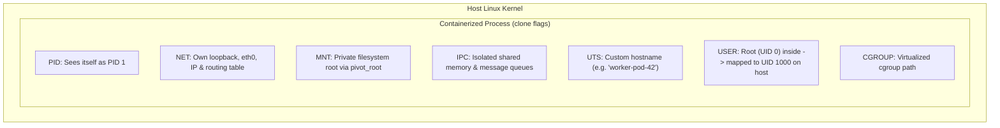

## "Containers" do not exist in the Linux kernel

One of the biggest misconceptions in modern software engineering is that a "container" is a virtual machine or a distinct kernel object.

If you search the entire Linux kernel source code for the word `container_struct`, you will find nothing. **There is no such thing as a container in the Linux kernel.**

A container (Docker, Kubernetes pod, containerd) is simply a **standard Linux process** constrained by two kernel primitives that have existed for decades:
1. **Namespaces** (*What the process can see*): Restricts the process's view of system resources (process IDs, network interfaces, filesystem mounts).
2. **Control Groups (cgroups)** (*How much the process can use*): Enforces hard limits on physical resource consumption (CPU cores, RAM bytes, disk I/O bandwidth).

---

## 1. The 7 Kernel Namespaces (What You Can See)

When a process is spawned via the `clone()` system call with namespace flags, the kernel provides it with an isolated virtual view:



| Namespace | System Flag | What It Isolates | Real-World Impact |
| :--- | :--- | :--- | :--- |
| **PID** | `CLONE_NEWPID` | Process IDs | The container process sees itself as **PID 1** (init). It cannot see or send signals to host processes. |
| **NET** | `CLONE_NEWNET` | Network interfaces | The container gets its own `lo` interface, private virtual Ethernet (`veth`) pair, port bindings, and iptables rules. Port 80 inside does not conflict with Port 80 on the host! |
| **MNT** | `CLONE_NEWNS` | Filesystem mount points | Combined with `pivot_root`, the container sees an isolated directory tree (e.g. an Ubuntu root filesystem) completely separated from the host's `/`. |
| **IPC** | `CLONE_NEWIPC` | POSIX message queues & shared memory | Prevents container processes from attaching to the host's shared memory segments. |
| **UTS** | `CLONE_NEWUTS` | Hostname & domain name | Allows the container to have its own unique hostname (`my-container`) without changing the host server's name. |
| **USER** | `CLONE_NEWUSER` | UID and GID mappings | Enables **rootless containers**: a process running as UID 0 (`root`) inside the container is mapped to an unprivileged UID (e.g., `10001`) on the host. |
| **CGROUP**| `CLONE_NEWCGROUP`| Cgroup root view | Masks the host's full cgroup hierarchy, showing only the container's relative slice. |

---

## 2. Control Groups: cgroups v1 vs cgroups v2

Namespaces make a process blind to its neighbors, but they do not stop it from hogging 100% of the host CPU or eating all 64GB of RAM. That is the job of **cgroups**.

### The Flaws of cgroups v1
- Historically, cgroups v1 used disjoint, independent directory trees for every resource (`/sys/fs/cgroup/cpu`, `/sys/fs/cgroup/memory`, `/sys/fs/cgroup/blkio`).
- Different controllers could not coordinate. For example, memory-throttled writes could not properly throttle disk I/O because the memory controller and block I/O controller operated in isolation.

### The Modern Standard: cgroups v2 (Unified Hierarchy)
Standardized in modern Linux distributions and Kubernetes 1.25+, **cgroups v2** replaces disparate trees with a single unified hierarchy:

```
/sys/fs/cgroup/
├── kubepods.slice/
│   ├── kubepods-burstable.slice/
│   │   ├── pod_xyz/
│   │   │   ├── cgroup.procs      (PIDs in this container)
│   │   │   ├── cpu.max           (CPU quota and period)
│   │   │   ├── memory.max        (Hard memory limit -> OOM)
│   │   │   ├── memory.high       (Soft memory limit -> throttle)
│   │   │   ├── memory.pressure   (Pressure Stall Information)
│   │   │   └── io.max            (Disk read/write IOPS caps)
```

---

## 3. Controlling CPU & Memory

### 1. CPU Throttling (`cpu.max`)
CPU limits are configured as `[quota] [period]` (in microseconds):
```bash
# Allow 2 full CPU cores (200ms of compute every 100ms period)
echo "200000 100000" > /sys/fs/cgroup/mygroup/cpu.max

# Allow exactly 0.5 CPU cores
echo "50000 100000" > /sys/fs/cgroup/mygroup/cpu.max
```
If the process uses its quota before the period ends, the CFS/EEVDF scheduler **throttles** it, parking its threads until the next period ticks.

### 2. Memory Limits (`memory.max` vs `memory.high`)
- **`memory.max` (Hard Limit)**: If total memory exceeds this ceiling and cannot be reclaimed by dropping page cache, the kernel **OOM Killer** terminates the process immediately.
- **`memory.high` (Soft Limit)**: When exceeded, the kernel slows down the process and aggressively flushes page caches, but avoids triggering an OOM kill.

---

## 4. Pressure Stall Information (PSI)

How do you know if your Kubernetes pods are struggling *before* they are killed by OOM or throttled to death?

Traditional metrics (like "Memory Usage %") are misleading because the Linux Page Cache naturally fills free RAM. Linux solves this with **Pressure Stall Information (PSI)**:

```bash
cat /sys/fs/cgroup/mygroup/memory.pressure
# Output:
# some avg10=2.45 avg60=1.12 avg300=0.50 total=128490
# full avg10=0.00 avg60=0.00 avg300=0.00 total=0
```
- **`some`**: The percentage of wall-clock time that *some* threads were stalled waiting on memory/CPU/IO.
- **`full`**: The percentage of time that *all* threads in the cgroup were completely stalled (0% useful work occurring).
- **Production Gold Standard**: Modern Kubernetes autoscalers and monitoring agents use PSI to detect true resource starvation before outages occur.

---

## 5. Practical Hands-On Tools

### Build a "Container" Manually with `unshare`
You can create a real container from scratch using built-in Linux CLI commands without installing Docker:
```bash
# Spawn a new shell with its own PID, Network, Mount, and Hostname namespaces:
sudo unshare --pid --net --mount --uts --fork /bin/bash

# Inside the shell, check your isolated hostname:
hostname my-secret-container
hostname
# Check the host: the host's hostname remains untouched!
```

### Inspect Container Namespaces with `lsns`
```bash
# List all active namespaces on the host and the processes bound to them
lsns -t pid,net,mnt
```

### Monitor cgroup v2 Trees with `systemd-cgtop`
```bash
# View real-time CPU, Memory, and I/O consumption by cgroup hierarchy
systemd-cgtop
```

---

## Key Takeaways

1. **Containers are processes, not VMs**: They share the host kernel and hardware directly.
2. **Namespaces govern vision; cgroups govern consumption**: Namespaces hide host entities; cgroups v2 enforce bandwidth, memory, and CPU limits.
3. **Use PSI for real observability**: Monitor `memory.pressure` and `cpu.pressure` to catch starvation long before processes get killed.

---

Links to: **[Container Security & Sandboxing](/docs/operating-system/05-networking-and-virtualization/04-kernel-security-seccomp)** (Linux Capabilities, rootless user namespaces, seccomp-bpf, and microVMs).

