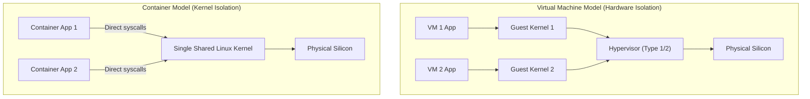
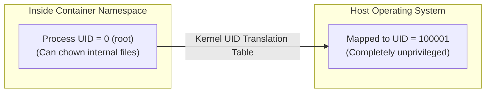
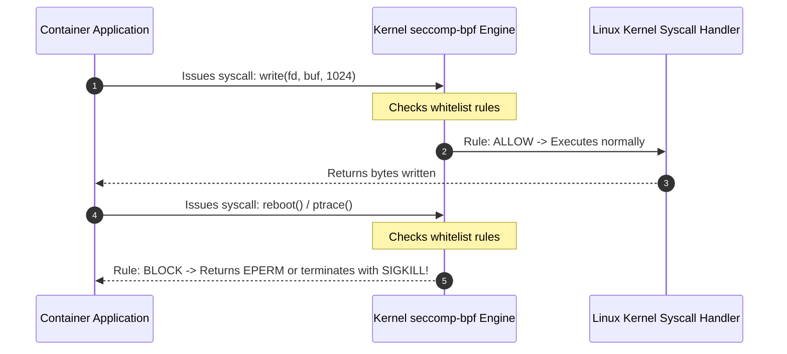
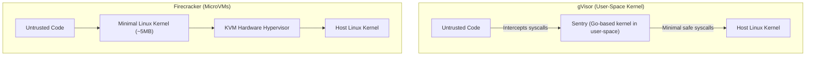
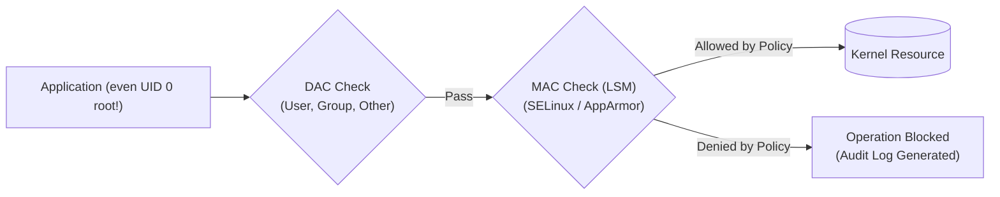

## The shared kernel vulnerability

In traditional hardware virtualization (VirtualBox, VMware, AWS EC2 Nitro), each virtual machine runs its own dedicated operating system kernel on top of a hypervisor. If a process compromises its kernel, it is still trapped inside its virtual hardware envelope.

In containers (Docker, Kubernetes), **all containers share the exact same host Linux kernel**.



If a malicious process inside a container exploits a vulnerability in the kernel (e.g., a buffer overflow in a `bpf()` or `fsopen()` syscall), **it gains root control over the entire physical host server**.

To prevent container breakouts, Linux enforces three concentric rings of security: **Capabilities**, **User Namespaces**, and **seccomp-bpf**.

---

## 1. Linux Capabilities: Splitting the Monolith of "Root"

Historically in Unix, security was binary:
- **UID 0 (`root`)**: Can do literally anything (reboot machine, bypass file permissions, raw network sockets).
- **UID > 0 (normal users)**: Heavily restricted.

This caused severe security risks: if an application like Nginx needed to bind to privileged port `80`, it had to run as full `root`. If an attacker found an exploit in Nginx, they got complete ownership of the server.

Linux solved this by breaking the powers of root into **40+ independent Capabilities**:

| Capability | What It Authorizes | Principle of Least Privilege |
| :--- | :--- | :--- |
| `CAP_NET_BIND_SERVICE` | Bind to ports below 1024 (e.g. 80, 443). | Grant *only* this capability to web servers so they can bind to port 80 without running as root. |
| `CAP_SYS_ADMIN` | The "kitchen sink": mount filesystems, load kernel modules, configure IPC. | **Extremely dangerous**. Should almost never be granted to containers. |
| `CAP_NET_RAW` | Send raw Ethernet/IP packets, forge headers. | Used by `ping` and packet sniffers; blocked in secure container runtimes. |
| `CAP_DAC_OVERRIDE` | Bypass all read, write, and execute permission checks on files. | Bypasses all standard Unix file permissions. |

### Docker & Kubernetes Default: Drop All, Add Needed
Modern production best practice is to drop all capabilities and whitelist only what is strictly required:
```yaml
# Kubernetes Pod Security Context:
securityContext:
  capabilities:
    drop: ["ALL"]
    add: ["NET_BIND_SERVICE"]
```

---

## 2. Rootless Containers & User Namespaces

Even if an application runs as UID 0 (`root`) inside a container, **User Namespaces** ensure it has zero privileges on the host:



If an attacker escapes the container filesystem to the host, the kernel sees an unprivileged user (`UID 100001`). They cannot read `/etc/shadow`, modify system files, or kill host processes.

---

## 3. seccomp-bpf: Filtering System Calls

The Linux kernel exposes over **450 distinct system calls**. A typical web server (Node, Go, Python) only ever needs ~50 of them (`read`, `write`, `epoll_wait`, `socket`, `futex`).

The other 400 syscalls (`reboot`, `mount`, `kexec_load`, `ptrace`, `bpf`) represent pure **attack surface**.

**seccomp** (Secure Computing Mode) uses the in-kernel **BPF (Berkeley Packet Filter)** engine to inspect and filter system calls before the kernel executes them:



### The Docker Default Profile
By default, Docker applies a standard seccomp profile that blocks **44 dangerous system calls** (including `reboot`, `swapon`, `clone3` with new user namespaces, and `kexec_load`).

---

## 4. Modern Multi-Tenant Sandboxing: gVisor vs Firecracker

When running untrusted customer code (e.g. AWS Lambda, serverless functions, multi-tenant SaaS), standard Linux containers are considered insufficient. Two modern architectures solve this:



1. **gVisor (Google Cloud Run / GKE Sandbox)**: Implements a user-space kernel in Go ("Sentry"). It intercepts system calls before they ever reach the Linux kernel, neutralizing kernel exploit zero-days.
2. **Firecracker (AWS Lambda / Fargate)**: A minimalist open-source Virtual Machine Monitor written in Rust that boots a complete, stripped-down Linux microVM in **< 5 milliseconds** using the Linux KVM hypervisor. Combines the speed of containers with the true hardware barrier of virtual machines.

---

## 5. Mandatory Access Control (MAC): SELinux & AppArmor

Beyond POSIX file permissions (Discretionary Access Control, DAC) and Linux Capabilities, modern production kernels enforce **Mandatory Access Control (MAC)**:



1. **Discretionary Access Control (DAC) Limitations**: In traditional Unix, the file owner dictates permissions (`chmod 777`). If a web server running as user `www-data` is compromised, the attacker can access any file readable by `www-data`.
2. **Access Control Lists (ACLs) vs Capability Lists**:
   - **ACLs**: Stored with the resource (e.g. file inode stores which users/groups have read/write access).
   - **Capability Lists**: Stored with the subject/process (e.g. process holds an unforgeable ticket authorizing access to specific resources).
3. **AppArmor (Path-Based MAC)**: Standard in Ubuntu and Debian. Binds security profiles to file pathnames (e.g. `/usr/sbin/nginx` is strictly forbidden from reading `/etc/shadow` or executing `/bin/sh`, even if exploited by remote code execution).
4. **SELinux (Label-Based MAC)**: Standard in RHEL, Fedora, and Android. Assigns cryptographic security contexts (`user:role:type:level`) to every process, inode, and socket. The kernel Linux Security Module (LSM) consults a compiled policy matrix: unless a rule explicitly allows type `httpd_t` to read `etc_t`, access is blocked even for root (`UID 0`).

---

## 6. Practical Security Auditing Tools

### Inspect Process Capabilities with `getpcaps`
```bash
# View capabilities granted to a running process
getpcaps <pid>

# Decode capability bitmasks into human-readable strings
capsh --decode=00000000a80425fb
```

### Audit System Calls with `strace -c`
To write a custom, minimal seccomp whitelist for your production binary:
```bash
# Run application under realistic load and summarize every syscall it invoked
strace -c -f ./my-application
```

### Check MAC Status
```bash
# Inspect SELinux enforcement status
sestatus

# Inspect AppArmor profile status
aa-status
```

---

## Key Takeaways

1. **Containers share one kernel**: A single kernel exploit can compromise the entire host unless restricted.
2. **Drop capabilities aggressively**: Strip `CAP_SYS_ADMIN` and grant only precise permissions like `CAP_NET_BIND_SERVICE`.
3. **seccomp cuts attack surface by 90%**: Blocking unused syscalls renders whole classes of kernel exploits impossible.
4. **Use microVMs (Firecracker) for untrusted code**: Real hardware hypervisor isolation remains the gold standard for multi-tenant security.

---

Links to: **[Performance Synthesis, eBPF & Systems Observability](/docs/operating-system/06-observability-and-advanced/01-observability-ebpf)** (Brendan Gregg's USE method, PMU hardware counters, and in-kernel eBPF instrumentation).

