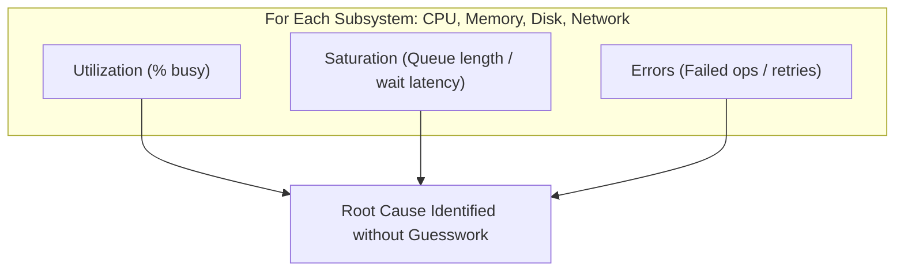
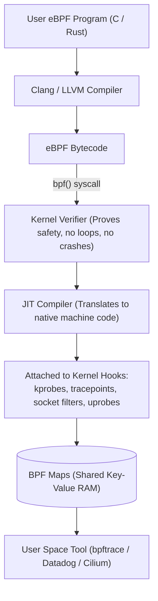

## Abstractions cost money — in microseconds

Throughout this 16-lesson curriculum, we have dissected the layers of the operating system:
- CPU scheduling (EEVDF) and context switching
- Memory virtualisation, page tables, and TLB caches
- The VFS layer, Page Cache, and durability (`fsync`)
- Multiplexed network I/O (`epoll`) and zero-syscall async rings (`io_uring`)
- Namespaces, cgroups v2, and container boundaries

Every single abstraction consumes physical resources. When an application is slow, crashing, or suffering from p99 latency spikes in production, **the root cause is almost always an unintended interaction with one of these OS abstractions**.

---

## 1. The Cost of Abstractions in Microseconds

Keep these physical orders of magnitude anchored in your engineering intuition:

| Operation | Typical Latency | Real-World Context & Impact |
| :--- | :--- | :--- |
| **CPU L1 Cache Reference** | **~1 nanosecond** | 4 CPU cycles. Direct silicon access. |
| **CPU Branch Mispredict** | **~3 nanoseconds** | Flushes CPU execution pipeline (~15 cycles). |
| **L2 / L3 Cache Reference** | **~4–15 nanoseconds** | 10–40 CPU cycles. |
| **DRAM Memory Access** | **~50–100 nanoseconds** | Main physical RAM latency (cache miss). |
| **Futex Lock (Uncontended)** | **~10–20 nanoseconds** | Atomic user-space CAS (0 system calls). |
| **System Call (Crossing Ring 3 $\to$ 0)**| **~1–3 microseconds** | Register save, trap table transition, privilege switch. |
| **Context Switch (Thread)** | **~2–5 microseconds** | CPU register swap, cache thrashing. |
| **Context Switch (Process)** | **~5–15 microseconds** | Register swap **plus TLB flush & page table switch**. |
| **Minor Page Fault** | **~2–5 microseconds** | Kernel grabs free RAM frame, writes PTE. |
| **NVMe SSD 4KB Read** | **~10–50 microseconds** | Direct PCIe DMA transfer. |
| **Major Page Fault (SSD/Swap)** | **~1–5 milliseconds** | Thread blocked waiting on disk read (1,000x slower!). |
| **TCP Packet (Cross-Datacenter)**| **~10–50 milliseconds** | Physical speed-of-light in fiber optic cable. |

---

## 2. Brendan Gregg's USE Method

When troubleshooting an unknown performance crisis in production, avoid guessing or blindly changing config parameters. Follow Netflix performance architect **Brendan Gregg's USE Method**:

For **every physical and virtual resource** (CPU, Memory, Storage, Network, File Descriptors):
1. **Utilization**: What percentage of time was the resource busy doing work? (e.g. CPU at 85%, Disk at 98%).
2. **Saturation**: Is there extra work queuing up because the resource cannot keep up? (e.g. CPU runqueue length, Linux disk queue depth `aqu-sz`, network packet drops).
3. **Errors**: Are there hardware or software errors occurring? (e.g. TCP retransmits, memory ECC errors, disk I/O timeouts).



> [!IMPORTANT]
> **Utilization is not throughput**: A CPU running at 100% does not mean useful work is happening. It could be spinning on locked futexes, drowning in TLB shootdowns, or thrashing in context switches.

---

## 3. Hardware PMUs: Instructions Per Cycle (IPC)

Modern CPUs contain a **Performance Monitoring Unit (PMU)** — dedicated hardware counters that measure internal silicon events without adding software overhead:

- **Cycles**: Total clock ticks.
- **Instructions**: Machine instructions retired.
- **IPC (Instructions Per Cycle)**:
  `IPC = Instructions / Cycles`
  - **IPC > 1.5**: **CPU-bound**. The code is efficiently executing instructions; optimize algorithms or parallelize across cores.
  - **IPC < 0.5**: **Memory-bound**. The CPU is stalling 70%+ of the time waiting for DRAM cache misses or memory bus latency! Faster algorithms won't help; you must fix cache locality, struct packing, or data layout.

```bash
# Measure IPC, cache misses, and branch mispredictions
perf stat ./my-workload
```

---

## 4. The eBPF Revolution: In-Kernel Programmability

Historically, observing Linux internals required writing risky kernel modules (which could crash the server with a kernel panic) or running `strace` (which added up to **100x slowdown** by intercepting every syscall via `ptrace`).

In modern Linux, **eBPF (Extended Berkeley Packet Filter)** transforms the kernel into a programmable platform:



### Why eBPF is Unstoppable:
1. **Safety**: The in-kernel **Verifier** mathematically proves the bytecode cannot dereference null pointers, access out-of-bounds memory, or loop infinitely before allowing it to load.
2. **Near-Zero Overhead**: Code is JIT-compiled directly into machine instructions inside the kernel. Aggregates data in BPF Maps in RAM without copying every event to user space.
3. **Total Observability**:
   - **Kprobes / Kretprobes**: Hook into *any* kernel C function dynamically.
   - **Uprobes**: Hook into user-space applications (e.g. trace SSL/TLS decrypted bytes in OpenSSL without code changes!).
   - **Tracepoints**: Stable, documented kernel instrumentation points.

---

## 5. Flamegraphs: Visualizing On-CPU & Off-CPU Latency

Invented by Brendan Gregg, **Flamegraphs** convert gigabytes of profiler stack traces into an interactive, visual hierarchy:

```
[=========================== all stacks ===========================]
[========== process_http_request ==========] [==== background_gc ===]
[== parse_json ==] [==== query_db_pool ====] [== mark_and_sweep ==]
[= parse_string =] [= pthread_mutex_lock =]
```
- **X-axis**: Alphabetical sorting of function frames (width indicates % of total time spent in that function).
- **Y-axis**: Call stack depth (top-most box is the function actively executing).

### On-CPU vs Off-CPU Flamegraphs:
- **On-CPU Flamegraph**: Shows where the CPU is actively burning cycles (e.g. regex parsing, JSON serialization).
- **Off-CPU Flamegraph**: Shows **what threads are blocked waiting for** (lock contention, disk `fsync`, network timeouts, or kernel page faults).

---

## 6. The Production Diagnostic Toolchain

Master these diagnostic one-liners for production incident triage:

### 1. Identify Process Bottleneck
```bash
# Check CPU, I/O wait (%wa), and system time (%sy)
top -b -n 1 | head -n 20
```

### 2. Trace Storage I/O Latency with BCC
```bash
# Summarize block device I/O latency distribution (histogram)
biolatency-bpfcc -m 1
```

### 3. Trace Process Executions System-Wide
```bash
# Catch short-lived processes draining CPU cycles
execsnoop-bpfcc
```

### 4. Trace Off-CPU Blocking Time with `bpftrace`
```bash
# Sample kernel off-cpu sleep call stacks
bpftrace -e 'tracepoint:sched:sched_switch { @[kstack] = count(); }'
```

### 5. Generate a CPU Flamegraph with `perf`
```bash
# 1. Sample stack traces at 99Hz for 10 seconds
perf record -F 99 -a -g -- sleep 10

# 2. Render flamegraph
perf script | stackcollapse-perf.pl | flamegraph.pl > cpu_flamegraph.svg
```

---

## 7. Kernel Timers, Clocks & CPU Power Management

To accurately measure performance and govern silicon energy efficiency, the kernel coordinates hardware clocks and CPU power states:

- **Clock Sources & Timers**:
  - **TSC (Time Stamp Counter)**: Hardware cycle counter on modern x86 CPUs. Sub-nanosecond resolution, monotonic, read via `rdtsc` instruction with near-zero latency.
  - **hrtimers (High-Resolution Timers)**: Nanosecond-resolution kernel timer subsystem replacing the coarse periodic system tick (`jiffies`), driving precise POSIX `nanosleep()` and epoll timeouts.
- **CPU Power States**:
  - **C-States (Idle Sleep States)**: From $C_0$ (active execution) down to $C_6$ (core clocks stopped, voltage collapsed, L1/L2 caches flushed). Waking up from deep C-states incurs latency penalties (tens of microseconds), causing p99 latency spikes on low-load network servers.
  - **P-States & Frequency Governors**: Governed by `cpufreq` (e.g. `performance`, `powersave`, `schedutil`). Latency-critical systems (HFT, game servers) lock CPUs to maximum clock frequency using the `performance` governor:
    ```bash
    # Lock all CPU cores to maximum frequency
    cpupower frequency-set -g performance
    ```

---

## The Complete Picture: You Now Understand the Machine

You have journeyed through the full stack of modern operating systems:
1. From bare silicon through CPU scheduling and kernel boundaries...
2. Through atomic futexes, memory translation, and page allocators...
3. Past the VFS, dirty Page Cache flushers, and NVMe parallel queues...
4. Across non-blocking event loops, `io_uring` completion rings, and zero-copy transfers...
5. To container isolation with cgroups v2, seccomp sandboxes, and eBPF instrumentation.

With these foundational mental models, you no longer guess how systems behave. **You know what the kernel is doing under every line of code you write.**

---

Links to: **[Real-Time Operating Systems & Embedded Constraints](/docs/operating-system/06-observability-and-advanced/02-rtos-embedded)** (when determinism and hard deadline guarantees matter more than throughput).

