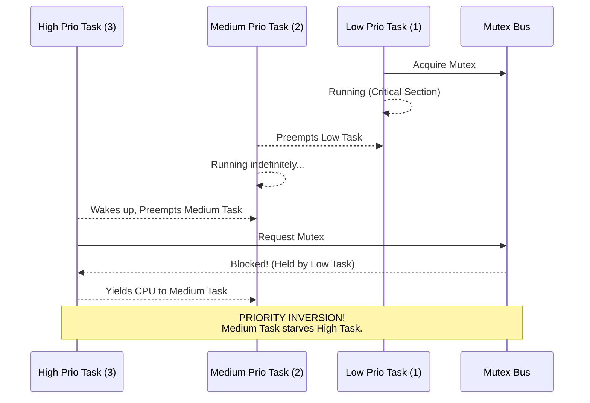

A medical ventilator or fly-by-wire flight controller does not care if its control algorithm finishes in 10 microseconds on average; it cares that it **NEVER** finishes later than 500 microseconds in the worst possible case. General-Purpose Operating Systems (GPOS) like Windows, macOS, or standard Linux are built to maximize *throughput* and *fairness*. They will gladly pause a critical thread for a few milliseconds to process a network packet or flush a disk cache.

In the realm of Real-Time Operating Systems (RTOS), this behavior is unacceptable. An RTOS is designed to guarantee **determinism**. Predictability is paramount. If a task requires execution within a strict timeframe, the OS must provide mechanisms to guarantee that deadline is met, regardless of system load. 

This lesson explores the theory of deterministic scheduling, real-world catastrophes caused by priority mismanagement, and the architecture of modern embedded operating systems designed to keep the world safe.

---

## 1. Hard vs. Firm vs. Soft Real-Time Systems

"Real-time" does not mean "fast." A real-time system that processes temperature readings once per hour is still a real-time system, provided it strictly honors that 1-hour deadline. The classification of a real-time system depends entirely on the consequences of missing a deadline.

| Characteristic | Hard Real-Time | Firm Real-Time | Soft Real-Time |
| :--- | :--- | :--- | :--- |
| **Deadline Tolerance** | Zero tolerance. Missing a deadline is a total system failure. | Low tolerance. Results are useless if late. | High tolerance. Late results degrade quality. |
| **Latency Bounds** | Strictly bounded and mathematically provable worst-case execution time (WCET). | Tightly bounded, but occasional drops are handled gracefully. | Best-effort statistical bounds (e.g., 99th percentile). |
| **Consequences of Failure** | Loss of life, catastrophic hardware damage, mission failure. | Wasted computation, dropped events. | Annoyance, visual stuttering, degraded user experience. |
| **Examples** | Pacemakers, ABS braking systems, avionics, industrial robotics. | Satellite telemetry parsing, financial trading (sometimes), live video frames. | Video games, interactive audio rendering, UI updates. |

---

## 2. Deterministic Real-Time Scheduling Algorithms

To guarantee deadlines, RTOS schedulers must be highly predictable. Unlike the Linux Completely Fair Scheduler (CFS), which uses complex heuristics to balance load, RTOS schedulers use rigorous mathematical models.

### Rate Monotonic Scheduling (RMS)
RMS is a static-priority scheduling algorithm. It assigns priorities based on the periodicity of the task: **the shorter the period, the higher the priority**.
- If Task A runs every 10ms and Task B runs every 50ms, Task A gets a higher static priority.
- The Liu-Layland CPU utilization bound proves that a set of $n$ periodic tasks can always be scheduled by RMS if their total CPU utilization $U$ satisfies: 
  $$U \le n(2^{1/n} - 1)$$
- For a large number of tasks ($n \to \infty$), the bound approaches $\approx 69.3\%$. This means you can mathematically guarantee deadlines as long as CPU utilization stays below 69.3%.

### Earliest Deadline First (EDF)
EDF is a dynamic-priority algorithm. It assigns priority based on proximity to the deadline: **the task whose deadline is closest gets the highest priority**.
- Priorities change dynamically as time progresses.
- EDF is theoretically optimal for uniprocessor systems; it can achieve up to **100% CPU utilization** under preemptive conditions.
- However, EDF is harder to implement, incurs higher overhead, and behaves unpredictably during transient overloads (cascading deadline misses).

### Fixed-Priority Preemptive Scheduling
Most embedded microcontrollers use strict fixed-priority preemptive scheduling. The developer assigns a priority 0-255. The OS always runs the highest-priority ready task. It will ruthlessly preempt a lower-priority task the instant a higher-priority task wakes up.

```mermaid
gantt
    title RMS vs EDF Scheduling Behavior (Tasks: T1(Period=4), T2(Period=6))
    dateFormat  X
    axisFormat %s
    section RMS (Static)
    T1 (High Prio) : active, t1, 0, 1
    T2 (Low Prio)  : active, t2, 1, 3
    T1 (High Prio) : active, t3, 4, 5
    T2 (Low Prio)  : active, t4, 5, 6
    section EDF (Dynamic)
    T1 (Nearest)   : active, e1, 0, 1
    T2 (Nearest)   : active, e2, 1, 3
    T1 (Nearest)   : active, e3, 4, 5
    T2 (Nearest)   : active, e4, 5, 6
```


*(Note: In simple cases, RMS and EDF look similar, but EDF adapts when task phases overlap irregularly.)*

---

## 3. The Mars Pathfinder Disaster: Priority Inversion

In July 1997, NASA's Mars Pathfinder lander successfully touched down on Mars. Shortly after, the spacecraft began inexplicably resetting itself, losing precious communication windows. The system was trapped in a reboot loop triggered by a hardware watchdog timer.

### The Root Cause
The Pathfinder used a commercial RTOS (VxWorks) with strict fixed-priority scheduling. It suffered from a classic concurrency bug known as **Priority Inversion**.

1. **Task 1 (Low Priority - Meteorological Data):** Acquired a shared lock (`mutex_bus`) to write data to the shared memory bus.
2. **Task 2 (Medium Priority - Communications):** A long-running task that did *not* need the bus, but became ready to run. It preempted Task 1 because Medium > Low.
3. **Task 3 (High Priority - Information Management):** Woke up, needed to publish critical data, and demanded `mutex_bus`. 

Because Task 1 held `mutex_bus`, Task 3 blocked. However, Task 1 could not run to release the lock because it was being constantly preempted by Task 2! The Medium priority task was effectively starving the High priority task indefinitely. When the High priority task failed to execute in time, a watchdog timer detected the hang and rebooted the spacecraft.



### The Solution: Priority Inheritance
NASA engineers debugged the system remotely from Earth and uploaded a patch to enable **Priority Inheritance Protocol (PIP)**. 

Under PIP, when a High priority task blocks on a lock held by a Low priority task, the Low priority task *temporarily inherits* the High priority task's priority. This allowed the Low priority task (now acting as High priority) to preempt the Medium task, quickly finish its critical section, release the lock, and revert to its original Low priority. The actual High priority task could then acquire the lock and proceed.

*(Alternative: **Priority Ceiling Protocol (PCP)**, where any task acquiring a mutex immediately gets its priority boosted to the highest priority of any task that might ever use that mutex.)*

---

## 4. Embedded RTOS Implementations

Different constraints demand different RTOS architectures.

### FreeRTOS
The undisputed king of microcontrollers. FreeRTOS is an ultra-lightweight preemptive kernel written mostly in C. 
- **Footprint:** Can compile down to ~5KB ROM and ~500 bytes of RAM.
- **Design:** Provides a core scheduler (cooperative or preemptive via a SysTick timer), queues, semaphores, and mutexes. Nothing more.
- **Usage:** Ubiquitous in IoT sensors, smart home appliances, and simple wearables.

### Zephyr Project (Linux Foundation)
A modern, open-source RTOS aimed at connected IoT devices, structured much like a miniature Linux kernel.
- **Design:** Features robust Hardware Abstraction Layers (HAL), device trees (like Linux), and deeply integrated IP, Bluetooth, and Thread networking stacks.
- **Usage:** Complex smartwatches, industrial sensors, and mesh-networked devices.

### QNX Neutrino
A proprietary, highly reliable microkernel RTOS owned by BlackBerry.
- **Design:** True microkernel architecture. Drivers, file systems, and network stacks run in isolated user-space memory. If a network driver crashes, it can be restarted without taking down the kernel.
- **Usage:** Certified for safety-critical environments like automotive infotainment and ADAS (ISO 26262 ASIL D), medical devices, and railway controls.

### PREEMPT_RT Linux
Standard Linux is not an RTOS. However, the `PREEMPT_RT` patchset meticulously modifies the Linux kernel to support hard real-time behavior.
- **Changes:** Converts spinlocks to preemptible sleeping mutexes, forces interrupt handlers into schedulable kernel threads, and enables full kernel preemption.
- **Usage:** Industrial robotics, high-frequency trading (HFT) platforms, and telecommunications infrastructure where you need both the vast Linux ecosystem and bounded latency.

---

## 5. Practical Investigation & Real-Time Telemetry

Even on desktop Linux, you can interact with real-time scheduling policies (POSIX SCHED_FIFO and SCHED_RR) to prioritize critical workloads.

**Inspecting Real-Time Priorities:**
Use `chrt` to view or manipulate a process's scheduling policy.
```bash
# View the scheduling policy of a process
$ chrt -p 1234
pid 1234's current scheduling policy: SCHED_OTHER
pid 1234's current scheduling priority: 0

# Launch a command with strict real-time FIFO priority 99 (Highest)
$ sudo chrt --fifo 99 ./my_critical_binary
```

**Testing Real-Time Latency:**
`cyclictest` is the standard tool to measure OS scheduling latency by setting an alarm and measuring the difference between the expected wakeup time and the actual wakeup time.
```bash
# Run cyclictest on all CPUs, with real-time priority 98, locking memory (-m)
$ sudo cyclictest --smp -p98 -m
```

**Configuring Priority in POSIX C:**
```c
#include <pthread.h>
#include <sched.h>

void make_thread_realtime(pthread_t thread) {
    struct sched_param param;
    param.sched_priority = 90; // High priority

    // SCHED_FIFO: First-in, first-out strict real-time scheduling
    if (pthread_setschedparam(thread, SCHED_FIFO, &param) != 0) {
        perror("Failed to set real-time priority");
    }
}
```

---

## 6. Real-World Mental Anchors

- **The Obvious Case:** A modern Anti-Lock Braking System (ABS) must calculate wheel slip and pulse the brakes in exact millisecond increments. It relies on a bare-metal RTOS using hard real-time fixed priorities.
- **The Counter-Intuitive Case:** Why is a $2, 100MHz ARM Cortex-M4 microcontroller running FreeRTOS safer for controlling a robotic surgical arm than a $500, 4GHz Intel Core i9 running standard Ubuntu? The i9 might evaluate the kinematics 10,000 times faster on average, but a sudden Linux memory compaction or disk flush could stall the CPU for 150ms—long enough for the scalpel to cause lethal damage. The 100MHz chip is slower, but mathematically guarantees it will respond within 2ms, every single time.
- **The Failure Mode / Edge Case:** Misusing Priority Ceiling Protocol (PCP). If a low-priority diagnostic task acquires a lock with a high priority ceiling, it artificially boosts its own priority, unnecessarily delaying medium-priority tasks that have nothing to do with that lock.

---

## 7. ✕ What people get wrong

- **"Real-Time means ultra-fast computation."** 
  False. Real-Time means determinism and predictability. An OS bounding worst-case latency to 100ms is real-time if the deadline is 150ms.
- **"Linux cannot be used for real-time tasks."** 
  False. With the `PREEMPT_RT` patch (which was merged into the mainline Linux kernel in 2024), Linux is extensively used for firm and hard real-time applications in robotics and automotive spaces.
- **"Just assign everything the highest priority."**
  A classic novice mistake. If everything is highest priority, nothing is prioritized. The system degrades into chaotic round-robin scheduling, destroying all deterministic guarantees.

---

## 8. Why this matters

For most web developers, latency is an inconvenience measured in dropped HTTP requests. But for systems engineers, latency can be a physical safety hazard. Understanding RTOS scheduling, priority inversion, and bounded determinism is critical for anyone building software that touches the physical world—from self-driving cars and avionics to medical devices and industrial automation. Even in the cloud, high-frequency trading engines and ultra-low latency audio servers borrow heavily from RTOS principles to bypass GPOS overheads.

---

## Key Takeaways

1. **Determinism over Throughput:** GPOS optimizes for average speed and fairness; RTOS optimizes for guaranteed Worst-Case Execution Time (WCET).
2. **Beware Priority Inversion:** Unrestricted preemption combined with shared locks can cause medium-priority tasks to starve high-priority tasks. Priority Inheritance is the standard cure.
3. **The Right Tool for the Physics:** FreeRTOS for tiny microcontrollers, Zephyr for connected IoT, QNX for certified safety-critical systems, and PREEMPT_RT for heavy computational real-time workloads.

---

**Links to:** 
[Distributed Operating System Concepts](/docs/operating-system/06-observability-and-advanced/03-distributed-os)
