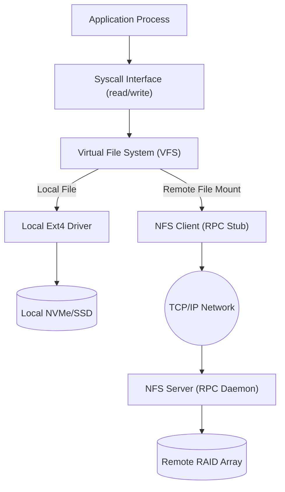
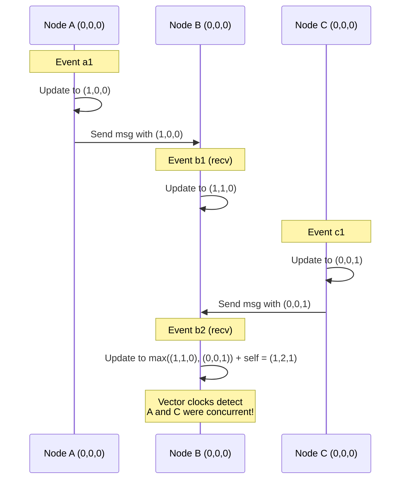

Leslie Lamport famously stated: "A distributed system is one in which the failure of a computer you didn't even know existed can render your own computer unusable." When we leave the comfortable boundaries of a single node—where the OS kernel manages local resources with atomic precision—we enter a chaotic realm.

In a single-node operating system, we rely on shared memory, precise interrupts, atomic hardware instructions, and a unified global state. In a distributed system, these guarantees evaporate. The network is unreliable, latency is unpredictable, clocks drift independently, and partial failures are inevitable. This lesson explores how foundational OS abstractions like file systems, inter-process communication, clocks, and locks are reinvented to survive the harsh reality of the network.

## 1. Distributed File Systems (DFS)

A single disk block is no longer enough when data exceeds the capacity of one machine, or when thousands of concurrent clients need to access the same files. Distributed File Systems attempt to provide the illusion of a local file system over the network.

### Network File System (NFS)
NFS integrates cleanly with the Virtual File System (VFS) layer. When a process calls `read()`, the VFS routes it either to a local file system (like Ext4) or intercepts it and passes it to the NFS client, which packages the request into a Remote Procedure Call (RPC) sent over TCP/UDP to an NFS server.
*   **The Cache Consistency Dilemma**: If two clients cache the same file and modify it, who wins? NFS historically uses **close-to-open consistency**: when a client closes a file, its changes are flushed to the server. When another client opens it, it checks the server for the latest version. It's not strictly atomic, but it is fast enough for general UNIX usage.

### Google File System (GFS) & HDFS
Designed for massive, batch-processing workloads (like MapReduce), GFS completely abandons the POSIX compliance of NFS.
*   **Architecture**: Files are split into massive **64MB chunks**. A single metadata **Master (NameNode)** tracks where chunks live, while thousands of **ChunkServers (DataNodes)** store the actual data.
*   **Replication & Pipelining**: Every chunk is replicated (usually 3x) across different racks. Writes are streamed in a pipeline from the primary replica to secondary replicas. It optimizes for **append-mostly** access patterns rather than random overwrites.

### Andrew File System (AFS)
AFS solves the caching problem differently: it uses **whole-file client caching**. When a client opens a file, AFS downloads the *entire file* to the local disk cache. The server gives the client a **callback promise**—a guarantee that the server will notify the client if another machine modifies the file. This radically reduces server load, making AFS highly scalable for read-heavy workloads like source code trees.



## 2. Remote Procedure Calls (RPC)

Inter-Process Communication (IPC) on a local machine (pipes, shared memory, UNIX sockets) assumes both processes share a kernel. When communicating across machines, we use RPC.

### The Abstraction
RPC aims to make a network request look exactly like a local function call. Instead of writing socket handling code, a developer simply calls `result = calculate(x, y)`.

### The Anatomy of an RPC
1.  **Client Stub**: The client calls a local stub function. The stub packages the parameters into a standard format.
2.  **Serialization/Marshaling**: Complex memory structures (like pointers or linked lists, which make no sense on another machine) are flattened into a byte stream.
3.  **Transport**: The bytes are sent over the network (e.g., TCP or HTTP/2).
4.  **Server Stub**: The server receives the bytes.
5.  **Deserialization/Unmarshaling**: The byte stream is converted back into native data types.
6.  **Execution**: The server executes the actual function and returns the result through the reverse path.

### The Fallacies of Distributed Computing
RPC's attempt to hide the network can be dangerous because developers forget Peter Deutsch's Fallacies:
1.  The network is reliable (it isn't—packets drop).
2.  Latency is zero (it isn't—speed of light bounds).
3.  Bandwidth is infinite (it isn't).
4.  Topology doesn't change (switches fail, routes change).

### The Modern Standard: gRPC
Today, **gRPC** (paired with Protocol Buffers) dominates. It uses HTTP/2 as its transport, enabling multiplexing (many concurrent requests on one TCP connection), bidirectional streaming, and extremely efficient binary serialization compared to verbose JSON/REST APIs.

## 3. Time & Clock Synchronization

In a single node, `gettimeofday()` relies on the motherboard's hardware clock. In a distributed system, clocks are a nightmare.

### Why Physical Clocks Lie
Every machine has a quartz crystal oscillator. Due to microscopic manufacturing differences and temperature variances, these crystals vibrate at slightly different frequencies. This causes **clock drift**. After a few weeks, two disconnected servers will disagree on the time by seconds.

### Network Time Protocol (NTP)
NTP synchronizes physical clocks over the Internet to authoritative time servers (often backed by atomic clocks). However, due to network jitter and asymmetric routing latency, NTP can only guarantee accuracy to within a few milliseconds. Milliseconds might sound small, but a modern CPU executes millions of instructions in a millisecond. You cannot use NTP to accurately order high-frequency distributed events.

### Google TrueTime (Spanner)
Google realized that unbounded clock uncertainty makes distributed databases extremely slow (requiring complex coordination protocols). TrueTime uses GPS receivers and atomic clocks installed in *every* Google datacenter. TrueTime provides an API that returns a time interval: $[t_{earliest}, t_{latest}]$. It mathematically guarantees that the absolute true time lies within that bound. By intentionally waiting out the uncertainty bound (a few milliseconds), Google Spanner achieves globally consistent distributed transactions without locking everything.

### Logical Clocks: Ordering Events Without Real Time
If physical clocks are unreliable, how do we know if Event A happened before Event B?

**Lamport Logical Clocks**:
Introduced the "happens-before" relation ($\to$). Each node maintains a simple integer counter.
1.  Before executing an event, increment the counter.
2.  When sending a message, piggyback the counter value.
3.  When receiving a message, set the local counter to $max(local\_counter, message\_counter) + 1$.
This provides a *partial ordering* of events, proving causality.

**Vector Clocks**:
Lamport clocks can't detect concurrent events. Vector clocks solve this by having each node track an array (vector) of counters, one for every node in the system. When comparing two vector clocks, if one is strictly greater than the other in all indices, there is causality. If some indices are greater and some are smaller, the events were **concurrent** (a conflict occurred).



## 4. Distributed Mutual Exclusion & Coordination

You cannot use a POSIX `pthread_mutex_t` to lock a resource when the threads live on different continents without shared RAM.

### The Centralized Lock Server
The simplest approach is a single master node that grants locks. 
*   **The Problem**: It is a massive single point of failure (SPOF) and a performance bottleneck.

### Distributed Locks with Leases (ZooKeeper, etcd)
Modern systems use distributed coordination services like **Apache ZooKeeper**, **Chubby**, or **etcd**.
Instead of indefinite locks, they issue **leases** (e.g., "Node A holds this lock for 10 seconds"). 
Node A must constantly send heartbeats to renew the lease. If Node A crashes or suffers a network partition, the heartbeat stops, the lease expires, and the lock is safely released to someone else, preventing a distributed deadlock. These systems use consensus protocols (like Raft) internally to ensure the lock server itself is highly available.

## 5. Distributed Consensus: The Core Problem

How do a group of machines agree on a single value or state, even if some of them crash or messages are lost?

### The FLP Impossibility Theorem
Fischer, Lynch, and Paterson proved a sobering reality: **No deterministic consensus protocol can guarantee agreement in an asynchronous network if even one process can unannouncedly fail.**
In the real world, we bypass FLP by using timeouts (introducing synchrony assumptions) or randomization.

### Practical Consensus: Raft vs Paxos
For decades, **Paxos** was the standard, but it was notoriously difficult to understand and implement. **Raft** was designed explicitly for understandability and powers systems like etcd (Kubernetes' brain) and Consul.

**How Raft Works:**
1.  **Leader Election**: Nodes start as followers. If they don't hear a heartbeat within a *randomized election timeout*, they declare themselves a candidate and request votes. The randomized timeout ensures one candidate usually wins before others wake up.
2.  **Log Replication**: The Leader receives all client requests (AppendEntries RPC) and sends them to followers.
3.  **Safety Invariant**: A change is only committed when a **majority** (quorum) of nodes acknowledge it. This majority rule ensures that even if a minority of nodes fail or become partitioned, the system continues, and split-brain scenarios are avoided.

## 6. Practical Investigation & Distributed Tools

You can observe these distributed phenomena from your terminal.

*   **Testing network latency and jitter**:
    Use `mtr` (My Traceroute) to see routing hops and packet loss, or `iperf3` to measure raw bandwidth between two nodes.
    ```bash
    iperf3 -s # On server
    iperf3 -c <server_ip> # On client
    ```
*   **Inspect NTP synchronization**:
    Check how tightly your local clock is bound to time servers.
    ```bash
    chronyc sources -v
    # OR
    timedatectl status
    ```
*   **Interacting with Raft Consensus (etcd)**:
    You can spin up an etcd cluster and test distributed key-value storage.
    ```bash
    etcdctl put leader "node-a"
    etcdctl get leader
    etcdctl watch leader # Blocks, waiting for changes pushed by consensus
    ```

## 7. Real-world Examples

### The Obvious Case
A globally distributed microservice architecture. Service A in US-East needs user data from Service B in EU-West. They communicate via gRPC over mutually authenticated TLS. If Service B goes down, Service A uses circuit breakers and fallbacks to degrade gracefully rather than crashing.

### The Counter-Intuitive Case: Amazon Dynamo
When Amazon built DynamoDB for their shopping cart system, they realized that **strict consistency is the enemy of availability** (CAP Theorem). If they used strict locks or consensus for every cart addition, a network partition would prevent users from adding items to their cart—losing Amazon millions of dollars. Instead, they chose **eventual consistency**. The system accepts writes simultaneously on disconnected nodes, storing divergent vector clocks. The conflict is resolved *later* (often at checkout), preferring to merge the carts rather than block the initial writes.

### The Failure Mode: Split-Brain
In a 2-node cluster without a quorum tie-breaker (a 3rd node or witness), a network partition occurs. Node A cannot reach Node B. Both assume the other is dead. Both promote themselves to the active Leader and start accepting writes. When the network heals, the databases have irreconcilable, divergent data. This is why consensus clusters *always* require an odd number of nodes (3, 5, 7) to form a majority quorum.

## ✕ What people get wrong

*   **"NTP makes all servers have identical clock times."** 
    **False.** NTP corrects drift, but network jitter means there is always uncertainty. You can never assume `time_on_node_a == time_on_node_b`.
*   **"Distributed locks can never fail."** 
    **False.** If a client holds a lock via ZooKeeper, enters a long garbage collection pause, and its lease expires, another client can grab the lock. The first client wakes up still believing it holds the lock, leading to data corruption.
*   **"Just use TCP, it handles dropped packets."** 
    **False.** TCP ensures reliable delivery *over an established connection*. If the cable is cut or the target server's kernel panics, TCP will eventually time out, but your application thread will be blocked for minutes unless you set explicit RPC timeouts.

## Why this matters

Single-node OS design teaches you how resources are managed when hardware is reliable. Distributed OS design teaches you how to survive when the environment is hostile. From designing scalable web APIs to passing system design interviews at FAANG companies, understanding the trade-offs between consistency, availability, vector clocks, and consensus is what separates a junior developer from a principal distributed systems engineer. Latency engineering and cloud reliability depend on these core primitives.

## Key Takeaways

1.  **Network fallacies invalidate local assumptions**: You cannot treat RPCs like local function calls without robust timeouts, circuit breakers, and retries.
2.  **Physical time is an illusion**: You cannot order distributed events using wall clocks without massive atomic hardware infrastructure (TrueTime). Rely on logical/vector clocks or consensus logs.
3.  **Consensus requires a quorum**: Safe distributed coordination and leader election (via Raft or Paxos) mathematically require an odd number of nodes to ensure a resilient majority.

Links to: [Systems Quick Reference Cheat Sheet](/docs/operating-system/06-observability-and-advanced/quick-reference)
