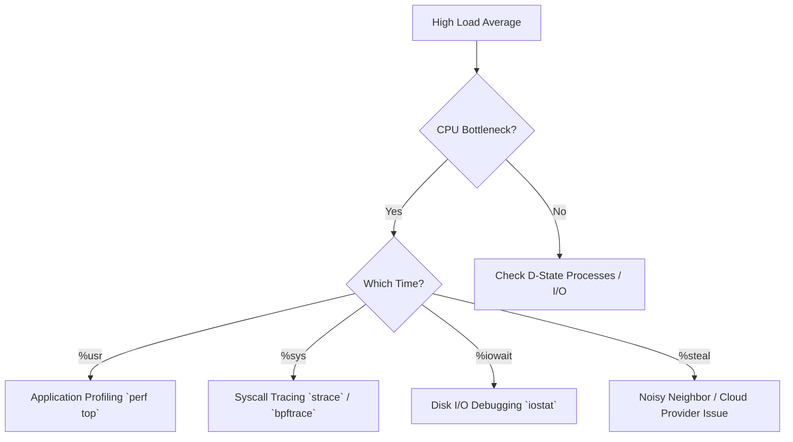
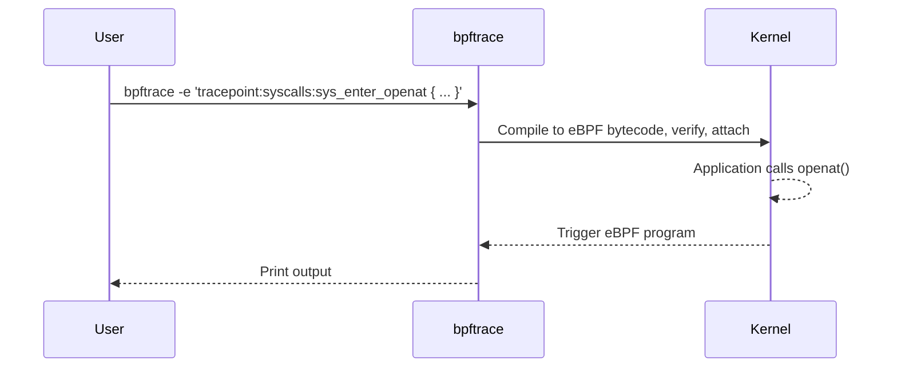

When a production incident hits and services are stalling, API tail latencies are spiking to 5 seconds, or a core database is suddenly throwing OOM exceptions, you don't have time to leisurely browse through `man` pages. You need immediate answers to narrow down the fault domain. Is it the CPU queue, memory starvation, block I/O saturation, or network packet drops?

This cheat sheet is the production SRE and systems engineer's command-line reference card. It distills complex OS abstractions into concrete diagnostic tools. Keep this pinned. When pager duty calls at 3 AM, these are the exact incantations you will use to interrogate the Linux kernel and find the smoking gun.

## 1. The 60-Second Production Triage Checklist

The "Netflix 60-Second Checklist" is an industry-standard heuristic. Run these 10 commands in the first 60 seconds of logging into a degraded Linux server to establish a baseline of system health.

```bash
# 1. High-level load average and uptime
uptime

# 2. Kernel ring buffer (OOM kills, hardware errors, TCP syn floods)
dmesg -T | tail -n 20

# 3. Virtual memory statistics (paging, block I/O, context switches)
vmstat 1

# 4. CPU balance across all cores (is one core pegged?)
mpstat -P ALL 1

# 5. Per-process CPU utilization
pidstat 1

# 6. Block device I/O stats (disk saturation and queue depth)
iostat -xz 1

# 7. High-level memory usage
free -m

# 8. Network interface throughput (Rx/Tx)
sar -n DEV 1

# 9. TCP connection metrics (active vs passive opens)
sar -n TCP 1

# 10. Live process overview (look for high CPU/Memory hogs)
top
```

## 2. CPU & Scheduler Diagnostics

When CPU utilization is high, the critical distinction is whether time is spent executing user code (`%usr`), making kernel system calls (`%sys`), waiting on disk (`%iowait`), or stolen by the hypervisor (`%steal`).



### Essential CPU Commands

```bash
# Profile the hottest functions globally in the kernel and user space
perf top

# Detailed CPU hardware counters for a command
perf stat -d ./my_binary

# Pin a process to specific CPU cores (cores 0,1,2,3)
taskset -cp 0-3 <pid>

# Change scheduling policy to Real-Time (FIFO) with priority 99
chrt -f -p 99 <pid>

# Inspect hardware topology (NUMA nodes, L1/L2/L3 caches)
cat /proc/cpuinfo

# View internal kernel scheduler stats for a specific process
cat /proc/<pid>/sched
```

### CPU Metrics Matrix

| Metric | Meaning | Common Root Cause |
| :--- | :--- | :--- |
| `%usr` | User-space execution | Heavy compute, infinite loops, inefficient algorithms. |
| `%sys` | Kernel-space execution | High syscall rate, lock contention in kernel, heavy network I/O. |
| `%iowait` | Idle, but waiting on block I/O | Slow disk, swapping heavily, insufficient page cache. |
| `%steal` | Hypervisor scheduling delay | CPU limits in cgroups/VM, "noisy neighbor" on cloud host. |
| `%idle` | CPU doing nothing | Application is single-threaded or bottlenecked on locks/network. |

## 3. Memory & Virtual Memory Diagnostics

Memory issues manifest as either hard OOM (Out of Memory) kills, or severe performance degradation due to paging (thrashing) and aggressive page cache eviction.

### Essential Memory Commands

```bash
# Human-readable memory summary
free -h

# Detailed memory watermarks, HugePages, and slab allocator info
cat /proc/meminfo

# Watch swap-in (si) and swap-out (so) rates
vmstat 1

# Watch detailed paging rate
sar -B 1

# View a rollup of the process's memory footprint (RSS vs PSS)
cat /proc/<pid>/smaps_rollup
```

### Managing the OOM Killer

The kernel calculates an `oom_score` (0 to 1000) for every process. When memory is exhausted, the highest score is killed.

```bash
# Check how likely a process is to be killed (higher is worse)
cat /proc/<pid>/oom_score

# Protect a critical process (e.g., SSHD or a database) from the OOM killer (-1000 means DO NOT KILL)
echo -1000 > /proc/<pid>/oom_score_adj
```

### Transparent Huge Pages (THP)

THP dynamically allocates 2MB pages instead of 4KB, reducing TLB misses. However, the background compaction thread can cause massive latency spikes in memory-heavy databases (like Redis or MongoDB).

```bash
# Check THP status (always / [madvise] / never)
cat /sys/kernel/mm/transparent_hugepage/enabled

# Disable THP on the fly
echo never > /sys/kernel/mm/transparent_hugepage/enabled
```

## 4. Storage & File System Diagnostics

Storage latency is a prime suspect for API timeouts. A slow EBS volume or local NVMe drive will cause threads to block in the Uninterruptible Sleep (`D`) state.

### I/O Triage with iostat

```bash
# Extended disk stats, 1-second intervals
iostat -xz 1
```
**Key `iostat` Columns:**
- `%util`: Device utilization. If 100%, the device is completely saturated.
- `await`: Average wait time (ms) for an I/O request (includes queue time + service time). Spikes mean the queue is backing up.
- `r_await` / `w_await`: Read vs. Write wait times.
- `aqu-sz`: Average queue size. If this is high (> 10-20 for SSDs), requests are stalling.

### File System Exhaustion

It's possible to have plenty of disk space but still fail to create files if you run out of inodes.

```bash
# Check disk space
df -h

# Check inode usage! (Crucial for directories with millions of tiny files)
df -i

# Find "deleted" files still held open by processes (consuming disk space but invisible to `ls`)
lsof +L1
```

### Tuning the Page Cache

When an application writes to a file, data goes to the Page Cache (dirty pages). The kernel flushes these to disk asynchronously.

```bash
# See dirty page settings
sysctl -a | grep vm.dirty

# Drop caches to simulate a "cold start" benchmark (Dangerous in prod! Destroys read performance temporarily)
sync && echo 3 > /proc/sys/vm/drop_caches
```

## 5. Networking & Socket Diagnostics

Network issues often hide in TCP state machines, full socket buffers, or hardware NIC drops.

### Essential Socket Commands

```bash
# Detailed socket telemetry: timers, RTT, cwnd, receive/send queues
ss -t -a -n -p -i

# Watch for TCP retransmits and packet drops (counters incrementing rapidly is bad)
netstat -s | grep -i "retrans"
# or
nstat -z | grep -i TcpExtTCPSynRetrans

# Check routing tables
ip route

# Check NIC hardware ring buffer drops (RX/TX errors)
ethtool -S eth0 | grep -i drop
```

### Tuning Network Ceilings

When handling thousands of connections per second, you must tune the TCP backlog queues to prevent dropping SYNs.

```bash
# Max number of completely established sockets waiting for accept()
sysctl net.core.somaxconn

# Max number of half-open connections (SYN_RECV)
sysctl net.ipv4.tcp_max_syn_backlog
```

## 6. eBPF & Dynamic Tracing Cheat Sheet

When standard tools fail, eBPF (Extended Berkeley Packet Filter) allows you to safely instrument the live kernel with negligible overhead. `bpftrace` is the awk of eBPF.



### eBPF One-Liners

```bash
# 1. Trace syscall counts by process name (What is this app doing?)
bpftrace -e 'tracepoint:raw_syscalls:sys_enter { @[comm] = count(); }'

# 2. Block I/O latency histogram (biolatency)
bpftrace -e 'kprobe:blk_account_io_done { @ = hist(retval); }'

# 3. Trace file opens (opensnoop)
bpftrace -e 'tracepoint:syscalls:sys_enter_openat { printf("%s %s\n", comm, str(args->filename)); }'

# 4. Off-CPU time: Why is a process sleeping/blocked?
bpftrace -e 'kprobe:finish_task_switch { @[kstack, comm] = count(); }'
```

## 7. Container & cgroups v2 Cheat Sheet

Containers are just namespaces and cgroups. In modern systems (cgroups v2), everything is unified under a single hierarchy.

```bash
# View CPU limits and usage for a cgroup (100000 100000 = 1 CPU core)
cat /sys/fs/cgroup/system.slice/docker-<id>.scope/cpu.max

# View Memory limits
cat /sys/fs/cgroup/system.slice/docker-<id>.scope/memory.max

# Check PSI (Pressure Stall Information) for memory (is this cgroup thrashing?)
cat /sys/fs/cgroup/system.slice/docker-<id>.scope/memory.pressure

# Top-like view for cgroups
systemd-cgtop
```

### Breaking into Namespaces

Sometimes a container has no shell (`scratch` image). You can use the host to enter the container's namespaces.

```bash
# Find the PID of the container entrypoint
docker inspect -f '{{.State.Pid}}' <container_name>

# Enter its network, IPC, UTS, and mount namespaces
nsenter -t <pid> -n -i -u -m /bin/bash
```

## 8. Linux Signals Reference Table

Signals are primitive IPC used heavily for process lifecycle management. Knowing the exact numbers and default behaviors is crucial for orchestrating services gracefully.

| Signal | Number | Default Action | Catchable? | Typical Usage & Meaning |
| :--- | :--- | :--- | :--- | :--- |
| `SIGHUP` | 1 | Terminate | Yes | "Hangup". Terminal closed. Often used to tell daemons to reload config. |
| `SIGINT` | 2 | Terminate | Yes | "Interrupt". Generated by `Ctrl+C`. Graceful shutdown request. |
| `SIGQUIT` | 3 | Core Dump | Yes | Generated by `Ctrl+\`. Like SIGINT, but dumps memory for debugging. |
| `SIGILL` | 4 | Core Dump | Yes | Illegal instruction (e.g., running AVX-512 code on an older CPU). |
| `SIGTRAP` | 5 | Core Dump | Yes | Trace/breakpoint trap. Used by debuggers (gdb). |
| `SIGKILL` | 9 | Terminate | **No** | "Kill 9". Kernel immediately destroys process. Resources may leak. |
| `SIGSEGV` | 11 | Core Dump | Yes | "Segmentation Fault". Accessing unmapped or protected memory. |
| `SIGPIPE` | 13 | Terminate | Yes | Writing to a pipe or socket that has been closed by the reader. |
| `SIGALRM` | 14 | Terminate | Yes | Timer set by `alarm()` system call expired. |
| `SIGTERM` | 15 | Terminate | Yes | Standard termination signal. This is what `kill <pid>` sends by default. |
| `SIGCHLD` | 17 | Ignore | Yes | Child process stopped or terminated. Parent uses this to `wait()`. |
| `SIGSTOP` | 19 | Stop | **No** | Pause the process entirely (suspended in kernel). |
| `SIGCONT` | 18 | Continue | Yes | Resume a process paused by `SIGSTOP` or `Ctrl+Z`. |

## ✕ What people get wrong

- **"High `%sys` means I need more CPU cores."** False. It usually means you have excessive locking overhead, extreme syscall rates (e.g., tiny `read()` buffers), or network interrupt storms. Adding cores might increase lock contention.
- **"The system has 0 Free Memory, we need to upgrade RAM."** False. Linux uses all unused memory for the Page Cache to speed up file I/O. Check `Available` memory in `free -m`, not `Free`.
- **"Just use `kill -9`."** Never use `SIGKILL` unless absolutely necessary. It prevents the application from closing sockets, flushing buffers, or releasing shared memory segments, leading to corruption. Always start with `SIGTERM` (15).

## Why this matters

In large-scale cloud environments, software engineers are often expected to operate the services they write. When an alert fires for an API SLO violation, the ability to rapidly drop into a shell and diagnose the kernel state separates junior developers from senior systems engineers. Mastering these tools reduces Mean Time To Resolution (MTTR) from hours of guessing to minutes of surgical precision.

## Key Takeaways

1. **Start broad, then zoom in**: Always use the 60-second checklist (`uptime`, `dmesg`, `vmstat`, `top`) before jumping to advanced tools like `perf` or `bpftrace`.
2. **Understand the wait state**: Knowing *why* a thread isn't running (`%iowait` vs `%steal` vs lock contention) dictates your entire debugging path.
3. **eBPF is the future**: When traditional metrics (`sar`, `iostat`) aren't granular enough, `bpftrace` allows you to ask the kernel custom questions with zero risk to production stability.

**Links to:** [Advanced Networking internals](./07-networking-internals.mdx)
