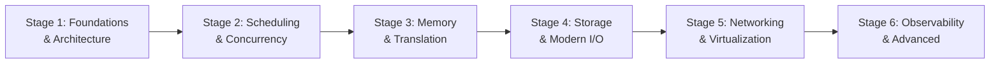

import { Callout } from 'fumadocs-ui/components/callout';
import { Tabs, Tab } from 'fumadocs-ui/components/tabs';

<ModuleOverview slug="operating-system" />

An operating system is the most sophisticated piece of software running on a computer. Every microsecond, it arbitrates physical silicon across competing threads, translates virtual addresses through multi-level page tables, flushes dirty pages to NVMe drives, and enforces security boundaries.

This masterclass connects **classical operating systems theory** (OSTEP, MIT 6.S081, Stanford CS140) to **modern production Linux kernel realities** (EEVDF scheduler, futexes, io_uring, cgroups v2, and eBPF observability).

---

## Curriculum Tracks

The curriculum is organized into six progressive stages:



### 1. Stage 1: Foundations & Architecture
**[Open Stage 1: Foundations & Architecture →](/docs/operating-system/01-foundations-and-architecture)**
- **Boot Process**: From UEFI power-on through GRUB and initramfs to systemd PID 1.
- **Kernel Architecture**: Monolithic (Linux) vs Microkernel (seL4, QNX) vs Hybrid vs Unikernels.
- **The Process**: Virtual address spaces, PCB context, copy-on-write `fork()` and `exec()`.
- **User vs Kernel Mode**: CPU rings, IDT interrupt tables, traps, and the microsecond cost of `syscall`.

### 2. Stage 2: Scheduling & Concurrency
**[Open Stage 2: Scheduling & Concurrency →](/docs/operating-system/02-scheduling-and-concurrency)**
- **CPU Scheduling**: From FIFO and MLFQ to Linux CFS and the modern 6.6+ EEVDF scheduler.
- **Synchronization Primitives**: Atomic CAS, spinlocks vs mutexes, and the 10ns Linux futex fast path.
- **Classic Concurrency**: Producer-Consumer (bounded buffer), Readers-Writers variants, and Dining Philosophers.
- **Deadlock Engineering**: Resource Allocation Graphs (RAG), Banker's Algorithm, detection, and recovery.
- **Inter-Process Communication**: Pipes, UNIX domain sockets with `SCM_RIGHTS`, and zero-copy shared memory.

### 3. Stage 3: Memory Systems & Translation
**[Open Stage 3: Memory Systems & Translation →](/docs/operating-system/03-memory-management)**
- **Address Spaces**: Segmentation vs paging, external fragmentation, and base-limit registers.
- **Virtual Memory**: 4-level x86-64 page tables, TLB hits/misses, and TLB shootdown storms.
- **Paging Dynamics**: Demand paging, page fault service latency, Belady's anomaly, and the Clock algorithm.
- **Allocators & OOM**: `brk` vs `mmap`, `ptmalloc` vs `jemalloc` thread-local caches, and Linux OOM killer heuristics.
- **NUMA & Memory-Mapped I/O**: Multi-socket memory bus latency, `numactl`, and zero-copy `mmap`.

### 4. Stage 4: Storage, Persistence & I/O
**[Open Stage 4: Storage, Persistence & I/O →](/docs/operating-system/04-storage-and-io)**
- **VFS & Page Cache**: Superblocks, inodes, dentries, dirty page writeback, and `fsync` semantics.
- **Crash Consistency**: Ext4 write-ahead logging (WAL), Copy-on-Write (ZFS/Btrfs), and SSD FTL physics.
- **Disk Scheduling & RAID**: SCAN, C-SCAN, and LOOK; RAID 0, 1, 5, 6, and 10; free space tracking.
- **I/O Multiplexing**: Hardware interrupts, SoftIRQs, DMA, the C10K problem, and $O(1)$ event loops with `epoll`.
- **The io_uring Revolution**: Asynchronous completion rings, SQPOLL zero-syscall mode, and zero-copy networking.

### 5. Stage 5: Networking & Virtualization
**[Open Stage 5: Networking & Virtualization →](/docs/operating-system/05-networking-and-virtualization)**
- **Kernel Networking**: TCP/IP socket buffer processing, netfilter 5-hook packet filtering, and XDP acceleration.
- **Hardware Virtualization**: Type 1 vs Type 2 hypervisors, Intel VT-x root execution, KVM, and EPT nested paging.
- **Containers**: Demystifying namespaces, cgroups v2 unified tree, CPU bandwidth limits, and PSI.
- **Sandboxing**: Linux Capabilities, rootless user namespaces, seccomp-bpf, and microVMs (Firecracker).

### 6. Stage 6: Observability & Advanced Systems
**[Open Stage 6: Observability & Advanced Systems →](/docs/operating-system/06-observability-and-advanced)**
- **Kernel Observability**: Brendan Gregg's USE method, PMU hardware counters, and eBPF kprobes/uprobes.
- **Real-Time Systems (RTOS)**: Determinism, Rate Monotonic & EDF scheduling, and Priority Inheritance.
- **Distributed OS Concepts**: Distributed file systems (NFS), RPC, logical clocks, and consensus basics.
- **Systems Quick Reference**: One-stop diagnostic command matrix (`perf`, `bpftrace`, `ss`, `iostat`).

---

## Modern Systems Diagnostic Toolchain

In production, troubleshooting performance requires commanding the Linux kernel's diagnostic toolset:

<Tabs items={['eBPF Tracing (bpftrace)', 'Hardware PMU (perf)', 'Kernel Tunables (sysctl)']}>
<Tab value="eBPF Tracing (bpftrace)">
```bash
# Trace disk I/O latency distribution in real time
bpftrace -e 'tracepoint:block:block_rq_issue { @start[args->dev] = nsecs; }'

# Count system calls per application process
bpftrace -e 'tracepoint:raw_syscalls:sys_enter { @[comm] = count(); }'
```
</Tab>

<Tab value="Hardware PMU (perf)">
```bash
# Measure CPU Instructions Per Cycle (IPC), cache misses, and branch mispredicts
perf stat -B -e cycles,instructions,cache-misses,branch-misses ./my-workload

# Record CPU profile at 99Hz and view hot call paths
perf record -F 99 -g -- sleep 10
perf report
```
</Tab>

<Tab value="Kernel Tunables (sysctl)">
```bash
# View and tune virtual memory dirty page ratios
sysctl vm.dirty_ratio
sysctl vm.dirty_background_ratio

# View and tune network receive socket buffer ceilings
sysctl net.core.rmem_max
sysctl net.ipv4.tcp_rmem
```
</Tab>
</Tabs>

---

## Ready to Begin?

Jump straight into **[01. The Boot Process — From Power Button to PID 1](/docs/operating-system/01-foundations-and-architecture/01-boot-process)** or explore **[Stage 1: Foundations & Architecture](/docs/operating-system/01-foundations-and-architecture)**.
