import { Callout } from 'fumadocs-ui/components/callout';
import { Tabs, Tab } from 'fumadocs-ui/components/tabs';
import { Steps, Step } from 'fumadocs-ui/components/steps';
import { Cards, Card } from 'fumadocs-ui/components/card';

## Start With the Problem: Why Not Just a File?

Suppose you are building **TravelBuddy**, a small flight-booking app. You need to remember reservations. The obvious idea is to save them to a file:

```text
bookings.json
[ {"id": 1, "customer": "Ada", "flight": "IB3412"},
  {"id": 2, "customer": "Bob", "flight": "AF1000"} ]
```

This works beautifully — until real life happens:

- **Two people book at once.** Both read the file, both add their row, both write it back. One booking silently disappears.
- **The power goes out mid-write.** The file is now half-written and unreadable. Everything is lost.
- **The file grows.** To find Ada's booking you must read and parse the whole thing.
- **Nothing protects the data.** A bug writes `"flight": null` and no rule stops it.

Every one of those is a **database problem**. A **relational database management system** exists to solve them.

> **A relational database stores your data as tables and guarantees — even under concurrency and crashes — that it stays correct, durable, and fast to query.**

A **DBMS** (Database Management System) is the software that provides those guarantees. **PostgreSQL is one such DBMS.**

---

## The Five Things a Database Does For You

| Guarantee | What it means | The file-based failure it prevents |
| :--- | :--- | :--- |
| **Concurrency control** | Many users read and write at once without corrupting each other | Two writes clobbering one another |
| **Durability / crash recovery** | Committed data survives a power cut | A half-written file |
| **Integrity / constraints** | Rules about valid data are enforced by the engine | `null` flights, negative prices |
| **Fast lookups** | Indexes find rows without scanning everything | Reading the whole file per query |
| **Transactions** | Groups of changes succeed or fail together | Half-finished bookings |

This is what you are actually buying when you install a database. Storage is easy; **correctness under adversity** is the hard part.

<Callout type="info" title="A Relational Database in One Sentence">
Data lives in **tables** (rows and typed columns). Tables relate to each other through **keys**. You ask questions in **SQL**, and the engine decides how to answer them efficiently.
</Callout>

---

## So What Is PostgreSQL, Exactly?

**PostgreSQL** is a free, open-source relational database management system, written in C, that has been developed continuously for over 35 years. It is the default serious database choice for a huge share of the industry.

```mermaid
flowchart LR
    C["Your application<br/>(web, script, tool)"] -->|"connects over TCP<br/>(port 5432) using SQL"| P["PostgreSQL server<br/>(one process per connection)"]
    P --> D["Data files on disk<br/>+ Write-Ahead Log"]

    style P fill:#0f172a,stroke:#38bdf8,stroke-width:2px
    style D fill:#0f172a,stroke:#34d399,stroke-width:2px
```



| Fact | Detail |
| :--- | :--- |
| **Type** | Relational (SQL) DBMS |
| **License** | PostgreSQL License — free, permissive, MIT-like |
| **Language** | C |
| **Default port** | 5432 |
| **Governed by** | The PostgreSQL Global Development Group (an open community, not one company) |
| **Current major version** | PostgreSQL 18 (late 2025), 19 expected late 2026 |
| **Support model** | ~1 major release per year; each supported for **5 years** |
| **Default branch of releases** | New features in major releases; bug/security fixes in minor ones |

<Callout type="tip" title="'Postgres' Means the Same Thing">
People say "Postgres" as a shorter name for PostgreSQL. Both are correct. The *server* is PostgreSQL; `psql` is its *client program* — don't mix those two up, because `psql` runs on your machine while the server does the actual work.
</Callout>

---

## A Very Short History

<Steps>
<Step>
### 1986 — Berkeley POSTGRES
Michael Stonebraker's team at UC Berkeley built **POSTGRES**, a research project exploring advanced database ideas (rules, types, extensibility). This is where the name comes from.
</Step>

<Step>
### 1995 — Postgres95, then "PostgreSQL"
SQL support was added and the project was renamed **PostgreSQL** — "Postgres" + "SQL". It remained open source.
</Step>

<Step>
### 1997–today — A community project
The project moved out of academia into an open community. It has grown steadily ever since, adding features (window functions, JSONB, logical replication, `MERGE`, partitioning) without ever doing a disruptive rewrite — which is why **databases upgraded from version 9 still feel familiar today**.
</Step>
</Steps>

<Callout type="info" title="Why the History Matters to You">
Because PostgreSQL evolves rather than reinvents, **almost every tutorial you find online still applies**. Learn the fundamentals once and they stay valid across versions. Only the newest conveniences (like `uuidv7()` in 18) are version-specific, and we flag those.
</Callout>

---

## Why People Choose PostgreSQL

| Strength | What it means in practice |
| :--- | :--- |
| **Rock-solid reliability** | A reputation for not losing data; conservative, well-tested releases |
| **Standards-based SQL** | ~170 of the 177 SQL:2023 Core features — your SQL is portable |
| **Extensible** | Add types, functions, index methods, and whole extensions (e.g. PostGIS, pgvector) |
| **Rich data types** | `jsonb`, arrays, ranges, UUIDs, geometric types — often removing the need for a second database |
| **Serious concurrency** | MVCC gives readers a consistent view without blocking writers |
| **Advanced SQL** | Window functions, CTEs, `MERGE`, `FILTER`, full-text search, `ON CONFLICT` upserts |
| **Free and unbounded** | No license costs, no feature-gated editions, no row limits |
| **Everywhere** | Ships with or is available on every OS and every major cloud |

<Callout type="warn" title="It Is Not Magic">
PostgreSQL rewards understanding. Its defaults are sensible but conservative, and misuses are real: an unindexed query can be slow, an unvacuumed table can bloat, and a `DELETE` without a `WHERE` will happily empty a table. This module teaches the *why*, not just the *how*, so you avoid those traps.
</Callout>

---

## How PostgreSQL Compares to the Other Big Names

All of these speak SQL. They differ in philosophy, features, and operations.

| | **PostgreSQL** | MySQL | SQLite | SQL Server |
| :--- | :--- | :--- | :--- | :--- |
| **Model** | Server process | Server process | Embedded file | Server process |
| **License** | Open source (permissive) | Open source (GPL) + commercial | Public domain | Commercial |
| **Best at** | Correctness + advanced features | Web apps, simple reads | Apps with no server (mobile, embedded) | Windows/Microsoft ecosystems |
| **Rich types** | Excellent (`jsonb`, arrays, ranges) | Good | Limited | Good |
| **Extensibility** | Outstanding | Moderate | Minimal | Moderate |
| **Typical scale** | Small to enormous | Small to large | Tiny (one process) | Small to large |

<Callout type="tip" title="When SQLite Is the Right Answer">
If your app is a single-user mobile app, a desktop tool, or a tiny script, **SQLite** is often better than PostgreSQL: it's a library, not a server, and needs zero setup. Reach for PostgreSQL once you have **concurrent users, a network, or a need for real operations**.
</Callout>

### PostgreSQL and the Cloud

You do not have to run the server yourself. Managed PostgreSQL is offered by essentially every provider (Amazon RDS/Aurora, Google Cloud SQL/AlloyDB, Azure Database for PostgreSQL, Supabase, Neon, and many more). They handle backups, replication, and patching — at a cost and with some control lost. The SQL and concepts you learn here apply unchanged.

---

## What You Actually Interact With

When you "use PostgreSQL", you touch four things. Keep them straight and everything is clearer:

```text
1. The SERVER        — postgres: the background process(es) that own the data
2. A DATABASE        — a named container of tables (one server hosts many)
3. The CLIENT        — psql (or your app), which connects and sends SQL
4. SQL               — the language you use to talk to it
```

You will meet all four in the next lesson:

<Cards>
  <Card title="Install it" href="/docs/postgresql/01-getting-started/02-install-and-psql" description="Get the server running with Docker, a native installer, or the cloud." />
  <Card title="Talk to it" href="/docs/postgresql/02-querying-and-performance/01-querying-data-in-postgres" description="Learn the SQL you'll use every day." />
  <Card title="Keep it safe" href="/docs/postgresql/03-transactions-and-safety/03-backup-restore-and-pitr" description="Backups and recovery, once you have data worth keeping." />
</Cards>

---

## Chapter Summary & Quick Recall

<Cards>
  <Card title="Databases exist to survive reality" href="#start-with-the-problem-why-not-just-a-file">
    Concurrency, crashes, integrity, and speed. A DBMS provides guarantees a file cannot.
  </Card>
  <Card title="PostgreSQL is a free, open-source relational DBMS" href="#so-what-is-postgresql-exactly">
    Around since the 1980s, community-governed, one major release a year with five years of support, strong SQL-standard conformance.
  </Card>
  <Card title="Four things: server, database, client, SQL" href="#what-you-actually-interact-with">
    `psql` is the client; the server owns the data; SQL is how you talk to it.
  </Card>
</Cards>

<Callout type="info" title="Next Up: Lesson 02">
Enough theory — let's get a real server running. Continue to **[Install, Connect & Master `psql`](/docs/postgresql/01-getting-started/02-install-and-psql)**.
</Callout>
