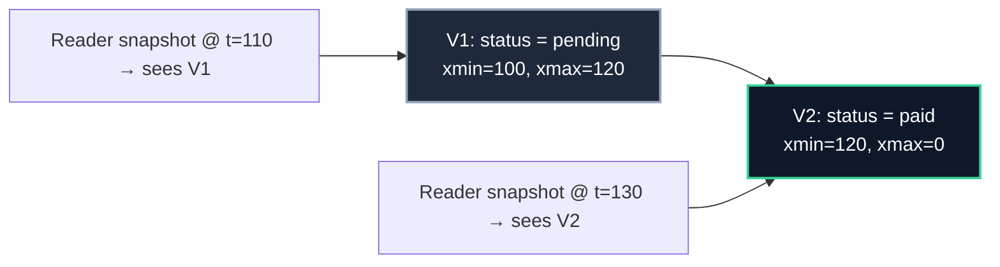

import { Callout } from 'fumadocs-ui/components/callout';
import { Tabs, Tab } from 'fumadocs-ui/components/tabs';
import { Cards, Card } from 'fumadocs-ui/components/card';

## The Superpower: Readers Don't Block Writers

The naïve way to control concurrency is locking: a reader takes a shared lock, a writer takes an exclusive lock, and they block each other. That's correct but painful — a long report freezes all writes.

**MVCC (Multi-Version Concurrency Control)** takes a different route: **keep multiple versions of each row.** A reader sees the version that was current when its snapshot was taken; a writer creates a *new* version. Neither waits for the other.



Every row version carries a small header:

| Field | Meaning |
| :--- | :--- |
| `xmin` | The transaction that **created** this version |
| `xmax` | The transaction that **deleted/superseded** it (0 if still live) |
| `ctid` | Physical location `(block, offset)` — changes when a row moves |

An `UPDATE` is **not** an edit in place: it writes a new tuple version and marks the old one with `xmax`.

<Callout type="info" title="The Consequence and the Cost">
**Reads never block writes, and writes never block reads.** Writers only conflict on writes to the *same* row. The price is that the table accumulates **dead tuples** — old versions no transaction will ever see again — which must be cleaned up.
</Callout>

---

## Dead Tuples and Bloat

```text
After many updates to one row:
Page: [ V1 dead ] [ V2 dead ] [ V3 dead ] [ V4 LIVE ]
                  ^ space that cannot be reused until VACUUM runs
```

**`VACUUM`** marks dead tuple slots reusable and updates the **visibility map** (which lets index-only scans skip heap fetches). **Autovacuum** does this automatically, in the background.

```sql
VACUUM bookings;                 -- reclaim dead tuples (no full lock)
VACUUM ANALYZE bookings;         -- also refresh statistics
VACUUM FULL bookings;            -- rewrite the table (ACCESS EXCLUSIVE — usually avoid)
```

| Command | What it does | Lock |
| :--- | :--- | :--- |
| `VACUUM` | Mark dead space reusable | Weak |
| `VACUUM ANALYZE` | Above + statistics | Weak |
| `ANALYZE` | Statistics only | Weak |
| `VACUUM FULL` | Rewrite & shrink the table | **Access exclusive (blocks everything)** |
| `pg_repack` | Rewrite online, no long lock | Brief |

<Callout type="error" title="Autovacuum Is Not Optional">
On high-churn tables, autovacuum often lags. Bloat means heavier scans and index-only scans that fall back to the heap. Worse, a table approaching the transaction-ID limit causes PostgreSQL to **refuse new writes** to protect your data. Never disable autovacuum.
</Callout>

---

## Tuning Autovacuum for Hot Tables

The global defaults are conservative. A busy table needs per-table settings:

```sql
ALTER TABLE bookings SET (
    autovacuum_vacuum_scale_factor = 0.02,   -- vacuum after 2% change (default 20%)
    autovacuum_vacuum_threshold    = 1000,
    autovacuum_analyze_scale_factor = 0.01
);
```

---

## Watching Your Health

```sql
-- Dead tuples and last vacuum/analyze per table
SELECT relname, n_live_tup, n_dead_tup,
       round(100 * n_dead_tup / greatest(n_live_tup + n_dead_tup, 1), 1) AS dead_pct,
       last_autovacuum, last_autoanalyze
FROM pg_stat_user_tables
ORDER BY n_dead_tup DESC
LIMIT 15;

-- Table vs. index sizes
SELECT relname,
       pg_size_pretty(pg_relation_size(relid))       AS heap,
       pg_size_pretty(pg_indexes_size(relid))        AS indexes,
       pg_size_pretty(pg_total_relation_size(relid)) AS total
FROM pg_stat_user_tables
ORDER BY pg_total_relation_size(relid) DESC
LIMIT 15;
```

<Callout type="warn" title="Transaction-ID Wraparound Is a Hard Wall">
Transaction ids are a rolling 32-bit counter. If a table's oldest unfrozen id gets too close to the limit (hundreds of millions, i.e. ~1.5–2 billion from the limit), PostgreSQL **stops accepting writes** and demands an aggressive vacuum. Monitor it:

```sql
SELECT datname, age(datfrozenxid) AS xid_age FROM pg_database ORDER BY xid_age DESC;
```
Treat a large `xid_age` as a production incident, not a curiosity.
</Callout>

---

## Index Bloat and Rebuilding

Indexes bloat too, especially with random-key inserts. Rebuild them online when they get large:

```sql
REINDEX INDEX CONCURRENTLY idx_bookings_customer;
-- or all indexes of a table, without blocking writes:
REINDEX TABLE CONCURRENTLY bookings;
```

<Callout type="tip" title="UUIDv7 Helps Here Too">
Random UUIDv4 primary keys scatter inserts across the index, causing page splits and bloat. PostgreSQL 18's **`uuidv7()`** produces time-ordered ids that insert at the end of the B-tree — far less churn. For internal keys, `bigint GENERATED ALWAYS AS IDENTITY` is even better.
</Callout>

---

## A Long-Running Transaction Is a Real Problem

An open transaction (even an idle one) **holds back the vacuum horizon**: dead tuples newer than the oldest snapshot can't be removed, so bloat grows.

```sql
-- Anything hanging around?
SELECT pid, now() - xact_start AS age, state, query
FROM pg_stat_activity
WHERE xact_start IS NOT NULL
ORDER BY xact_start;
```

<Callout type="error" title="The `idle in transaction` Bandit">
A session that ran `BEGIN` and then went idle holds locks *and* blocks vacuum. Always close transactions promptly, and set `idle_in_transaction_session_timeout` so a forgotten one can't quietly ruin vacuum for hours. This is one of the most common causes of "why is my table so big?".
</Callout>

---

## Practice

```sql
-- 1. Update the same row many times, then watch dead tuples grow
UPDATE customers SET full_name = full_name WHERE id = '...';
SELECT n_dead_tup, last_autovacuum FROM pg_stat_user_tables WHERE relname = 'customers';

-- 2. Reclaim and refresh
VACUUM (VERBOSE, ANALYZE) customers;

-- 3. Check wraparound headroom
SELECT datname, age(datfrozenxid) FROM pg_database ORDER BY 2 DESC;
```

---

## Chapter Summary & Quick Recall

<Cards>
  <Card title="MVCC = many versions, no reader/writer blocking" href="#the-superpower-readers-dont-block-writers">
    Updates create new tuple versions with `xmin`/`xmax`; snapshots decide visibility. The cost is dead tuples.
  </Card>
  <Card title="Vacuum keeps the database alive and writeable" href="#dead-tuples-and-bloat">
    Autovacuum reclaims dead space, maintains the visibility map, and prevents transaction-ID wraparound. Tune it for hot tables.
  </Card>
  <Card title="Long transactions cause bloat" href="#a-long-running-transaction-is-a-real-problem">
    An open or idle transaction holds back the vacuum horizon. Keep them short and set an idle timeout.
  </Card>
</Cards>

<Callout type="info" title="Next Up: Lesson 03">
Your data is correct and healthy. Now make sure you can get it back. Continue to **[Backup, Restore & Point-in-Time Recovery](/docs/postgresql/03-transactions-and-safety/03-backup-restore-and-pitr)**.
</Callout>
