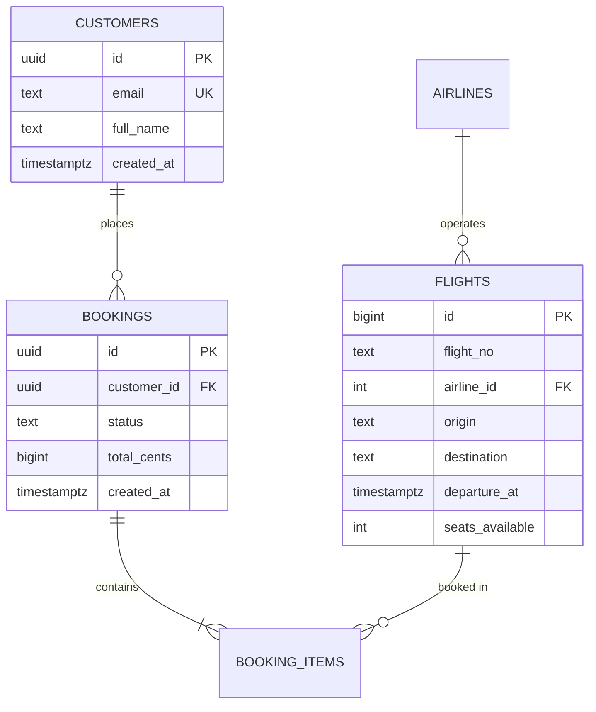

import { Callout } from 'fumadocs-ui/components/callout';
import { Tabs, Tab } from 'fumadocs-ui/components/tabs';
import { Steps, Step } from 'fumadocs-ui/components/steps';
import { Cards, Card } from 'fumadocs-ui/components/card';

<ModuleOverview slug="postgresql" />

**You have never used PostgreSQL. That's fine — this module assumes you know nothing about it.** We start at "what is a database?", install a real PostgreSQL in about two minutes, and climb all the way to replication, tuning, and production operations.

Along the way we build **TravelBuddy**, a small flight-booking system, so every concept lands on the same concrete example.

<Callout type="tip" title="Absolute beginner? Read it in this order">
1. **[What PostgreSQL Is](/docs/postgresql/01-getting-started/01-what-is-postgresql)** — the big picture and why people choose it.
2. **[Install & `psql`](/docs/postgresql/01-getting-started/02-install-and-psql)** — get a real database running on your machine.
3. **[Tables, Types & Constraints](/docs/postgresql/01-getting-started/03-tables-types-and-constraints)** — create your first real schema.

Then work forward through the stages. Nothing later assumes knowledge that an earlier lesson didn't cover.
</Callout>

---

## What PostgreSQL Actually Is

**PostgreSQL** (often just "Postgres") is a free, open-source **relational database management system** — software that stores your data durably and answers questions about it safely, correctly, and fast, even when many people use it at once and even when the machine crashes.

| Question | Short answer |
| :--- | :--- |
| What is it? | A relational (SQL) database server |
| Cost? | Free and open source (PostgreSQL License, MIT-like) |
| Written in? | C |
| Who runs it? | Everyone from hobbyists to Apple, Instagram, NASA, and most cloud providers |
| Current major version | PostgreSQL 18 (a new major release roughly every year) |
| Do I need SQL first? | Helpful, but not required — we teach the SQL you need as we go |

<Callout type="info" title="Postgres vs. 'SQL' — the thing that confuses beginners">
**SQL** is the *language*; **PostgreSQL** is a *database that speaks it*. You don't choose between them. If you want a deep dive on the language itself, the companion module is **[Databases, SQL & Data-Intensive Systems](/docs/databases-sql)**.
</Callout>

---

## Your First 10 Minutes

You do not need to install anything to *see* PostgreSQL work. If you have Docker, this starts a full server:

```bash
# Start PostgreSQL 18
docker run --name pg-learn \
  -e POSTGRES_PASSWORD=secret \
  -p 5432:5432 -d postgres:18

# Open an interactive SQL prompt (psql) inside the container
docker exec -it pg-learn psql -U postgres
```

At the `postgres=#` prompt, type:

```sql
CREATE TABLE hello (id int PRIMARY KEY, message text);
INSERT INTO hello VALUES (1, 'PostgreSQL is running!');
SELECT * FROM hello;
```

```text
 id |        message
----+------------------------
  1 | PostgreSQL is running!
(1 row)
```

That is a complete, working relational database. Everything else in this module is depth on top of these four lines.

<Callout type="warn" title="Stuck at step one?">
If Docker feels like too much, **[Lesson 02](/docs/postgresql/01-getting-started/02-install-and-psql)** walks through native installers (Windows, macOS, Linux), a cloud option with no local setup, and how to connect. Start there.
</Callout>

---

## The Honest Learning Timeline

<Steps>
<Step>
### Weeks 1–3: Getting Comfortable
Install Postgres, learn `psql`, create databases and users, design your first tables, and write real `INSERT`/`SELECT`/`UPDATE`/`DELETE` statements. This is the "I can actually use this" phase.
</Step>

<Step>
### Weeks 3–8: Querying Like a Pro
Joins, grouping, subqueries, CTEs, and window functions. Then PostgreSQL's signature features — `jsonb`, arrays, ranges, full-text search, upserts. Finally: indexes and reading `EXPLAIN` so you can make queries fast on purpose.
</Step>

<Step>
### Weeks 8–14: Getting Correctness Right
Transactions and isolation levels (including the write-skew trap), MVCC and vacuum, locking and deadlocks, and backups you have actually tested. This is where you stop losing data.
</Step>

<Step>
### Weeks 14+: Running It in Production
Roles and security, configuration and tuning, connection pooling, replication and high availability, extensions, monitoring, maintenance, and upgrades.
</Step>
</Steps>

---

## Curriculum Tracks

```mermaid
flowchart LR
    A["Stage 1<br/>Getting<br/>Started"] --> B["Stage 2<br/>Querying &<br/>Performance"]
    B --> C["Stage 3<br/>Transactions<br/>& Safety"]
    C --> D["Stage 4<br/>Admin, Scaling<br/>& Production"]

    style A fill:#0f172a,stroke:#38bdf8,stroke-width:2px
    style B fill:#0f172a,stroke:#34d399,stroke-width:2px
    style C fill:#0f172a,stroke:#f59e0b,stroke-width:2px
    style D fill:#0f172a,stroke:#a855f7,stroke-width:2px
```



### 1. Stage 1: Getting Started

**[Open Stage 1 →](/docs/postgresql/01-getting-started)**

- **What PostgreSQL Is** — databases in plain English, Postgres history and versions, and how it compares to MySQL, SQLite, and SQL Server.
- **Install & `psql`** — Docker, native installers, and cloud; connecting; the `psql` meta-commands you'll use every day; creating databases, users, and schemas.
- **Tables, Types & Constraints** — the PostgreSQL type system, `CREATE TABLE`, keys and constraints, identity vs. `serial` vs. `uuidv7()`, generated columns.

### 2. Stage 2: Querying & Performance

**[Open Stage 2 →](/docs/postgresql/02-querying-and-performance)**

- **Querying Data in PostgreSQL** — filtering, sorting, joins, grouping, subqueries, CTEs, and window functions.
- **PostgreSQL's Signature Features** — `jsonb`, arrays, ranges, full-text search, `DISTINCT ON`, `LATERAL`, `FILTER`, `ON CONFLICT`, `RETURNING`, and `MERGE`.
- **Indexes & `EXPLAIN`** — B-tree, hash, GIN, GiST, BRIN; composite, partial, expression, and covering indexes; reading `EXPLAIN (ANALYZE, BUFFERS)`.

### 3. Stage 3: Transactions, Concurrency & Data Safety

**[Open Stage 3 →](/docs/postgresql/03-transactions-and-safety)**

- **Transactions & Isolation** — ACID, savepoints, isolation levels and anomalies, explicit locking, deadlocks, and timeouts.
- **MVCC, Vacuum & Bloat** — how PostgreSQL gives readers a consistent snapshot without blocking writers, and how to keep it healthy.
- **Backup, Restore & PITR** — `pg_dump`/`pg_restore`, base backups, WAL archiving, point-in-time recovery, and testing your restores.

### 4. Stage 4: Administration, Scaling & Production

**[Open Stage 4 →](/docs/postgresql/04-administration-and-scaling)**

- **Roles, Security & RLS** — users and roles, `GRANT`/`REVOKE`, schemas and `search_path`, `pg_hba.conf`, SSL, scram passwords, and row-level security.
- **Configuration & Tuning** — memory settings, planner costs, autovacuum tuning, connection pooling with PgBouncer, and `reload` vs. `restart`.
- **Replication, High Availability & Extensions** — streaming and logical replication, failover, read replicas, the extension ecosystem, monitoring, and upgrades.

---

## The TravelBuddy Schema

Every lesson uses the same small dataset, so the pieces fit together.



---

## The One Habit That Matters Most

<Tabs items={['Run it', 'Look at it', 'Back it up']}>
<Tab value="Run it">
```sql
-- Nothing here is theoretical. Type it into psql.
SELECT version();
```
</Tab>
<Tab value="Look at it">
```sql
-- Always know WHERE your data lives and HOW big it is.
SELECT relname, pg_size_pretty(pg_total_relation_size(relid)) AS size
FROM pg_stat_user_tables ORDER BY pg_total_relation_size(relid) DESC;
```
</Tab>
<Tab value="Back it up">
```bash
# A backup you have never restored is not a backup.
pg_dump -Fc travelbuddy > travelbuddy.dump
pg_restore -d travelbuddy_restore travelbuddy.dump
```
</Tab>
</Tabs>

<Callout type="info" title="The Golden Rule">
> *"Never memorize settings or syntax. Understand the **problem the feature solves** — a slow query, a lost update, a crash, a security hole — because every index, isolation level, and tuning knob exists to fix a specific failure."*
</Callout>

Start here: **[01. What PostgreSQL Is](/docs/postgresql/01-getting-started/01-what-is-postgresql)**.

---

## All Lessons

<Cards>
  <Card title="Stage 1 · Getting Started" href="/docs/postgresql/01-getting-started" description="What PostgreSQL is, installing it, psql, and designing your first tables with real types and constraints." />
  <Card title="Stage 2 · Querying & Performance" href="/docs/postgresql/02-querying-and-performance" description="Queries, joins and window functions; jsonb, arrays and full-text; indexes and reading EXPLAIN." />
  <Card title="Stage 3 · Transactions & Safety" href="/docs/postgresql/03-transactions-and-safety" description="ACID and isolation, MVCC and vacuum, backups, restore, and point-in-time recovery." />
  <Card title="Stage 4 · Administration, Scaling & Production" href="/docs/postgresql/04-administration-and-scaling" description="Roles and security, configuration and tuning, connection pooling, replication, extensions and upgrades." />
</Cards>
