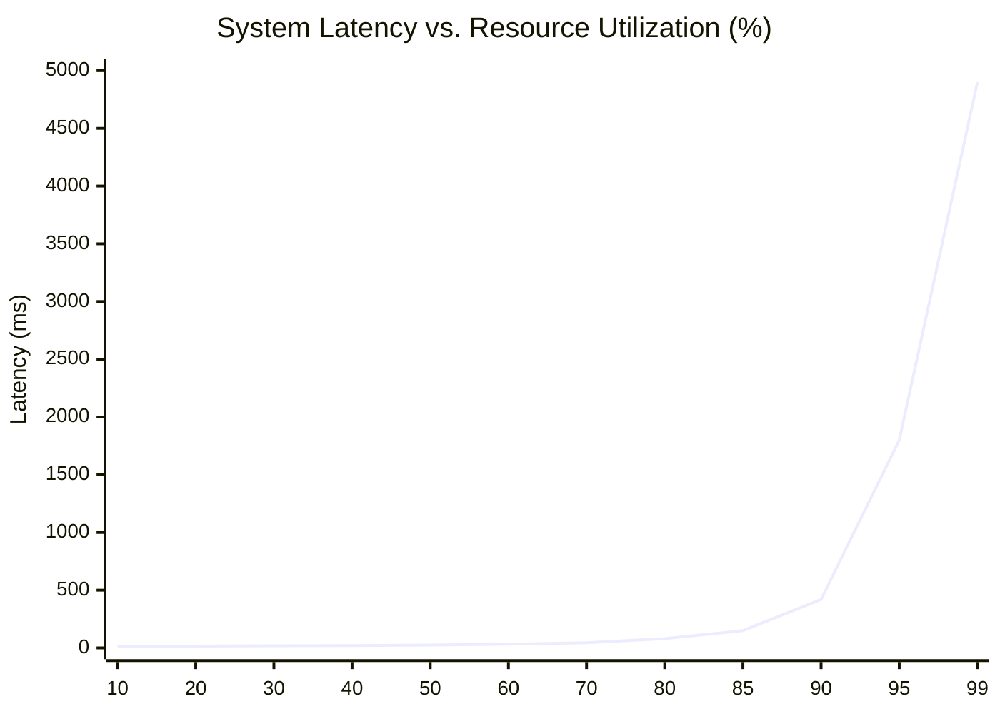

import { Callout } from 'fumadocs-ui/components/callout';
import { Tabs, Tab } from 'fumadocs-ui/components/tabs';
import { Steps, Step } from 'fumadocs-ui/components/steps';
import { Cards, Card } from 'fumadocs-ui/components/card';

## The Birth of TravelBuddy (v0.1)

<Callout type="info" title="📚 Foundation Knowledge Check">
Before analyzing system boundaries, ensure you are familiar with how packets navigate the internet and how client-server connections work:
- Review the **[OSI 7-Layer Model & Encapsulation](/docs/computer-networking/02-switching-and-data-link/01-osi-model)** to understand frame-to-packet dataflow.
- Understand transport trade-offs with **[TCP vs. UDP & Handshakes](/docs/computer-networking/04-protocols-and-cloud/01-tcp-vs-udp-handshake)**.
- Explore modern application transport with **[HTTP/1.1 to HTTP/3 QUIC](/docs/computer-networking/04-protocols-and-cloud/02-dns-http-email)**.
</Callout>

It is late Friday night. Two software engineers, Alice and Bob, have decided to build **TravelBuddy**: a web application where users can search for cheap commercial flights, reserve hotel rooms, and manage travel itineraries.

Alice opens her laptop and creates a brand-new directory. Within 48 hours, she writes a monolithic Express application backed by an embedded SQLite database.

```mermaid
flowchart TD
    subgraph Client["User Browser"]
        Browser["Chrome / Safari<br/>Single Page App"]
    end

    subgraph Laptop["Alice's MacBook Pro (Single Node)"]
        direction TB
        Port["Port :3000"]
        
        subgraph Monolith["Node.js Process (PID 4821)"]
            Router["Express Router<br/>/api/flights<br/>/api/hotels<br/>/api/book"]
            Auth["In-Memory Auth & Sessions"]
            Logic["Booking & Pricing Business Logic"]
            PDFGen["Ticket PDF Generator (Puppeteer)"]
        end

        subgraph Storage["Local File System"]
            DB[("travelbuddy.sqlite<br/>(SQLite File)")]
            Disk["/var/uploads/<br/>Static Images & PDFs"]
        end
    end

    Browser -- "HTTP GET/POST" --> Port
    Port --> Router
    Router --> Auth --> Logic
    Logic --> DB
    Logic --> PDFGen --> Disk

    style Client fill:#020617,stroke:#38bdf8,stroke-width:2px
    style Laptop fill:#0f172a,stroke:#38bdf8,stroke-width:2px
    style Monolith fill:#1e293b,stroke:#94a3b8,stroke-width:1px
    style Storage fill:#1e293b,stroke:#fbbf24,stroke-width:1px
```



Alice sends the link to 10 of their closest friends.
- They search for flights between New York and London.
- The SQLite query executes in **1.2 milliseconds**.
- The page renders instantly.
- Everyone books their weekend trips without a single glitch.

Bob is euphoric: *"Alice, the application is flawless! Let's post it on Product Hunt and Hacker News right now!"*

Alice pauses. As a software engineer, she knows the code is clean, unit tests pass, and ESLint is green. But as a budding systems architect, she asks the defining question of distributed systems:

> *"What happens when 50,000 strangers click that link at the exact same second?"*

---

## Architecture vs. Code: Two Fundamentally Different Worlds

Before addressing the surge of 50,000 users, we must delineate the boundary between **Software Engineering (Coding)** and **System Architecture (System Design)**.

```mermaid
flowchart LR
    subgraph Code["Software Engineering / Code Level"]
        direction TB
        C1["Data Structures & Algorithms<br/>(HashMaps, B-Trees, QuickSort)"]
        C2["Object-Oriented & Functional Design<br/>(SOLID, Factories, Observers)"]
        C3["Language Runtime & Memory<br/>(V8 Engine, Garbage Collection)"]
        C4["Unit & Integration Tests"]
    end

    subgraph Arch["System Design / Architectural Level"]
        direction TB
        A1["Process & Network Boundaries<br/>(Inter-process vs TCP Sockets)"]
        A2["Throughput & Latency Topologies<br/>(Load Balancers, CDN, Caches)"]
        A3["State Management & Consistency<br/>(ACID vs Eventual, Replication)"]
        A4["Failure Domains & Blast Radius<br/>(SPOFs, Circuit Breakers, Partitions)"]
    end

    Code -. "Runs within" .-> Arch

    style Code fill:#0f172a,stroke:#34d399,stroke-width:2px
    style Arch fill:#0f172a,stroke:#38bdf8,stroke-width:2px
```



| Dimension | Software Engineering (Coding) | System Architecture (System Design) |
| :--- | :--- | :--- |
| **Primary Focus** | How is the logic structured within a process? | How do independent processes communicate and store state? |
| **Core Abstractions** | Functions, classes, interfaces, modules, design patterns. | Nodes, network protocols, caches, queues, databases. |
| **Failure Scope** | Exceptions, type mismatches, null pointers, logic errors. | Machine crashes, network partitions, disk saturation, packet loss. |
| **Latency Horizon** | Nanoseconds ($\text{ns}$) to microseconds ($\mu\text{s}$) in memory. | Milliseconds ($\text{ms}$) to seconds across networks. |
| **Tooling** | Compilers, debuggers, linters, unit test runners. | Metrics (Prometheus), traces (OpenTelemetry), load generators. |

You can write the cleanest, most idiomatic TypeScript or Rust code with 100% test coverage. But if your application places 50,000 concurrent database connections onto a single SQLite file, your system will halt completely within seconds.

---

## Architectural Foundations: Three-Tier Architecture & The MVC Pattern

Before decomposing systems into distributed clusters, every software engineer must understand the classical foundational blueprint that bridges application code and infrastructure topology: **Three-Tier Architecture** and the **Model-View-Controller (MVC)** design pattern.

```mermaid
flowchart TD
    subgraph ClientLayer["Tier 1: Presentation Tier (Client)"]
        Browser["Web Browser (React / HTML5)"]
        Mobile["Mobile App (iOS / Android)"]
    end

    subgraph AppLayer["Tier 2: Application / Business Logic Tier"]
        direction TB
        subgraph MVC["MVC Request Engine"]
            Controller["Controller<br/>(Route Handlers, Input Validation, Coordination)"]
            Model["Model<br/>(Business Rules, Entities, Data Access)"]
            View["View<br/>(JSON Serializer / HTML Template)"]
        end
    end

    subgraph DataLayer["Tier 3: Data Tier (Storage & Persistence)"]
        DB[("Relational / NoSQL Database")]
        FileStore[("Object Storage / S3")]
    end

    Browser & Mobile -- "HTTP / HTTPS Request" --> Controller
    Controller -- "1. Validates & Calls" --> Model
    Model -- "2. Queries / Mutations" --> DB & FileStore
    DB & FileStore -- "3. Raw Records" --> Model
    Model -- "4. Domain Entities" --> Controller
    Controller -- "5. Passes Data" --> View
    View -- "6. Formatted Response (JSON/HTML)" --> Browser & Mobile

    style ClientLayer fill:#020617,stroke:#38bdf8,stroke-width:2px
    style AppLayer fill:#0f172a,stroke:#34d399,stroke-width:2px
    style DataLayer fill:#0f172a,stroke:#fbbf24,stroke-width:2px
    style MVC fill:#1e293b,stroke:#94a3b8,stroke-width:1px
```



### The Three-Tier Architectural Topology

The Three-Tier Architecture organizes a software system into three physically or logically separate layers:

| Tier | Primary Responsibility | Key Components | Scalability Bottlenecks |
| :--- | :--- | :--- | :--- |
| **1. Presentation Tier** | User interface, collecting inputs, and displaying information to end users. | Web browsers, mobile native apps, desktop clients, terminal CLIs. | Client-side rendering performance, network bandwidth, DOM overhead. |
| **2. Application Tier** | Core business logic, workflows, business calculations, authentication, and orchestration. | Express/Node.js, Spring Boot, Django, Go services. | CPU utilization, memory pressure, thread pool exhaustion, event loop lag. |
| **3. Data Tier** | Persistent storage, data integrity, transactional guarantees, and retrieval. | PostgreSQL, MySQL, Redis, DynamoDB, Amazon S3. | Disk I/O (IOPS), connection pool limits, write locks, storage capacity. |

<Callout type="info" title="Logical Separation vs. Physical Separation">
In **TravelBuddy v0.1**, Alice implemented all three tiers *logically* (she has UI templates, Express business logic, and SQLite database storage), but they are running *physically* inside a single Node.js process on one laptop. The entire journey of scaling web architectures is the progressive physical separation and horizontal distribution of these three tiers.
</Callout>

### The MVC Pattern: Structuring Application Logic

Within the Application Tier, the **Model-View-Controller (MVC)** design pattern enforces strict **Separation of Concerns (SoC)**:

<Steps>
<Step>
### The Model: Domain Logic & Data Representation
The **Model** manages the state of the application. It contains the business entities (e.g., `Flight`, `Booking`, `User`), domain logic (e.g., *"seats cannot be negative"*, *"vouchers expire after 30 days"*), and direct interactions with database drivers or ORMs. The Model has zero awareness of the user interface or HTTP headers.
</Step>

<Step>
### The View: Data Presentation
The **View** is responsible for formatting data for display. In classical server-rendered applications, the View consists of HTML template engines (EJS, Jinja, Thymeleaf). In modern API-first distributed backends, the View manifests as a **JSON serializer / DTO (Data Transfer Object)** layer that shapes response payloads according to public API contracts.
</Step>

<Step>
### The Controller: Request Orchestration & Flow Control
The **Controller** acts as the intermediary. It listens for incoming HTTP requests (e.g., `POST /api/book`), extracts and sanitizes request parameters, invokes the appropriate Model methods to execute business logic, handles error exceptions, and passes the result to the View to format the HTTP response.
</Step>
</Steps>

```typescript title="mvc-travelbuddy-example.ts"
// 1. MODEL: Encapsulates domain rules and persistence
export class FlightModel {
  static async reserveSeat(flightId: string, seatNumber: string): Promise<BookingResult> {
    const flight = await db.query('SELECT * FROM flights WHERE id = $1', [flightId]);
    if (flight.availableSeats <= 0) {
      throw new Error('FLIGHT_SOLD_OUT');
    }
    return db.query('INSERT INTO bookings (flight_id, seat) VALUES ($1, $2) RETURNING *', [flightId, seatNumber]);
  }
}

// 2. CONTROLLER: Orchestrates HTTP protocol, validates input, calls Model
export class BookingController {
  static async handleBooking(req: Request, res: Response) {
    const { flightId, seatNumber } = req.body;
    if (!flightId || !seatNumber) {
      return res.status(400).json({ error: 'Missing flightId or seatNumber' });
    }

    try {
      const booking = await FlightModel.reserveSeat(flightId, seatNumber);
      // Passes entity to the View (JSON serializer)
      return res.status(201).json(BookingView.render(booking));
    } catch (err: any) {
      if (err.message === 'FLIGHT_SOLD_OUT') {
        return res.status(409).json({ error: 'Selected flight is fully booked' });
      }
      return res.status(500).json({ error: 'Internal system error' });
    }
  }
}

// 3. VIEW: Shapes the data contract for consumers
export class BookingView {
  static render(booking: any) {
    return {
      bookingReference: booking.id,
      seat: booking.seat,
      status: 'CONFIRMED',
      issuedAt: new Date().toISOString(),
    };
  }
}
```

#### Why MVC Matters for System Architecture
1. **Independent Evolution:** You can redesign the View (e.g., migrating from server-rendered HTML to a mobile React Native client) without modifying a single line of domain business logic in the Model.
2. **Security & Boundary Enforcement:** Controllers prevent untrusted user inputs from directly manipulating raw database queries (mitigating injection vulnerabilities).
3. **Paving the Way for Microservices:** When decomposing a monolithic application, bounded contexts cleanly map along domain Models and their associated Controllers.

---

## Why Systems Fail as They Grow

A system does not degrade linearly as load increases. Instead, systems perform predictably until they reach a tipping point—after which latency explodes exponentially and availability collapses.



Why does this dramatic "hockey stick" curve happen?

### 1. The Physics of Queuing: Kingman's Formula

In queuing theory, when requests arrive faster than a service can complete them, waiting time does not increase proportionally—it diverges toward infinity.

For an $M/M/1$ queue (Poisson arrivals, exponential service times), the average time a request spends waiting in the queue ($W_q$) is given by:

$$
W_q = \left( \frac{\rho}{1 - \rho} \right) \cdot \frac{1}{\mu}
$$

Where:
- $\rho = \frac{\lambda}{\mu}$ is the **utilization factor** of the system.
- $\lambda$ is the arrival rate of requests (requests per second).
- $\mu$ is the service rate (capacity per second).

Notice what happens as utilization $\rho$ approaches $1.0$ (100% saturation):
- At $\rho = 0.50$ (50% utilization): $\frac{0.5}{1 - 0.5} = 1.0 \times \text{service time}$.
- At $\rho = 0.80$ (80% utilization): $\frac{0.8}{1 - 0.8} = 4.0 \times \text{service time}$.
- At $\rho = 0.95$ (95% utilization): $\frac{0.95}{1 - 0.95} = 19.0 \times \text{service time}$.
- At $\rho = 0.99$ (99% utilization): $\frac{0.99}{1 - 0.99} = 99.0 \times \text{service time}$!

<Callout type="error" title="The Saturation Cliff">
Operating a server or database pool at 95%+ utilization means any momentary 5% spike in incoming traffic creates an infinite backlog. Requests queue up, hit browser timeouts, users hit refresh in frustration, and the incoming arrival rate $\lambda$ doubles—leading to immediate system death.
</Callout>

### 2. Resource Starvation Vectors

When TravelBuddy experiences an unexpected surge in traffic, four critical OS-level resources saturate:

<Steps>
<Step>
### CPU Throttling & Context Switching
When hundreds of concurrent threads contend for a small number of CPU cores, the OS kernel spends more time saving and restoring registers (**context switching**) than executing user code. The system enters **thrashing**.
</Step>

<Step>
### Memory Leaks & Out-Of-Memory (OOM) Killer
Each active TCP connection, HTTP request payload, and buffered response consumes RAM. When memory is exhausted, the Linux kernel invokes the `OOM Killer` to terminate the highest-memory process—typically your Node.js or Java runtime.
</Step>

<Step>
### File Descriptor Exhaustion (`EMFILE`)
In UNIX systems, *everything is a file*. Every incoming client TCP socket, every outgoing database connection, and every local file read consumes a file descriptor. When the process hits `ulimit -n` (default often 1024), new incoming connections fail with `Error: EMFILE: too many open files`.
</Step>

<Step>
### Connection Pool Starvation & Lock Contention
Databases limit concurrent connections to protect their own internal engine. If 1,000 web threads compete for 20 database pool connections, 980 threads block waiting for a free handle. In SQLite, write operations lock the entire database file exclusively; simultaneous writes block all reads and writes until timeouts trigger.
</Step>
</Steps>

---

## Requirements Engineering: Functional vs. Non-Functional

Every distributed system begins with two sets of specifications: **Functional Requirements** (what the system does) and **Non-Functional Requirements** (the architectural constraints under which it operates).

```mermaid
flowchart TD
    subgraph Requirements["System Requirements Taxonomy"]
        direction TB
        FR["Functional Requirements (FR)<br/>The Capabilities & Features"]
        NFR["Non-Functional Requirements (NFR)<br/>The System Qualities & Constraints"]
    end

    subgraph FR_Examples["FR: What the user experiences"]
        F1["Search flights by Origin, Dest & Date"]
        F2["Book seat with seat-map selection"]
        F3["Process credit card payments"]
        F4["Download PDF ticket confirmation"]
    end

    subgraph NFR_Examples["NFR: How the system behaves"]
        N1["Availability (e.g., 99.99% uptime)"]
        N2["Latency (p99 < 150ms for search)"]
        N3["Throughput (10,000 QPS search peak)"]
        N4["Consistency (Strict: no double-booking)"]
        N5["Fault Tolerance (Survive datacenter loss)"]
    end

    FR --> FR_Examples
    NFR --> NFR_Examples

    style Requirements fill:#020617,stroke:#38bdf8,stroke-width:2px
    style FR_Examples fill:#0f172a,stroke:#34d399,stroke-width:1px
    style NFR_Examples fill:#0f172a,stroke:#fbbf24,stroke-width:1px
```



### The 5 Pillar Non-Functional Requirements (NFRs)

#### 1. Availability
The percentage of total time a system remains operational and capable of fulfilling incoming requests.
- Expressed in "nines" (e.g., 99.9% vs. 99.99%).
- A system that fails 1 out of 10,000 requests achieves $99.99\%$ availability.

#### 2. Latency & Tail Percentiles
The elapsed time between a client dispatching a request and receiving the full response.
- **Never rely on average (mean) latency!** Averages conceal catastrophic outlier experiences.
- System architects measure **percentile latencies**:
  - **$p50$ (Median):** 50% of requests are faster than this threshold.
  - **$p95$:** 95% of requests are faster than this threshold.
  - **$p99$:** Only 1 in 100 requests is slower than this threshold.
  - **$p99.9$:** The worst 1 in 1,000 requests (crucial for multi-service fan-out).

```mermaid
flowchart LR
    subgraph FanOut["The Multi-Call Latency Trap"]
        Gateway["API Gateway"]
        S1["Flight Service<br/>p99 = 100ms"]
        S2["Hotel Service<br/>p99 = 100ms"]
        S3["Pricing Engine<br/>p99 = 100ms"]
        S4["User Profile<br/>p99 = 100ms"]
    end

    Gateway --> S1
    Gateway --> S2
    Gateway --> S3
    Gateway --> S4

    style Gateway fill:#0f172a,stroke:#38bdf8,stroke-width:2px
    style S1 fill:#0f172a,stroke:#34d399,stroke-width:1px
    style S2 fill:#0f172a,stroke:#34d399,stroke-width:1px
    style S3 fill:#0f172a,stroke:#34d399,stroke-width:1px
    style S4 fill:#0f172a,stroke:#34d399,stroke-width:1px
```



<Callout type="info" title="The Probability of a Slow Page">
If your homepage makes 20 downstream microservice calls to assemble a page, and each service has a 99% success/fast latency rate ($p = 0.99$), the probability that the entire page succeeds without hitting a single $p99$ slow call is:
$$
P(\text{fast page}) = 0.99^{20} \approx 0.8179 \quad (81.8\%)
$$
Nearly **1 out of every 5 page loads** will experience the sluggish $p99$ latency!
</Callout>

#### 3. Throughput
The quantity of units a system can process within a specified time window:
- **QPS / RPS:** Queries Per Second / Requests Per Second.
- **TPS:** Transactions Per Second (e.g., credit card charges).
- **IOPS:** Input/Output Operations Per Second on disk.
- **Bandwidth:** Gigabits per second ($\text{Gbps}$) entering or leaving the network boundary.

#### 4. Consistency
The degree of agreement among different replicas or components regarding the current value of a piece of data:
- **Strong Consistency:** Once a write is acknowledged, every subsequent read across any server immediately returns the latest value (essential for seat reservations).
- **Eventual Consistency:** Replicas will converge over time, but momentary reads may return stale data (acceptable for hotel star ratings and user reviews).

#### 5. Fault Tolerance & Reliability
The ability of a system to maintain normal operational standards despite hardware failures, software bugs, or network partitions.
- Measured by **MTBF** (Mean Time Between Failures) and **MTTR** (Mean Time To Repair).

---

## Quantifying Reliability: SLI, SLO, and SLA

In production systems, reliability is not a subjective feeling—it is a mathematical contract.

```mermaid
flowchart TD
    SLI["1. Service Level Indicator (SLI)<br/>What did we actually measure?<br/>Example: 99.92% of search requests returned in < 150ms over 30 days."]
    SLO["2. Service Level Objective (SLO)<br/>What is our engineering target?<br/>Example: We target 99.9% of requests < 150ms."]
    SLA["3. Service Level Agreement (SLA)<br/>What is our legal & financial contract with users?<br/>Example: If availability drops below 99.5%, refund 20% of monthly fee."]

    SLI -. "Evaluated against" .-> SLO
    SLO -. "Provides buffer for" .-> SLA

    style SLI fill:#0f172a,stroke:#38bdf8,stroke-width:2px
    style SLO fill:#0f172a,stroke:#34d399,stroke-width:2px
    style SLA fill:#0f172a,stroke:#fbbf24,stroke-width:2px
```



### The Error Budget Concept
The gap between 100% and your SLO is your **Error Budget**.
- If your SLO is **$99.9\%$ availability**, your error budget is **$0.1\%$**.
- In a month of 100,000,000 requests, you are allowed up to **100,000 failed requests** without violating your objective.
- Teams use their error budget to deploy new features, perform chaos experiments, and ship database migrations. If the error budget burns to zero, all feature work stops and the team focuses exclusively on system reliability.

---

## TravelBuddy v0.1: The Single Server Anatomy

Let's inspect how TravelBuddy was implemented on day one. Below is the exact code running on Alice's single server.

<Tabs items={['server.ts', 'schema.sql']}>
<Tab value="server.ts">
```typescript
import express, { Request, Response } from 'express';
import Database from 'better-sqlite3';
import puppeteer from 'puppeteer';
import fs from 'fs';

const app = express();
app.use(express.json());

// Single embedded SQLite database file on local disk
const db = new Database('./travelbuddy.sqlite');

// In-memory active user sessions (LOST IF NODE RESTARTS!)
const activeSessions: Record<string, { userId: string }> = {};

// 1. Flight Search Endpoint
app.get('/api/flights', (req: Request, res: Response) => {
  const { origin, destination, date } = req.query;
  
  // Single-thread executes synchronous SQLite query
  const query = `
    SELECT id, flight_number, origin, destination, price, available_seats 
    FROM flights 
    WHERE origin = ? AND destination = ? AND flight_date = ?
  `;
  const flights = db.prepare(query).all(origin, destination, date);
  return res.json({ flights });
});

// 2. Flight Booking Endpoint (High Risk of Race Conditions)
app.post('/api/book', async (req: Request, res: Response) => {
  const { flightId, userId, passengerName } = req.body;

  // STEP 1: Check seat count
  const flight = db.prepare('SELECT available_seats FROM flights WHERE id = ?').get(flightId) as any;
  if (!flight || flight.available_seats <= 0) {
    return res.status(400).json({ error: 'No seats available!' });
  }

  // STEP 2: Decrement seats (RACE CONDITION OCCURS HERE)
  db.prepare('UPDATE flights SET available_seats = available_seats - 1 WHERE id = ?').run(flightId);

  // STEP 3: Record booking
  const result = db.prepare(
    'INSERT INTO bookings (flight_id, user_id, passenger_name, status) VALUES (?, ?, ?, ?)'
  ).run(flightId, userId, passengerName, 'CONFIRMED');

  // STEP 4: Synchronous heavy PDF generation blocking the Node event loop!
  const browser = await puppeteer.launch({ headless: true });
  const page = await browser.newPage();
  await page.setContent(`<h1>Boarding Pass for ${passengerName}</h1><p>Booking ID: ${result.lastInsertRowid}</p>`);
  const pdfBuffer = await page.pdf({ format: 'A4' });
  await browser.close();

  // STEP 5: Write PDF directly to local disk
  const filePath = `./uploads/ticket_${result.lastInsertRowid}.pdf`;
  fs.writeFileSync(filePath, pdfBuffer);

  return res.json({ 
    success: true, 
    bookingId: result.lastInsertRowid,
    downloadUrl: `/uploads/ticket_${result.lastInsertRowid}.pdf`
  });
});

app.listen(3000, () => {
  console.log('TravelBuddy v0.1 live on http://localhost:3000');
});
```
</Tab>

<Tab value="schema.sql">
```sql
CREATE TABLE IF NOT EXISTS flights (
  id INTEGER PRIMARY KEY AUTOINCREMENT,
  flight_number TEXT NOT NULL,
  origin TEXT NOT NULL,
  destination TEXT NOT NULL,
  flight_date TEXT NOT NULL,
  price REAL NOT NULL,
  available_seats INTEGER NOT NULL
);

CREATE TABLE IF NOT EXISTS bookings (
  id INTEGER PRIMARY KEY AUTOINCREMENT,
  flight_id INTEGER NOT NULL,
  user_id TEXT NOT NULL,
  passenger_name TEXT NOT NULL,
  status TEXT NOT NULL,
  created_at DATETIME DEFAULT CURRENT_TIMESTAMP,
  FOREIGN KEY (flight_id) REFERENCES flights(id)
);

CREATE INDEX idx_flight_search ON flights(origin, destination, flight_date);
```
</Tab>
</Tabs>

---

## Architectural Autopsy: The Fatal Flaws of v0.1

Alice's prototype functions properly when 10 friends use it sequentially. However, from a distributed systems perspective, it contains five critical vulnerabilities:

```mermaid
flowchart TD
    subgraph Flaws["The 5 Fatal Flaws of TravelBuddy v0.1"]
        F1["1. Single Point of Failure (SPOF)<br/>If Alice's laptop loses Wi-Fi or battery, 100% of users are offline."]
        F2["2. In-Memory Session Coupling<br/>User logins stored in RAM: every code restart kicks every user out."]
        F3["3. Ephemeral Local File Storage<br/>PDF boarding passes written to ./uploads. If the disk corrupts, tickets are destroyed."]
        F4["4. Heavy Work on the Event Loop<br/>Puppeteer spins up a Chrome process on every booking, pinning CPU to 100%."]
        F5["5. Database Concurrency Lock<br/>SQLite locks the entire database file during writes. Multiple bookings deadlock."]
    end

    style Flaws fill:#0f172a,stroke:#f87171,stroke-width:2px
```



### The Race Condition in Seat Booking
Look closely at lines 28–36 in `server.ts`:
```typescript
// Thread A reads available_seats = 1
// Thread B reads available_seats = 1 at the same millisecond!
// Thread A updates seats to 0 and issues ticket
// Thread B updates seats to -1 and issues second ticket for the same physical seat!
```
Two passengers arrive at JFK Airport holding valid boarding passes for **Seat 14A**. This is the classic **double-booking concurrency anomaly**.

In the next lesson, TravelBuddy goes viral on Product Hunt, hits the front page of Hacker News, and crashes under the weight of 50,000 concurrent users. We will study **Vertical vs. Horizontal Scaling**, eliminate single points of failure, introduce **Nginx reverse proxying**, and decouple state from compute.
