import { Callout } from 'fumadocs-ui/components/callout';
import { Tabs, Tab } from 'fumadocs-ui/components/tabs';
import { Steps, Step } from 'fumadocs-ui/components/steps';
import { Cards, Card } from 'fumadocs-ui/components/card';

## The Black Friday Meltdown

It is 08:00 AM on Black Friday. TravelBuddy is featured on the front page of Product Hunt and mentioned by a major travel influencer.

Within ten minutes, traffic surges from 10 concurrent users to **45,000 concurrent users**.

On Alice's deployment:
1. **The CPU spikes to 100%:** Generating Puppeteer PDF tickets for thousands of concurrent users locks all CPU cores.
2. **The Event Loop freezes:** Node.js can no longer accept incoming HTTP connections.
3. **Database Lock Contention:** The single SQLite file receives hundreds of simultaneous write locks. Queries error out with `SQLITE_BUSY: database is locked`.
4. **The Server Dies:** The OS `OOM Killer` terminates the process. Users see blank screens and `502 Bad Gateway` errors.

```mermaid
flowchart TD
    Traffic["45,000 Concurrent Users<br/>Black Friday Rush"] --> Node["Single Node.js Server<br/>(4 Cores, 8 GB RAM)"]
    
    Node --> E1["CPU 100% Saturation<br/>Event loop blocked by PDF generation"]
    Node --> E2["RAM 100% (OOM Crash)<br/>Unbounded HTTP connection buffers"]
    Node --> E3["SQLite DB Lock<br/>Deadlock on travelbuddy.sqlite"]
    
    E1 --> Crash["Catastrophic Outage<br/>504 Gateway Timeout"]
    E2 --> Crash
    E3 --> Crash

    style Traffic fill:#450a0a,stroke:#f87171,stroke-width:2px
    style Node fill:#0f172a,stroke:#fbbf24,stroke-width:2px
    style Crash fill:#450a0a,stroke:#ef4444,stroke-width:3px
```



TravelBuddy's founders need an immediate scaling plan.

---

## The Two Paths of Scalability

When a system runs out of capacity, an engineering team has fundamentally two choices: **Scale Up (Vertical Scaling)** or **Scale Out (Horizontal Scaling)**.

```mermaid
flowchart TD
    subgraph Vertical["Vertical Scaling (Scale Up)"]
        direction TB
        V1["Small Server<br/>(2 vCPU, 4GB RAM)"] --> V2["Medium Server<br/>(16 vCPU, 64GB RAM)"] --> V3["Beast Server<br/>(128 vCPU, 1024GB RAM)"]
    end

    subgraph Horizontal["Horizontal Scaling (Scale Out)"]
        direction TB
        H1["Server Node A<br/>(4 vCPU, 16GB)"]
        H2["Server Node B<br/>(4 vCPU, 16GB)"]
        H3["Server Node C<br/>(4 vCPU, 16GB)"]
        H4["Server Node N...<br/>(4 vCPU, 16GB)"]
    end

    style Vertical fill:#0f172a,stroke:#38bdf8,stroke-width:2px
    style Horizontal fill:#0f172a,stroke:#34d399,stroke-width:2px
```



### 1. Vertical Scaling (Scale Up)

Vertical scaling means upgrading the existing physical or virtual machine with more compute power: faster CPU clock speeds, more cores, larger RAM capacities, and high-throughput NVMe SSD drives.

#### Advantages
- **Zero Architectural Changes:** You don't need to rewrite code, split databases, or manage network calls between services. Your application still runs on `localhost`.
- **Zero Network Latency:** Inter-process communication happens within memory or local Unix domain sockets, operating at nanosecond speeds.
- **ACID Transactions Remain Trivial:** The database runs on a single node, retaining immediate consistency without distributed locking protocols.

#### Disadvantages & The Hard Physical Ceiling
- **The Hardware Ceiling:** You cannot purchase a single server with 10,000 CPU cores or 100 Terabytes of RAM. The largest commercially available cloud instances (e.g., AWS `u-24tb1.112xlarge`) top out at 448 vCPUs and 24 TB of memory—and cost over $180,000 per month.
- **The Law of Diminishing Returns (Exponential Cost):** Going from a 4-core machine to an 8-core machine may double your price. But going from a 64-core machine to a 256-core specialized NUMA mainframe costs 15x to 30x more for incremental gains.
- **Single Point of Failure (SPOF):** No matter how large the machine is, if its motherboard fails, its power supply blows, or its operating system kernel panics, **100% of your users are offline**.
- **Unavoidable Deployment Downtime:** Upgrading RAM or CPU hardware requires shutting down the physical server.

### 2. Horizontal Scaling (Scale Out)

Horizontal scaling means adding more standard, commodity compute instances in parallel to share the total workload.

#### Advantages
- **Virtually Infinite Scaling:** If 5 nodes handle 50,000 requests per second, you can deploy 50 nodes to handle 500,000 requests per second.
- **High Availability & Fault Tolerance:** If node #3 experiences a kernel panic or hardware failure, a load balancer detects the failure and routes traffic to nodes #1, #2, #4, and #5. Zero downtime for users.
- **Cost Efficiency:** Running 10 standard commodity instances is often significantly cheaper than running one specialized supercomputer.
- **Zero-Downtime Rolling Deployments:** You can upgrade servers one at a time without ever dropping traffic.

#### Disadvantages
- **Distributed Systems Complexity:** Network latency is introduced. Machines must communicate over TCP/IP sockets.
- **Statelessness Requirement:** Compute nodes cannot store user sessions, cached files, or state locally.
- **Data Consistency Challenges:** Distributing writes across multiple database nodes introduces the CAP theorem, eventual consistency, and complex replication lag.

---

## Step 1: Separating the Database Tier (TravelBuddy v1.0)

The first step in transforming TravelBuddy from a fragile prototype to a production system is **isolating the database from the web server**.

In v0.1, the web application and the SQLite database shared the exact same CPU and RAM. When Puppeteer spiked CPU usage, the database starved.

```mermaid
flowchart LR
    subgraph WebBox["Web Tier (Node.js App Server)"]
        API["Express App<br/>(Business Logic)"]
    end

    subgraph DBBox["Database Tier (Dedicated Managed Instance)"]
        Postgres[("PostgreSQL 16<br/>Dedicated 16 vCPU, 64GB RAM<br/>Connection Pool")]
    end

    Client["Browser Clients"] --> API
    API -- "TCP / Port 5432<br/>Connection Pool (PgBouncer)" --> Postgres

    style WebBox fill:#0f172a,stroke:#38bdf8,stroke-width:2px
    style DBBox fill:#0f172a,stroke:#fbbf24,stroke-width:2px
```



### Why SQLite Had to Go: Concurrency & Durability

| Feature | SQLite (Embedded) | PostgreSQL / MySQL (Client-Server) |
| :--- | :--- | :--- |
| **Process Model** | Runs inside application process | Independent, dedicated operating system daemon |
| **Concurrency** | Single-writer lock (one write locks entire file) | Row-level locking (thousands of concurrent writes) |
| **Network Access** | Local disk access only | Remote TCP connections across secure VPC |
| **Connection Pooling** | N/A (shared file descriptor) | Supports hundreds of concurrent clients |
| **Replication** | Manual file copying | Automated streaming replication to standby nodes |

Alice migrates the schema to PostgreSQL. She introduces row-level locking for flight bookings:

```sql
-- Atomic seat reservation in PostgreSQL with row-level locking
BEGIN;

-- Lock ONLY the target flight row for the duration of this transaction
SELECT id, available_seats 
FROM flights 
WHERE id = 42 
FOR UPDATE;

-- Check and decrement safely without race conditions
UPDATE flights 
SET available_seats = available_seats - 1 
WHERE id = 42 AND available_seats > 0;

INSERT INTO bookings (flight_id, user_id, status) 
VALUES (42, 'usr_981', 'CONFIRMED');

COMMIT;
```

---

## Step 2: The Core Rule: Making Compute Stateless

Now that the database is on its own dedicated server, Alice tries to run two copies of the web server (`Web-1` and `Web-2`).

Immediately, users report bizarre bugs:
1. *"I logged into TravelBuddy, but when I clicked 'My Bookings', the site told me I wasn't logged in!"*
2. *"I uploaded my passport photo, but when I refreshed the page, the image gave a 404 Not Found error!"*

Why did this happen? **Because TravelBuddy's web tier was stateful.**

```mermaid
flowchart TD
    subgraph Problem["The Stateful Trap"]
        U1["User Alice"] -- "Req 1: Login" --> W1["Web Server 1<br/>Stores Session in local RAM"]
        U1 -- "Req 2: View Bookings" --> W2["Web Server 2<br/>RAM is empty! Returns 401 Unauthorized"]
    end

    style Problem fill:#0f172a,stroke:#f87171,stroke-width:2px
```



### Eliminating State from the Web Servers

To scale horizontally, **every web server instance must be identical and disposable**. A request from any user must be capable of being processed by any web server in the pool.

State must be extracted and delegated to external, specialized distributed stores:

```mermaid
flowchart LR
    subgraph Client["Users"]
        C1["User Request"]
    end

    subgraph WebTier["Stateless Web Pool"]
        W1["Web Node 1"]
        W2["Web Node 2"]
        W3["Web Node 3"]
    end

    subgraph ExternalState["Decoupled State Tier"]
        Redis[("Redis Cluster<br/>User Sessions & Rate Limits")]
        S3[("Object Storage (S3)<br/>PDFs, Passports, Avatars")]
        DB[("PostgreSQL Database<br/>Core Relational Data")]
    end

    C1 --> W1 & W2 & W3
    W1 & W2 & W3 --> Redis
    W1 & W2 & W3 --> S3
    W1 & W2 & W3 --> DB

    style Client fill:#020617,stroke:#38bdf8,stroke-width:1px
    style WebTier fill:#0f172a,stroke:#34d399,stroke-width:2px
    style ExternalState fill:#0f172a,stroke:#fbbf24,stroke-width:2px
```



<Steps>
<Step>
### 1. User Sessions $\rightarrow$ Distributed Key-Value Store (Redis)
Instead of storing session IDs in a local JavaScript object (`const activeSessions = {}`), the web servers store sessions in a centralized **Redis** cluster. 
- When `Web-1` authenticates Alice, it writes `SET session:xyz '{"userId": 101}' EX 86400` to Redis.
- When Alice's next request hits `Web-3`, `Web-3` reads the session key from Redis in under 1 millisecond.
- Alternatively, use stateless **JSON Web Tokens (JWTs)** signed cryptographically with asymmetric keys (`RS256`), eliminating server-side session lookups entirely for read verification.
</Step>

<Step>
### 2. File Uploads $\rightarrow$ Object Storage (AWS S3, Google Cloud Storage)
Instead of writing PDF tickets and avatar photos to local `/var/uploads`, the application streams files directly to an **Object Store**.
- Object stores provide **99.999999999% (11 nines)** of data durability.
- They are accessible over standard HTTPS endpoints.
- Files are assigned a globally unique URL (e.g., `https://s3.amazonaws.com/travelbuddy-assets/ticket-9912.pdf`) that can be cached at edge CDNs.
</Step>

<Step>
### 3. Ephemeral Server Lifecycle
Because no user data or files live on `Web-1` or `Web-2`, cloud auto-scaling can terminate nodes when traffic drops at night, or spin up 50 new nodes during a Black Friday flash sale, without a single byte of user state being lost.
</Step>
</Steps>

---

## Step 3: Introducing the Reverse Proxy (Nginx)

Now that we have multiple stateless web instances, how does incoming traffic from the internet find them?

Clients on the public internet cannot send requests directly to private internal IP addresses like `10.0.1.14:3000` and `10.0.1.15:3000`. We must place a **Reverse Proxy** at the network boundary.

### Forward Proxy vs. Reverse Proxy: The Critical Distinction

```mermaid
flowchart TD
    subgraph FP["Forward Proxy (Protects & Represents Clients)"]
        ClientA["Internal Client A"] --> ProxyF["Forward Proxy<br/>(Corporate Firewall / VPN)"]
        ClientB["Internal Client B"] --> ProxyF
        ProxyF --> PublicInternet["Public Internet<br/>(Google, Wikipedia)"]
    end

    subgraph RP["Reverse Proxy (Protects & Represents Servers)"]
        PublicUsers["Public Internet Users"] --> ProxyR["Reverse Proxy<br/>(Nginx / Envoy / HAProxy)"]
        ProxyR --> Srv1["Internal Web Server 1"]
        ProxyR --> Srv2["Internal Web Server 2"]
        ProxyR --> Srv3["Internal Web Server 3"]
    end

    style FP fill:#0f172a,stroke:#38bdf8,stroke-width:1px
    style RP fill:#0f172a,stroke:#34d399,stroke-width:2px
```



- **Forward Proxy:** Sits in front of **clients**. The servers on the internet do not know the client's real identity. Used for privacy, enterprise firewalls, and content filtering.
- **Reverse Proxy:** Sits in front of **origin servers**. The clients on the internet do not know which specific backend server processes their request. Used for load balancing, caching, security, and SSL termination.

### Why Put Nginx in Front of Node.js / Python / Go?

Node.js is great at executing JavaScript business logic, but it is **inefficient at handling raw internet TCP sockets**.

Nginx (written in C using event-driven asynchronous I/O with `epoll`/`kqueue`) offloads four critical duties from your application code:

1. **TLS / SSL Termination:** Decrypting HTTPS traffic requires intense mathematical cryptography (RSA / Diffie-Hellman handshakes). Nginx decrypts incoming TLS once at the edge and forwards plain HTTP over the secure private VPC to your web servers, saving massive CPU cycles on the app tier.
2. **Slow Client Buffering:** If a mobile user on a 2G cellular network uploads an image over 30 seconds, Node.js would have to keep an entire worker thread or memory buffer alive for 30 seconds. Nginx buffers the slow byte stream entirely in C memory, and only dispatches the completed request to Node.js in 1 millisecond.
3. **Static Asset Offloading:** Nginx can serve static images, CSS, and JavaScript bundles directly from disk or cache using Linux kernel zero-copy `sendfile()`, completely bypassing your application runtime.
4. **Compression (Gzip / Brotli):** Compresses JSON payloads and HTML before transmitting over the public WAN.

### Production Nginx Configuration for TravelBuddy

Below is Alice's battle-tested `nginx.conf`:

```nginx
# Define the pool of stateless TravelBuddy web instances
upstream travelbuddy_backend {
    # Least connections routing: send request to server with fewest active connections
    least_conn;
    
    server 10.0.1.10:3000 max_fails=3 fail_timeout=10s;
    server 10.0.1.11:3000 max_fails=3 fail_timeout=10s;
    server 10.0.1.12:3000 max_fails=3 fail_timeout=10s;
    
    # Keepalive connections to backend servers to eliminate TCP handshake overhead
    keepalive 64;
}

# Rate limiting zone: max 20 requests per second per IP
limit_req_zone $binary_remote_addr zone=search_limit:10m rate=20r/s;

server {
    listen 80;
    server_name travelbuddy.com www.travelbuddy.com;
    # Redirect all plain HTTP traffic to secure HTTPS
    return 301 https://$host$request_uri;
}

server {
    listen 443 ssl http2;
    server_name travelbuddy.com www.travelbuddy.com;

    # SSL / TLS Termination
    ssl_certificate /etc/letsencrypt/live/travelbuddy.com/fullchain.pem;
    ssl_certificate_key /etc/letsencrypt/live/travelbuddy.com/privkey.pem;
    ssl_protocols TLSv1.2 TLSv1.3;
    ssl_ciphers HIGH:!aNULL:!MD5;

    # Gzip Compression
    gzip on;
    gzip_types text/plain text/css application/json application/javascript;
    gzip_min_length 1000;

    # Route 1: Serve static assets directly from disk with aggressive caching
    location /static/ {
        alias /var/www/travelbuddy/static/;
        expires 30d;
        add_header Cache-Control "public, no-transform";
    }

    # Route 2: Forward flight & hotel search API requests to the upstream pool
    location /api/ {
        # Apply rate limiting with burst buffer
        limit_req zone=search_limit burst=10 nodelay;

        proxy_pass http://travelbuddy_backend;
        proxy_http_version 1.1;
        proxy_set_header Connection "";
        
        # Pass real client headers to the backend
        proxy_set_header Host $host;
        proxy_set_header X-Real-IP $remote_addr;
        proxy_set_header X-Forwarded-For $proxy_add_x_forwarded_for;
        proxy_set_header X-Forwarded-Proto $scheme;

        # Timeouts to prevent slow backends from hanging Nginx
        proxy_connect_timeout 5s;
        proxy_send_timeout 10s;
        proxy_read_timeout 10s;
    }
}
```

---

## TravelBuddy Architecture Evolution (v2.0)

With the database separated, compute made stateless, and an Nginx reverse proxy routing traffic, TravelBuddy achieves its first truly scalable architecture:

```mermaid
flowchart TD
    subgraph Internet["Public Internet"]
        Users["Web & Mobile Users"]
    end

    subgraph Edge["Security & Routing Edge"]
        DNS["Route 53 / Anycast DNS"]
        Proxy["Nginx Reverse Proxy<br/>SSL Termination + Rate Limiting"]
    end

    subgraph AppTier["Stateless Compute Tier (Auto-Scaling Group)"]
        Node1["Node Instance 1<br/>(Express API)"]
        Node2["Node Instance 2<br/>(Express API)"]
        Node3["Node Instance 3<br/>(Express API)"]
    end

    subgraph CacheTier["Fast State Tier"]
        RedisCluster[("Redis Cluster<br/>Session Store & Cache")]
    end

    subgraph StorageTier["Durable Storage Tier"]
        S3Bucket[("Object Storage (S3)<br/>Boarding Pass PDFs & Assets")]
        DBPrimary[("PostgreSQL Primary<br/>(Handles All Writes)")]
        DBReplica[("PostgreSQL Read Replica<br/>(Handles Search Queries)")]
    end

    Users --> DNS --> Proxy
    Proxy --> Node1 & Node2 & Node3

    Node1 & Node2 & Node3 --> RedisCluster
    Node1 & Node2 & Node3 --> S3Bucket
    Node1 & Node2 & Node3 -- "Writes (Bookings)" --> DBPrimary
    Node1 & Node2 & Node3 -- "Reads (Flight Searches)" --> DBReplica
    DBPrimary -. "Asynchronous Replication" .-> DBReplica

    style Internet fill:#020617,stroke:#38bdf8,stroke-width:1px
    style Edge fill:#0f172a,stroke:#38bdf8,stroke-width:2px
    style AppTier fill:#0f172a,stroke:#34d399,stroke-width:2px
    style CacheTier fill:#0f172a,stroke:#fbbf24,stroke-width:2px
    style StorageTier fill:#0f172a,stroke:#a855f7,stroke-width:2px
```



### What We Have Solved
1. **No More CPU Meltdowns:** Web nodes can scale from 3 to 30 instances automatically during traffic spikes.
2. **No More OOM Kills:** Heavy PDF generation and file storage are offloaded to S3.
3. **No More Database File Locks:** Concurrency is handled by PostgreSQL row-level locks and read replicas.
4. **Zero Downtime Deployments:** Instances can be restarted one by one behind Nginx without dropping user connections.

However, as TravelBuddy grows from 50,000 to **5,000,000 daily searches**, a new bottleneck emerges: 
- 80% of searches are for the exact same popular routes (e.g., *JFK to LHR on Friday*).
- Millions of identical SQL queries hit the PostgreSQL read replicas, driving read latency up to 400ms.

In the next lesson, we master **Load Balancing & Caching Strategies**—exploring Layer 4 vs. Layer 7 balancers, consistent hashing, and sub-millisecond multi-tier caching with Redis and CDNs.
