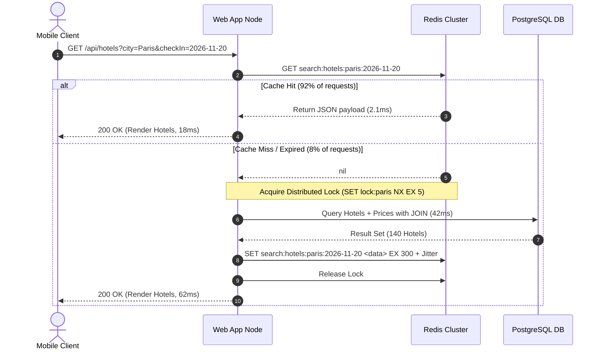

import { Callout } from 'fumadocs-ui/components/callout';
import { Tabs, Tab } from 'fumadocs-ui/components/tabs';
import { Steps, Step } from 'fumadocs-ui/components/steps';
import { Cards, Card } from 'fumadocs-ui/components/card';

## The 500,000 Search Spike

TravelBuddy has launched a holiday promotion: *"Fly to Paris for \$199."*

Within seconds, 500,000 users begin repeatedly searching for hotel rooms and flight itineraries across Europe. 

Even with multiple stateless web nodes and PostgreSQL read replicas, the system chokes:
1. **The Database Read Replicas Hit 100% CPU:** 85% of users are querying the exact same hotel inventory in central Paris for the exact same weekend dates. The database repeatedly executes the exact same expensive multi-table `JOIN` operations across `hotels`, `room_inventory`, and `amenities`.
2. **Network Bandwidth Bottleneck:** The single Nginx reverse proxy becomes a networking bottleneck as it attempts to handle hundreds of thousands of concurrent TCP handshakes and SSL terminations.

To scale beyond this threshold, we must master two foundational distributed systems disciplines: **Load Balancing** and **Multi-Tier Caching**.


---

## Load Balancing: Distributing the Flood

A **Load Balancer (LB)** acts as a reverse traffic cop, sitting between incoming client requests and backend server pools. It ensures no single compute instance becomes overwhelmed, routes around unhealthy nodes, and enables zero-downtime rolling software deployments.

```mermaid
flowchart TD
    Clients["Hundreds of Thousands of Clients"] --> LB["Load Balancer Pool"]
    
    subgraph Pool["Backend Target Group"]
        S1["Backend Server 1"]
        S2["Backend Server 2"]
        S3["Backend Server 3 (Unhealthy - Excluded)"]
        S4["Backend Server 4"]
    end

    LB -- "Active" --> S1
    LB -- "Active" --> S2
    LB -. "Health Check Failed (500)" .-x S3
    LB -- "Active" --> S4

    style Clients fill:#020617,stroke:#38bdf8,stroke-width:1px
    style LB fill:#0f172a,stroke:#38bdf8,stroke-width:2px
    style S1 fill:#0f172a,stroke:#34d399,stroke-width:1px
    style S2 fill:#0f172a,stroke:#34d399,stroke-width:1px
    style S3 fill:#450a0a,stroke:#ef4444,stroke-width:2px
    style S4 fill:#0f172a,stroke:#34d399,stroke-width:1px
```



### Layer 4 vs. Layer 7 Load Balancing

The most critical architectural distinction in load balancing is the **OSI Layer** at which the balancer operates.

```mermaid
flowchart TD
    subgraph L4["Layer 4: Transport Layer (TCP/UDP)"]
        direction TB
        P4["Inspects: Source IP, Dest IP, Source Port, Dest Port<br/>DOES NOT inspect HTTP payload or headers<br/>Operates on raw byte packets"]
    end

    subgraph L7["Layer 7: Application Layer (HTTP/HTTPS/gRPC)"]
        direction TB
        P7["Inspects: HTTP Methods, Headers, Cookies, URL Paths, JSON Body<br/>Terminates TLS, parses HTTP protocol stream<br/>Enables content-based intelligent routing"]
    end

    style L4 fill:#0f172a,stroke:#38bdf8,stroke-width:2px
    style L7 fill:#0f172a,stroke:#fbbf24,stroke-width:2px
```



| Dimension | Layer 4 Load Balancing (L4) | Layer 7 Load Balancing (L7) |
| :--- | :--- | :--- |
| **OSI Layer** | Layer 4 (Transport / TCP / UDP) | Layer 7 (Application / HTTP / HTTPS / gRPC) |
| **Packet Inspection** | IP address and TCP/UDP port only. | Full HTTP payload, headers, cookies, URL paths. |
| **TLS/SSL Decryption** | Pass-through (or terminated without payload inspection). | Must terminate TLS to inspect and modify HTTP content. |
| **Performance & Latency** | **Blazing fast**; near line-rate packet forwarding ($< 1\text{ms}$). | Slightly higher CPU overhead for protocol parsing ($2-5\text{ms}$). |
| **Routing Intelligence** | Limited (cannot route based on URL path or cookies). | High (can route `/api/flights` to Pool A, `/api/hotels` to Pool B). |
| **Memory Footprint** | Extremely low (stateless packet routing / NAT). | Moderate (buffers HTTP request headers and bodies). |
| **Common Technologies** | AWS Network Load Balancer (NLB), Linux IPVS, HAProxy (TCP mode). | AWS Application Load Balancer (ALB), Nginx, Envoy, Traefik. |

<Callout type="tip" title="Production Architecture Pattern: Two-Tier Load Balancing">
High-scale architectures rarely choose between L4 and L7—they deploy **both in tandem**.
1. An ultra-fast **Layer 4 Load Balancer (AWS NLB / IPVS)** accepts millions of raw public TCP connections and balances packets across a pool of Layer 7 gateways.
2. The **Layer 7 Gateways (Envoy / Nginx)** terminate TLS, inspect HTTP paths (`/flights` vs `/hotels`), validate JWTs, and route requests to target microservice clusters.
</Callout>

### Load Balancing Routing Algorithms

How does a load balancer pick which specific backend server receives the next request?

#### 1. Round Robin & Weighted Round Robin
- **Round Robin:** Requests are distributed sequentially: Server 1 $\rightarrow$ Server 2 $\rightarrow$ Server 3 $\rightarrow$ Server 1.
- **Weighted Round Robin:** Assigns weights based on hardware specs. A 32-core machine receives a weight of 4, while an 8-core machine receives a weight of 1, getting 4x the requests.
- *Best for:* Uniform, short-lived requests where every request takes roughly the same CPU time.

#### 2. Least Connections & Weighted Least Connections
- Directs traffic to the server currently maintaining the fewest active TCP connections.
- *Best for:* Long-lived connections (WebSockets, database proxies, long-polling HTTP streams) where connection duration varies wildly.

#### 3. IP Hash
- Hashes the client's source IP address: $\text{Server} = \text{hash}(\text{Client IP}) \pmod N$.
- *Best for:* Crude session stickiness when sessions cannot be externalized. (Drawback: behind corporate proxies or NAT gateways, thousands of users share one IP, causing hot spots).

#### 4. Consistent Hashing
In standard modulo hashing ($\text{hash}(\text{key}) \pmod N$), if you add or remove one server ($N \rightarrow N+1$), almost **100% of all keys remap to completely different servers**, causing catastrophic cache churn.

**Consistent Hashing** maps both servers and data keys to a continuous logical circle (the **hash ring**, typically from $0$ to $2^{32} - 1$).


- When a key arrives, it is hashed onto the ring and assigned to the **first node encountered moving clockwise**.
- **When a node fails or is added:** Only $\frac{1}{N}$ of the total keys are remapped! The rest remain on their existing servers.
- **Virtual Nodes (Vnodes):** To prevent uneven key distribution, each physical server is mapped to multiple virtual points on the ring (e.g., 200 virtual tokens per machine).

#### 5. Least Response Time (Least Latency / TTFB)
- Directs traffic to the server that combines the **fewest active connections** and the **lowest average response latency** (often measured via Time-to-First-Byte / TTFB over the past $N$ health checks).
- Formula conceptually evaluates: $\text{Cost} = \text{Active Connections} \times \text{Average Response Time}$.
- *Best for:* Workloads where server processing times are unpredictable or backend hardware is heterogeneous (e.g., mixing older and newer generation cloud instances).

#### 6. Geographical (Geo-Proximity / Latency-Based) Load Balancing
- Inspects client source IP geolocation or utilizes Anycast BGP routing to direct traffic to the data center or server pool geographically closest to the user.
- Prevents unnecessary transatlantic cross-continental fiber round-trips ($~100\text{ms}$ speed-of-light propagation latency).
- *Best for:* Global platforms like TravelBuddy where European users must hit Frankfurt servers and North American users hit Virginia servers.

---

### Eliminating the Load Balancer as a Single Point of Failure (SPOF)

Placing a load balancer in front of multiple application servers eliminates web tier SPOFs. However, it introduces an existential vulnerability: **The load balancer itself becomes the Single Point of Failure.** If the single NGINX or HAProxy host suffers a power loss or kernel panic, 100% of incoming traffic is dropped.

To achieve true high availability ($99.99\%+$), production architectures deploy load balancers in **redundant clustered pairs**.

```mermaid
flowchart TD
    DNS["Public DNS Record: travelbuddy.com<br/>Resolves to Floating Virtual IP (VIP): 198.51.100.1"] --> VIP["Floating Virtual IP (VIP): 198.51.100.1"]

    subgraph Cluster["High-Availability Load Balancer Pair"]
        direction LR
        subgraph Master["Node A: Primary Load Balancer (ACTIVE)"]
            LB1["HAProxy / Nginx (Active)"]
            K1["Keepalived Daemon (Master)<br/>Binds VIP: 198.51.100.1"]
        end

        subgraph Backup["Node B: Standby Load Balancer (PASSIVE)"]
            LB2["HAProxy / Nginx (Standby)"]
            K2["Keepalived Daemon (Backup)<br/>Listening for Heartbeats"]
        end

        K1 <-- "VRRP Heartbeat Multicast (Every 1s)<br/>224.0.0.18 over Private Network" --> K2
    end

    VIP -. "1. Normal Operation (Points to Node A)" .-> LB1
    VIP =="2. Automatic Failover on Node A Crash" ==> LB2

    subgraph Backend["Application Server Farm"]
        App1["App Server 1"]
        App2["App Server 2"]
        App3["App Server 3"]
    end

    LB1 --> App1 & App2 & App3
    LB2 --> App1 & App2 & App3

    style DNS fill:#020617,stroke:#38bdf8,stroke-width:2px
    style VIP fill:#0f172a,stroke:#fbbf24,stroke-width:2px
    style Master fill:#0f172a,stroke:#34d399,stroke-width:2px
    style Backup fill:#0f172a,stroke:#94a3b8,stroke-width:2px
    style Cluster fill:#1e293b,stroke:#38bdf8,stroke-width:1px
```



#### Active-Passive Redundancy with Floating IP & VRRP (Keepalived)

In an **Active-Passive** architecture, two identical load balancers run simultaneously:
1. **The Floating Virtual IP (VIP):** The public DNS points to a single IP address (`198.51.100.1`) that is not permanently tied to a physical network interface. It "floats" between nodes.
2. **Virtual Router Redundancy Protocol (VRRP):** Both nodes run a daemon like `Keepalived`. The Primary node broadcasts periodic multicast heartbeats (every 1 second) across the private subnet declaring: *"I am alive, priority 101."*
3. **Automated Sub-Second Failover:**
   - If the Primary node crashes or network cables unplug, heartbeat packets stop.
   - The Standby node (priority 100) misses 3 consecutive heartbeats (3 seconds).
   - The Standby transitions itself to `MASTER`, sends a **Gratuitous ARP (GARP)** packet to update the network switch's MAC address lookup table, and claims the Floating IP.
   - Traffic instantly flows to Node B with zero DNS changes and near-zero dropped connections!

```conf title="/etc/keepalived/keepalived.conf (Standby Node B)"
vrrp_script check_haproxy {
    script "killall -0 haproxy" # Returns 0 if haproxy process is running
    interval 2
    weight 2
}

vrrp_instance VI_1 {
    state BACKUP
    interface eth0
    virtual_router_id 51
    priority 100
    advert_int 1

    authentication {
        auth_type PASS
        auth_pass Secr3tPasswd
    }

    virtual_ipaddress {
        198.51.100.1/24 dev eth0
    }

    track_script {
        check_haproxy
    }
}
```

#### Active-Active Redundancy with BGP Anycast & ECMP
For planetary-scale infrastructure (like Cloudflare or AWS), Active-Passive has the limitation that the standby machine sits idle. Under **Active-Active BGP Anycast**:
- Multiple load balancers across the globe announce the *exact same public IP address* to upstream Internet routers using BGP (Border Gateway Protocol).
- Routers use **Equal-Cost Multi-Path (ECMP)** hashing to distribute packets across all active balancers concurrently.
- If any balancer goes offline, the BGP session drops and routers automatically route packets to surviving peers within milliseconds.

---

## Caching: The Sub-Millisecond Speedup

There is an immutable rule in computer architecture: **The fastest, cheapest database query is the one you never execute.**

### The Latency Pyramid

To appreciate why caching transforms system throughput, examine the physical latency gap between hardware tiers:

```mermaid
flowchart TD
    L1["CPU L1 Cache (~0.5 - 1 ns)"] --> L2["CPU L2/L3 Cache (~3 - 10 ns)"]
    L2 --> RAM["Main Memory / RAM (Redis) (~50 - 100 ns)"]
    RAM --> SSD["NVMe Solid State Drive (~20 - 100 µs)"]
    SSD --> HDD["Rotational Magnetic Disk (~2 - 10 ms)"]
    HDD --> Net["Inter-Datacenter Network Call (~50 - 150 ms)"]

    style L1 fill:#0f172a,stroke:#38bdf8,stroke-width:1px
    style RAM fill:#0f172a,stroke:#34d399,stroke-width:2px
    style SSD fill:#0f172a,stroke:#fbbf24,stroke-width:1px
    style Net fill:#450a0a,stroke:#f87171,stroke-width:1px
```



Reading 1 MB of hotel pricing data:
- From **Memory (Redis/RAM):** $\approx 0.25\text{ ms}$.
- From **NVMe Disk (PostgreSQL table scan):** $\approx 10\text{ ms}$ (40x slower).
- From **Cold Disk with complex JOINs:** $\approx 150\text{ ms}$ (600x slower).

### The Multi-Tier Caching Topology

In modern distributed systems, caching is not a single tool—it is a layered defense in depth:


1. **Client / Browser Cache:** HTTP headers (`Cache-Control: max-age=3600, stale-while-revalidate=60`, `ETag`) prevent the browser from making network requests for unchanged flight assets.
2. **Edge CDN (Content Delivery Network):** Caches static assets (images, CSS, JS) and edge-cacheable API responses in 300+ Point-of-Presence (PoP) datacenters geographically close to the user.
3. **Reverse Proxy Cache (Nginx):** Caches popular responses directly in Nginx memory, responding before the request ever touches Node.js or Python runtimes.
4. **Application In-Memory Cache:** Stores small, frequently accessed lookup tables (e.g., airport code dictionaries like `JFK -> John F. Kennedy`) directly inside the process memory.
5. **Distributed Cache (Redis):** Centralized, blazing-fast key-value cluster accessible across all stateless web servers.
6. **Database Buffer Pool (InnoDB / Postgres Shared Buffers):** The database's internal RAM caching hot table pages from disk.

---

## Cache Design Patterns

How does your application coordinate reads and writes between the distributed cache (Redis) and the database (PostgreSQL)?

```mermaid
flowchart TD
    subgraph P1["1. Cache-Aside (Lazy Loading)"]
        direction TB
        App1["Application"] -- "1. Read Cache" --> C1[("Cache")]
        App1 -- "2. Miss? Query DB" --> D1[("Database")]
        App1 -- "3. Write back to Cache" --> C1
    end

    subgraph P2["2. Write-Through"]
        direction TB
        App2["Application"] -- "1. Write Data" --> C2[("Cache")]
        C2 -- "2. Sync Write Data" --> D2[("Database")]
    end

    subgraph P3["3. Write-Back (Write-Behind)"]
        direction TB
        App3["Application"] -- "1. Write Data" --> C3[("Cache")]
        C3 -. "2. Async Batch Flush" .-> D3[("Database")]
    end

    style P1 fill:#0f172a,stroke:#38bdf8,stroke-width:1px
    style P2 fill:#0f172a,stroke:#34d399,stroke-width:1px
    style P3 fill:#0f172a,stroke:#fbbf24,stroke-width:1px
```



### 1. Cache-Aside (Lazy Loading)
- **Read Path:** The application requests data from the cache. On a cache hit, it returns the data immediately. On a cache miss, it fetches data from the database, writes the result to the cache with a Time-To-Live (TTL), and returns it to the client.
- **Write Path:** The application writes directly to the database, and then either deletes or invalidates the corresponding cache key.
- **Pros:** Resilient against cache crashes (requests gracefully fall back to the database). The cache only stores data that is actually requested.
- **Cons:** Cache miss penalty on the first read. Potential for stale data if database updates occur without cache eviction.

### 2. Read-Through
- The application treats the cache as the sole data store. When a cache miss occurs, the cache library/middleware automatically fetches the missing data from the database, populates itself, and returns it to the caller.

### 3. Write-Through
- When writing data, the application writes directly to the cache. The cache synchronously writes the update to the database before returning a success response.
- **Pros:** Data in cache is never stale; guarantees strict synchronization.
- **Cons:** High write latency (incurs the latency cost of two sequential writes).

### 4. Write-Back (Write-Behind)
- The application writes data immediately to the cache and acknowledges success to the client in sub-millisecond time. The cache queues updates and flushes them to the persistent database in asynchronous batches (e.g., every 5 seconds).
- **Pros:** Extraordinary write throughput and minimal write latency.
- **Cons:** **High risk of data loss.** If the Redis node crashes or loses power before dirty cached data is flushed to the database, committed writes are permanently lost.

---

## Cache Eviction Policies & Mechanics

When a cache's memory allocation fills to capacity (e.g., reaching 16 GB), how does it determine which keys to evict?

### Common Eviction Algorithms
1. **LRU (Least Recently Used):** Evicts the item that has not been accessed for the longest period of time. (Industry standard for most web applications).
2. **LFU (Least Frequently Used):** Tracks access counts; evicts items with the lowest access frequency. (Ideal for steady-state workloads, but slow to adapt to sudden changes in popularity).
3. **FIFO (First-In, First-Out):** Evicts the oldest item based on insertion time, regardless of access frequency.
4. **Random Replacement:** Evicts a random key. Low overhead, but unpredictable cache hit rates.

### Building an LRU Cache: The Classical Interview Architecture

An optimal LRU Cache must achieve **$O(1)$ constant time reads** and **$O(1)$ constant time writes/evictions**.

To achieve this, we combine two data structures:
1. A **Hash Map** for $O(1)$ key lookup.
2. A **Doubly Linked List** to maintain chronological access order.

```mermaid
flowchart LR
    Head["Head (Most Recently Used)"] <--> N1["Node: Paris<br/>Price: $199"]
    N1 <--> N2["Node: London<br/>Price: $250"]
    N2 <--> N3["Node: Tokyo<br/>Price: $800"]
    N3 <--> Tail["Tail (Least Recently Used - First to Evict)"]

    Map["Hash Map<br/>'Paris' -> &Node1<br/>'London' -> &Node2<br/>'Tokyo' -> &Node3"] -. "O(1) Pointers" .-> N1 & N2 & N3

    style Head fill:#0f172a,stroke:#34d399,stroke-width:1px
    style Tail fill:#450a0a,stroke:#f87171,stroke-width:1px
    style Map fill:#0f172a,stroke:#38bdf8,stroke-width:2px
```



```typescript
class LRUNode<K, V> {
  key: K;
  value: V;
  prev: LRUNode<K, V> | null = null;
  next: LRUNode<K, V> | null = null;

  constructor(key: K, value: V) {
    this.key = key;
    this.value = value;
  }
}

export class LRUCache<K, V> {
  private capacity: number;
  private map = new Map<K, LRUNode<K, V>>();
  private head: LRUNode<K, V> | null = null; // Most Recently Used
  private tail: LRUNode<K, V> | null = null; // Least Recently Used

  constructor(capacity: number) {
    this.capacity = capacity;
  }

  get(key: K): V | null {
    const node = this.map.get(key);
    if (!node) return null;
    this.moveToHead(node);
    return node.value;
  }

  put(key: K, value: V): void {
    let node = this.map.get(key);
    if (node) {
      node.value = value;
      this.moveToHead(node);
      return;
    }

    node = new LRUNode(key, value);
    this.map.set(key, node);
    this.addToHead(node);

    if (this.map.size > this.capacity) {
      this.evictTail();
    }
  }

  private moveToHead(node: LRUNode<K, V>): void {
    this.removeNode(node);
    this.addToHead(node);
  }

  private addToHead(node: LRUNode<K, V>): void {
    node.next = this.head;
    node.prev = null;
    if (this.head) this.head.prev = node;
    this.head = node;
    if (!this.tail) this.tail = node;
  }

  private removeNode(node: LRUNode<K, V>): void {
    if (node.prev) node.prev.next = node.next;
    else this.head = node.next;

    if (node.next) node.next.prev = node.prev;
    else this.tail = node.prev;
  }

  private evictTail(): void {
    if (!this.tail) return;
    this.map.delete(this.tail.key);
    this.removeNode(this.tail);
  }
}
```

---

## The Four Cache Catastrophes & How to Prevent Them

In distributed systems, caching bugs cause devastating cascading outages. You must design against four specific failure modes:

<Steps>
<Step>
### 1. Cache Stampede (The Thundering Herd)
**The Scenario:** A hot key (e.g., `hotel:paris:flash-sale` accessed 50,000 times/second) expires. At that exact millisecond, 50,000 incoming requests miss the cache simultaneously and all execute the heavy SQL query against PostgreSQL at the exact same moment. The database CPU hits 100% and crashes.

**The Mitigation:** Use **Distributed Mutex Locking** (via Redis `SET NX` or Singleflight). Only the first thread that acquires the lock is permitted to query the database and repopulate the cache; the other 49,999 requests wait for the key to reappear.
</Step>

<Step>
### 2. Cache Penetration
**The Scenario:** Malicious clients or scrapers query millions of non-existent IDs (e.g., `/api/hotels?id=-999999` or randomly generated UUIDs). The cache never stores these keys because they don't exist. Every single request bypasses the cache entirely and hammers the database.

**The Mitigation:**
1. **Cache Empty/Null Results:** Store `SET hotel:-999999 'NULL' EX 60` with a short 60-second TTL.
2. **Bloom Filter:** Place a space-efficient probabilistic **Bloom Filter** in front of the cache. If the Bloom filter reports an ID does not exist, reject the request immediately without touching the cache or database.
</Step>

<Step>
### 3. Cache Avalanche
**The Scenario:** The engineering team sets a uniform 24-hour TTL on all cached records. Exactly 24 hours later, hundreds of thousands of keys expire at the exact same second. The database is crushed by a massive tsunami of cache misses.

**The Mitigation:** Add **Random Jitter** to the TTL:
$$
\text{Effective TTL} = \text{Base TTL} + \text{random}(0, \Delta)
$$
For example, instead of expiring exactly at 3600 seconds, expire between 3300 and 3900 seconds to disperse database queries smoothly across time.
</Step>

<Step>
### 4. Cache Breakdown
**The Scenario:** A single ultra-hot key expires right in the middle of a live product launch.

**The Mitigation:** Implement **Probabilistic Early Recomputation (XFetch Algorithm)** or run background worker cron jobs to refresh hot keys asynchronously before their TTL reaches zero.
</Step>
</Steps>

---

## TravelBuddy Hotel Search Caching in Action

Let's look at how TravelBuddy implements sub-50ms hotel search caching using **Redis Hashes and Sorted Sets**:



By introducing Layer 4/7 load balancing and a distributed Redis caching tier, TravelBuddy scales smoothly to **5,000,000 daily searches** with a $92\%$ cache hit rate and median latency below $25\text{ms}$.

However, as the engineering team grows to 60 engineers, a completely different crisis strikes:
- The monolithic code repository has become an unmaintainable behemoth.
- A bug introduced in the hotel review formatting module crashes the flight checkout payment processor.
- A deployment requires 45 minutes of automated testing, locking out all engineering teams twice a day.

In the next lesson, we break down **Monoliths, Microservices, and Asynchronous Queues**—learning how to decouple systems with RabbitMQ and Apache Kafka.
