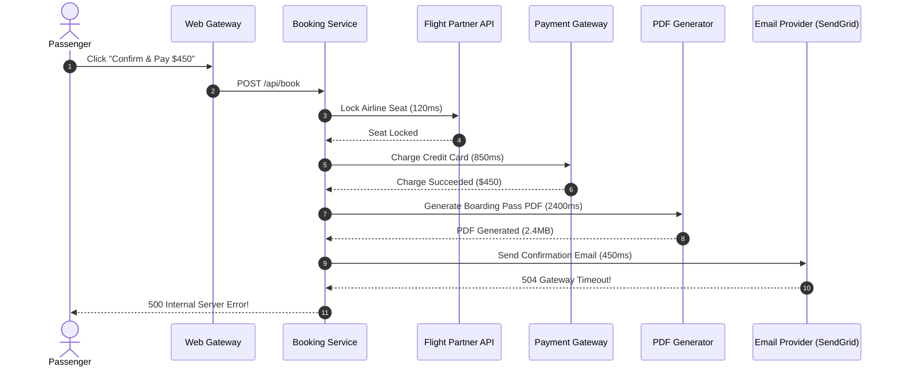
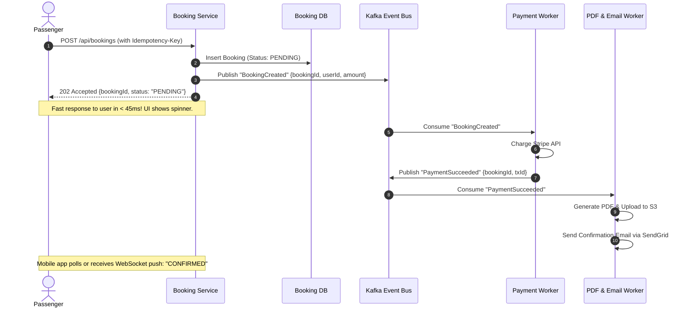

import { Callout } from 'fumadocs-ui/components/callout';
import { Tabs, Tab } from 'fumadocs-ui/components/tabs';
import { Steps, Step } from 'fumadocs-ui/components/steps';
import { Cards, Card } from 'fumadocs-ui/components/card';

## The Monolithic Gridlock

TravelBuddy has grown from two founders into a high-growth company with **65 software engineers** divided into six distinct product squads:
1. *Squad Flight Search*
2. *Squad Hotel Inventory*
3. *Squad Pricing & Promotions*
4. *Squad Checkout & Payments*
5. *Squad Customer Notifications*
6. *Squad User Reviews & Community*

All 65 engineers still work in the same single repository, and all code is compiled into a single massive deployment artifact: **the Monolith**.

```mermaid
flowchart TD
    subgraph Monolith["The Monolithic Beast (One Process, One Deployment)"]
        direction TB
        Auth["Auth & User Profiles"]
        Flight["Flight Engine"]
        Hotel["Hotel Inventory"]
        Promo["Discounts & Vouchers"]
        Pay["Stripe Payment Processing"]
        Notify["Email & SMS Notifications"]
        PDF["Puppeteer Boarding Pass Gen"]
        Review["User Reviews & Photos"]
    end

    SharedDB[("Single PostgreSQL Database<br/>(Shared Schema & Tables)")]

    Auth & Flight & Hotel & Promo & Pay & Notify & PDF & Review --> SharedDB

    style Monolith fill:#0f172a,stroke:#f87171,stroke-width:2px
    style SharedDB fill:#0f172a,stroke:#fbbf24,stroke-width:2px
```




Suddenly, severe organizational and technical dysfunction erupts:

- **The Blast Radius Is 100%:** An intern on *Squad User Reviews* commits a small bug that causes an uncaught memory leak in review photo parsing. The entire Node.js process crashes—taking down **Stripe checkout and ticket booking** across the entire company!
- **All-or-Nothing Scaling Inefficiency:** Flight search receives 50,000 requests per second, requiring 40 server instances. But payment processing only receives 50 requests per second and requires strict PCI-DSS compliance. Because everything is bundled together, TravelBuddy must deploy 40 instances of the entire monolithic bundle—including sensitive payment code—wasting immense cloud infrastructure spend.
- **The Dependency Version Lock:** *Squad Payments* requires the Stripe SDK at version 14.x. *Squad Notifications* relies on an analytics package that requires an older library version incompatible with Stripe SDK 14. A single application can only run one runtime version.
- **Deployment Gridlock:** Merging a pull request requires running 12,000 unit and integration tests across all squads. The CI/CD pipeline takes 58 minutes. If a single test fails, the entire company's deployment freezes for the day.

---

## The Architectural Spectrum: Monolith vs. Microservices

Architectures are not binary choices between "good" and "bad"—they are engineering trade-offs between **operational complexity** and **organizational scalability**.

```mermaid
flowchart LR
    M["1. Classic Monolith<br/>Low operational overhead<br/>High coupling at scale"] --> MM["2. Modular Monolith<br/>Strict domain boundaries<br/>Single deployable artifact"] --> MS["3. Microservices<br/>Independent deployments<br/>High distributed complexity"]

    style M fill:#0f172a,stroke:#38bdf8,stroke-width:1px
    style MM fill:#0f172a,stroke:#34d399,stroke-width:2px
    style MS fill:#0f172a,stroke:#a855f7,stroke-width:2px
```



### Comparative Architectural Matrix

| Dimension | Monolithic Architecture | Modular Monolith | Microservices Architecture |
| :--- | :--- | :--- | :--- |
| **Deployment Unit** | Single binary or container. | Single binary or container. | Dozens or hundreds of independent containers. |
| **Database Model** | Single shared database. | Single database with schema domain boundaries. | **Database-per-Service** (private to each service). |
| **Inter-Module Comms** | In-memory function calls ($< 1\mu\text{s}$). | In-memory package APIs ($< 1\mu\text{s}$). | Network RPCs / REST / gRPC ($5-50\text{ms}$). |
| **Data Transactions** | Local ACID transactions (`BEGIN ... COMMIT`). | Local ACID transactions. | **Distributed Transactions** (Saga Pattern / Eventual). |
| **Blast Radius** | Global (one bug can crash entire app). | Moderate (process crash still global). | Isolated to the specific service boundary. |
| **CI/CD Build Time** | Monolithic pipeline; slow as team grows. | Fast with affected-only builds (Turborepo/Nx). | Independent per-service pipelines ($< 3\text{ min}$). |
| **Operational Cost** | Low (simple VM or single container cluster). | Low to Moderate. | **Very High** (Kubernetes, service mesh, distributed tracing). |

<Callout type="warn" title="Conway's Law & The Microservice Trap">
**Conway's Law (1967):** *"Organizations which design systems are constrained to produce designs which are copies of the communication structures of these organizations."*

Do **not** adopt microservices when you have a 5-person startup team. You will spend 80% of your engineering time maintaining Kubernetes manifests, service meshes, and network retry logic rather than shipping user features. Split into microservices only when **team coordination bottlenecks exceed the operational cost of distributed systems**.
</Callout>

### The Pragmatic Middle Ground: The Modular Monolith

Before rushing into 50 independent microservices, many world-class engineering teams (including Shopify and GitHub) use a **Modular Monolith**:
- The codebase remains a single deployable artifact.
- Code is segregated into strict, isolated domain packages (e.g., `packages/flights`, `packages/payments`, `packages/notifications`).
- Modules are **strictly forbidden** from directly importing private classes or querying internal database tables belonging to another domain. They communicate exclusively through public typed interfaces.

---

### Migrating Safely: The Strangler Fig Pattern

When an existing monolith grows too large, business executives often suggest: *"Let's pause feature development for 9 months and rewrite everything into microservices from scratch!"*

<Callout type="error" title="The Big Bang Rewrite Fallacy">
A "Big Bang" rewrite is the single most dangerous decision in software engineering. While the rewrite team spends 18 months trying to catch up, the production monolith continues changing, customer requirements diverge, and the new system launches with catastrophic regressions.
</Callout>

Instead of rewriting, world-class architects use **Martin Fowler's Strangler Fig Pattern**—named after Australian strangler fig vines that seed in the upper canopy of a host tree, slowly grow branches downward to root in the ground, and gradually envelop and supplant the host tree over years.

```mermaid
flowchart TD
    subgraph Phase1["Phase 1: Intercept at the Edge"]
        direction TB
        Client1["Client Traffic"] --> Gateway1["API Gateway / Reverse Proxy"]
        Gateway1 -- "100% of Paths" --> Mono1["Legacy Monolith"]
    end

    subgraph Phase2["Phase 2: Gradual Seam Extraction"]
        direction TB
        Client2["Client Traffic"] --> Gateway2["API Gateway / Routing Seams"]
        Gateway2 -- "Legacy Routes (/flights, /hotels)" --> Mono2["Shrinking Monolith"]
        Gateway2 -- "Extracted Routes (/notifications, /reviews)" --> Svc1["New Microservices<br/>(Dedicated DBs)"]
        Mono2 -. "Change Data Capture (CDC)" .-> Svc1
    end

    subgraph Phase3["Phase 3: Monolith Decommissioned"]
        direction TB
        Client3["Client Traffic"] --> Gateway3["API Gateway"]
        Gateway3 --> SvcA["Flight Service"]
        Gateway3 --> SvcB["Hotel Service"]
        Gateway3 --> SvcC["Payment Service"]
        Gateway3 --> SvcD["Notification Service"]
    end

    Phase1 ==> Phase2 ==> Phase3

    style Phase1 fill:#0f172a,stroke:#38bdf8,stroke-width:1px
    style Phase2 fill:#0f172a,stroke:#fbbf24,stroke-width:2px
    style Phase3 fill:#0f172a,stroke:#34d399,stroke-width:1px
```



#### Step-by-Step Strangler Fig Mechanics

<Steps>
<Step>
### 1. Identify a High-Value "Seam"
A **seam** is a bounded context with clear boundaries, low inbound dependencies, and a well-understood interface. In TravelBuddy, `NotificationService` (sending emails and SMS) or `UserReviewsService` are ideal first candidates—unlike Core Booking, a bug in reviews will not break airline ticketing.
</Step>

<Step>
### 2. Introduce the Intercepting Reverse Proxy
Place an API Gateway (Envoy, Kong, or Nginx) in front of the existing application. Initially, it simply forwards 100% of traffic to the legacy monolith. Clients now communicate with the gateway, decoupling client endpoints from server topology.
</Step>

<Step>
### 3. Build the New Service with Its Own Database
Construct the new service adhering strictly to the **Database-per-Service** pattern. The new service must never directly touch the monolith's database tables.
</Step>

<Step>
### 4. Hydrate Data & Shadow Traffic
Synchronize historical data into the new service's datastore using background workers or **Change Data Capture (CDC)** via Kafka. Run **shadow traffic (dark launching)**: the gateway clones live incoming requests and sends them to both the monolith and the new microservice, comparing responses to verify parity without impacting users.
</Step>

<Step>
### 5. Cutover & Decommission Legacy Code
Shift 1% $\rightarrow$ 10% $\rightarrow$ 50% $\rightarrow$ 100% of live traffic to the new microservice. Once the microservice has run stably in production for weeks, physically delete the old notification module from the monolith. The monolith shrinks continuously until it either reaches an optimal core size or is extinguished entirely.
</Step>
</Steps>

---

### Architectural Pitfall: The Distributed Monolith Anti-Pattern

Many engineering teams declare they have adopted microservices when, in reality, they have built **The Distributed Monolith**: *the single worst architectural state a company can find itself in.*

```mermaid
flowchart TD
    subgraph DM["The Distributed Monolith: Worst of Both Worlds"]
        direction TB
        Web["Client Web / Mobile"] --> S1["Service A: Web Gateway"]
        
        subgraph SyncChain["Fragile Synchronous Chain (Latency Compounding)"]
            S1 -- "HTTP GET (50ms)" --> S2["Service B: Booking"]
            S2 -- "HTTP POST (60ms)" --> S3["Service C: Inventory"]
            S3 -- "HTTP POST (40ms)" --> S4["Service D: Pricing"]
            S4 -- "HTTP POST (120ms)" --> S5["Service E: Loyalty Points"]
        end

        subgraph SharedStore["The Anti-Pattern Core: Shared Database"]
            DB[("Single Massive PostgreSQL Database<br/>Every service reads & writes directly!")]
        end

        S1 & S2 & S3 & S4 & S5 --> DB
    end

    style DM fill:#450a0a,stroke:#ef4444,stroke-width:2px
    style SyncChain fill:#1e293b,stroke:#f87171,stroke-width:1px
    style SharedStore fill:#1e293b,stroke:#fbbf24,stroke-width:1px
```



A distributed monolith has all the **operational overhead, network latency, and deployment complexity** of microservices, combined with all the **tight coupling, cascading failures, and schema locking** of a messy monolith.

#### The 6 Warning Signs of a Distributed Monolith

| Symptom | Why It Destroys Systems | The Architectural Remedy |
| :--- | :--- | :--- |
| **1. Shared Database Across Services** | Multiple services query the same relational tables directly. A change to a single column schema by Team A breaks Team B and Team C in production. | **Database-per-Service.** All data access must go through the owning service's public API or domain events. |
| **2. Deep Synchronous Call Chains ($> 4$ hops)** | Service A calls B, which calls C, which calls D. Latencies compound: $T_{\text{total}} = \sum t_i$. If Service D experiences a 2-second GC pause, Service A times out. | Decouple using **asynchronous event brokers (Kafka / RabbitMQ)** or cache derived data locally. |
| **3. Lockstep Deployments** | Service A cannot be deployed without simultaneously releasing Service B and Service C. Version coupling proves the services are not independently deployable. | Implement backwards-compatible APIs (Protobuf field tags, optional JSON keys) and semantic versioning. |
| **4. Nano-Services / Over-Partitioning** | Splitting functions into separate network containers (e.g., a service that only calculates tax). JSON serialization and network overhead exceed execution time by 1,000x. | Re-aggregate related nano-services back into a cohesive, domain-driven microservice. |
| **5. Single Team Owning 30 Services** | A small team of 5 engineers spends all week managing 30 Dockerfiles, Helm charts, and CI/CD pipelines instead of building product features. | Consolidate services back into a **Modular Monolith** until team size justifies service boundaries. |
| **6. No Distributed Tracing** | An HTTP request returns a `504 Gateway Timeout`, and engineers must SSH into 8 different pods trying to cross-reference timestamps in log files. | Mandate **Correlation IDs (`X-Correlation-ID`)** and OpenTelemetry distributed tracing from Day 1. |

---

## Code Organization: Monorepo vs. Polyrepo

When splitting into multiple services, where does the code live in Git?

```mermaid
flowchart TD
    subgraph Mono["Monorepo (Single Unified Git Repository)"]
        direction TB
        R1["travelbuddy/"]
        R1 --> D1["services/flight-service/"]
        R1 --> D2["services/payment-service/"]
        R1 --> D3["packages/ui-components/"]
        R1 --> D4["packages/shared-types/"]
    end

    subgraph Poly["Polyrepo (Multi-Repo: One Git Repo Per Service)"]
        direction TB
        G1["github.com/travelbuddy/flight-service.git"]
        G2["github.com/travelbuddy/payment-service.git"]
        G3["github.com/travelbuddy/shared-types.git"]
    end

    style Mono fill:#0f172a,stroke:#38bdf8,stroke-width:2px
    style Poly fill:#0f172a,stroke:#34d399,stroke-width:2px
```



### Monorepo
- **Single repository** containing all services, packages, and shared libraries.
- **Advantages:** Atomic commits across services (you can update an API schema and all downstream consumers in a single git commit). Universal search and refactoring. Shared build tooling (Nx, Turborepo, Bazel).
- **Disadvantages:** Repository size grows rapidly. Requires advanced CI tooling to only test and build affected packages (`git diff` inspection). Strict PR merge queues needed.

### Polyrepo
- **Separate repositories** for every independent microservice and shared library.
- **Advantages:** Granular access permissions (contractors can access only the review service). Completely isolated CI/CD pipelines. Clear ownership boundaries.
- **Disadvantages:** Coordinating cross-service breaking changes is painful. Updating a shared TypeScript interface requires publishing an npm package, version bumping, and submitting PRs across 20 distinct repositories.

---

## Inter-Service Communication: Synchronous vs. Asynchronous

Once you decompose TravelBuddy into independent services, how do they talk to each other?

### 1. Synchronous Communication (REST / gRPC)

In a synchronous model, Service A dispatches an HTTP or gRPC request to Service B and **blocks execution waiting for the response**.



### The Synchronous Cascade Failure
Examine the sequence above. What happens when SendGrid experiences a 504 Gateway Timeout?
1. **The User's Credit Card was charged \$450!**
2. The user sees a red **"500 Internal Server Error"** banner.
3. The user panics, clicks the button two more times, and gets charged \$1,350!
4. **Latency Accumulation:** Total response time is $L_{\text{total}} = 120 + 850 + 2400 + 450 = 3,820\text{ ms}$. If any single downstream service is slow, the entire user experience hangs.

---

## Asynchronous Communication: Message Brokers & Event Streams

To build resilient distributed systems, we must replace synchronous chains with **Asynchronous Event-Driven Architecture**.

```mermaid
flowchart LR
    Producer["Booking Service<br/>(Event Producer)"] -- "Publish Event<br/>BookingInitiated" --> Broker["Message Broker / Stream<br/>(Kafka / RabbitMQ)"]
    
    Broker -- "Consume" --> Pay["Payment Service"]
    Broker -- "Consume" --> PDF["PDF Worker"]
    Broker -- "Consume" --> Email["Email Worker"]
    Broker -- "Consume" --> Analytics["Data Lake Warehouse"]

    style Producer fill:#0f172a,stroke:#38bdf8,stroke-width:2px
    style Broker fill:#0f172a,stroke:#fbbf24,stroke-width:2px
    style Pay fill:#0f172a,stroke:#34d399,stroke-width:1px
    style PDF fill:#0f172a,stroke:#34d399,stroke-width:1px
    style Email fill:#0f172a,stroke:#34d399,stroke-width:1px
    style Analytics fill:#0f172a,stroke:#a855f7,stroke-width:1px
```



### The Three Superpowers of Queues

<Steps>
<Step>
### 1. Temporal Decoupling
The Producer and Consumer **do not need to be online at the same time**.
- If the Email Worker crashes, or SendGrid has an outage, the message sits safely in the queue.
- When the Email Worker restarts 30 minutes later, it drains the queue and delivers all pending emails. **Zero lost confirmations.**
</Step>

<Step>
### 2. Load Leveling (Traffic Spike Buffering)
During a Black Friday flash sale, 20,000 users complete bookings per second.
- The PostgreSQL database can only sustain 1,000 writes per second.
- The message queue accepts all 20,000 events in memory, absorbing the spike.
- Background consumer workers pull from the queue at a steady, sustainable rate of 1,000 writes/second. The database never crashes.
</Step>

<Step>
### 3. Fan-Out & Extensibility
Want to add an AI Fraud Detection service or send booking telemetry to Datadog?
- You do **not** modify the Booking Service code.
- You simply attach a new Consumer group to the `booking-events` topic.
</Step>
</Steps>

---

## Message Brokers (RabbitMQ) vs. Event Streaming (Apache Kafka)

Engineers often confuse message queues with distributed commit logs. They solve fundamentally different problems.

```mermaid
flowchart TD
    subgraph Rabbit["RabbitMQ: Message Broker (Smart Broker, Dumb Consumer)"]
        direction TB
        RB["Queue stores messages until acknowledged.<br/>Once Consumer confirms, message is DELETED.<br/>Point-to-point task queues & complex routing (AMQP)."]
    end

    subgraph Kafka["Apache Kafka: Distributed Commit Log (Dumb Broker, Smart Consumer)"]
        direction TB
        KF["Append-only immutable partition log on disk.<br/>Messages persist for days/weeks regardless of consumption.<br/>Each consumer tracks its own Offset pointer.<br/>High throughput: millions of events/sec via sequential I/O."]
    end

    style Rabbit fill:#0f172a,stroke:#38bdf8,stroke-width:2px
    style Kafka fill:#0f172a,stroke:#34d399,stroke-width:2px
```



| Dimension | RabbitMQ | Apache Kafka |
| :--- | :--- | :--- |
| **Model** | Message Broker (Store-and-forward queue). | Distributed Append-Only Event Log. |
| **Message Lifecycle** | Deleted immediately upon successful ACK. | Retained on disk according to retention policy (e.g., 7 days). |
| **Replayability** | Cannot replay consumed messages. | **Full Replay:** Any consumer can reset offset to the beginning. |
| **Ordering** | Ordered per queue (broken by multiple consumers). | Strictly ordered **within each partition**. |
| **Throughput** | Tens of thousands of messages/sec. | **Millions** of events/sec (zero-copy page cache). |
| **Routing** | Rich AMQP exchanges (topic, direct, fanout, headers). | Topic-based with consumer group partition assignments. |
| **Ideal Use Case** | Transactional task queues, background jobs. | Real-time event streaming, activity tracking, event sourcing. |

---

## Refactoring TravelBuddy: Resilient Asynchronous Checkout

Below is TravelBuddy's new production event-driven checkout flow:



### The Idempotency Guarantee: Preventing Double Charges

In distributed systems, networks drop packets. A client might send a payment request, the server executes it, but the network connection drops before the HTTP response reaches the client.

The client retries. How do we prevent charging the passenger twice?

We enforce **Idempotency**:

```sql
-- In the Payment Service Database
CREATE TABLE payment_transactions (
  id UUID PRIMARY KEY DEFAULT gen_random_uuid(),
  idempotency_key VARCHAR(255) UNIQUE NOT NULL, -- Client-generated UUID
  booking_id UUID NOT NULL,
  amount_cents INTEGER NOT NULL,
  stripe_charge_id VARCHAR(255) NOT NULL,
  status VARCHAR(50) NOT NULL,
  created_at TIMESTAMP WITH TIME ZONE DEFAULT NOW()
);
```

```typescript
// Payment Worker Consumer Logic
async function processPayment(event: BookingCreatedEvent): Promise<void> {
  const { idempotencyKey, bookingId, amountCents } = event;

  // STEP 1: Check if this unique operation was already processed
  const existingTx = await db.query(
    'SELECT * FROM payment_transactions WHERE idempotency_key = $1',
    [idempotencyKey]
  );

  if (existingTx.rows.length > 0) {
    console.log(`Duplicate request detected for key ${idempotencyKey}. Skipping charge.`);
    return; // Safe no-op!
  }

  // STEP 2: Charge payment gateway with idempotency key
  const charge = await stripe.charges.create(
    {
      amount: amountCents,
      currency: 'usd',
      metadata: { bookingId }
    },
    {
      idempotencyKey // Pass directly to Stripe to prevent double processing
    }
  );

  // STEP 3: Store result atomically
  await db.query(
    `INSERT INTO payment_transactions 
     (idempotency_key, booking_id, amount_cents, stripe_charge_id, status) 
     VALUES ($1, $2, $3, $4, 'SUCCESS')`,
    [idempotencyKey, bookingId, amountCents, charge.id]
  );
}
```

By decoupling domains into microservices and communicating asynchronously via Kafka event logs, TravelBuddy has eliminated cascading crashes, achieved sub-50ms user acceptance times, and guaranteed zero double-bookings.

Now, TravelBuddy faces its ultimate test: scaling to **10 Million Daily Active Users** worldwide.

In the next lesson—the **Capstone Architecture Lab**—you will step into the shoes of the Chief Architect to calculate complete back-of-the-envelope capacity estimations and design the planetary blueprint for TravelBuddy.
