import { Callout } from 'fumadocs-ui/components/callout';
import { Tabs, Tab } from 'fumadocs-ui/components/tabs';
import { Steps, Step } from 'fumadocs-ui/components/steps';
import { Cards, Card } from 'fumadocs-ui/components/card';

## The Chief Architect's Challenge

You have been appointed Chief Systems Architect of **TravelBuddy**.

The Board of Directors has approved a major global expansion: TravelBuddy is scaling from a regional app to a planetary platform serving **10 Million Daily Active Users (DAU)** across the Americas, Europe, and Asia-Pacific.

In this capstone design lab, we will build the complete end-to-end distributed system blueprint—from mathematical capacity estimation down to concurrency locking and disaster recovery.

---

## Step 1: System Requirements & Constraints

Before drawing a single architecture box, we establish non-negotiable boundaries:

### Functional Requirements (FR)
1. **Global Search:** Users can query available flights and hotels across origin, destination, and dates with sub-second response times.
2. **Atomic Booking:** Users can select a seat or hotel room and reserve it. **Strict zero double-booking guarantee.**
3. **Idempotent Payments:** Secure credit card processing via payment gateways with automated retry mechanisms and zero duplicate charges.
4. **Ticket Delivery:** Immediate generation of digital boarding pass PDFs and asynchronous email/SMS notifications.
5. **Booking History:** Users can view active and past itineraries on demand.

### Non-Functional Requirements (NFR)
1. **High Availability:** $99.99\%$ availability ("four nines"), permitting less than $52.6$ minutes of unscheduled downtime per year.
2. **Search Latency:** $p99 < 150\text{ ms}$ globally across all continents.
3. **Booking Latency:** $p99 < 500\text{ ms}$ for transactional reservations.
4. **Data Durability:** Zero data loss for confirmed financial bookings ($RPO = 0$, Recovery Point Objective).
5. **Consistency Model:** Strong consistency for inventory reservation; eventual consistency for flight search indexes, hotel reviews, and analytics.

---

## Step 2: Back-of-the-Envelope Capacity Estimation

A systems design interview or production architecture review without numbers is mere hand-waving. Let's calculate exact mathematical sizing.

### 1. Traffic & Query Per Second (QPS)

```mermaid
flowchart LR
    DAU["10 Million DAU"] --> Searches["200M Searches/Day<br/>(20 searches/user)"]
    DAU --> Bookings["500K Bookings/Day<br/>(1 booking / 20 users)"]
    
    Searches --> SearchQPS["Avg Search QPS: 2,315<br/>Peak Search QPS: 5,787 (~5,800)"]
    Bookings --> BookQPS["Avg Booking QPS: 5.8<br/>Peak Booking QPS: 18 (~20)"]

    style DAU fill:#0f172a,stroke:#38bdf8,stroke-width:2px
    style Searches fill:#0f172a,stroke:#34d399,stroke-width:1px
    style Bookings fill:#0f172a,stroke:#fbbf24,stroke-width:1px
    style SearchQPS fill:#0f172a,stroke:#34d399,stroke-width:2px
    style BookQPS fill:#0f172a,stroke:#fbbf24,stroke-width:2px
```



#### Search Queries (Read Path)
- **Daily Searches:** $10,000,000 \text{ DAU} \times 20 \text{ searches/user/day} = 200,000,000 \text{ searches/day}$.
- **Average Search QPS:**
  $$
  \text{Avg QPS} = \frac{200,000,000 \text{ requests}}{86,400 \text{ seconds}} \approx 2,315 \text{ QPS}
  $$
- **Peak Search QPS (Traffic spike multiplier 2.5x during lunch/evening):**
  $$
  \text{Peak QPS} = 2,315 \times 2.5 \approx 5,787 \text{ QPS} \quad (\approx 5,800 \text{ QPS})
  $$

#### Booking Transactions (Write Path)
- **Daily Bookings (Conversion rate 5%):** $\frac{10,000,000}{20} = 500,000 \text{ bookings/day}$.
- **Average Booking QPS:**
  $$
  \text{Avg Write QPS} = \frac{500,000}{86,400} \approx 5.8 \text{ QPS}
  $$
- **Peak Booking QPS (Peak multiplier 3x during flash promotions):**
  $$
  \text{Peak Write QPS} = 5.8 \times 3 \approx 17.4 \text{ QPS} \quad (\approx 18 \text{ QPS})
  $$
- **Read-to-Write Ratio:** $\frac{200,000,000}{500,000} = 400:1$ (Extremely read-heavy system).

---

### 2. Storage Capacity (5-Year Horizon)

#### Relational Booking Records (PostgreSQL)
A single booking row includes:
- `booking_id` (UUID): 16 bytes
- `user_id` (UUID): 16 bytes
- `flight_id` / `hotel_id` (UUID): 16 bytes
- `total_amount_cents` (INT): 4 bytes
- `status` (VARCHAR): 16 bytes
- `passenger_metadata` (JSONB): ~1,000 bytes
- `created_at` / `updated_at` (TIMESTAMPTZ): 16 bytes
- Overhead & B-Tree Index buffers: ~150 bytes
- **Total per booking row:** $\approx 1.2 \text{ KB}$

**Calculations:**
- **Daily Storage:** $500,000 \times 1.2 \text{ KB} = 600,000 \text{ KB} = 600 \text{ MB/day}$.
- **1-Year Storage:** $600 \text{ MB} \times 365 \approx 219 \text{ GB/year}$.
- **5-Year Storage:** $219 \text{ GB} \times 5 \approx 1.1 \text{ TB}$.

<Callout type="info" title="Storage Reality Check">
$1.1 \text{ TB}$ over 5 years is surprisingly compact! It easily fits on a modern cloud relational database instance (e.g., AWS RDS PostgreSQL with provisioned IOPS NVMe SSDs). We do not need complex distributed NoSQL sharding for the primary booking ledger—a primary-replica relational database provides total ACID safety with manageable storage.
</Callout>

#### Document / PDF Ticket Storage (Object Store / S3)
- E-Ticket PDF size: $\approx 200 \text{ KB}$
- Daily PDF storage: $500,000 \times 200 \text{ KB} = 100 \text{ GB/day}$.
- 1-Year PDF storage: $100 \text{ GB} \times 365 \approx 36.5 \text{ TB/year}$.
- **5-Year PDF storage:** $36.5 \text{ TB} \times 5 \approx 182.5 \text{ TB}$.
- *Design decision:* Store all generated PDFs in **AWS S3 / Google Cloud Storage** with lifecycle policies that transition tickets older than 90 days to S3 Glacier Deep Archive (costing $\approx 0.00099\text{ USD per GB/month}$).

---

### 3. Memory & Cache Estimations (The 80/20 Rule)

Following Pareto's Principle, **$20\%$ of flight routes and hotel destinations account for $80\%$ of all search queries**.

- Top 50,000 popular flight routes $\times$ average date window (10 days) = $500,000$ hot cache entries.
- Average search result payload (JSON compressed): $15 \text{ KB}$.
- **Raw Cache Memory:** $500,000 \times 15 \text{ KB} = 7.5 \text{ GB}$.
- Adding dynamic hotel availability caches, session states, and rate-limiting counters: $\approx 25 \text{ GB}$.
- Provisioning for $3\times$ safety margin and replica sets: **A $100 \text{ GB}$ Redis cluster** (e.g., 4 shards of 32 GB each) effortlessly caches 95%+ of global search traffic in RAM.

---

### 4. Network Bandwidth Requirements

- **Inbound Search Traffic:** $5,800 \text{ Peak QPS} \times 1 \text{ KB request} = 5.8 \text{ MB/s} \approx 46.4 \text{ Mbps}$.
- **Outbound Search Traffic:** $5,800 \text{ Peak QPS} \times 20 \text{ KB JSON response} = 116 \text{ MB/s} \approx 928 \text{ Mbps} \approx 1 \text{ Gbps}$.
- *Design decision:* A standard 10 Gbps cloud network interface easily accommodates this egress load, with edge CDNs handling 70%+ of static asset payloads.

---

## Step 3: Planetary Architecture Blueprint

Below is the complete, production-grade distributed systems blueprint for TravelBuddy:

```mermaid
flowchart TD
    subgraph Users["Global Clients (Web, iOS, Android)"]
        ClientNA["North America Users"]
        ClientEU["Europe Users"]
        ClientAPAC["Asia-Pacific Users"]
    end

    subgraph Edge["Global Edge Tier (Cloudflare Anycast)"]
        DNS["GeoDNS Routing (Anycast)"]
        WAF["Web Application Firewall (DDoS / Rate Limit)"]
        CDN["Edge CDN (Static Assets & Cached GETs)"]
    end

    subgraph Ingress["Ingress Tier (Per Region)"]
        NLB["Layer 4 Load Balancer (AWS NLB)"]
        ALB["Layer 7 API Gateway (Envoy / ALB)"]
    end

    subgraph AppCluster["Microservices Tier (Kubernetes EKS)"]
        SearchSvc["Search Service (Go)<br/>Stateless Pool"]
        BookingSvc["Booking Service (Rust/Node)<br/>Stateless Pool"]
        PaySvc["Payment Service (Java/Spring)<br/>Stateless Pool"]
        UserSvc["User/Auth Service"]
    end

    subgraph FastState["Distributed Caching & Search Indices"]
        SearchIndex[("Elasticsearch / OpenSearch<br/>Geospatial & Fuzzy Flights")]
        RedisCluster[("Redis Cluster<br/>Hot Cache & Redlock Mutex")]
    end

    subgraph EventBackbone["Asynchronous Event Streaming"]
        KafkaBus[["Apache Kafka Cluster<br/>Topics: booking-created, payment-success"]]
    end

    subgraph AsyncWorkers["Background Asynchronous Workers"]
        PDFWorker["Puppeteer Ticket Worker"]
        EmailWorker["SendGrid / SMS Notification Worker"]
        AnalyticsWorker["Snowflake Lakehouse Ingest"]
    end

    subgraph DurableStorage["Durable Persistence Tier"]
        DBPrimary[("PostgreSQL Primary (Aurora)<br/>Multi-AZ Synchronous")]
        DBReplica1[("PostgreSQL Read Replica 1")]
        DBReplica2[("PostgreSQL Read Replica 2")]
        S3Bucket[("Object Storage (AWS S3)<br/>Boarding Pass PDFs")]
    end

    Users --> DNS --> WAF --> CDN
    CDN -- "Dynamic API Miss" --> NLB --> ALB
    
    ALB -- "/api/search" --> SearchSvc
    ALB -- "/api/book" --> BookingSvc
    ALB -- "/api/users" --> UserSvc

    SearchSvc --> RedisCluster
    SearchSvc -. "Cache Miss" .-> SearchIndex

    BookingSvc --> RedisCluster
    BookingSvc -- "Atomic Reservation" --> DBPrimary
    BookingSvc -- "Publish Event" --> KafkaBus

    KafkaBus -- "booking-created" --> PaySvc
    PaySvc -- "External Stripe API" --> Stripe[("Stripe Payment Gateway")]
    PaySvc -- "Publish payment-success" --> KafkaBus

    KafkaBus -- "payment-success" --> PDFWorker & EmailWorker & AnalyticsWorker
    PDFWorker --> S3Bucket
    
    DBPrimary -. "Streaming Replication" .-> DBReplica1 & DBReplica2

    style Users fill:#020617,stroke:#38bdf8,stroke-width:1px
    style Edge fill:#0f172a,stroke:#38bdf8,stroke-width:2px
    style Ingress fill:#0f172a,stroke:#fbbf24,stroke-width:2px
    style AppCluster fill:#0f172a,stroke:#34d399,stroke-width:2px
    style FastState fill:#0f172a,stroke:#a855f7,stroke-width:2px
    style EventBackbone fill:#450a0a,stroke:#f87171,stroke-width:2px
    style AsyncWorkers fill:#0f172a,stroke:#38bdf8,stroke-width:2px
    style DurableStorage fill:#0f172a,stroke:#fbbf24,stroke-width:2px
```



---

## Step 4: Resolving the Concurrency Race Condition

The most critical engineering challenge in TravelBuddy is **preventing double-booking of flight seats and hotel rooms**.

When a flash sale launches, 500 passengers attempt to book **Seat 14A on Flight TB-404** at the exact same millisecond. How do we guarantee only one passenger wins the seat without crashing the database?

```mermaid
flowchart TD
    subgraph Race["The 500-User Race Condition"]
        P1["Passenger 1"]
        P2["Passenger 2"]
        P500["Passenger 500"]
    end

    Lock{"Distributed Lock<br/>(Redis Redlock / SET NX)"}
    
    P1 -- "Acquires Lock (0.2ms)" --> Lock
    P2 -- "Fails Lock" --> Lock
    P500 -- "Fails Lock" --> Lock

    Lock -- "Winner Proceeds" --> DB["PostgreSQL ACID Transaction<br/>Status = RESERVED"]
    Lock -. "Losers Rejected (Fast Fail)" .-> Reject["Return 409 Conflict<br/>'Seat already taken'"]

    style Race fill:#020617,stroke:#38bdf8,stroke-width:1px
    style Lock fill:#0f172a,stroke:#fbbf24,stroke-width:2px
    style DB fill:#0f172a,stroke:#34d399,stroke-width:2px
    style Reject fill:#450a0a,stroke:#f87171,stroke-width:2px
```



### The Three Locking Strategies Compared

1. **Pessimistic Locking (`SELECT FOR UPDATE`):**
   - Locks the row in PostgreSQL until the transaction commits.
   - *Pros:* 100% ACID consistency.
   - *Cons:* Extremely dangerous under high concurrency. If 500 connections wait on row locks, database thread pools starve and latency cascades.
2. **Optimistic Locking (`version` column):**
   - Reads the seat row with `version = 1`. During update:
     ```sql
     UPDATE seats 
     SET status = 'RESERVED', version = version + 1 
     WHERE id = 404 AND version = 1;
     ```
   - If another user updated it first, the row count is `0`, and the transaction fails safely.
   - *Pros:* Zero database locks held.
   - *Cons:* High retry rate under heavy write contention.
3. **Distributed Redis Mutex (`SET NX EX`):**
   - Acquire a distributed lock in Redis in $0.5\text{ ms}$:
     ```
     SET lock:flight:404:seat:14A <unique_request_token> NX EX 120
     ```
   - The first request acquires the lock; all subsequent requests fail immediately in memory without touching PostgreSQL.
   - The winner has 120 seconds to complete payment before the lock automatically releases.

### Production Implementation: Distributed Lock + Database Commit

```typescript
import { Redis } from 'ioredis';
import { Pool } from 'pg';
import crypto from 'crypto';

const redis = new Redis(process.env.REDIS_URL!);
const db = new Pool({ connectionString: process.env.DATABASE_URL });

export async function reserveSeat(
  flightId: string, 
  seatNumber: string, 
  userId: string
): Promise<{ success: boolean; message: string }> {
  const lockKey = `lock:flight:${flightId}:seat:${seatNumber}`;
  const lockToken = crypto.randomUUID();
  const LOCK_TTL_SECONDS = 120; // 2 minute reservation window

  // STEP 1: Attempt to acquire distributed lock in Redis (O(1) in < 1ms)
  const acquired = await redis.set(lockKey, lockToken, 'EX', LOCK_TTL_SECONDS, 'NX');

  if (!acquired) {
    return { 
      success: false, 
      message: 'This seat is currently held by another passenger. Please select another seat.' 
    };
  }

  // STEP 2: Winner executes transactional database update
  const client = await db.connect();
  try {
    await client.query('BEGIN');

    // Verify seat is available and update atomically
    const updateResult = await client.query(
      `UPDATE flight_seats 
       SET status = 'HELD', held_by_user = $1, held_until = NOW() + INTERVAL '2 minutes'
       WHERE flight_id = $2 AND seat_number = $3 AND status = 'AVAILABLE'`,
      [userId, flightId, seatNumber]
    );

    if (updateResult.rowCount === 0) {
      // Seat was already booked in persistent storage
      await client.query('ROLLBACK');
      await redis.del(lockKey); // Release lock immediately
      return { success: false, message: 'Seat is no longer available.' };
    }

    await client.query('COMMIT');
    return { success: true, message: 'Seat held for 2 minutes. Proceed to checkout.' };
  } catch (error) {
    await client.query('ROLLBACK');
    await redis.del(lockKey); // Release lock on error
    throw error;
  } finally {
    client.release();
  }
}
```

---

## Step 5: Failure Mode and Effects Analysis (FMEA)

Senior systems designers do not assume components will stay healthy; they systematically analyze how the system behaves when each component dies.

| Component / Subsystem | Failure Scenario | Impact | Architectural Mitigation Strategy |
| :--- | :--- | :--- | :--- |
| **Edge CDN / Cloudflare** | Major BGP routing or edge outage. | Users in specific regions cannot reach site. | Multi-CDN failover via Route 53 DNS latency health checks to backup edge (Fastly/Akamai). |
| **Redis Cache Cluster** | Primary Redis node crashes or experiences network split. | Sudden drop in cache hit rate; surge in DB traffic. | 1. Redis Sentinel / Cluster automated failover in $< 3\text{s}$.<br/>2. **Circuit Breakers** (Resilience4j/Polly) shed 50% of search traffic.<br/>3. Return cached stale responses or rate limit non-critical queries. |
| **PostgreSQL Primary** | Catastrophic hardware failure or kernel panic on Primary. | Zero write/booking operations can be executed. | Multi-AZ automated failover (AWS Aurora / Patroni with Raft). Read replica promoted to Primary in $< 30\text{ seconds}$ with zero data loss ($RPO = 0$). |
| **Payment Gateway (Stripe)** | Stripe API returns `504 Gateway Timeout` or 500 errors. | Bookings cannot be charged synchronously. | 1. Booking remains in `PENDING` state.<br/>2. Payment event routed to Kafka **Dead Letter Queue (DLQ)**.<br/>3. Asynchronous retry worker executes with **exponential backoff and jitter** ($2^n \times \text{rand}$). |
| **Kafka Event Bus** | A Kafka broker partition goes offline. | Consumers cannot read messages from that partition. | Topic configured with replication factor of 3 (`min.insync.replicas=2`). Producers configured with `acks=all`. |
| **Traffic Surge (10x Spike)** | Sudden viral influencer booking event (100,000 QPS). | Kubernetes pods hit resource limits. | 1. **Horizontal Pod Autoscaler (HPA)** scales pods based on CPU/Queue lag.<br/>2. **Adaptive Load Shedding:** Drop low-priority analytics and recommendation queries to protect core checkout. |

---

## Summary: The Journey from Localhost to 10M DAU

In this Capstone, we took TravelBuddy through the entire distributed systems evolutionary arc:

1. **Capacity Estimations:** Translated 10M DAU into 5,800 Peak Search QPS, 1.1 TB 5-year relational storage, and 1 Gbps egress bandwidth.
2. **Planetary Blueprint:** Layered Anycast DNS, Edge CDNs, L4/L7 load balancers, stateless Kubernetes compute, Redis caching, Kafka event streaming, and PostgreSQL replication.
3. **Concurrency Safety:** Neutralized double-booking race conditions through Redis distributed locks and atomic database updates.
4. **Resiliency Engineering:** Hardened every failure boundary with multi-AZ failover, Dead Letter Queues, and circuit breakers.

With this capstone complete, proceed to the **Distributed Systems Quick Reference** to review the high-density formulas, latency numbers, and decision matrices required for production engineering and system design interviews.
