import { Callout } from 'fumadocs-ui/components/callout';
import { Tabs, Tab } from 'fumadocs-ui/components/tabs';
import { Steps, Step } from 'fumadocs-ui/components/steps';
import { Cards, Card } from 'fumadocs-ui/components/card';

## The Running Narrative: Meet TravelBuddy

Every massive distributed system in the world—from Netflix and Uber to Amazon and Airbnb—started as a humble, fragile script running on a developer's laptop.

In this track, we follow the real-world engineering journey of **TravelBuddy**: a flight, hotel, and itinerary booking platform.

```mermaid
flowchart TD
    subgraph S1["Phase 1: Day 1 Prototype"]
        TB1["TravelBuddy v0.1<br/>localhost:3000<br/>Express + SQLite<br/>10 College Friends"]
    end

    subgraph S2["Phase 2: Black Friday Crash"]
        TB2["Traffic Spike (50K Concurrent)<br/>CPU Saturation: 100%<br/>Database Locks<br/>Cascading 504 Timeouts"]
    end

    subgraph S3["Phase 3: Multi-Tier Architecture"]
        TB3["Stateless Web Nodes<br/>Nginx Reverse Proxy<br/>Managed PostgreSQL DB<br/>S3 Asset Bucket"]
    end

    subgraph S4["Phase 4: High Concurrency & Caching"]
        TB4["Layer 4/7 Load Balancers<br/>Redis Cache Cluster<br/>Read Replicas<br/>Sub-50ms Search Latency"]
    end

    subgraph S5["Phase 5: Decoupled Microservices"]
        TB5["Event-Driven Kafka Backbone<br/>Idempotent Payment Workers<br/>Distributed Circuit Breakers<br/>10M Daily Active Users"]
    end

    TB1 --> TB2 --> TB3 --> TB4 --> TB5

    style TB1 fill:#0f172a,stroke:#38bdf8,stroke-width:2px
    style TB2 fill:#450a0a,stroke:#f87171,stroke-width:2px
    style TB3 fill:#0f172a,stroke:#fbbf24,stroke-width:2px
    style TB4 fill:#0f172a,stroke:#34d399,stroke-width:2px
    style TB5 fill:#0f172a,stroke:#a855f7,stroke-width:2px
```

Through TravelBuddy's triumphs and catastrophic outages, you will experience the exact trade-offs, architectural decisions, and production failure modes faced by senior staff engineers building modern high-scale distributed systems.

---

## What You Will Learn in This Track

This track establishes the core mental models of backend architecture and distributed systems. You will learn to think not merely in terms of classes, frameworks, and database tables, but in terms of network boundaries, throughput limits, failure domains, and state management.

<Cards>
  <Card title="01. What Is System Design & Architecture?" href="/docs/system-design/01-foundations-and-architecture/01-what-is-system-design-and-architecture">
    Distinguish architecture from code structure. Master Functional vs. Non-Functional requirements (Availability, Latency, Throughput, Consistency), SLIs/SLOs/SLAs, and inspect TravelBuddy v0.1 on a single machine.
  </Card>
  <Card title="02. Scaling from Zero to Millions" href="/docs/system-design/01-foundations-and-architecture/02-scaling-from-zero-to-millions">
    Evaluate vertical vs. horizontal scaling, identify Single Points of Failure (SPOFs), decouple state into Redis/S3, and introduce Nginx reverse proxying to support rapid user growth.
  </Card>
  <Card title="03. Load Balancing & Caching Strategies" href="/docs/system-design/01-foundations-and-architecture/03-load-balancing-and-caching">
    Master Layer 4 vs. Layer 7 routing, consistent hashing algorithms, multi-tier caching (Client, CDN, Redis), cache patterns (Cache-Aside, Write-Through), and cache stampede mitigations.
  </Card>
  <Card title="04. Monoliths, Microservices & Queues" href="/docs/system-design/01-foundations-and-architecture/04-monoliths-microservices-and-queues">
    Analyze Monoliths, Modular Monoliths, and Microservices; monorepo vs. polyrepo trade-offs; synchronous RPCs vs. asynchronous message queues (RabbitMQ/Kafka) for resilient workflows.
  </Card>
  <Card title="Capstone: Scaling TravelBuddy to 10M DAU" href="/docs/system-design/01-foundations-and-architecture/capstone-scaling-travelbuddy">
    Execute a comprehensive system design interview lab: rigorous back-of-the-envelope calculations (QPS, storage, bandwidth), production blueprint, concurrency locking, and failure mode analysis.
  </Card>
  <Card title="Engineering Quick Reference" href="/docs/system-design/01-foundations-and-architecture/quick-reference">
    High-density cheatsheet: Latency numbers every systems architect must memorize, capacity sizing formulas, high-availability downtime tables, and load balancer decision matrices.
  </Card>
</Cards>

---

## Architectural Track Roadmap

```mermaid
graph TD
    subgraph Foundations["1. Foundations & Requirements"]
        FR["Functional & Non-Functional Specs"] --> NFR["Availability, Latency, Throughput, SLAs"]
        NFR --> ARCH["Code Patterns vs Distributed Architecture"]
    end

    subgraph Scaling["2. Scaling Paradigms"]
        ARCH --> SCALE["Scale Up (Vertical) vs Scale Out (Horizontal)"]
        SCALE --> STATE["Stateless Compute + Decoupled State Storage"]
        STATE --> PROXY["Reverse Proxies & Connection Buffering (Nginx)"]
    end

    subgraph TrafficState["3. Traffic Distribution & Speed"]
        PROXY --> LB["L4 vs L7 Load Balancing & Consistent Hashing"]
        LB --> CACHE["Caching Topology (CDN, Reverse Proxy, Redis)"]
        CACHE --> PATTERN["Cache-Aside, Write-Back, Stampede Protection"]
    end

    subgraph Decoupling["4. Domain Decomposition & Concurrency"]
        PATTERN --> MONO["Monolith vs Modular Monolith vs Microservices"]
        MONO --> QUEUE["Temporal Decoupling: Event Streaming (Kafka/RabbitMQ)"]
        QUEUE --> RESIL["Idempotency, Circuit Breakers & Dead Letter Queues"]
    end

    subgraph Production["5. Production Readiness"]
        RESIL --> BLUEPRINT["Capstone: 10M DAU TravelBuddy Blueprint"]
        BLUEPRINT --> CHEAT["Latency & Sizing Quick Reference"]
    end

    style Foundations fill:#0f172a,stroke:#38bdf8,stroke-width:2px
    style Scaling fill:#0f172a,stroke:#fbbf24,stroke-width:2px
    style TrafficState fill:#0f172a,stroke:#34d399,stroke-width:2px
    style Decoupling fill:#0f172a,stroke:#a855f7,stroke-width:2px
    style Production fill:#0f172a,stroke:#38bdf8,stroke-width:2px
```

---

## The Distributed Systems Engineering Mindset

Writing single-process software relies on assumptions that are completely violated the moment code runs across multiple machines separated by a network. 

In 1994, L. Peter Deutsch and James Gosling articulated the **8 Fallacies of Distributed Computing**:

<Callout type="warn" title="The 8 Fallacies of Distributed Computing">
When you write code on one computer, you assume:
1. The network is reliable.
2. Latency is zero.
3. Bandwidth is infinite.
4. The network is secure.
5. Topology doesn't change.
6. There is one administrator.
7. Transport cost is zero.
8. The network is homogeneous.

**In production distributed systems, every single one of these assumptions is false.** Packet loss happens, fiber cables get cut, switch buffers overflow, DNS servers glitch, and cloud virtual machines reboot without warning.
</Callout>

### The Three Golden Rules of System Architecture

Throughout this track and the rest of the curriculum, we test every design choice against three fundamental rules:

1. **Decouple Compute from State:** Web and application servers must be disposable and stateless. Any instance can crash, reboot, or scale down without dropping user sessions or corrupting transactions.
2. **Design for Failure:** Hardware breaks, network cables glitch, and dependencies time out. Systems must gracefully degrade rather than crashing catastrophically.
3. **Measure Tail Latency, Not Averages:** If a webpage requires 50 microservice calls to render, the median response time ($p50$) does not determine user experience—the 99th percentile ($p99$) does.

Let's begin by stepping into Alice and Bob's shoes as they write the very first lines of code for TravelBuddy.
