import { Callout } from 'fumadocs-ui/components/callout';
import { Tabs, Tab } from 'fumadocs-ui/components/tabs';
import { Steps, Step } from 'fumadocs-ui/components/steps';
import { Cards, Card } from 'fumadocs-ui/components/card';

## Latency Numbers Every Systems Architect Must Know

In distributed systems design, your intuition for time must span **nine orders of magnitude**—from sub-nanosecond CPU clock cycles to multi-hundred-millisecond cross-continental fiber round-trips.

Below are the foundational latency numbers (originally popularized by Jeff Dean and Peter Norvig), updated for modern DDR5 RAM, PCIe 5.0 NVMe SSDs, and high-speed cloud networks.

```mermaid
flowchart TD
    L1["L1 CPU Cache: 0.5 - 1 ns"] --> L2["L2 CPU Cache: 3 - 4 ns"]
    L2 --> RAM["Main Memory (RAM): 50 - 100 ns"]
    RAM --> SSD_Read["NVMe SSD Random Read: 10 - 50 µs"]
    SSD_Read --> DC_LAN["Same Datacenter Round-Trip: 0.5 ms"]
    DC_LAN --> Cross_Region["Cross-Region WAN (US-East to US-West): 60 ms"]
    Cross_Region --> Transatlantic["Transatlantic Fiber (NYC to London): 75 - 90 ms"]
    Transatlantic --> Transpacific["Transpacific Fiber (LA to Tokyo): 110 - 140 ms"]

    style L1 fill:#0f172a,stroke:#38bdf8,stroke-width:1px
    style L2 fill:#0f172a,stroke:#38bdf8,stroke-width:1px
    style RAM fill:#0f172a,stroke:#34d399,stroke-width:2px
    style SSD_Read fill:#0f172a,stroke:#fbbf24,stroke-width:1px
    style DC_LAN fill:#0f172a,stroke:#fbbf24,stroke-width:1px
    style Cross_Region fill:#450a0a,stroke:#f87171,stroke-width:1px
    style Transatlantic fill:#450a0a,stroke:#ef4444,stroke-width:2px
    style Transpacific fill:#450a0a,stroke:#ef4444,stroke-width:2px
```

### The Human Scale Comparison (1 CPU Cycle = 1 Second)

To build physical intuition, scale **1 CPU clock cycle ($0.3\text{ ns}$) up to 1 human second**:

| Operation | Real Hardware Latency | Human Scaled Time (1 cycle = 1 sec) | Mental Model Analogy |
| :--- | :--- | :--- | :--- |
| **1 CPU Cycle** | $0.3 \text{ ns}$ | **1 second** | A single heartbeat. |
| **L1 Cache Access** | $0.9 \text{ ns}$ | **3 seconds** | Reaching for a pen on your desk. |
| **L2 Cache Access** | $3.5 \text{ ns}$ | **12 seconds** | Grabbing a book from your bookshelf. |
| **RAM (Main Memory)** | $60 \text{ ns}$ | **3.3 minutes** | Walking down the hall to the water cooler. |
| **NVMe SSD Random Read** | $25 \mu\text{s}$ | **23.1 hours** | Leaving the office, sleeping, and returning tomorrow. |
| **Rotational HDD Seek** | $4 \text{ ms}$ | **4.6 months** | Taking a full semester sabbatical. |
| **Same Datacenter RTT** | $0.5 \text{ ms}$ | **19.3 days** | A three-week international vacation. |
| **NYC to London Fiber RTT** | $75 \text{ ms}$ | **7.9 years** | Earning a Bachelor's and a Master's degree! |
| **Server Crash Reboot** | $3 \text{ minutes}$ | **19,000 years** | Entire span of recorded human civilization! |

<Callout type="warn" title="Key Architectural Takeaway">
Reading from RAM is **$400\times$ faster** than reading from an NVMe SSD, and **$800,000\times$ faster** than waiting for an inter-datacenter network round-trip. This is why in-memory caching (Redis) and edge networks (CDNs) are non-negotiable for high-concurrency systems.
</Callout>

---

## Capacity Estimation & Sizing Cheat Sheet

During system design interviews and capacity planning reviews, memorize these mathematical shortcuts:

### 1. Seconds in Time Intervals
- $1 \text{ minute} = 60 \text{ seconds}$
- $1 \text{ hour} = 3,600 \text{ seconds}$
- $1 \text{ day} = 86,400 \text{ seconds} \approx \mathbf{10^5 \text{ seconds}}$ (mental math shortcut: $8.64 \times 10^4$)
- $1 \text{ month} \approx 2.59 \times 10^6 \text{ seconds} \approx \mathbf{2.5 \times 10^6 \text{ seconds}}$
- $1 \text{ year} \approx 3.15 \times 10^7 \text{ seconds} \approx \mathbf{3 \times 10^7 \text{ seconds}}$

### 2. RPS to Daily Traffic Conversions
- $\mathbf{1 \text{ RPS}} \approx 86,400 \text{ requests/day} \approx \mathbf{100,000 \text{ requests/day}}$
- $\mathbf{12 \text{ RPS}} \approx 1,000,000 \text{ requests/day (1M/day)}$
- $\mathbf{120 \text{ RPS}} \approx 10,000,000 \text{ requests/day (10M/day)}$
- $\mathbf{1,200 \text{ RPS}} \approx 100,000,000 \text{ requests/day (100M/day)}$
- $\mathbf{12,000 \text{ RPS}} \approx 1,000,000,000 \text{ requests/day (1 Billion/day)}$

### 3. Data Storage Multipliers ($2^{10}$ Powers)

| Unit | Power of 2 | Exact Decimal Bytes | Shorthand Approximation |
| :--- | :--- | :--- | :--- |
| **1 Byte (B)** | $2^0$ | $1$ | 1 ASCII character |
| **1 Kilobyte (KB)** | $2^{10}$ | $1,024$ | $\approx 10^3$ bytes ($1,000$ bytes) |
| **1 Megabyte (MB)** | $2^{20}$ | $1,048,576$ | $\approx 10^6$ bytes ($1$ million bytes) |
| **1 Gigabyte (GB)** | $2^{30}$ | $1,073,741,824$ | $\approx 10^9$ bytes ($1$ billion bytes) |
| **1 Terabyte (TB)** | $2^{40}$ | $1,099,511,627,776$ | $\approx 10^{12}$ bytes ($1$ trillion bytes) |
| **1 Petabyte (PB)** | $2^{50}$ | $1,125,899,906,842,624$ | $\approx 10^{15}$ bytes ($1$ quadrillion bytes) |

---

## High Availability: The "Nines" Reference Table

Availability represents the fraction of total uptime over a given time window:

$$
\text{Availability} = \frac{\text{Uptime}}{\text{Uptime} + \text{Downtime}}
$$

| Availability | Allowed Downtime / Year | Allowed Downtime / Month | Allowed Downtime / Day | Engineering Implication |
| :--- | :--- | :--- | :--- | :--- |
| **$90\%$ ("one nine")** | 36.5 days | 72 hours | 2.4 hours | Bare metal home server or hobby script. |
| **$99\%$ ("two nines")** | 3.65 days | 7.2 hours | 14.4 minutes | Basic unmonitored single-server application. |
| **$99.9\%$ ("three nines")** | 8.76 hours | 43.8 minutes | 1.44 minutes | Standard SaaS product with multi-node setup. |
| **$99.95\%$** | 4.38 hours | 21.6 minutes | 43.2 seconds | Typical high-quality cloud SLA (AWS/GCP default). |
| **$99.99\%$ ("four nines")** | **52.6 minutes** | **4.32 minutes** | **8.64 seconds** | Enterprise-grade: multi-AZ, automated failover. |
| **$99.999\%$ ("five nines")** | **5.26 minutes** | **25.9 seconds** | **0.86 seconds** | Carrier-grade / financial core: multi-region active-active. |

---

## Load Balancer Decision Matrix

```mermaid
flowchart TD
    Q1{"Do you need to route by<br/>HTTP Path, Header, or Cookie?"}
    
    Q1 -- "Yes (Content Routing)" --> L7["Layer 7 Balancer<br/>(AWS ALB, Envoy, Nginx)<br/>Features: Path routing, TLS termination,<br/>WAF, JWT validation"]
    
    Q1 -- "No (Pure TCP/UDP Stream)" --> Q2{"Extreme throughput<br/>or ultra-low latency (<1ms)?"}
    
    Q2 -- "Yes (>1M RPS / Gaming / WebSockets)" --> L4["Layer 4 Balancer<br/>(AWS NLB, IPVS, HAProxy TCP)<br/>Features: Line-rate throughput, NAT/DSR"]
    Q2 -- "No" --> L7

    style Q1 fill:#0f172a,stroke:#38bdf8,stroke-width:2px
    style Q2 fill:#0f172a,stroke:#fbbf24,stroke-width:2px
    style L7 fill:#0f172a,stroke:#34d399,stroke-width:2px
    style L4 fill:#0f172a,stroke:#a855f7,stroke-width:2px
```

### Balancing Algorithm Cheat Sheet

- **Round Robin:** Best for uniform request durations across identical hardware instances.
- **Least Connections:** Best for long-lived, uneven sessions (WebSockets, database proxying, file streaming).
- **Consistent Hashing:** Best for stateful caches, distributed sharding, and minimizing key remapping during node failure.
- **IP Hash:** Basic session affinity fallback when client cookies cannot be inspected.

---

## Caching Strategy Comparison Matrix

| Pattern | Read Latency | Write Latency | Data Consistency | Risk of Data Loss | Complexity | Ideal Use Case |
| :--- | :--- | :--- | :--- | :--- | :--- | :--- |
| **Cache-Aside** | Fast on hit ($1\text{ms}$); Slow on miss ($50\text{ms}$). | Fast (writes directly to DB). | Eventual (risk of reading stale cache). | **None** (DB is persistent source of truth). | Low | General read-heavy web apps (flight searches, profiles). |
| **Read-Through** | Fast on hit; Miss handled transparently. | Fast (writes to DB). | Stronger synchronization. | **None** | Moderate | Centralized data access layer with cache plugins. |
| **Write-Through** | Fast ($1\text{ms}$). | **Higher** (sync writes to Cache + DB). | **Strict** (cache is always up-to-date). | **None** | Moderate | Systems requiring read consistency immediately after write. |
| **Write-Back (Behind)** | **Fastest** ($1\text{ms}$). | **Fastest** (sub-millisecond to RAM). | Eventual in DB; Strong in Cache. | **High** (crash before flush loses writes). | High | High-frequency logging, real-time gaming, telemetry. |

---

## Distributed Systems Rules of Thumb

1. **The Shared-Nothing Rule:** Nodes should never share physical memory or local disks. Communicate exclusively via message passing and network APIs.
2. **Make Operations Idempotent:** In distributed environments, messages will be delivered more than once. Design every API endpoint to safely accept duplicate requests using idempotency keys.
3. **Always Set Timeouts:** Never make an outbound network call without an explicit socket connection timeout ($1-3\text{s}$) and read timeout ($5-10\text{s}$). An unbounded timeout will tie up server worker threads and bring down your entire fleet.
4. **Jitter Your Retries:** When a downstream service returns an error, retry with **exponential backoff and full random jitter** ($t = \text{random}(0, \text{base} \cdot 2^{\text{attempt}})$) to prevent the Thundering Herd.
5. **Circuit Breakers Are Mandatory:** If a downstream dependency fails 50% of requests over 10 seconds, open the circuit breaker immediately. Return a fallback response in $1\text{ms}$ rather than waiting for timeouts to cascade.
