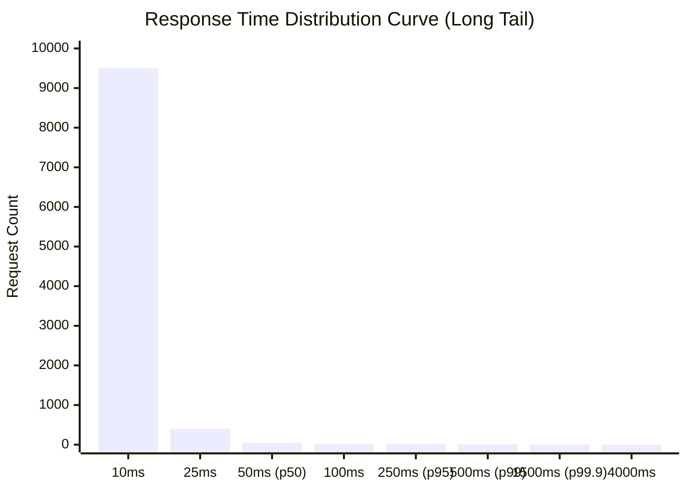
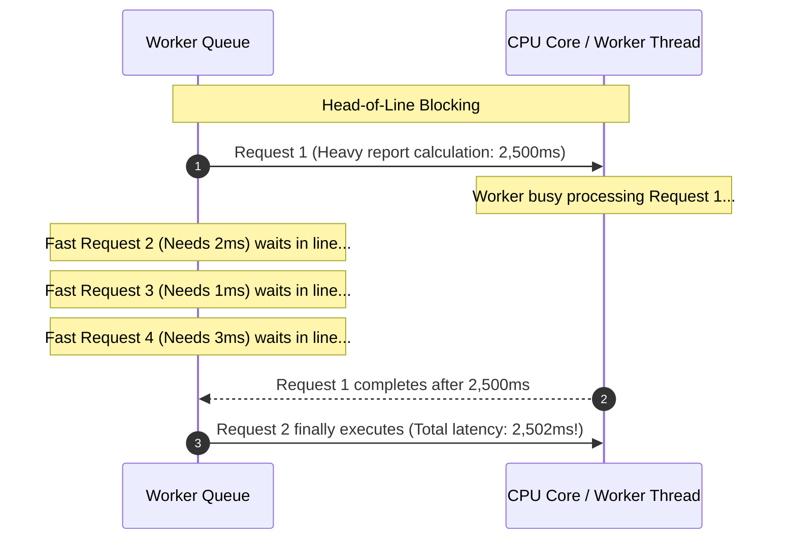

import { Callout } from 'fumadocs-ui/components/callout';
import { Tabs, Tab } from 'fumadocs-ui/components/tabs';
import { Steps, Step } from 'fumadocs-ui/components/steps';
import { Cards, Card } from 'fumadocs-ui/components/card';

At the heart of distributed engineering lies a sobering reality: **hardware will die, software has bugs, humans will misconfigure production, and traffic will surge unexpectedly.**

Martin Kleppmann identifies three fundamental non-functional concerns that anchor all data-intensive architectures:
1. **Reliability:** The system should continue to work correctly (performing the desired function at the desired level of performance) even in the face of adversity (hardware or software faults, and human error).
2. **Scalability:** As the system grows in data volume, traffic volume, or complexity, there should be reasonable ways of dealing with that growth without degrading performance.
3. **Maintainability:** Over time, many different engineers will work on the system (both maintaining current behavior and adapting it to new use cases), and they should all be able to work productively.

```mermaid
flowchart TD
    subgraph Triad["The Non-Functional Core Triad of Data Systems"]
        R["Reliability<br/>'Tolerating Faults Without System Failure'"]
        S["Scalability<br/>'Handling Growth in Volume & Concurrency'"]
        M["Maintainability<br/>'Operability, Simplicity & Evolvability'"]
    end
    
    R <--> S
    S <--> M
    M <--> R

    style Triad fill:#020617,stroke:#38bdf8,stroke-width:2px
    style R fill:#0f172a,stroke:#ef4444,stroke-width:2px
    style S fill:#0f172a,stroke:#38bdf8,stroke-width:2px
    style M fill:#0f172a,stroke:#10b981,stroke-width:2px
```

Let us dissect each pillar from first principles using our global airline and flight platform, **TravelBuddy**.

---

## Pillar 1: Reliability (Faults vs. Failures)

A system is reliable when it continues to deliver correct service even when things go wrong. But in distributed systems, we must distinguish between two critical terms:

<Callout type="warn" title="Fundamental Distinction: Fault vs. Failure">
* **Fault:** One component of the system deviates from its specification (e.g., an SSD controller fails, a memory stick suffers a bit flip, a switch port flaps, or a network link drops packets).
* **Failure:** The system as a *whole* stops providing the required service to its end users.

A system cannot be 100% *fault-free*, because faults are physically inevitable in physical components. Instead, our goal is to design **fault-tolerant (or resilient)** systems: architectures where underlying component faults do not cascade into overall service failures.

```mermaid
flowchart LR
    A["Component Fault<br/>(e.g., Node 3 SSD Corrupts)"] --> B{"Fault-Tolerant<br/>Boundary?"}
    B -- "No Redundancy" --> C["System Failure<br/>(TravelBuddy Outage - 500 Errors)"]
    B -- "Replication & Health Checks" --> D["Normal User Service<br/>(Node 3 isolated, failover to Replica)"]

    style A fill:#450a0a,stroke:#ef4444,stroke-width:2px
    style B fill:#0f172a,stroke:#38bdf8,stroke-width:2px
    style C fill:#7f1d1d,stroke:#ef4444,stroke-width:2px
    style D fill:#064e3b,stroke:#10b981,stroke-width:2px
```

</Callout>

### 1. Hardware Faults

Hardware failures are statistical certainties at scale. In a datacenter with 10,000 hard disks, an average Mean Time Between Failures (MTBF) of 50 years means:

$$\frac{10,000 \text{ drives}}{50 \times 365 \text{ days}} \approx 0.55 \text{ drive failures per day}$$

You must expect a disk crash roughly every other day. Modern cloud datacenters experience:
* Power supply unit (PSU) blowouts.
* RAM bit-flips caused by cosmic rays (ECC memory reduces but does not completely eliminate this).
* Network interface card (NIC) packet corruption.
* Top-of-Rack (ToR) switch power grid failures.

**Mitigation:** Historically, enterprise IT relied on hardware-level redundancy: RAID arrays on disks, dual power supplies, and hot-swappable batteries. However, modern cloud architectures assume nodes are disposable cattle rather than pets. We use **software fault-tolerance techniques**: distributed consensus, multi-replica state machines, and cross-Availability Zone replication.

### 2. Software Errors

Unlike independent hardware faults, software faults are systematic bugs that often correlate across machines:
* A software bug causing a process to crash whenever a specific Unicode sequence is parsed in a passenger's passport name.
* A runaway background thread consuming 100% CPU on all nodes in a cluster simultaneously.
* A cascading failure where one slow database node causes incoming queries to back up, filling thread pools, causing upstream HTTP timeouts, which triggers aggressive automated retries, swamping the remaining database nodes until the entire cluster collapses.
* Corrupted system clocks (NTP leap second bugs) breaking lease timeouts and token validations.

**Mitigation:** Carefully thinking about assumptions, thorough integration testing, process isolation, sandboxing, automated health checks, process supervision (e.g., systemd, Kubernetes container restarts), and circuit breakers (e.g., Netflix Hystrix pattern).

### 3. Human Errors

Studies of large-scale internet operations (including Google, AWS, and Microsoft reports) reveal that **human configuration error is the leading cause of outages (70%–80%)**, while hardware faults account for only 10%–20%.

Engineers inadvertently deploy bad configurations, drop tables in production rather than staging, or invert access control rules.

```mermaid
flowchart TD
    subgraph HumanMitigation["Mitigating Human Faults in TravelBuddy"]
        H1["1. Defensive Abstractions<br/>Make correct actions easy, dangerous actions hard"]
        H2["2. Non-Production Sandboxes<br/>Staging environments with realistic synthetic workloads"]
        H3["3. Automated Testing Suites<br/>Unit, integration, property-based & fuzz testing"]
        H4["4. Fast Rollback & Canary Deploys<br/>Roll out to 1% traffic before full fleet deployment"]
        H5["5. Detailed Observability<br/>Granular telemetry, distributed traces, blameless postmortems"]
    end

    style HumanMitigation fill:#020617,stroke:#38bdf8,stroke-width:2px
```

---

## Pillar 2: Scalability

Scalability is not a one-dimensional boolean flag (*"Is your system scalable?"*). It is a multidimensional capability:

> **If a system grows in a particular way, what are our options for coping with the growth? How do we prevent performance degradation when load parameters increase?**

### Describing Load: Load Parameters

To reason about scale, we must mathematically identify our **load parameters**:
* Requests per second (RPS) to an API.
* Read-to-write ratio of database queries.
* Number of simultaneously active users (DAU/MAU).
* Cache hit rate and cache eviction frequency.
* Graph degree (number of connections per node).

#### The Twitter Scaling Case Study (DDIA Chapter 1)

Martin Kleppmann highlights Twitter's historical architecture transition to illustrate how different load operations interact:
* **Tweet posting:** ~4,600 tweets/sec average (~12,000 tweets/sec peak).
* **Timeline reading:** ~300,000 timeline views/sec.

Two distinct architectural approaches were tried:

```mermaid
flowchart TD
    subgraph Approach1["Approach 1: Relational Join on Read (Fan-out on Read)"]
        direction TB
        Post1["1. User posts tweet"] --> InsertDB["INSERT INTO tweets VALUES (...)"]
        Read1["2. Follower views timeline"] --> JoinDB["SELECT * FROM tweets JOIN follows ...<br/>(Expensive disk joins at 300k RPS)"]
    end

    subgraph Approach2["Approach 2: Materialized In-Memory Inbox (Fan-out on Write)"]
        direction TB
        Post2["1. User posts tweet"] --> LookupF["Look up all followers"]
        LookupF --> PushCache["Insert tweet ID into Redis list<br/>for every follower's home timeline"]
        Read2["2. Follower views timeline"] --> FetchCache["LRANGE user:timeline 0 99<br/>(Blazing fast O(1) Redis read)"]
    end

    style Approach1 fill:#0f172a,stroke:#ef4444,stroke-width:2px
    style Approach2 fill:#0f172a,stroke:#10b981,stroke-width:2px
```

* **Why Approach 1 Failed:** Querying follower relationships and joining across millions of tweets at 300,000 queries per second saturated database disk I/O.
* **Why Approach 2 Solved Timeline Reads:** Reading a user's timeline became a simple $O(1)$ memory lookup (`LRANGE user:timeline 0 49`).
* **The New Bottleneck in Approach 2:** Celebrity accounts! When a celebrity with 40 million followers posts a tweet, that single write causes 40 million write operations into follower timeline caches. If write processing takes 5 seconds, followers see delayed notifications.
* **The Final Hybrid Solution:** Ordinary users use fan-out on write (Approach 2). Celebrity accounts are excluded from the fan-out queue; when a follower loads their feed, the celebrity's tweets are fetched separately and merged dynamically on read!

### The TravelBuddy Case Study: Flight Search vs. Seat Booking

In TravelBuddy, our load parameters exhibit asymmetric read/write characteristics:

```mermaid
flowchart LR
    subgraph SearchPath["Flight Search Traffic (99.2% of Volume)"]
        S1["850,000 searches/sec"] --> S2["Read-heavy, cache-friendly<br/>Stale data acceptable for 30s"]
    end

    subgraph BookingPath["Seat Reservation Traffic (0.8% of Volume)"]
        B1["6,800 bookings/sec"] --> B2["Write-heavy, strict ACID<br/>Zero stale reads allowed (Double-booking disaster)"]
    end

    style SearchPath fill:#0f172a,stroke:#38bdf8,stroke-width:2px
    style BookingPath fill:#0f172a,stroke:#f59e0b,stroke-width:2px
```

* **Search Path:** High volume (850,000 RPS). Can be heavily scaled with distributed read replicas, CDN edge caches, and LSM-tree key-value stores.
* **Booking Path:** Lower volume (6,800 RPS), but subjected to intense **lock contention** during flash sales (e.g., holiday ticket drops for JFK $\rightarrow$ LHR routes). A single flight has only 300 seats. If 50,000 users attempt to reserve seat 12A simultaneously, database row-level locking or optimistic concurrency control becomes the critical serialization bottleneck.

---

## Describing Performance: Latency vs. Response Time

Engineers often use "latency" and "response time" interchangeably, but in precision systems design:

<Callout type="info" title="Latency vs. Response Time">
* **Latency:** The duration that a request is waiting to be handled—the time it is latent (e.g., time waiting in network buffers, OS context switches, or server queues before actual processing starts).
* **Response Time:** What the client actually observes. It includes the network round-trip time, server queue delays, actual service processing time, database queries, and client-side deserialization.
</Callout>

### Why Averages (Means) Lie

Never evaluate system performance using arithmetic mean response times.

Consider 100 requests to TravelBuddy's flight search API:
* 99 requests take **10 ms**.
* 1 request gets caught in a garbage collection pause and takes **5,000 ms**.
* **Arithmetic Mean:** $\frac{(99 \times 10) + 5000}{100} = \frac{990 + 5000}{100} = 59.9\text{ ms}$.

An average of 60 ms masks reality: 99% of your users experienced an instantaneous 10 ms response, but 1% suffered a catastrophic 5-second wait. If you report an average, you will never detect that your worst-case users are churning.

### Percentiles: $p50$, $p95$, $p99$, and $p99.9$

To observe real distributions, we sort all response times from fastest to slowest:

* **Median ($p50$):** Exactly half of the requests were faster than this value, and half were slower. Represents the typical user experience.
* **95th Percentile ($p95$):** 95% of requests were faster than this threshold. 1 in 20 requests was slower.
* **99th Percentile ($p99$):** 99% of requests were faster than this threshold. 1 in 100 requests was slower.
* **99.9th Percentile ($p99.9$ - "Three Nines"):** 1 in 1,000 requests was slower.

### Why Care About the Tail (p99 and p99.9)?

Why spend engineering effort optimizing for the unlucky 1 in 1,000 users?
1. **VIP Bias:** In e-commerce and travel platforms, the customers with the largest shopping carts, most frequent bookings, and highest lifetime value have the largest profiles, most complex itineraries, and make the most requests. The users hitting your 99.9th percentile are often your most valuable customers.
2. **Tail Latency Amplification:** In modern microservice architectures, a single user request fans out to dozens of downstream services.

```mermaid
flowchart TD
    Client["User Browser / App"] --> Gateway["API Gateway"]
    Gateway --> S1["Pricing Service"]
    Gateway --> S2["Seat Inventory Service"]
    Gateway --> S3["Baggage Rules Service"]
    Gateway --> S4["Frequent Flyer Service"]
    Gateway --> S5["Hotel Partner Service"]
    
    style Client fill:#0f172a,stroke:#38bdf8,stroke-width:2px
    style Gateway fill:#0f172a,stroke:#818cf8,stroke-width:2px
```

Suppose a single TravelBuddy booking page requires 100 backend service calls to render all itinerary widgets. Assume each backend service has an independent $p99$ latency of 200 ms (meaning there is a 1% chance a single call is slow).

What is the probability that the overall web page will be delayed by at least one slow backend call?

$$P(\text{at least one slow call}) = 1 - (1 - 0.01)^{100} = 1 - (0.99)^{100} \approx 1 - 0.366 = \mathbf{63.4\%}$$

Even though 99% of individual backend queries are fast, **over 63% of your end-user page loads will experience tail latency delay!**

### Head-of-Line Blocking and Queuing Delays

A server can typically process only a limited number of tasks in parallel (constrained by CPU cores, thread pool size, or database connection limits).

Even if a small request takes only 2 milliseconds of CPU time, if it is queued behind a 2.5-second analytical calculation, its measured response time will be 2.502 seconds. This is **head-of-line blocking**. For this reason, measuring server-side execution time alone is dangerously misleading; you must measure request queuing delay at the edge.

---

## Service Level Metrics: SLI, SLO, SLA & Error Budgets

In production engineering, performance is managed through clear contractual definitions:

<Tabs items={['SLI (Indicator)', 'SLO (Objective)', 'SLA (Agreement)', 'Error Budget']}>
<Tab value="SLI (Indicator)">
### Service Level Indicator (SLI)
A quantifiable metric measuring current operational service performance.

*Examples for TravelBuddy:*
* **Availability SLI:** $\frac{\text{Successful HTTP 2xx/3xx Responses}}{\text{Total Valid HTTP Requests}} \times 100\%$
* **Latency SLI:** Percentage of `/api/v1/flights/search` requests served in $< 200\text{ ms}$ measured at the ingress load balancer over a rolling 30-day window.
</Tab>

<Tab value="SLO (Objective)">
### Service Level Objective (SLO)
An internal target reliability goal agreed upon by engineering and product teams.

*Examples for TravelBuddy:*
* The booking API will return successfully for $\ge 99.95\%$ of requests over any calendar month.
* The 99th percentile ($p99$) latency for flight search queries will be $< 350\text{ ms}$.
</Tab>

<Tab value="SLA (Agreement)">
### Service Level Agreement (SLA)
A formal legal contract with external customers specifying financial penalties (service credits, refunds) if the SLO is breached.

*Example:* If TravelBuddy's Enterprise Travel Management API availability falls below $99.9\%$ in a billing month, corporate clients receive a 15% discount on their SaaS platform subscription.
</Tab>

<Tab value="Error Budget">
### Error Budget
The inverse of the SLO. If your availability SLO is $99.9\%$, your error budget is $0.1\%$.

$$\text{Error Budget} = 100\% - 99.9\% = 0.1\% \text{ allowable downtime or failure}$$

In a 30-day month (43,200 minutes), an error budget of $0.1\%$ permits exactly **43.2 minutes of total outage**.
</Tab>
</Tabs>

### The Error Budget Policy

When an engineering team has plenty of remaining error budget, they are permitted to ship risky new features, perform chaos experiments, and refactor code rapidly.

However, if a flash sale surge or bad release burns through **80% of the monthly error budget in week one**, the Error Budget Policy freezes all feature releases. All engineering resources pivot exclusively to reliability improvements, test automation, and infrastructure resilience until the budget recovers.

---

## Pillar 3: Maintainability

The majority of software cost is not spent during initial development, but during ongoing maintenance: fixing bugs, keeping systems running, investigating failures, modifying code for new platforms, and paying down technical debt.

DDIA identifies three core design principles for maintainability:

```mermaid
flowchart TD
    subgraph Maintainability["The Three Pillars of Maintainability"]
        direction TB
        O["1. Operability<br/>Make it easy for operations teams to keep the system running smoothly."]
        S["2. Simplicity<br/>Eliminate accidental complexity so new engineers understand the system quickly."]
        E["3. Evolvability (Extensibility)<br/>Make it easy to modify the system for unanticipated requirements."]
    end

    style Maintainability fill:#020617,stroke:#10b981,stroke-width:2px
    style O fill:#0f172a,stroke:#38bdf8,stroke-width:1px
    style S fill:#0f172a,stroke:#f59e0b,stroke-width:1px
    style E fill:#0f172a,stroke:#ec4899,stroke-width:1px
```

### 1. Operability: Empowering Operations
Good software makes operators' lives easier:
* Provides visibility into system health via standardized metrics (Prometheus, OpenTelemetry).
* Emits structured JSON logs with correlation IDs (`trace_id`, `span_id`).
* Provides safe defaults and enables runtime configuration overrides without restarting processes.
* Self-heals when individual nodes crash, and provides clear runbooks when human intervention is needed.

### 2. Simplicity: Taming Accidental Complexity
Frederick Brooks distinguished between two forms of complexity:
* **Essential Complexity:** The inherent difficulty of the problem itself (e.g., flight reservation business rules, currency exchange, time zones).
* **Accidental Complexity:** Complexity introduced entirely by our implementation choices (e.g., using 5 different message brokers, inconsistent data formats, manual concurrency locks when an actor framework would suffice).

One of the greatest tools for removing accidental complexity is **clean abstraction**. A great abstraction hides vast implementation details behind an intuitive interface:
* SQL abstracts physical disk b-tree traversals and index scans.
* TCP abstracts packet loss, retransmission, and byte reordering behind an orderly stream.

### 3. Evolvability: Embracing Continuous Change
Requirements change constantly:
* TravelBuddy expands from flights into train journeys and hotel bundles.
* Regulatory compliance (e.g., GDPR right-to-be-forgotten) requires deleting passenger records across 14 databases.
* New mobile clients demand GraphQL instead of legacy REST endpoints.

A system is evolvable when its components are loosely coupled, its schemas can evolve without breaking old clients (as we will explore in Chapter 4), and its test coverage allows engineers to refactor boldly.

---

## TravelBuddy Production Blueprint: Latency & Reliability Architecture

Here is how TravelBuddy defines its production SLOs and service boundaries:

```mermaid
flowchart LR
    Ingress["Edge Gateway<br/>Envoy Proxy"] --> Auth["Auth Service<br/>p99 < 20ms"]
    Ingress --> Search["Search Engine<br/>p99 < 150ms<br/>Cache hit: 85%"]
    Ingress --> Booking["Booking Service<br/>p99 < 250ms<br/>Strict ACID TX"]
    
    Booking --> PG[("Postgres Cluster<br/>Multi-AZ Sync")]
    Search --> LSM[("RocksDB Index<br/>SSD Read Replicas")]

    style Ingress fill:#0f172a,stroke:#38bdf8,stroke-width:2px
    style Auth fill:#0f172a,stroke:#818cf8,stroke-width:1px
    style Search fill:#0f172a,stroke:#34d399,stroke-width:1px
    style Booking fill:#0f172a,stroke:#f59e0b,stroke-width:1px
    style PG fill:#020617,stroke:#f59e0b,stroke-width:1px
    style LSM fill:#020617,stroke:#34d399,stroke-width:1px
```

| Service | Availability SLO | Latency SLI ($p50$) | Latency SLI ($p99$) | Error Budget (30d) | Primary Failure Domain |
| :--- | :--- | :--- | :--- | :--- | :--- |
| **Flight Search** | $99.9\%$ (Three 9s) | $45\text{ ms}$ | $180\text{ ms}$ | $43.2\text{ min}$ | Cache eviction stampedes |
| **Seat Booking** | $99.99\%$ (Four 9s) | $80\text{ ms}$ | $280\text{ ms}$ | $4.32\text{ min}$ | Database lock contention |
| **Passenger Profile**| $99.95\%$ | $15\text{ ms}$ | $75\text{ ms}$ | $21.6\text{ min}$ | Network cross-region latency |
| **Payment Ingestion**| $99.999\%$ (Five 9s)| $120\text{ ms}$ | $450\text{ ms}$ | $25.9\text{ sec}$ | Third-party payment gateway timeouts |

---

## Key Takeaways & Review Checklist

<Cards>
<Card title="Faults vs Failures" icon="ShieldCheck">
A fault is an isolated component deviation; a failure is total system degradation. Build systems that tolerate component faults through automated failovers and isolation boundaries.
</Card>
<Card title="Tail Latency & Fan-out" icon="Activity">
Arithmetic means hide bad customer experiences. Monitor $p95$, $p99$, and $p99.9$. In fan-out microservice architectures, tail latency compounds exponentially across dependencies.
</Card>
<Card title="SLI / SLO / Error Budgets" icon="Sliders">
Use SLIs to measure reality, SLOs to set internal targets, and Error Budgets to balance feature development velocity against system reliability.
</Card>
<Card title="The Three Maintainability Virtues" icon="Wrench">
Design for operability (observability & health checks), simplicity (clean abstractions that eliminate accidental complexity), and evolvability (loosely coupled components).
</Card>
</Cards>
