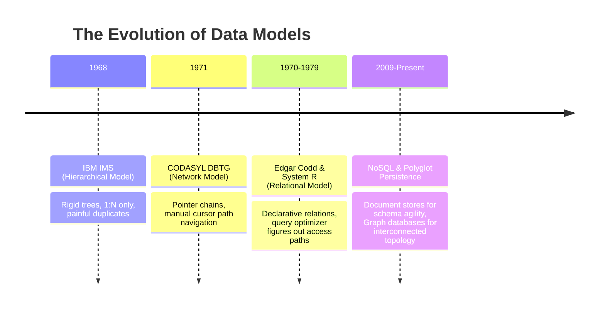
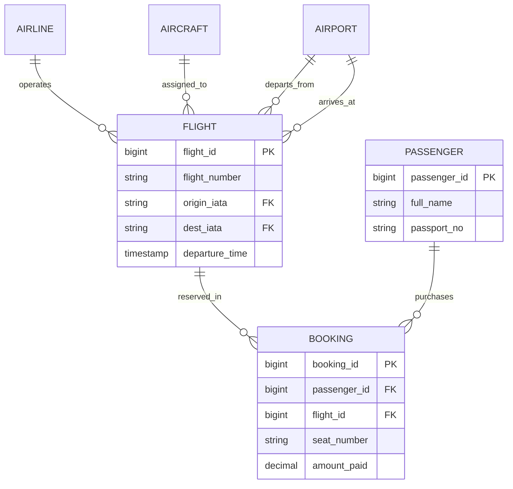

import { Callout } from 'fumadocs-ui/components/callout';
import { Tabs, Tab } from 'fumadocs-ui/components/tabs';
import { Steps, Step } from 'fumadocs-ui/components/steps';
import { Cards, Card } from 'fumadocs-ui/components/card';

Data models are perhaps the most important part of developing software. They shape not only how software is written, but **how we think about the problem we are solving**.

Most applications are built by layering data models on top of each other:
1. As an application developer, you model real-world concepts (passengers, flight itineraries, aircraft seats) in terms of **objects, domain classes, and data structures**.
2. When persisting those structures, you store them as **relational tables, JSON documents, or graph vertices and edges**.
3. The database engine represents those tables or documents as **bytes in memory, on-disk pages, or append-only log segments**.
4. Hardware engineers represent those bytes as **electrical charges, magnetic polarities, or optical laser pulses**.

In this chapter, we explore the layer where software engineering meets data infrastructure: **Relational vs. Document vs. Graph models**, and their respective query languages.

```mermaid
flowchart TD
    subgraph DataModels["The Tripartite Spectrum of Data Models"]
        R["Relational Model (PostgreSQL, MySQL)<br/>Tabular Relations, Foreign Keys, ACID Joins<br/>Best for: High Many-to-Many & Strict Transactions"]
        D["Document Model (MongoDB, Couchbase)<br/>Hierarchical JSON Trees, Locality of Reference<br/>Best for: One-to-Many Self-Contained Trees"]
        G["Graph Model (Neo4j, AWS Neptune)<br/>Index-Free Adjacency, Vertices & Relationships<br/>Best for: Arbitrary Interconnected Networks"]
    end

    style DataModels fill:#020617,stroke:#38bdf8,stroke-width:2px
    style R fill:#0f172a,stroke:#38bdf8,stroke-width:1px
    style D fill:#0f172a,stroke:#10b981,stroke-width:1px
    style G fill:#0f172a,stroke:#ec4899,stroke-width:1px
```



---

## The Historical Battle: Hierarchical, Network & Relational

To understand why modern databases look the way they do, we must revisit the fundamental debate of the 1970s.



### 1. The Hierarchical Model (IBM IMS, 1968)
IBM's Information Management System represented data as a tree of records nested inside records (much like modern JSON).
* **The Fatal Flaw:** It worked brilliantly for one-to-many ($1:N$) relationships, but handling many-to-many ($N:M$) relationships was a nightmare. To associate a passenger with multiple flights, you either had to duplicate passenger records across trees or manually resolve pointer references.

### 2. The Network Model (CODASYL, 1971)
The Conference on Data Systems Languages generalized the hierarchical tree into a network: a record could have multiple parents.
* **The Fatal Flaw (The Access Path Problem):** Relationships were represented as physical linked-list pointer chains on disk. To query data, an engineer had to write procedural code that manually navigated through the pointers:
  ```cobol
  MOVE FIRST flight RECORD OF airport-flight-set.
  WHILE NOT END-OF-SET
      FIND NEXT passenger-record WITHIN flight-passenger-set
      GET passenger-record.
  ```
* **Currency Indicators & Fragility:** In CODASYL, the runtime tracked a "cursor" known as a **currency indicator** indicating the application's current position in the record set. If a concurrent query shifted the currency indicator, or if a DBA reordered records on disk or dropped an access path index, **all existing application traversal logic broke immediately**. Applications were deeply coupled to the physical layout of disk blocks.

### 3. Codd's Relational Breakthrough (1970)
Edgar Codd proposed a radical abstraction:
* Data is simply a collection of **relations** (tables), where each relation is an unordered set of **tuples** (rows).
* There are no visible physical pointers. Relationships are logical foreign keys matched at query time.
* The application issues a **declarative query**, and the **Query Optimizer** automatically figures out whether to use a B-tree index, a hash join, or a sequential scan.

---

## The Object-Relational Impedance Mismatch

Modern applications are written in object-oriented languages (TypeScript, Java, Python, Go). Data is held in nested class instances, maps, and typed objects.

However, relational databases store data in flat, two-dimensional tables. Translating between memory objects and relational tables requires an awkward translation layer called **Object-Relational Mapping (ORM)**:

```mermaid
flowchart LR
    subgraph AppMemory["Application Object (In-Memory)"]
        Obj["Passenger Object<br/>- id: 9812<br/>- name: 'Alice Chen'<br/>- past_flights: [FL-101, FL-402]<br/>- preferences: {seat: 'Aisle', meal: 'Vegan'}"]
    end

    subgraph RelationalDB["Relational Schema (Normalized)"]
        T1["passengers (id, name)"]
        T2["passenger_preferences (passenger_id, seat, meal)"]
        T3["passenger_flight_history (passenger_id, flight_id, date)"]
    end

    Obj <== "ORM Translation Layer<br/>(Impedance Mismatch)" ==> RelationalDB

    style AppMemory fill:#0f172a,stroke:#38bdf8,stroke-width:2px
    style RelationalDB fill:#0f172a,stroke:#f59e0b,stroke-width:2px
```



This impedance mismatch leads to notorious performance traps:
1. **The $N+1$ Query Problem:** Fetching 100 passengers triggers 1 query to get the passengers, followed by 100 separate queries to fetch each passenger's preference row.
2. **Loss of Hierarchy:** Storing a single structured passenger resume or itinerary requires shredding it into 5 normalized relational tables connected by foreign keys.

---

## Document Model vs. Relational Model

The resurgence of the document model (MongoDB, CouchDB, DynamoDB) was driven by two practical promises:
1. **Schema flexibility (Schema-on-Read):** Storing nested, evolving JSON objects without executing heavy `ALTER TABLE` DDL migrations.
2. **Storage Locality:** A user's profile and preferences can be fetched in a single sequential disk read rather than 4 relational joins.

### One-to-Many Relationships: Document Locality Wins

In TravelBuddy, consider a hotel review record:
```json
{
  "_id": "rev_77192",
  "hotel_id": "hotel_grand_hyatt_sfo",
  "reviewer": {
    "user_id": "usr_402",
    "name": "Sarah Connor",
    "tier": "Platinum"
  },
  "rating": 5,
  "comment": "Exceptional airport shuttle and quiet rooms.",
  "photos": [
    {"url": "https://cdn.travelbuddy.com/p1.jpg", "caption": "Lobby"},
    {"url": "https://cdn.travelbuddy.com/p2.jpg", "caption": "Suite"}
  ],
  "created_at": "2026-03-15T09:30:00Z"
}
```

If reviews are almost always displayed in their entirety on the hotel detail page, storing them as a single document offers exceptional **locality of reference**: the database reads one contiguous disk block and returns the complete JSON payload directly to the frontend.

### Many-to-Many Relationships: Relational Wins

However, what happens when relationships are not isolated trees?

Consider TravelBuddy's flight booking system:
* A passenger books a flight.
* The flight belongs to an airline.
* The flight connects an origin airport and a destination airport.
* Each airport is in a city, which is in a country, with specific customs rules.
* Multiple passengers share the flight; multiple flights share the aircraft.



If you store this inside a Document store:
* If you embed the flight information inside the booking document, and the flight departure time changes, you must update thousands of individual passenger booking documents.
* If you instead store references (foreign keys) inside document IDs, your application code must perform manual client-side joins, shifting database query optimizer responsibilities back to the developer—recreating the exact failure of the 1970s CODASYL network model!

<Callout type="info" title="The Rule of Thumb for Relational vs. Document">
* If your data consists of **self-contained document trees** where relationships between documents are rare ($1:N$ hierarchy), the **Document model** is clean and performant.
* If your data features **many-to-many relationships ($N:M$)**, interconnected entities, and requires transactional cross-entity consistency, the **Relational model** with foreign keys and ACID joins is mathematically superior.
</Callout>

### Practitioner Case Study: The LinkedIn Profile Dilemma

Consider modeling a user profile (such as LinkedIn or TravelBuddy's verified pilot profile):
* A user has an ID, full name, headline, and profile picture.
* A user has multiple **positions** (employment history), each with a company name, title, start date, and end date.
* A user has multiple **education entries** (university, degree, graduation year).
* A user has endorsements and recommendations from other users ($N:M$).

```mermaid
flowchart TD
    subgraph ProfileModelingOptions["Architectural Spectrum: Modeling Profiles"]
        Opt1["1. Fully Normalized Relational Tables<br/>users, positions, education, companies<br/>Pros: Referential integrity, no data duplication<br/>Cons: Heavy joins on every profile load"]
        Opt2["2. Document Model (e.g. MongoDB)<br/>Single self-contained JSON document per user<br/>Pros: Fetch profile in 1 read query<br/>Cons: Changing company name requires batch updating millions of documents"]
        Opt3["3. Hybrid Relational + Native JSONB (PostgreSQL/MySQL)<br/>Relational primary keys + JSONB column for custom fields<br/>Pros: ACID guarantees for core entities, flexibility for unstructured metadata"]
    end

    style ProfileModelingOptions fill:#020617,stroke:#38bdf8,stroke-width:2px
    style Opt1 fill:#0f172a,stroke:#38bdf8,stroke-width:1px
    style Opt2 fill:#0f172a,stroke:#10b981,stroke-width:1px
    style Opt3 fill:#0f172a,stroke:#f59e0b,stroke-width:1px
```



1. **Fully Normalized:** If `company` is a normalized table with an ID, renaming a company ("Facebook" $\to$ "Meta") is an instant $O(1)$ single-row update. However, rendering a user's resume requires joins across 5 tables.
2. **Pure Document:** In a document store, positions are embedded. But if a user enters a plain string `"Google"` while another enters `"Google Inc."`, search queries for Google employees suffer from data fragmentation. Furthermore, if the company entity has a logo, updates require updating every user's document.
3. **The Hybrid Solution (Native JSON/JSONB):** Modern relational databases (PostgreSQL `JSONB`, MySQL `JSON`) eliminate this false dichotomy. Relational tables handle core identity and foreign keys, while semi-structured attributes (custom tags, user preferences) live in indexed JSON columns without needing schema migrations for every new UI field.

---

## Schema-on-Read vs. Schema-on-Write

The debate between NoSQL and relational is often mischaracterized as *"schemaless vs schema"*. In reality, there is no such thing as schemaless software; code that reads data always assumes a schema!

The true difference is **when that schema is enforced**:

```mermaid
flowchart TD
    subgraph SchemaOnWrite["Schema-on-Write (Relational)"]
        direction TB
        W1["Application Writes Row"] --> E1{"Database validates schema<br/>against DDL table definitions"}
        E1 -- "Invalid Types or Missing Column" --> Fail["REJECT WRITE (Error)"]
        E1 -- "Valid" --> OK1["Commit row to disk"]
        R1["Application Reads Row"] --> Parse1["Guaranteed consistent structure"]
    end

    subgraph SchemaOnRead["Schema-on-Read (Document)"]
        direction TB
        W2["Application Writes JSON"] --> OK2["Database stores raw bytes directly<br/>(No schema checks)"]
        R2["Application Reads JSON"] --> Parse2{"Client code checks fields:<br/>if ('seat' in doc) ..."}
        Parse2 -- "Legacy schema variant" --> HandleLegacy["Handle backward compatibility in code"]
    end

    style SchemaOnWrite fill:#0f172a,stroke:#38bdf8,stroke-width:2px
    style SchemaOnRead fill:#0f172a,stroke:#10b981,stroke-width:2px
```



* **Schema-on-write:** Comparable to static, compile-time type checking in languages like Rust or TypeScript. The database guarantees that all rows conform to rigid column definitions.
* **Schema-on-read:** Comparable to dynamic, runtime type checking in languages like Python or JavaScript. The database stores arbitrary fields; the application is responsible for decoding and interpreting the payload.

### Handling Schema Migrations in Production

When TravelBuddy decides to split a passenger's `name` string into `first_name` and `last_name`:

* **In a Schema-on-read database:** Old records remain unchanged. The application simply handles both forms:
  ```typescript
  const firstName = doc.first_name ?? doc.name?.split(' ')[0] ?? 'Unknown';
  ```
* **In a Schema-on-write database:** You run a database migration:
  ```sql
  ALTER TABLE passengers ADD COLUMN first_name VARCHAR(100), ADD COLUMN last_name VARCHAR(100);
  UPDATE passengers SET first_name = split_part(name, ' ', 1), last_name = split_part(name, ' ', 2);
  ```
  On large tables with 500 million rows, running a blocking `UPDATE` can lock tables and cause severe downtime unless executed using zero-downtime online schema migration tools (e.g., GitHub's `gh-ost` or PlanetScale's Vitess).

---

## Declarative vs. Imperative Query Languages

One of Codd's greatest gifts to computing was the **declarative query language (SQL)**.

<Tabs items={['Declarative (SQL)', 'Imperative (Code)']}>
<Tab value="Declarative (SQL)">
```sql
-- Declarative: Tell the database WHAT you want, not HOW to retrieve it
SELECT 
    f.flight_number, 
    f.origin_iata, 
    f.dest_iata, 
    COUNT(b.booking_id) AS total_passengers
FROM flights f
JOIN bookings b ON f.flight_id = b.flight_id
WHERE f.departure_time >= '2026-06-01' 
  AND f.origin_iata = 'SFO'
GROUP BY f.flight_number, f.origin_iata, f.dest_iata
HAVING COUNT(b.booking_id) > 200;
```
* The query specifies the desired data shape, filtering conditions, and grouping.
* The query optimizer is free to:
  * Pick an index scan on `(origin_iata, departure_time)`.
  * Choose between Hash Join, Merge Join, or Nested Loop Join.
  * Execute joins across multiple CPU cores in parallel.
</Tab>

<Tab value="Imperative (Code)">
```typescript
// Imperative: Tell the computer the exact procedural instructions
function getBusySFOFlights(flights: Flight[], bookings: Booking[]) {
  const result = [];
  for (const f of flights) {
    if (f.origin_iata === 'SFO' && f.departure_time >= '2026-06-01') {
      let count = 0;
      for (const b of bookings) {
        if (b.flight_id === f.flight_id) {
          count++;
        }
      }
      if (count > 200) {
        result.push({
          flight_number: f.flight_number,
          origin: f.origin_iata,
          dest: f.dest_iata,
          total_passengers: count
        });
      }
    }
  }
  return result;
}
```
* Specifies step-by-step loops.
* Rigidly locks execution order. A nested loop over millions of records is $O(N \times M)$ and cannot be automatically parallelized or indexed by the language runtime.
</Tab>
</Tabs>

<Callout type="info" title="The CSS Analogy from DDIA">
Think of web styling. In CSS, you write declarative rules:
```css
li.active > a { color: #38bdf8; font-weight: bold; }
```
You do not imperatively write:
```javascript
for (const el of document.getElementsByTagName('li')) {
  if (el.classList.contains('active')) {
    for (const child of el.children) {
      if (child.tagName === 'A') {
        child.style.color = '#38bdf8';
      }
    }
  }
}
```
Declarative specifications allow the browser engine to optimize rendering, repaint only dirty nodes, and apply GPU accelerations without application changes.
</Callout>

---

## Graph-Like Data Models

When relationships in your domain become the primary entity, neither relational tables nor document trees suffice.

Consider TravelBuddy's flight routing engine:
* Finding connecting flights between **San Francisco (SFO)** and **Cape Town (CPT)** with a maximum of 2 layovers.
* Accounting for partner airline alliances, minimum connection layover times (at least 60 minutes, at most 240 minutes), and visa transit requirements.


### The Relational Nightmare: Recursive Joins

Querying arbitrary-length paths in SQL requires recursive Common Table Expressions (CTEs):
```sql
WITH RECURSIVE flight_paths AS (
    SELECT origin_iata, dest_iata, 1 AS hops, ARRAY[origin_iata, dest_iata] AS path, price
    FROM flights
    WHERE origin_iata = 'SFO'
  UNION ALL
    SELECT fp.origin_iata, f.dest_iata, fp.hops + 1, path || f.dest_iata, fp.price + f.price
    FROM flight_paths fp
    JOIN flights f ON fp.dest_iata = f.origin_iata
    WHERE fp.hops < 3 AND NOT f.dest_iata = ANY(fp.path)
)
SELECT * FROM flight_paths WHERE dest_iata = 'CPT' ORDER BY price ASC;
```

As the number of hops increases, the relational engine must repeatedly join the full `flights` table against itself, scanning indexes for each level. The query quickly degenerates into exponential latency.

### The Property Graph Model (Neo4j)

In a **Property Graph**, the data consists of:
1. **Vertices (Nodes):**
   * A unique identifier.
   * A set of outgoing edges and incoming edges.
   * A collection of key-value properties.
2. **Edges (Relationships):**
   * A unique identifier.
   * The vertex where the edge starts (tail node).
   * The vertex where the edge ends (head node).
   * A label describing the relationship type.
   * A collection of key-value properties.

#### Index-Free Adjacency: The Secret Sauce of Graphs

Why are graph databases so fast at traversal compared to relational joins?

<Callout type="warn" title="Index-Free Adjacency">
In a relational database, to find rows connected to ID `42`, the engine must search an index (a B-tree lookup of $O(\log N)$).

In a graph database using **index-free adjacency**, each vertex directly holds physical pointers in memory/disk to its adjacent edges. Traversing an edge is a raw pointer dereference: **$O(1)$ constant time**!

The speed of finding a connecting flight depends only on the number of outgoing flights from that specific airport, **not on the total number of flights stored globally in the database**.
</Callout>

### Declarative Graph Queries: Cypher

Neo4j's Cypher is an expressive declarative query language that visually mirrors ASCII-art graph connections:

```cypher
// Find all routes from SFO to CPT with at most 2 stops
MATCH path = (origin:Airport {iata: 'SFO'})-[:FLIGHT_ROUTE*1..3]->(dest:Airport {iata: 'CPT'})
WHERE ALL(r IN relationships(path) WHERE r.available_seats > 0)
RETURN 
    [n IN nodes(path) | n.iata] AS route,
    reduce(totalCost = 0, r IN relationships(path) | totalCost + r.price) AS total_price,
    reduce(totalHours = 0, r IN relationships(path) | totalHours + r.duration_hours) AS duration
ORDER BY total_price ASC
LIMIT 5;
```

Notice the readability: `(origin)-[:FLIGHT_ROUTE*1..3]->(dest)` expresses a variable-length path traversal between 1 and 3 hops in a single intuitive line.

---

### Triple-Stores, RDF, and SPARQL

While Property Graphs dominate operational web architectures, the **Triple-Store model** is the foundation of the Semantic Web and open-data ontologies.

In a triple-store, all information is decomposed into atomic statements comprising three elements:
$$\textbf{(Subject, Predicate, Object)}$$

For example, in the triple `(Flight101, operatesFrom, JFK)`:
* **Subject:** An entity vertex in the graph (`Flight101`).
* **Predicate:** An edge connecting the entities (`operatesFrom`).
* **Object:** Either another entity vertex (`JFK`) or a primitive value / literal (such as `"14:30 EST"` or `350.00`).

```mermaid
flowchart LR
    S["Subject: Flight 101"] -- "Predicate: departsFrom" --> O1["Object: Airport JFK"]
    S -- "Predicate: destination" --> O2["Object: Airport LHR"]
    S -- "Predicate: baseFareUSD" --> O3["Literal: 549.00"]

    style S fill:#0f172a,stroke:#38bdf8,stroke-width:2px
    style O1 fill:#0f172a,stroke:#10b981,stroke-width:1px
    style O2 fill:#0f172a,stroke:#10b981,stroke-width:1px
    style O3 fill:#0f172a,stroke:#f59e0b,stroke-width:1px
```



#### The Turtle Syntax Format

RDF triples can be expressed in **Turtle (Terse RDF Triple Language)**, a human-readable format:

```turtle
@prefix : <urn:travelbuddy:>.

_:flight101 :type :Flight ;
            :airline "British Airways" ;
            :origin :airport_jfk ;
            :destination :airport_lhr ;
            :fare 550.00 .

:airport_jfk :type :Airport ; :iata "JFK" ; :city "New York" .
:airport_lhr :type :Airport ; :iata "LHR" ; :city "London" .
```

#### The SPARQL Query Language

**SPARQL (SPARQL Protocol and RDF Query Language)** is the declarative query standard for RDF triple-stores. SPARQL queries match sets of triple patterns against the graph:

```sparql
PREFIX : <urn:travelbuddy:>

# Find all one-stop connecting routes from JFK to Tokyo (HND)
SELECT ?flight1 ?layover ?flight2 WHERE {
    ?f1 :type :Flight ;
        :origin :airport_jfk ;
        :destination ?layover .

    ?f2 :type :Flight ;
        :origin ?layover ;
        :destination :airport_hnd .
}
```

Notice the power of the `?` prefix: variables are bound declaratively across triple patterns. The SPARQL engine finds all subgraphs that satisfy every clause in the pattern.

---

### Datalog: Declarative Rules & Recursive Logic

**Datalog** is a foundational declarative query language derived from Prolog. It serves as the query language for deductive databases (such as Datomic) and modern static program analysis engines.

In Datalog, data is represented as relational **facts**, and queries are expressed as logical **rules**:

```prolog
% Base Facts: (origin, destination, airline)
flight("SFO", "JFK", "Delta").
flight("JFK", "LHR", "BritishAirways").
flight("LHR", "HND", "JapanAirlines").

% Rule 1: A direct flight means the airport is reachable in 1 hop
can_reach(Origin, Dest) :- flight(Origin, Dest, _).

% Rule 2: Transitive / Recursive reachable rule
can_reach(Origin, Dest) :- flight(Origin, Intermediate, _), can_reach(Intermediate, Dest).
```

* The rule `can_reach(Origin, Dest) :- ...` reads: *"Origin can reach Dest **if** the conditions on the right side hold true"*.
* Unlike standard SQL, which requires recursive Common Table Expressions (`WITH RECURSIVE`), Datalog natively represents complex recursive graph relationships and rules with mathematical conciseness. The query engine automatically computes the fixed-point closure without risk of infinite loops (guaranteed by stratification).

---

## Polyglot Persistence: TravelBuddy's Unified Strategy

No single data model is ideal for every workload. Modern distributed architectures employ **Polyglot Persistence**: using the right storage tool for each distinct domain workload.

```mermaid
flowchart TD
    subgraph TravelBuddyPlatform["TravelBuddy Polyglot Architecture"]
        direction TB
        
        API["TravelBuddy Gateway"]
        
        subgraph Relational["1. PostgreSQL (Relational)"]
            PG["Seat Bookings, Ticketing & Payments<br/>• Strict ACID transactions<br/>• Foreign key referential integrity<br/>• Schema-on-write prevents corrupted state"]
        end

        subgraph Document["2. MongoDB (Document)"]
            MG["Hotel Reviews & Room Catalog<br/>• Hierarchical JSON documents<br/>• Rich locality of reference<br/>• Schema-on-read accommodates varying hotel amenities"]
        end

        subgraph Graph["3. Neo4j (Property Graph)"]
            N4["Flight Connections & Alliances<br/>• Index-free adjacency<br/>• Variable-length pathfinding (Cypher)<br/>• Fast layover and route optimization"]
        end

        API --> Relational
        API --> Document
        API --> Graph
    end

    style TravelBuddyPlatform fill:#020617,stroke:#38bdf8,stroke-width:2px
    style Relational fill:#0f172a,stroke:#38bdf8,stroke-width:1px
    style Document fill:#0f172a,stroke:#10b981,stroke-width:1px
    style Graph fill:#0f172a,stroke:#ec4899,stroke-width:1px
```



---

## Key Takeaways & Review Checklist

<Cards>
<Card title="Impedance Mismatch" icon="Layers">
Object-relational mapping tries to bridge in-memory objects and tabular relations, but can lead to leaky abstractions like the $N+1$ query problem.
</Card>
<Card title="Document vs Relational" icon="FileText">
Document stores provide locality for 1:N self-contained hierarchical trees. Relational stores excel when data exhibits complex many-to-many ($N:M$) connections.
</Card>
<Card title="Schema Enactment" icon="CheckCircle">
Schema-on-write guarantees strict data integrity at commit time. Schema-on-read shifts schema decoding and migration complexity into application code.
</Card>
<Card title="Index-Free Adjacency" icon="Share2">
Graph engines traverse relationships in $O(1)$ constant time per hop via direct pointers, unlocking recursive path queries that cripple relational join engines.
</Card>
</Cards>
