import { Callout } from 'fumadocs-ui/components/callout';
import { Tabs, Tab } from 'fumadocs-ui/components/tabs';
import { Steps, Step } from 'fumadocs-ui/components/steps';
import { Cards, Card } from 'fumadocs-ui/components/card';

At the base of every database lies a **storage engine**: the software library responsible for organizing bytes on physical storage media (DRAM, NVMe SSDs, spinning platters) and retrieving them efficiently.

There is no universally optimal storage engine. An engine engineered for extreme write throughput (e.g., ingesting billions of flight sensor metrics) operates under fundamentally different physics than an engine engineered for transactional row updates (e.g., reserving an airplane seat).

In this chapter, we build from the simplest possible storage engine up to **LSM-Trees**, **B-Trees**, and **OLAP Columnar storage**.

---

## The World's Simplest Database: The Power of Append-Only

In *Designing Data-Intensive Applications*, Martin Kleppmann introduces the world's simplest database implemented as two Bash functions:

```bash
#!/bin/bash
db_set () {
    echo "$1,$2" >> database.db
}

db_get () {
    grep "^$1," database.db | sed -e "s/^$1,//" | tail -n 1
}
```

Let's test it:
```bash
$ db_set "FL-101" '{"origin":"SFO","dest":"JFK","status":"ON_TIME"}'
$ db_set "FL-101" '{"origin":"SFO","dest":"JFK","status":"DELAYED_30M"}'
$ db_get "FL-101"
# Output: {"origin":"SFO","dest":"JFK","status":"DELAYED_30M"}
```

### The Fundamental Index Trade-Off

Look at the algorithmic complexity of this two-line engine:
* **`db_set` (Write):** Appends to the end of a file. This is **$O(1)$ constant time**. Append-only writes achieve the maximum sequential write throughput physical storage hardware can deliver.
* **`db_get` (Read):** Scans the entire file from start to finish looking for matching lines. This is **$O(N)$ linear time**. If TravelBuddy has 100 million flight events, every read scans hundreds of megabytes of raw text.

To make reads fast, we must introduce an **Index**: an auxiliary data structure derived from the primary data.

<Callout type="warn" title="The Universal Law of Storage Indexes">
Any index speeds up reads ($O(N) \rightarrow O(\log N)$ or $O(1)$), but **inevitably slows down writes**. Every write must now update not only the raw data on disk, but also each index data structure.
</Callout>

---

## 1. Hash Indexes & Bitcask: The In-Memory Offset Map

How can we give our append-only log instant $O(1)$ lookups?

This is the design of **Bitcask** (the default storage engine in Riak):
1. Keep the data file on disk as an append-only sequential log.
2. Maintain an **in-memory hash map** storing every key and its exact **byte offset** in the data file.

```mermaid
flowchart LR
    subgraph RAM["In-Memory RAM Hash Map"]
        K1["'FL-101' -> Offset: 0, Size: 64B"]
        K2["'FL-204' -> Offset: 64, Size: 58B"]
        K3["'FL-101' -> Offset: 122, Size: 68B (Updated)"]
    end

    subgraph Disk["Append-Only Data File on Disk"]
        D1["[Byte 0..63]: FL-101=ON_TIME"]
        D2["[Byte 64..121]: FL-204=BOARDING"]
        D3["[Byte 122..189]: FL-101=DELAYED_30M"]
    end

    K3 -. "Direct OS lseek() & read()" .-> D3

    style RAM fill:#0f172a,stroke:#38bdf8,stroke-width:2px
    style Disk fill:#020617,stroke:#10b981,stroke-width:2px
```

* **Read Path:** Look up key in RAM hash table $\rightarrow$ get byte offset $\rightarrow$ perform a single random disk read (`lseek` and read bytes) $\rightarrow$ return value. Fast $O(1)$!
* **Write Path:** Append new record to file on disk $\rightarrow$ update memory hash table with new offset. Fast $O(1)$!

### Compaction and Segment Merging

If we keep appending updates and deletes, the disk file will eventually run out of space.

Bitcask solves this by breaking the log into **segments** of fixed size (e.g., 64 MB). When a segment reaches capacity, it is frozen and made read-only, and a new active segment is created. A background thread runs **Compaction**: it parses old segments, discards overwritten duplicate keys, and keeps only the latest value for each key:

```mermaid
flowchart TD
    subgraph OldSegments["Old Segments with Overwrites"]
        S1["Segment 1<br/>FL-101: ON_TIME<br/>FL-204: SCHEDULED<br/>FL-101: DELAYED"]
        S2["Segment 2<br/>FL-305: ON_TIME<br/>FL-101: CANCELLED<br/>FL-204: DEPARTED"]
    end

    subgraph Compacted["Compacted Merged Segment"]
        M1["Segment Merged<br/>FL-101: CANCELLED<br/>FL-204: DEPARTED<br/>FL-305: ON_TIME"]
    end

    OldSegments -- "Background Merge & Compact" --> Compacted

    style OldSegments fill:#0f172a,stroke:#ef4444,stroke-width:2px
    style Compacted fill:#064e3b,stroke:#10b981,stroke-width:2px
```

### The Fatal Limitations of Bitcask
1. **The RAM Constraint:** All keys **must fit in RAM**. If TravelBuddy has 2 billion flight ticket IDs, you need gigabytes of expensive RAM just for the hash map pointers.
2. **Range Queries Are Impossible:** Because a hash map does not preserve sort order, querying *"give me all flights between FL-100 and FL-200"* requires scanning every key individually.

---

## 2. SSTables & LSM-Trees: Sorted String Tables

What if we impose a simple rule on our disk segments: **the sequence of key-value pairs must be sorted by key**?

This structure is called an **SSTable (Sorted String Table)**. It powers modern high-throughput databases including **RocksDB, LevelDB, Apache Cassandra, and ScyllaDB**.

```mermaid
flowchart LR
    subgraph SSTable["SSTable Segment on Disk (Sorted by Key)"]
        direction LR
        E1["Key: 'FL-101'"]
        E2["Key: 'FL-105'"]
        E3["Key: 'FL-204'"]
        E4["Key: 'FL-305'"]
        E5["Key: 'FL-990'"]
    end
    
    style SSTable fill:#020617,stroke:#38bdf8,stroke-width:2px
```

### Why SSTables Are Dramatically Superior

1. **Merging SSTables is Fast & Efficient ($O(N)$ MergeSort):**
   Merging two sorted segments on disk does not require loading them into memory. A background process reads both files sequentially like the merge step in MergeSort: compare the first keys of each file, write the lowest key to the output segment, and advance. Sequential disk I/O runs at peak SSD bus speeds (3–7 GB/s).
2. **Sparse In-Memory Index:**
   We no longer need to keep *every* key in memory! We only keep a sparse index in RAM (e.g., one entry every 4 KB of disk data):

```mermaid
flowchart TD
    subgraph RAM_Sparse["In-Memory Sparse Index"]
        S1["'FL-101' -> Offset: 0"]
        S2["'FL-204' -> Offset: 4096"]
        S3["'FL-500' -> Offset: 8192"]
    end

    subgraph Disk_Data["SSTable Disk File (4KB Compressed Blocks)"]
        B1["Block 0: FL-101 .. FL-203 (Compressed)"]
        B2["Block 1: FL-204 .. FL-499 (Compressed)"]
        B3["Block 2: FL-500 .. FL-999 (Compressed)"]
    end

    S2 -. "Lookup 'FL-305': between FL-204 and FL-500" .-> B2

    style RAM_Sparse fill:#0f172a,stroke:#38bdf8,stroke-width:2px
    style Disk_Data fill:#020617,stroke:#10b981,stroke-width:2px
```

To find `FL-305`, we search our sparse memory index: `FL-305` falls between `FL-204` and `FL-500`. We jump directly to offset 4096, decompress that single 4 KB block, and scan the few entries inside.

### The LSM-Tree Lifecycle: From Memory to Disk

How do we write incoming data sorted by key if writes arrive in completely random order?

We maintain the sort order in memory using a self-balancing binary search tree (Red-Black tree, AVL tree, or SkipList). This in-memory structure is called a **MemTable**.

```mermaid
flowchart TD
    WriteReq["Client Write Request (Key, Value)"] --> WAL["1. Append to Write-Ahead Log (WAL) on Disk<br/>(Crash Recovery Durability)"]
    WAL --> MemTable["2. Insert into MemTable (In-Memory SkipList)<br/>(Maintains keys in sorted order)"]
    
    MemTable -- "When MemTable > 32MB<br/>Flush as immutable SSTable" --> L0["Level 0 SSTable Files on Disk"]
    
    L0 -- "Compaction" --> L1["Level 1 SSTable Files"]
    L1 -- "Compaction" --> L2["Level 2 SSTable Files"]

    style WriteReq fill:#0f172a,stroke:#38bdf8,stroke-width:2px
    style WAL fill:#020617,stroke:#ef4444,stroke-width:2px
    style MemTable fill:#0f172a,stroke:#10b981,stroke-width:2px
    style L0 fill:#1e293b,stroke:#f59e0b,stroke-width:1px
    style L1 fill:#1e293b,stroke:#f59e0b,stroke-width:1px
    style L2 fill:#1e293b,stroke:#f59e0b,stroke-width:1px
```

<Steps>
<Step>
### Step 1: Write-Ahead Log (WAL)
When a write arrives, it is appended to an on-disk sequential log file (the WAL). Its only purpose is crash recovery: if the server suddenly loses power, the MemTable in RAM can be completely restored by replaying the WAL.
</Step>

<Step>
### Step 2: The In-Memory MemTable
The key-value pair is inserted into the MemTable (a SkipList or Red-Black tree). Writes are acknowledged to the client immediately after updating the MemTable. Write latency is instantaneous sub-millisecond RAM access.
</Step>

<Step>
### Step 3: Flushing to SSTable
When the MemTable reaches a size limit (typically 32 MB or 64 MB), it is frozen as an immutable tree and flushed to disk as a brand-new sorted SSTable file. Because the keys are already sorted in memory, writing the SSTable is a pure sequential disk write. A fresh, empty MemTable is initialized for new incoming writes.
</Step>

<Step>
### Step 4: Compaction (Size-Tiered vs. Leveled)
In the background, a compaction worker merges multiple older SSTables into newer consolidated SSTables, discarding tombstoned (deleted) keys and superseded values.
</Step>
</Steps>

### The Problem of Non-Existent Keys: Bloom Filters

What happens when an application queries a key that **does not exist** in the database?

The storage engine must search:
1. The MemTable.
2. Level 0 SSTables.
3. Level 1 SSTables.
4. Level 2 SSTables... all the way to the oldest disk files!

Searching 15 disk files just to confirm that flight `FL-99999` does not exist ruins read throughput.

**The Solution: Bloom Filters.** A Bloom filter is a space-efficient probabilistic data structure that answers:
* *"Is this key definitely NOT in the SSTable?"* $\rightarrow$ **100% Guaranteed No** (Zero false negatives).
* *"Is this key in the SSTable?"* $\rightarrow$ **Probably Yes** (Small false positive rate, e.g., 1%).

```mermaid
flowchart LR
    Key["Lookup 'FL-99999'"] --> BF{"Check Bloom Filter in RAM"}
    BF -- "Key NOT present (100% certain)" --> ReturnNull["Return 'Not Found' Immediately<br/>(ZERO Disk I/O!)"]
    BF -- "Key might be present" --> ReadDisk["Perform SSTable Block Read on Disk"]

    style Key fill:#0f172a,stroke:#38bdf8,stroke-width:2px
    style BF fill:#0f172a,stroke:#f59e0b,stroke-width:2px
    style ReturnNull fill:#064e3b,stroke:#10b981,stroke-width:2px
    style ReadDisk fill:#450a0a,stroke:#ef4444,stroke-width:2px
```

By storing a few kilobytes of Bloom filter bitmasks in RAM for each SSTable, non-existent key lookups skip disk access entirely.

---

## 3. B-Trees: The Undisputed King of Relational Storage

Invented by Rudolf Bayer and Edward McCreight in 1970, **B-Trees** have remained the standard storage engine design for over 50 years. They power **PostgreSQL, MySQL InnoDB, SQLite, Oracle, and Microsoft SQL Server**.

Unlike LSM-Trees (which write immutable append-only files), B-Trees break the database down into **fixed-size blocks or pages** (traditionally 4 KB or 8 KB) and **update those pages in-place on disk**.

```mermaid
flowchart TD
    Root["Root Page [Keys: 100, 200]"]
    
    P1["Child Page [Keys: 20 .. 95]"]
    P2["Child Page [Keys: 105 .. 190]"]
    P3["Child Page [Keys: 210 .. 350]"]

    Root --> P1
    Root --> P2
    Root --> P3

    L1["Leaf Page: Rows 20..45"]
    L2["Leaf Page: Rows 50..95"]
    P1 --> L1
    P1 --> L2

    style Root fill:#020617,stroke:#38bdf8,stroke-width:2px
    style P1 fill:#0f172a,stroke:#818cf8,stroke-width:1px
    style P2 fill:#0f172a,stroke:#818cf8,stroke-width:1px
    style P3 fill:#0f172a,stroke:#818cf8,stroke-width:1px
    style L1 fill:#1e293b,stroke:#10b981,stroke-width:1px
    style L2 fill:#1e293b,stroke:#10b981,stroke-width:1px
```

### Anatomy of a B-Tree
* One page is designated as the **Root Page**.
* Each page contains several keys and pointers to child pages.
* The number of child pointers per page is the **Branching Factor** (typically several hundred, e.g., 500).
* Eventually we reach the **Leaf Pages**, which contain individual key values and row pointers (or the row data itself in a clustered index).

### The Math of B-Tree Depth

Because the branching factor is large, B-Trees are exceptionally flat.
With a 4 KB page size and branching factor of 500:
* Level 1 (Root): 1 page = up to 500 leaf pointers.
* Level 2: 500 pages = up to 250,000 leaf pointers.
* Level 3: 250,000 pages = up to 125,000,000 leaf pointers.
* Level 4: $500^4 = \mathbf{62,500,000,000\text{ keys}}$!

A four-level B-Tree can index over **62 billion records** with at most 4 page lookups. Since the root and top levels are cached permanently in RAM, most reads require **only 1 or 2 physical disk I/O operations**!

### Page Splits and Write-Ahead Logging (WAL)

When inserting a new key into a leaf page that is already completely full:
1. The engine allocates a new empty page on disk.
2. Half of the keys from the full page are moved into the new page.
3. The parent page is updated to include a pointer to the new child page (**Page Split**).

```mermaid
flowchart TD
    subgraph FullPage["Full Leaf Page (4KB)"]
        F["Keys: [10, 20, 30, 40, 50] (Full!)"]
    end
    
    subgraph Splitting["Page Split Operation"]
        P1["Leaf Page A: [10, 20]"]
        P2["New Leaf Page B: [40, 50]"]
        Parent["Parent Page updated with separator key: 30"]
    end

    FullPage -- "Insert 25 triggers split" --> Splitting

    style FullPage fill:#450a0a,stroke:#ef4444,stroke-width:2px
    style Splitting fill:#064e3b,stroke:#10b981,stroke-width:2px
```

<Callout type="warn" title="Why B-Trees Need a WAL">
If the database server loses power while writing page splits to disk, only half the pointers will be written, resulting in a corrupted tree.

To guarantee durability, B-Trees write every intended change to an append-only **Write-Ahead Log (WAL / Redo Log)** *before* touching the B-tree pages on disk. Upon reboot after a crash, the WAL is replayed to restore consistency.
</Callout>

### Row Storage Architectures: Clustered Index vs. Heap Files

How do B-tree leaf pages actually point to the underlying row data? Database engines adopt two contrasting architectural philosophies:

```mermaid
flowchart TD
    subgraph Clustered["1. Clustered Index (MySQL InnoDB)"]
        direction TB
        CRoot["Primary Key B+ Tree"]
        CLeaf["Leaf Page contains FULL ROW payload directly<br/>(id, name, email, departure_time)"]
        CRoot --> CLeaf
        CSec["Secondary Index B+ Tree (e.g. email)"]
        CSecLeaf["Leaf Page points to PRIMARY KEY value"]
        CSec --> CSecLeaf
        CSecLeaf -. "Secondary Lookup: Traverses Primary Tree" .-> CRoot
    end

    subgraph Heap["2. Heap File with Secondary B-Trees (PostgreSQL)"]
        direction TB
        HeapFile["Heap Pages: Unordered raw rows on disk<br/>Tuple identified by ctid = (page_num, offset)"]
        HIdx1["Primary B-Tree: Key -> ctid"]
        HIdx2["Secondary B-Tree: Key -> ctid"]
        HIdx1 --> HeapFile
        HIdx2 --> HeapFile
    end

    style Clustered fill:#020617,stroke:#38bdf8,stroke-width:2px
    style Heap fill:#020617,stroke:#10b981,stroke-width:2px
```

* **Clustered Index (MySQL InnoDB):**
  * The table *is* the B+ tree. The leaf pages of the primary key index hold the actual row columns.
  * *Advantage:* Reading a row by primary key requires zero secondary hops.
  * *Trade-off:* Every secondary index stores the primary key as its row pointer rather than a physical address. Querying by a secondary index (`email`) requires a double-lookup: first down the secondary index to get the primary key, then down the primary B+ tree to read the full row columns.
* **Heap Files with Tuple Identifiers (PostgreSQL):**
  * Rows are appended into unordered 8KB **heap pages**.
  * Both primary and secondary B-trees store leaf entries that map keys to physical **tuple identifiers (`ctid`)**: a tuple of `(block_number, tuple_offset)`.
  * *Advantage:* Secondary index lookups directly read the heap page in a single hop without re-traversing a primary B-tree.
  * *Trade-off:* When an `UPDATE` moves a row to another heap block (because it grew in size), all secondary indexes pointing to the old `ctid` must either be updated, or the engine must leave behind an indirect pointer chain (mitigated by Postgres HOT - Heap-Only Tuples optimization).

---

## LSM-Trees vs. B-Trees: The Showdown

How do you choose between an LSM-Tree (RocksDB, Cassandra) and a B-Tree (PostgreSQL, InnoDB)?

```mermaid
flowchart LR
    subgraph LSM_Pros["LSM-Tree Advantages"]
        L1["Higher Write Throughput<br/>(Sequential writes, no in-place overwrites)"]
        L2["Lower Storage Footprint<br/>(Better compression, zero page fragmentation)"]
    end

    subgraph BTree_Pros["B-Tree Advantages"]
        B1["Predictable Read Latency<br/>(Every key exists in exactly 1 location)"]
        B2["Strong Transactional Isolation<br/>(Row locks attach directly to B-Tree leaves)"]
    end

    style LSM_Pros fill:#0f172a,stroke:#38bdf8,stroke-width:2px
    style BTree_Pros fill:#0f172a,stroke:#10b981,stroke-width:2px
```

### The Amplification Metrics

To evaluate storage engines rigorously, systems engineers evaluate three amplification metrics:

1. **Write Amplification:**
   The ratio of bytes written to physical storage for every byte written by the user application:
   $$\text{Write Amplification} = \frac{\text{Bytes written to underlying disk}}{\text{Bytes written by application}}$$
   * In a B-Tree, updating a single 20-byte string requires writing the entire 4 KB or 8 KB page to disk, plus the WAL entry!
   * In an LSM-Tree, writes are batched sequentially, but repeated background compactions re-write data multiple times.
2. **Read Amplification:**
   The number of physical disk reads required to satisfy one application read.
   * In B-Trees: Exactly 1 disk read (if upper pages are cached in RAM).
   * In LSM-Trees: Potentially multiple reads across different SSTable levels (mitigated by Bloom filters).
3. **Space Amplification:**
   The ratio of database file size on disk to actual user data size.
   * In B-Trees: High (pages are only 50%–70% full to allow for insertions, leaving unused fragmentation holes).
   * In LSM-Trees: Low (SSTable blocks are compressed contiguously without internal page holes).

### The Peril of LSM Compaction Stalls

While LSM-trees typically sustain higher write throughput than B-trees, they can suffer from **compaction latency spikes**:
* If incoming write throughput exceeds the background thread's compaction rate, uncompacted SSTable files accumulate.
* Read queries slow down because they must check dozens of files.
* Eventually, the engine deliberately throttles incoming writes (**Compaction Stall**) to allow background disk I/O to catch up, causing severe tail latency spikes ($p99.9$).

---

### Modern Hybrids: $B^\epsilon$-Trees (Bf-Trees)

For decades, database architects accepted an unavoidable dilemma: **choose B-Trees for fast, predictable point reads, or LSM-Trees for high write throughput**.

In 2007–2015, research into I/O-efficient algorithms produced **$B^\epsilon$-Trees** (often referred to in database engineering streams as **Bf-Trees** or **Buffer Trees**, popularized by Bender, Farach-Colton et al. and commercialized in TokuDB / Fractal Tree engines).

```mermaid
flowchart TD
    subgraph B_Epsilon_Node["Anatomy of a B-epsilon Node"]
        direction TB
        Keys["Pivot Keys: [100, 200]"]
        Ptrs["Child Pointers: [Ptr 0, Ptr 1, Ptr 2]"]
        Buffer["Node-Level Write Buffer (Pending Inserts / Deletes)<br/>[k: 45, v: 'A'], [k: 120, v: 'B'], [k: 250, v: 'C']"]
    end

    subgraph FlushMechanics["Cascading Buffer Flush"]
        RootBuf["Root Node Buffer Full (1MB)"]
        Batch["Extract batch of keys destined for Child 1"]
        ChildBuf["Flush batch into Child 1 Buffer (1 sequential I/O)"]
        RootBuf --> Batch --> ChildBuf
    end

    style B_Epsilon_Node fill:#020617,stroke:#38bdf8,stroke-width:2px
    style FlushMechanics fill:#020617,stroke:#10b981,stroke-width:2px
```

#### How $B^\epsilon$-Trees Work
1. **Node Buffers:** Unlike a standard B-Tree where an internal node only stores child pointers and separator keys, every node in a $B^\epsilon$-Tree dedicates a large fraction of its page size (e.g., $1 - \epsilon$, often several megabytes) to an **in-node write buffer**.
2. **Buffering Writes at the Root:** When an application executes an `INSERT`, `UPDATE`, or `DELETE`, the operation is simply appended to the **root node's write buffer**. The write returns immediately.
3. **Cascading Flushes:** When a node's buffer fills up, the engine does not perform a page split immediately. Instead, it identifies the child pointer that has the largest batch of queued messages in the buffer, and flushes that batch down to the child node's buffer in a **single sequential write**.
4. **Point Reads:** When reading a key, the engine searches from the root down to the leaf, checking each node's buffer along the path to apply any pending modifications to the key.

#### The Theoretical I/O Advantage
* **B-Tree Random Write:** $\mathcal{O}(\log_B N)$ I/Os per insert (each insert may dirty a random 4KB page).
* **LSM-Tree Write:** $\mathcal{O}\left(\frac{1}{B} \log_{M/B} \frac{N}{B}\right)$ sequential I/Os (amortized across compaction passes).
* **$B^\epsilon$-Tree:** Achieves write performance of $\mathcal{O}\left(\frac{\log_B N}{B^{1-\epsilon}}\right)$ while maintaining point query latency of $\mathcal{O}\left(\frac{\log_B N}{\epsilon}\right)$.

By tuning the parameter $\epsilon$ ($0 < \epsilon < 1$), engine designers can smoothly interpolate between the pure write speed of an LSM-Tree ($\epsilon \to 0$) and the pure point-query speed of a B-Tree ($\epsilon \to 1$), delivering up to $10\times$ faster ingestion than InnoDB with significantly less compaction overhead than RocksDB.

---

## 4. OLTP vs. OLAP: Row-Oriented vs. Column-Oriented Storage

So far, we have discussed **OLTP (Online Transaction Processing)**: applications that insert, update, and fetch records by specific keys (e.g., booking an individual flight).

However, business analytics requires **OLAP (Online Analytical Processing)**: running aggregations across millions or billions of rows.

```mermaid
flowchart TD
    subgraph WorkloadTypes["OLTP vs. OLAP Workload Profiles"]
        direction LR
        OLTP["OLTP (Transactional)<br/>• Small number of records per query<br/>• Lookups by primary key (B-Tree/LSM)<br/>• Highly concurrent read/write<br/>• Latency target: Milliseconds"]
        OLAP["OLAP (Analytical)<br/>• Scans millions/billions of records<br/>• Aggregates a few columns (SUM, AVG)<br/>• Batch updates / ETL pipelines<br/>• Latency target: Seconds to Minutes"]
    end

    style WorkloadTypes fill:#020617,stroke:#38bdf8,stroke-width:2px
    style OLTP fill:#0f172a,stroke:#38bdf8,stroke-width:1px
    style OLAP fill:#0f172a,stroke:#a855f7,stroke-width:1px
```

### The OLAP Query Problem on Row Stores

Suppose TravelBuddy's finance VP runs this query across 500 million historical flights:
```sql
SELECT 
    origin_iata, 
    dest_iata, 
    EXTRACT(month FROM departure_time) AS month, 
    AVG(price_usd) AS avg_fare,
    SUM(passenger_count) AS total_passengers
FROM flight_sales_history
WHERE departure_time >= '2025-01-01' AND departure_time < '2026-01-01'
GROUP BY origin_iata, dest_iata, month;
```

In a traditional **Row-Oriented** database (PostgreSQL or MySQL):
* Every row is stored contiguously on disk: `(id, booking_id, user_id, passenger_name, passport_hash, credit_card_ref, origin_iata, dest_iata, seat_number, departure_time, price_usd, tax, currency, status, ...)`
* Even though the query only needs 4 columns (`origin_iata, dest_iata, departure_time, price_usd`), the disk controller **must read every single byte of all 500 million full rows** off disk into RAM!
* If a row is 500 bytes, reading 500,000,000 rows transfers **250 Gigabytes of raw data** across the memory bus just to compute an average!

### The Columnar Solution: Store Columns Together

In a **Column-Oriented Storage Engine** (ClickHouse, Snowflake, Google BigQuery, Apache Parquet):
* Instead of storing all columns of row 1, then all columns of row 2...
* We store **all values of column 1 together**, then all values of column 2 together!

```mermaid
flowchart TD
    subgraph RowLayout["Row-Oriented Layout (OLTP - Postgres)"]
        R1["Row 1: [FL-101, SFO, JFK, 2026-06-01, $450]"]
        R2["Row 2: [FL-102, LAX, ORD, 2026-06-01, $280]"]
        R3["Row 3: [FL-103, SFO, LHR, 2026-06-01, $820]"]
    end

    subgraph ColumnLayout["Column-Oriented Layout (OLAP - ClickHouse)"]
        C1["Col 'flight_number': [FL-101, FL-102, FL-103]"]
        C2["Col 'origin_iata':    [SFO, LAX, SFO]"]
        C3["Col 'dest_iata':      [JFK, ORD, LHR]"]
        C4["Col 'departure_time': [2026-06-01, 2026-06-01, 2026-06-01]"]
        C5["Col 'price_usd':      [450, 280, 820]"]
    end

    style RowLayout fill:#0f172a,stroke:#38bdf8,stroke-width:2px
    style ColumnLayout fill:#020617,stroke:#10b981,stroke-width:2px
```

When executing our analytics query, ClickHouse loads **only the disk blocks containing `origin_iata`, `dest_iata`, `departure_time`, and `price_usd`**. The remaining 30 columns are never touched. Disk I/O drops from 250 GB to 4 GB!

### Column Compression: Run-Length Encoding (RLE) & Bitmaps

Because column values share the same data type and often repeat similar values, columnar data compresses exceptionally well:

```mermaid
flowchart LR
    Uncompressed["Raw Column Data:<br/>['SFO', 'SFO', 'SFO', 'SFO', 'JFK', 'JFK', 'ORD']"]
    Compressed["Run-Length Encoded (RLE):<br/>('SFO', count: 4), ('JFK', count: 2), ('ORD', count: 1)"]

    Uncompressed -- "RLE Compression" --> Compressed

    style Uncompressed fill:#450a0a,stroke:#ef4444,stroke-width:2px
    style Compressed fill:#064e3b,stroke:#10b981,stroke-width:2px
```

* **Run-Length Encoding (RLE):** Sequences of identical values are stored as `(value, count)` pairs.
* **Bitmap Indexing:** A column with low cardinality (e.g., flight status: `ON_TIME`, `DELAYED`, `CANCELLED`) is converted into raw bitvectors where the $i$-th bit indicates whether row $i$ possesses that attribute.

#### Concrete Bitmap Indexing & SIMD Operations

Consider 8 rows of TravelBuddy flight data:

| Row ID | Flight Number | `flight_status` | `cabin_class` |
| :---: | :---: | :---: | :---: |
| **0** | FL-101 | `ON_TIME` | `ECONOMY` |
| **1** | FL-102 | `DELAYED` | `BUSINESS` |
| **2** | FL-103 | `CANCELLED` | `ECONOMY` |
| **3** | FL-104 | `DELAYED` | `FIRST` |
| **4** | FL-105 | `ON_TIME` | `ECONOMY` |
| **5** | FL-106 | `DELAYED` | `ECONOMY` |
| **6** | FL-107 | `ON_TIME` | `BUSINESS` |
| **7** | FL-108 | `DELAYED` | `ECONOMY` |

The columnar engine builds distinct bitvectors for each discrete value:
* `status = DELAYED`: `[0, 1, 0, 1, 0, 1, 0, 1]` (binary `0x55`)
* `cabin = ECONOMY`: `[1, 0, 1, 0, 1, 1, 0, 1]` (binary `0xBD`)

To execute the query:
```sql
SELECT COUNT(*) FROM flights WHERE flight_status = 'DELAYED' AND cabin_class = 'ECONOMY';
```

The database does not scan strings or compare row records. It loads the two 64-bit integers into CPU AVX-512 registers and performs a single hardware bitwise `AND` followed by a population count (`POPCNT`):
```text
  01010101 (status = DELAYED)
& 10101101 (cabin  = ECONOMY)
------------------------------
  00000101 -> POPCNT = 2 rows (Rows 5 and 7 match!)
```
This operates at **billions of rows per second per CPU core**.

---

### Data Warehouse Schemas: Star vs. Snowflake

In enterprise OLAP systems, data is structured into analytical schemas optimized for ad-hoc analytical slicing and dicing:

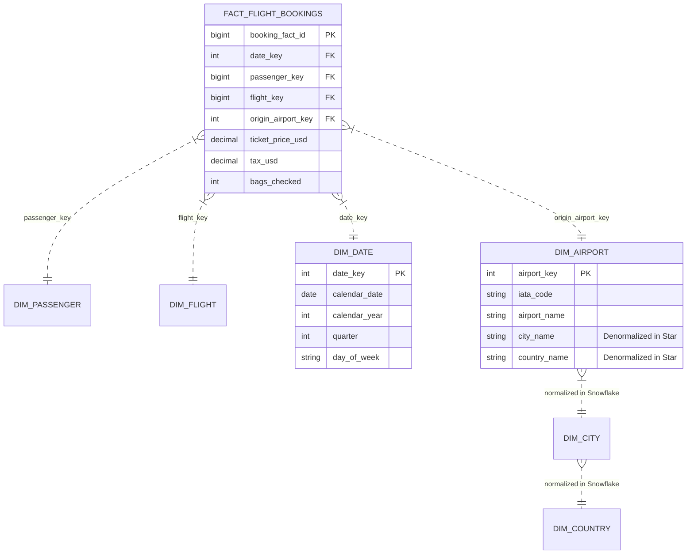

* **Star Schema:**
  * At the center is a massive **Fact Table** containing numerical measurements / metrics (`ticket_price_usd`, `bags_checked`) and foreign key keys pointing to dimension tables.
  * Surrounding the fact table are **Dimension Tables** (`dim_passenger`, `dim_airport`, `dim_date`) representing the "who, where, when, what".
  * *Denormalized:* In a star schema, dimension tables are deliberately denormalized (e.g. `city_name` and `country_name` are kept directly in `dim_airport`), keeping analytical joins simple and fast.
* **Snowflake Schema:**
  * Dimensions are further broken down into normalized sub-dimensions (e.g., `dim_airport` points to `dim_city`, which points to `dim_country`).
  * While saving some disk space by eliminating string redundancy, snowflake schemas require more joins for each query, making star schemas generally favored in modern columnar OLAP engines like ClickHouse and BigQuery.

---

## Storage Engine Architecture for TravelBuddy

| Domain Subsystem | Workload Pattern | Storage Engine Architecture | Technology |
| :--- | :--- | :--- | :--- |
| **Seat Booking & Transactions** | High concurrency, point updates, row locks, strict ACID | **B-Tree** (Clustered Index on `booking_id`) | **PostgreSQL** |
| **Search Telemetry & Clickstream** | 850k writes/sec, high write-amplification tolerance | **LSM-Tree** (MemTable + Leveled Compaction SSTables) | **RocksDB / Cassandra** |
| **Fleet Profitability & Pricing OLAP**| 500M+ rows scanned, aggregation across 4 columns | **Column-Oriented** (RLE, Bitmap Indexes, Vectorized) | **ClickHouse** |

---

## Key Takeaways & Review Checklist

<Cards>
<Card title="The Index Dilemma" icon="Zap">
Indexes speed up read queries ($O(N) \rightarrow O(\log N)$ or $O(1)$) but impose write amplification overhead on every insert, update, and delete.
</Card>
<Card title="LSM-Trees for Writes" icon="ArrowDownCircle">
LSM-Trees buffer writes sequentially in a MemTable and flush immutable SSTables to disk, delivering maximum sequential write throughput.
</Card>
<Card title="B-Trees for Predictable Reads" icon="FolderTree">
B-Trees update fixed-size 4KB pages in-place, keeping depths low and delivering predictable 1-to-2 disk hop reads for OLTP transactions.
</Card>
<Card title="Columnar Stores for OLAP" icon="Columns">
Column-oriented storage groups values of each column together, slashing disk I/O and enabling extreme compression (RLE, Bitmaps) for aggregations.
</Card>
</Cards>
