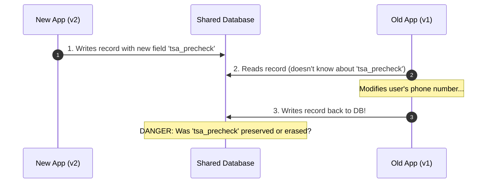

import { Callout } from 'fumadocs-ui/components/callout';
import { Tabs, Tab } from 'fumadocs-ui/components/tabs';
import { Steps, Step } from 'fumadocs-ui/components/steps';
import { Cards, Card } from 'fumadocs-ui/components/card';

Applications change over time. Features are added, user requirements evolve, and data schemas mutate:
* A passenger booking record needs a new field for `tsa_precheck_number`.
* An airport entity adds `elevation_meters` and `runway_length`.
* Old mobile clients running iOS 15 continue sending payloads from 2024, while backend microservices are continuously deployed in 2026.

In a large distributed system, **you cannot upgrade all software components simultaneously**. 
* On the server side, you perform **rolling upgrades (canary deployments)**, meaning new versions and old versions run concurrently for minutes, hours, or days.
* On the client side, users may not update their mobile application for months.

This reality requires our data systems to maintain both **Backward Compatibility** and **Forward Compatibility**:

```mermaid
flowchart LR
    subgraph BackwardCompat["Backward Compatibility"]
        direction TB
        B1["Newer Code"] -- "Reads" --> B2["Data written by Older Code"]
    end

    subgraph ForwardCompat["Forward Compatibility"]
        direction TB
        F1["Older Code"] -- "Reads" --> F2["Data written by Newer Code"]
    end

    style BackwardCompat fill:#0f172a,stroke:#38bdf8,stroke-width:2px
    style ForwardCompat fill:#0f172a,stroke:#10b981,stroke-width:2px
```



In this chapter, we trace the journey of data from in-memory objects to network wire formats, comparing **JSON, Protocol Buffers, Thrift, and Avro**, and dissecting the modes of distributed dataflow.

---

## Formats for Encoding Data

Programs operate on data using two fundamentally different representations:

1. **In-Memory Representation:**
   Data is stored in RAM using native objects, structs, pointers, arrays, and hash maps optimized for CPU access.
2. **Byte Sequence (Wire Format):**
   When sending data over a network or writing it to disk, memory pointers are meaningless (another process has a different address space). The data must be converted into a self-contained sequence of bytes.

The transition from memory structures to byte sequences is called **Encoding (Serialization or Marshalling)**; the reverse is **Decoding (Deserialization or Unmarshalling)**.

```mermaid
flowchart LR
    Memory["In-Memory Object<br/>(Pointers, Structs, Vtables)"] -- "Encoding / Serialization" --> Wire["Contiguous Byte Sequence<br/>(Network Socket / Disk Block)"]
    Wire -- "Decoding / Deserialization" --> Memory

    style Memory fill:#0f172a,stroke:#38bdf8,stroke-width:2px
    style Wire fill:#020617,stroke:#10b981,stroke-width:2px
```



### The Perils of Language-Specific Serialization

Most programming languages provide native built-in serialization mechanisms:
* Java: `java.io.Serializable`
* Python: `pickle`
* Ruby: `Marshal`

<Callout type="warn" title="Why Language-Specific Serialization Is Avoided in Production">
1. **Security Catastrophes:** Built-in decoders frequently instantiate arbitrary classes. An attacker who controls the serialized byte stream can trigger **Remote Code Execution (RCE)** by injecting malicious object graphs (e.g., the infamous Java `ysoserial` exploits).
2. **Language Lock-in:** If TravelBuddy's booking engine encodes data with Python `pickle`, a Go or Rust analytics service cannot easily decode it.
3. **Inefficiency:** Native encoders serialize complete class names, metadata, and reflection schemas, producing bloated payloads with poor throughput.
</Callout>

---

## Textual Formats: JSON, XML & CSV

Because language-specific formats fail multi-system requirements, developers turned to standardized textual formats: JSON, XML, and CSV.

While human-readable and universally supported, textual formats carry subtle ambiguities:

```mermaid
flowchart TD
    subgraph TextFlaws["Subtle Flaws of Textual Formats in Systems Design"]
        T1["1. Number Precision Ambiguity<br/>JSON does not distinguish integers from floats. JavaScript represents numbers as IEEE 754 double floats, losing precision for integers > 2^53 (e.g., 64-bit booking IDs)."]
        T2["2. Binary String Inefficiency<br/>Binary payloads (passport photos, encryption keys) must be Base64-encoded, causing a 33% byte size penalty."]
        T3["3. Verbose Field Names<br/>Every single row repeats string keys ('passenger_passport_number') thousands of times."]
    end

    style TextFlaws fill:#020617,stroke:#ef4444,stroke-width:2px
```



### Binary JSON Variants (MessagePack, BSON)

Formats like **MessagePack** and **BSON** encode JSON documents into binary byte streams. However, they keep the human-readable string keys inside every single record:

```json
{"userName": "Martin", "favoriteNumber": 1337, "interests": ["daydreaming", "hacking"]}
```
Even in binary MessagePack, the ASCII strings `"userName"`, `"favoriteNumber"`, and `"interests"` are packed into every single message! 

#### The Raw Byte Showdown: MessagePack (66 Bytes) vs. Protobuf (33 Bytes)

Let's inspect the actual serialized bytes for the same payload:

| Component | MessagePack (66 Bytes Total) | Protocol Buffers (33 Bytes Total) |
| :--- | :--- | :--- |
| **Object Header** | `0x83` (fixmap with 3 pairs) | *None needed* |
| **Field 1 Name** | `0xa8` + `"userName"` (9 bytes string!) | Tag `1` + type `2`: `0x0a` (1 byte) |
| **Field 1 Value**| `0xa6` + `"Martin"` (7 bytes) | Length `6` + `"Martin"`: `0x064d617274696e` (7 bytes) |
| **Field 2 Name** | `0xae` + `"favoriteNumber"` (15 bytes string!)| Tag `2` + type `0`: `0x10` (1 byte) |
| **Field 2 Value**| `0xcd` + `0x0539` (1337 as uint16, 3 bytes) | Varint `0xb90a` (1337, 2 bytes) |
| **Field 3 Name** | `0xa9` + `"interests"` (10 bytes string!) | Tag `3` + type `2`: `0x1a` (1 byte) |
| **Field 3 Value**| `0x92` (array of 2 strings) + strings (21 bytes)| Lengths + `"daydreaming"` + `"hacking"` (21 bytes) |

Because binary JSON retains literal string keys, **over 50% of the payload consists of repeated field name characters**. Protocol Buffers eliminates all field names at encode time, shrinking the payload by exactly **50%**!

---

## Schema-Driven Binary Formats: Protocol Buffers & Thrift

To eliminate field name overhead, **Protocol Buffers (Google)** and **Apache Thrift (Facebook)** require a compile-time schema definition.

Instead of writing field names into the binary stream, they assign each field a compact **numeric field tag**:

```protobuf
syntax = "proto3";

package travelbuddy.booking.v1;

message FlightBooking {
    int64 booking_id = 1;
    string passenger_name = 2;
    string flight_number = 3;
    int32 seat_number = 4;
    int64 price_cents = 5;
    bool is_cancelled = 6;
}
```



```mermaid
flowchart LR
    subgraph ProtobufPayload["Protobuf Wire Encoding (Bytes)"]
        direction LR
        F1["Tag: 1 (Type: varint)"] --> V1["Value: 98124"]
        V1 --> F2["Tag: 2 (Type: length-delimited)"]
        F2 --> L2["Length: 10"]
        L2 --> V2["'Alice Chen'"]
        V2 --> F3["Tag: 3 (Type: length-delimited)"]
    end

    style ProtobufPayload fill:#020617,stroke:#38bdf8,stroke-width:2px
```

In the binary byte stream:
* The field name `"passenger_name"` **never appears**.
* Instead, a 1-byte header encodes the **field tag** (`2`) and the **wire type** (`length-delimited string`).
* A 100-byte JSON object compresses down to 22 bytes in Protocol Buffers!

### Variable-Length Integers (Varints)

How does Protobuf encode numbers efficiently?
In languages like C or Java, an `int64` always consumes 8 bytes (64 bits), even if its value is just `1`.

Protobuf uses **Varints (Variable-Length Quantities)**:
* Each byte uses its Most Significant Bit (MSB) as a continuation flag (`1` means more bytes follow; `0` means this is the final byte).
* Small numbers (e.g., `42`) consume only **1 byte**!
* Large numbers use up to 10 bytes.

For signed negative integers, standard two's complement has the sign bit set to 1, causing `-1` to consume 10 bytes. Protobuf solves this with **Zigzag Encoding**: mapping signed integers to unsigned integers so small negative numbers (`-1, -2`) map to small positive numbers (`1, 3`), keeping varint payloads tiny.

---

## Schema Evolution Rules in Protocol Buffers & Thrift

How do schemas evolve safely in production?

```mermaid
flowchart TD
    subgraph EvolutionRules["Protobuf Schema Evolution Rules"]
        R1["RULE 1: Never change a field tag number.<br/>Tag numbers are the wire identity of the field."]
        R2["RULE 2: New fields must be optional or have defaults.<br/>Old code will ignore unknown tags; new code will supply defaults."]
        R3["RULE 3: Never reuse a deleted tag number.<br/>Mark deleted tags as 'reserved' so future engineers cannot reuse them."]
    end

    style EvolutionRules fill:#020617,stroke:#34d399,stroke-width:2px
```



### Forward Compatibility in Action:
Suppose version 2 of the service adds field tag `7`:
```protobuf
message FlightBooking {
    // ... fields 1 to 6
    string loyalty_tier = 7; // NEW FIELD
}
```
When an older version 1 microservice receives this message:
* It reads fields 1 through 6 normally.
* It encounters field tag `7`. Because it has no definition for `7`, the parser looks at the wire type header, calculates the byte length, **skips the bytes**, and continues parsing.
* **Result:** Forward compatibility is preserved! Old code does not crash.

### Backward Compatibility in Action:
When a new version 2 microservice receives a legacy message generated by version 1:
* The wire stream contains tags 1 through 6. Tag 7 is absent.
* The generated code simply fills field `loyalty_tier` with the default value (empty string `""`).
* **Result:** Backward compatibility is preserved!

<Callout type="warn" title="The Peril of Reusing Field Tags">
If you remove `bool is_cancelled = 6;` and later another developer adds `int32 baggage_count = 6;`, an old microservice reading new records will interpret a passenger with 1 baggage item as having a cancelled flight!

To prevent this catastrophic bug, always mark deleted tags as **`reserved`**:
```protobuf
message FlightBooking {
    reserved 6;
    reserved "is_cancelled";
    // ...
}
```
</Callout>

---

## Apache Avro: The Schema Without Field Tags

Apache Avro (born in the Hadoop ecosystem) takes an even more radical approach:
* It does **not** include field names.
* It does **not** include field tags!
* A binary Avro payload contains **only contiguous values packed together**:

```
[0x02, 0x14, 0x41, 0x6c, 0x69, 0x63, 0x65, 0x20, 0x43, 0x68, 0x65, 0x6e, ...]
```

How on earth can a reader decode this stream if there are neither names nor tags?

### Writer's Schema vs. Reader's Schema

Avro requires two schemas:
1. **The Writer's Schema:** The exact schema used by the application that encoded the record.
2. **The Reader's Schema:** The schema expected by the application decoding the record.

```mermaid
flowchart TD
    W_Schema["Writer's Schema<br/>(Used when encoding in 2024)"]
    R_Schema["Reader's Schema<br/>(Expected by application in 2026)"]

    WireBytes["Raw Binary Bytes<br/>(No tags, no names!)"]

    W_Schema & R_Schema & WireBytes --> Decoder["Avro Schema Resolution Engine"]
    Decoder --> AppObj["Decoded In-Memory Object"]

    style W_Schema fill:#0f172a,stroke:#38bdf8,stroke-width:1px
    style R_Schema fill:#0f172a,stroke:#818cf8,stroke-width:1px
    style WireBytes fill:#020617,stroke:#10b981,stroke-width:2px
    style Decoder fill:#064e3b,stroke:#34d399,stroke-width:2px
```



At decode time, the Avro library looks at both schemas side-by-side:
* It matches fields by **field name**.
* If the Writer's schema contains a field missing from the Reader's schema, the decoder skips it.
* If the Reader's schema contains a field missing from the Writer's schema, the decoder injects the **default value** defined in the Reader's schema.

### How Does the Reader Get the Writer's Schema?
* **In Large Files (Hadoop/Parquet):** The writer's schema is embedded once at the very beginning of the 1 GB file.
* **In Message Brokers (Kafka):** You run a central **Confluent Schema Registry**. The message writer prepends a **4-byte schema ID** to the record. When a consumer receives the record, it queries the Schema Registry for schema ID `42`, caches it, and decodes the stream.

---

## Modes of Distributed Dataflow

Data does not live in isolation; it flows across process boundaries. Martin Kleppmann categorizes dataflow into three primary patterns:

```mermaid
flowchart TD
    subgraph DataflowModes["The 3 Modes of Distributed Dataflow"]
        M1["1. Dataflow Through Databases<br/>(One process writes, another reads later in time)"]
        M2["2. Dataflow Through Service Calls (REST / RPC)<br/>(Synchronous network request/response)"]
        M3["3. Asynchronous Message Passing (Kafka, RabbitMQ)<br/>(Decoupled event streams and queues)"]
    end

    style DataflowModes fill:#020617,stroke:#38bdf8,stroke-width:2px
```



### 1. Dataflow Through Databases

> *"Writing to a database is like sending a message to your future self."*

In a database, a record written by an application today might be read by a newer version of the application 5 years from now (backward compatibility).

Furthermore, during a rolling update, an older application instance might read a record written by a newer instance.



<Callout type="warn" title="Unknown Field Preservation">
If an older application version decodes a record, strips unknown fields from its internal memory struct, and writes the record back to the database, **it will permanently destroy the newly added fields!**

Production ORMs and serialization libraries must preserve unknown fields as raw byte buffers and write them back untouched.
</Callout>

### 2. Dataflow Through Services: REST vs. RPC

In service-oriented architectures, services communicate via network protocols:
* **REST (Representational State Transfer):** Built on HTTP primitives (GET, POST, PUT, DELETE), JSON payloads, and URI paths. Highly decoupled, human-inspectable, and cacheable via CDN edges.
* **RPC (Remote Procedure Calls):** Frameworks like **gRPC (Protocol Buffers)**, Apache Thrift, and Java RMI attempt to make a call to a remote network service look identical to calling a local in-memory function:
  ```typescript
  // Local function call:
  const result = calculateFlightRoute(sfo, jfk);
  
  // RPC client call (looks like local function):
  const result = await flightServiceClient.calculateFlightRoute({ origin: sfo, dest: jfk });
  ```

#### The Fundamental Fallacy of RPC

While RPC looks syntactically clean, **a network call is fundamentally different from a local in-memory function call**:

| Characteristic | Local Function Call | Remote Procedure Call (RPC) |
| :--- | :--- | :--- |
| **Predictability** | Deterministic (succeeds or throws predictable exception) | Unpredictable (packets drop, switch fails, timeout occurs) |
| **Latency** | Nanoseconds (direct CPU pointer jump) | Milliseconds to Seconds (network round-trip, queuing) |
| **Failure Mode** | Process crashes or returns | **Unknown State:** Did the request fail before reaching the server, or did the server process the booking and crash before returning the response? |
| **Idempotency** | Executed exactly once | Retrying without idempotency keys causes duplicate ticket charges |
| **Memory Isolation**| Can pass pointers and references | All parameters must be copied into bytes and transmitted |

### 3. Asynchronous Message Passing

In asynchronous message passing, a client sends a message to an intermediate **Message Broker** (Apache Kafka, RabbitMQ, Amazon SQS, NATS).


* **Decoupled in Time:** The producer does not wait for consumers to finish. If the Notification Service is temporarily down for maintenance, messages buffer safely in the broker until it recovers.
* **Fan-Out:** A single flight booking event can be consumed by 10 independent microservices without the booking service knowing who they are.
* **Backpressure Management:** If consumer services fall behind, the broker absorbs the spike rather than crashing downstream servers with HTTP 503 errors.

### Distributed Dataflow in the Actor Model

Beyond RPC and message brokers, the **Actor Model** (Erlang/OTP, Akka, Microsoft Orleans) represents a distinct paradigm for distributed communication:

```mermaid
flowchart LR
    subgraph NodeA["Cluster Node A (Version 1.4)"]
        ActorA["Actor: BookingCoordinator"]
    end

    subgraph NodeB["Cluster Node B (Version 1.5)"]
        MailboxB["Actor Mailbox Queue"]
        ActorB["Actor: SeatInventory"]
        MailboxB --> ActorB
    end

    ActorA -- "Serialized Message<br/>(ReserveSeat v1)" --> MailboxB

    style NodeA fill:#0f172a,stroke:#38bdf8,stroke-width:2px
    style NodeB fill:#0f172a,stroke:#10b981,stroke-width:2px
```



* **No Shared Memory:** Actors do not share state. Concurrency is handled without mutex locks: each actor processes messages from its private **Mailbox** sequentially in a single logical thread.
* **Location Transparency:** An actor sends messages using the exact same API whether the target actor resides in the same JVM/process or on a remote machine across the cluster.
* **Actor Schema Evolution Hazards:**
  * When performing a **rolling deployment** across an actor cluster, Node A (running version 1.4) sends serialized messages to Node B (running version 1.5).
  * If the system uses Java's built-in serialization or unversioned JSON, missing fields cause deserialization exceptions inside the actor mailbox, crashing the actor process.
  * *Best Practice:* Production actor clusters (such as Akka) require binary schema frameworks (Protocol Buffers) for all inter-actor network messages to ensure forward and backward compatibility across versions.

---

## TravelBuddy Microservice Architecture: gRPC + Kafka Pipeline

TravelBuddy combines these patterns:
1. **Synchronous Internal RPC (gRPC):** Low-latency, high-throughput service-to-service communication between the API Gateway and the Seat Inventory Engine.
2. **Asynchronous Event Stream (Kafka + Avro):** Publishing immutable booking events to analytics, fraud detection, and partner airline notification queues.

```protobuf
// TravelBuddy Booking Protocol Definition
syntax = "proto3";

package travelbuddy.booking.v1;

service BookingService {
    rpc ReserveSeat (ReserveSeatRequest) returns (ReserveSeatResponse);
}

message ReserveSeatRequest {
    string flight_id = 1;
    string passenger_id = 2;
    string seat_number = 3;
    string idempotency_key = 4;
}

message ReserveSeatResponse {
    enum Status {
        STATUS_UNSPECIFIED = 0;
        STATUS_CONFIRMED = 1;
        STATUS_SEAT_TAKEN = 2;
        STATUS_PAYMENT_FAILED = 3;
    }
    Status status = 1;
    string confirmation_code = 2;
    int64 timestamp_utc = 3;
}
```

---

## Key Takeaways & Review Checklist

<Cards>
<Card title="Forward vs Backward Compatibility" icon="Repeat">
Backward compatibility means new code reads old data. Forward compatibility means old code reads new data. Both are mandatory for rolling deployments.
</Card>
<Card title="Field Tags Over Field Names" icon="Hash">
Protocol Buffers and Thrift replace verbose string names with 1-byte numeric tags and varints, drastically cutting payload size and CPU parsing time.
</Card>
<Card title="Avro Schema Resolution" icon="FileCode">
Avro sends pure bytes without field tags, relying on an out-of-band Schema Registry to match the Writer's schema with the Reader's schema dynamically.
</Card>
<Card title="The RPC Fallacy" icon="AlertTriangle">
Network calls can never be disguised as local function calls. Always account for network partitions, timeouts, retries, and idempotency keys.
</Card>
</Cards>
