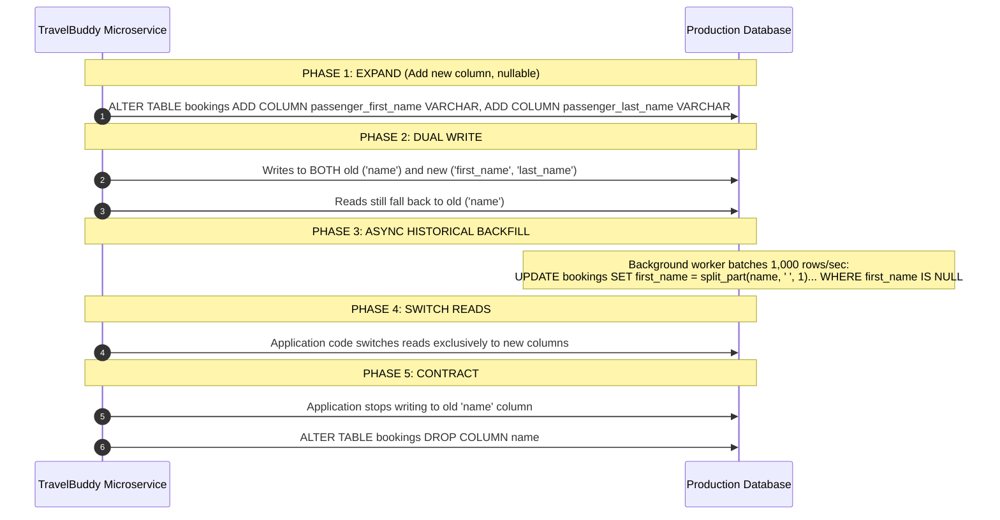

import { Callout } from 'fumadocs-ui/components/callout';
import { Tabs, Tab } from 'fumadocs-ui/components/tabs';
import { Steps, Step } from 'fumadocs-ui/components/steps';
import { Cards, Card } from 'fumadocs-ui/components/card';

Welcome to the **Track 2 Capstone Design Lab**.

In this capstone, you will translate the theoretical storage principles learned across Martin Kleppmann's *Designing Data-Intensive Applications* into working systems engineering:
1. **Lab Part 1:** Construct a working **LSM-Tree Storage Engine** from scratch in TypeScript—implementing an in-memory **MemTable**, append-only **Write-Ahead Log (WAL)**, on-disk **SSTable flushing**, and a **Bloom Filter** for zero-seek negative lookups.
2. **Lab Part 2:** Architect TravelBuddy's planetary **Polyglot Persistence Topology**, connecting transactional PostgreSQL, LSM search telemetry, Neo4j flight graphs, and ClickHouse analytics via **Change Data Capture (CDC)**.
3. **Lab Part 3:** Execute a live **Zero-Downtime Schema Migration** on 100 million flight booking records using the **Expand/Contract (Parallel Run) pattern**.

---

## Lab Part 1: Building a Mini LSM-Tree Engine in TypeScript

Let us implement the core mechanics of RocksDB/Cassandra in a clean, self-contained TypeScript engine.

```mermaid
flowchart TD
    subgraph Client["Application Client"]
        Put["set('FL-101', '{...}')"]
        Get["get('FL-101')"]
    end

    subgraph MiniLSM["Mini-LSM Storage Engine"]
        WAL[("Write-Ahead Log (append-only file)")]
        MemTable["In-Memory MemTable (Sorted Map)"]
        BF{"Bloom Filter"}
        SST[("SSTable Segments on Disk (Sorted & Indexed)")]
    end

    Put --> WAL
    Put --> MemTable
    MemTable -- "When size > threshold" --> SST
    Get --> MemTable
    Get -. "If miss" .-> BF
    BF -- "Probably Present" --> SST
    BF -- "Definitely Absent" --> InstantNull["Return null (Zero disk I/O)"]

    style Client fill:#0f172a,stroke:#38bdf8,stroke-width:2px
    style MiniLSM fill:#020617,stroke:#10b981,stroke-width:2px
    style InstantNull fill:#064e3b,stroke:#10b981,stroke-width:1px
```



### 1. The Bloom Filter Component

First, we build a space-efficient Bloom filter using 3 hash functions:

```typescript
// bloom-filter.ts
export class BloomFilter {
  private size: number;
  private bits: Uint8Array;

  constructor(sizeInBits: number = 1024) {
    this.size = sizeInBits;
    this.bits = new Uint8Array(Math.ceil(sizeInBits / 8));
  }

  // 3 distinct polynomial rolling hash functions
  private hash1(key: string): number {
    let hash = 0;
    for (let i = 0; i < key.length; i++) {
      hash = (hash * 31 + key.charCodeAt(i)) >>> 0;
    }
    return hash % this.size;
  }

  private hash2(key: string): number {
    let hash = 5381;
    for (let i = 0; i < key.length; i++) {
      hash = ((hash << 5) + hash + key.charCodeAt(i)) >>> 0;
    }
    return hash % this.size;
  }

  private hash3(key: string): number {
    let hash = 0;
    for (let i = 0; i < key.length; i++) {
      hash = (hash * 65599 + key.charCodeAt(i)) >>> 0;
    }
    return hash % this.size;
  }

  public add(key: string): void {
    const indices = [this.hash1(key), this.hash2(key), this.hash3(key)];
    for (const idx of indices) {
      const byteIdx = Math.floor(idx / 8);
      const bitMask = 1 << (idx % 8);
      this.bits[byteIdx] |= bitMask;
    }
  }

  public mightContain(key: string): boolean {
    const indices = [this.hash1(key), this.hash2(key), this.hash3(key)];
    for (const idx of indices) {
      const byteIdx = Math.floor(idx / 8);
      const bitMask = 1 << (idx % 8);
      if ((this.bits[byteIdx] & bitMask) === 0) {
        return false; // Guaranteed NOT in set!
      }
    }
    return true; // Probably in set
  }
}
```

### 2. The Complete LSM Storage Engine

Now we combine the Write-Ahead Log, the MemTable, the Bloom Filter, and the SSTable flusher:

```typescript
// lsm-engine.ts
import * as fs from 'fs';
import * as path from 'path';
import { BloomFilter } from './bloom-filter';

interface SSTableIndex {
  filename: string;
  bloomFilter: BloomFilter;
  sparseIndex: Map<string, number>; // key -> byte offset in file
}

export class MiniLSMEngine {
  private memTable: Map<string, string>;
  private walStream: fs.WriteStream;
  private sstables: SSTableIndex[] = [];
  private readonly maxMemTableSize = 4; // flush after 4 items for demo
  private readonly dataDir: string;
  private segmentCounter = 0;

  constructor(dataDir: string = './lsm-data') {
    this.dataDir = dataDir;
    if (!fs.existsSync(dataDir)) {
      fs.mkdirSync(dataDir, { recursive: true });
    }
    this.memTable = new Map();
    this.walStream = fs.createWriteStream(path.join(dataDir, 'wal.log'), { flags: 'a' });
  }

  // WRITE PATH: WAL -> MemTable -> Flush if full
  public set(key: string, value: string): void {
    // 1. Durability: append to Write-Ahead Log
    this.walStream.write(`${JSON.stringify({ key, value })}\n`);

    // 2. Insert into in-memory MemTable
    this.memTable.set(key, value);

    // 3. Flush if threshold reached
    if (this.memTable.size >= this.maxMemTableSize) {
      this.flushMemTable();
    }
  }

  // FLUSH PATH: Sort MemTable -> Write SSTable & Sparse Index to Disk
  private flushMemTable(): void {
    const sstableFile = path.join(this.dataDir, `sstable_${++this.segmentCounter}.db`);
    const sortedEntries = Array.from(this.memTable.entries()).sort(([a], [b]) => a.localeCompare(b));

    const sparseIndex = new Map<string, number>();
    const bloom = new BloomFilter(2048);
    let byteOffset = 0;
    const lines: string[] = [];

    for (let i = 0; i < sortedEntries.length; i++) {
      const [k, v] = sortedEntries[i];
      bloom.add(k);

      // Sparse index: record offset every 2 entries
      if (i % 2 === 0) {
        sparseIndex.set(k, byteOffset);
      }

      const line = `${k}\t${v}\n`;
      lines.push(line);
      byteOffset += Buffer.byteLength(line, 'utf-8');
    }

    fs.writeFileSync(sstableFile, lines.join(''), 'utf-8');

    // Register SSTable index in memory
    this.sstables.unshift({
      filename: sstableFile,
      bloomFilter: bloom,
      sparseIndex
    });

    // Reset MemTable & truncate WAL
    this.memTable.clear();
    fs.truncateSync(path.join(this.dataDir, 'wal.log'), 0);
  }

  // READ PATH: MemTable -> SSTables (filtered by Bloom filter)
  public get(key: string): string | null {
    // 1. Check in-memory MemTable
    if (this.memTable.has(key)) {
      return this.memTable.get(key)!;
    }

    // 2. Search SSTable segments (newest to oldest)
    for (const table of this.sstables) {
      // Bloom Filter Fast Gate
      if (!table.bloomFilter.mightContain(key)) {
        continue; // Skip file completely: zero disk I/O!
      }

      // Read file and parse
      const content = fs.readFileSync(table.filename, 'utf-8');
      const lines = content.trim().split('\n');
      for (const line of lines) {
        const [k, val] = line.split('\t');
        if (k === key) {
          return val;
        }
      }
    }

    return null; // Not found
  }
}
```

---

## Lab Part 2: TravelBuddy's Polyglot Architecture & CDC Pipeline

TravelBuddy handles distinct workloads across specialized storage engines:

```mermaid
flowchart TD
    subgraph Ingress["Client Entrypoint"]
        Gateway["TravelBuddy Edge API Gateway"]
    end

    subgraph OLTP["1. Primary Transactional Store"]
        Postgres[("PostgreSQL 16 Cluster<br/>B-Tree Primary Key: booking_id<br/>ACID Seat Reservations & Payments")]
    end

    subgraph CDC["2. Streaming Change Data Capture (CDC)"]
        Debezium["Debezium CDC Connector<br/>(Reads Postgres WAL Log)"]
        Kafka["Apache Kafka Event Bus<br/>Topic: travelbuddy.bookings.v1<br/>(Avro Schema Registry)"]
    end

    subgraph SpecializedSinks["3. Specialized Domain Engines"]
        Neo4j[("Neo4j Graph Store<br/>Index-Free Adjacency<br/>Flight Pathfinding")]
        Cassandra[("Cassandra / RocksDB<br/>LSM-Tree Telemetry<br/>850k writes/sec Search Logs")]
        ClickHouse[("ClickHouse OLAP<br/>Columnar Compressed<br/>Fleet Revenue Analytics")]
    end

    Gateway --> Postgres
    Postgres -. "WAL Stream" .-> Debezium
    Debezium --> Kafka
    Kafka --> Neo4j
    Kafka --> Cassandra
    Kafka --> ClickHouse

    style Ingress fill:#0f172a,stroke:#38bdf8,stroke-width:2px
    style OLTP fill:#0f172a,stroke:#f59e0b,stroke-width:2px
    style CDC fill:#020617,stroke:#a855f7,stroke-width:2px
    style SpecializedSinks fill:#020617,stroke:#10b981,stroke-width:2px
```



### Why Change Data Capture (CDC) Beats Dual Writes

Many engineers instinctively attempt **Dual Writes** from the application service:
```typescript
// ANTIPATTERN: The Dual-Write Trap
async function bookSeat(booking) {
  await postgres.insert(booking); // Succeeds
  await neo4j.updateGraph(booking); // FAILS! (Network drop)
}
```

Dual writes create irrecoverable split-brain data corruption:
1. **Network Partial Failures:** If write 1 succeeds and write 2 fails, the two databases permanently diverge.
2. **Race Conditions / Out-of-Order Writes:** If two concurrent requests update the same passenger, Request A might hit Postgres first but hit Neo4j second, causing permanent inconsistency.

**The CDC Solution:** The application writes exclusively to PostgreSQL. PostgreSQL writes the transaction atomically to its append-only WAL. Debezium reads the WAL stream and publishes immutable ordered events to Kafka, guaranteeing guaranteed at-least-once delivery to all specialized sinks.

---

## Lab Part 3: Zero-Downtime Schema Migration (The Expand/Contract Pattern)

In production, TravelBuddy cannot take down its flight booking service for 6 hours to run a blocking `ALTER TABLE` across 100 million booking rows.

We execute migrations using the **Expand/Contract (Parallel Run) Pattern**:



<Steps>
<Step>
### Phase 1: Expand (Non-blocking DDL)
Add the new columns as **nullable** fields without default values (or using Postgres 11+ non-rewriting defaults):
```sql
ALTER TABLE bookings 
    ADD COLUMN passenger_first_name VARCHAR(100),
    ADD COLUMN passenger_last_name VARCHAR(100);
```
This metadata-only operation completes in 2 milliseconds without locking table rows.
</Step>

<Step>
### Phase 2: Dual Write in Application Layer
Deploy application version $v2$. Whenever a new booking is created, the app writes to **both** the old `name` column and the new `first_name` and `last_name` columns:
```typescript
async function createBooking(data: BookingInput) {
  const [first, ...rest] = data.name.trim().split(' ');
  const last = rest.join(' ');

  return await db.query(
    `INSERT INTO bookings (booking_id, name, passenger_first_name, passenger_last_name) 
     VALUES ($1, $2, $3, $4)`,
    [data.id, data.name, first, last]
  );
}
```
</Step>

<Step>
### Phase 3: Background Batch Backfill
Run an asynchronous background worker script that pages through legacy rows where `passenger_first_name IS NULL`, converting them in small chunks with throttling to avoid saturating disk I/O:
```sql
-- Batch executed in chunks of 5,000 rows
UPDATE bookings 
SET 
    passenger_first_name = split_part(name, ' ', 1),
    passenger_last_name = substr(name, length(split_part(name, ' ', 1)) + 2)
WHERE booking_id IN (
    SELECT booking_id FROM bookings 
    WHERE passenger_first_name IS NULL 
    LIMIT 5000
);
```
</Step>

<Step>
### Phase 4: Switch Reads
Once telemetry confirms that `COUNT(*) WHERE passenger_first_name IS NULL` reaches 0, deploy application version $v3$. The application now reads exclusively from `passenger_first_name` and `passenger_last_name`.
</Step>

<Step>
### Phase 5: Contract (Cleanup)
Deploy application version $v4$ (removing all references to the legacy `name` column from SQL queries). Finally, drop the old column:
```sql
ALTER TABLE bookings DROP COLUMN name;
```
Zero seconds of downtime. Zero customer interruptions.
</Step>
</Steps>

---

## Capstone Architecture Review

<Cards>
<Card title="LSM Engine Mechanics" icon="Cpu">
MemTable buffers in RAM; WAL guarantees durability; SSTables write sorted files sequentially; Bloom filters eliminate wasted disk seeks for misses.
</Card>
<Card title="CDC vs Dual Writes" icon="Shuffle">
Never write to two databases in application code. Write to one source of truth with a WAL, and stream changes via Debezium and Kafka to specialized sinks.
</Card>
<Card title="Expand / Contract Migrations" icon="RefreshCw">
Evolve production schemas across 5 phases: Expand, Dual Write, Backfill, Switch Reads, and Contract—guaranteeing 100% uptime.
</Card>
</Cards>
