import { Callout } from 'fumadocs-ui/components/callout';
import { Cards, Card } from 'fumadocs-ui/components/card';
import { Steps, Step } from 'fumadocs-ui/components/steps';

Welcome to **Track 2: Data Models & Storage Engines**, inspired by Part 1 (*Foundations of Data Systems*) of Martin Kleppmann's seminal work, *Designing Data-Intensive Applications* (DDIA).

In modern software engineering, raw compute is rarely the bottleneck. Modern applications are fundamentally **data-intensive**: their primary challenges stem from the sheer volume of data, the complexity of its relationships, and the speed at which it mutates across network boundaries and persistent disks.

---

## The Reality of Data-Intensive Systems

A typical application is built by assembling diverse off-the-shelf components:
* Databases to store data persistently so it can be found again.
* In-memory caches to remember the results of expensive read operations.
* Search indexes to allow users to filter data by keyword or phrase.
* Stream and message queues to send asynchronous messages to other processes.
* Batch processing pipelines to crunch periodic analytics.

```mermaid
flowchart TD
    subgraph ClientLayer["Client & Edge Layer"]
        User["TravelBuddy Web & Mobile Clients"]
    end

    subgraph ServiceLayer["Application & Services Layer"]
        API["TravelBuddy Gateway & Microservices"]
    end

    subgraph StorageLayer["Data Models & Storage Engine Layer (Track 2 Focus)"]
        direction TB
        subgraph OLTP_Relational["OLTP Relational (PostgreSQL)"]
            PG["B-Tree Indexes<br/>ACID Flight Bookings & Invoicing"]
        end
        subgraph OLTP_LSM["High-Throughput LSM (Cassandra / RocksDB)"]
            LSM["Append-Only SSTables<br/>Flight Search Telemetry & Clickstream"]
        end
        subgraph GraphDB["Graph Store (Neo4j)"]
            GRAPH["Index-Free Adjacency<br/>Multi-Hop Flight Route Pathfinding"]
        end
        subgraph OLAP_Col["Columnar Warehouse (ClickHouse / Snowflake)"]
            COL["Bitmap & RLE Compressed Columns<br/>Global Route Profitability Analytics"]
        end
    end

    User --> API
    API --> PG
    API --> LSM
    API --> GRAPH
    API --> COL

    style ClientLayer fill:#0f172a,stroke:#38bdf8,stroke-width:2px
    style ServiceLayer fill:#0f172a,stroke:#818cf8,stroke-width:2px
    style StorageLayer fill:#020617,stroke:#34d399,stroke-width:2px
    style OLTP_Relational fill:#1e293b,stroke:#38bdf8,stroke-width:1px
    style OLTP_LSM fill:#1e293b,stroke:#f59e0b,stroke-width:1px
    style GraphDB fill:#1e293b,stroke:#ec4899,stroke-width:1px
    style OLAP_Col fill:#1e293b,stroke:#a855f7,stroke-width:1px
```

When building high-scale backends, we do not simply ask *"Which database should I use?"* Instead, we decompose our workload into its underlying physics:
1. What are our **read-to-write ratios**?
2. Are our queries **point lookups**, **scans over contiguous ranges**, or **multi-hop graph traversals**?
3. How is our data laid out on physical disk blocks, and what happens when the power cord is yanked out mid-write?
4. How do our serialization formats evolve when client versions and server versions diverge in production?

---

## The Running Case Study: TravelBuddy

Throughout this track, you will architect the persistence infrastructure of **TravelBuddy**—a planetary-scale global travel platform handling:
* **Flight Bookings & Ticketing:** Strict transactions where overbooking a seat leads to passenger outrage at the boarding gate.
* **Flight Route Graph:** Finding the shortest, cheapest, or fastest connecting flights across 9,000 airports and 40,000 commercial routes.
* **Flight Search Telemetry & Price Tracking:** Ingesting 850,000 search queries per second with sub-50ms write latency.
* **Historical Pricing & Fleet Logistics:** Running analytical queries over 10 billion historical flight records to predict seasonal ticket pricing.

---

## Track Syllabus & Curriculum

<Steps>
<Step>
### [01. Reliability, Scalability & Maintainability](/docs/system-design/02-data-models-and-storage/01-reliability-scalability-maintainability)
**The Core Triad of Data Systems (DDIA Chapter 1)**

Explore the foundational principles governing every production system. Understand the distinction between **faults and failures**, hardware redundancy vs software fault-tolerance, and human error mitigation. Master scalability load parameters (Twitter's fan-out dilemma, TravelBuddy's search spikes), tail latency percentiles ($p50$, $p95$, $p99$, $p99.9$), head-of-line blocking, and formal Service Level terminology (**SLIs, SLOs, SLAs, and Error Budgets**).
</Step>

<Step>
### [02. Data Models & Query Languages](/docs/system-design/02-data-models-and-storage/02-data-models-and-query-languages)
**Relational vs Document vs Graph Models (DDIA Chapter 2)**

Dive into the historical battle of data representations: the Hierarchical model, CODASYL Network model, Codd's Relational model, and modern NoSQL document stores. Examine object-relational impedance mismatch, many-to-one and many-to-many relationships, **schema-on-write vs schema-on-read**, and declarative SQL vs imperative query processing. Implement TravelBuddy's multi-hop flight route search using **Property Graphs and Cypher**.
</Step>

<Step>
### [03. Storage Engines: LSM-Trees vs B-Trees](/docs/system-design/02-data-models-and-storage/03-storage-engines-lsm-vs-btree)
**Inside the Database Engine: Bitcask, SSTables, LSM & B-Trees (DDIA Chapter 3)**

Build from first principles: start with an append-only shell script database, analyze Bitcask's in-memory hash index, and graduate to **SSTables (Sorted String Tables)** and **LSM-Trees (Log-Structured Merge-Trees)** with MemTables, write-ahead logs, Bloom filters, and compaction strategies (Size-Tiered vs Leveled). Compare LSM-Trees against classic **B-Trees** (4KB pages, in-place updates, page splits, latches). Analyze write amplification, read amplification, and explore **OLAP column-oriented storage** (bitmap indexes, run-length encoding).
</Step>

<Step>
### [04. Encoding & Evolution](/docs/system-design/02-data-models-and-storage/04-encoding-and-evolution)
**Binary Formats, Compatibility & Distributed Dataflow (DDIA Chapter 4)**

Uncover how in-memory pointers turn into network bytes. Evaluate textual formats (JSON, XML, CSV) vs schema-driven binary protocols (**Protocol Buffers, Apache Thrift, Apache Avro**). Master the strict mathematical mechanics of **forward and backward compatibility**, field tag rules, and default values. Study the three primary modes of dataflow: databases, synchronous RPC/REST (gRPC), and asynchronous message broker pipelines (Kafka).
</Step>

<Step>
### [Capstone: TravelBuddy Storage Engine Lab](/docs/system-design/02-data-models-and-storage/capstone-travelbuddy-storage-engine)
**Hands-on Systems Architecture & Polyglot Implementation**

Synthesize the entire track into an end-to-end production architecture for TravelBuddy. Construct an append-only LSM storage engine in TypeScript/Python with MemTable, SSTables, and Bloom filters. Implement a zero-downtime database migration pipeline using the **Expand/Contract (Parallel Run) pattern** with Change Data Capture (CDC).
</Step>

<Step>
### [Quick Reference & Cheat Sheets](/docs/system-design/02-data-models-and-storage/quick-reference)
**Storage Engines, Latency Numbers & Schema Rules**

High-density lookup tables comparing Bitcask, B-Trees, LSM-Trees, and Columnar stores; schema evolution rule cheatsheets for Protobuf/Avro; latency numbers every distributed systems engineer must memorize; and SLA uptime downtime calculator tables.
</Step>
</Steps>

---

## Pedagogical Objectives

By completing this track, you will be able to:
1. **Diagnose and eliminate tail latency bottlenecks** in distributed microservices using percentile distributions ($p99$, $p99.9$) rather than misleading averages.
2. **Defend database choices** based on data relationships (1:N vs N:M vs recursive graph traversal) rather than marketing buzzwords.
3. **Trace the exact physical path of a byte** from client payload through memory buffers, write-ahead logs, operating system page caches, and physical flash memory blocks.
4. **Design backward- and forward-compatible APIs** that enable independent microservice deployments without coordinated downtime or cascading deserialization crashes.
