import { Callout } from 'fumadocs-ui/components/callout';
import { Tabs, Tab } from 'fumadocs-ui/components/tabs';
import { Steps, Step } from 'fumadocs-ui/components/steps';
import { Cards, Card } from 'fumadocs-ui/components/card';

## The TravelBuddy Narrative: The European Expansion Glitch

As **TravelBuddy** expanded from a single North American datacenter to a worldwide platform, the operations team deployed database read replicas in **Frankfurt (EU-Central)** and **Singapore (APAC-South)** to serve global travelers with low latency.

```mermaid
flowchart TD
    subgraph US["US-East (Virginia) - Leader"]
        Leader[("Primary Leader DB<br/>PostgreSQL / Raft Node")]
    end

    subgraph EU["EU-Central (Frankfurt) - Follower"]
        ReplicaEU[("Read Replica EU<br/>Async Replication")]
    end

    subgraph APAC["APAC-South (Singapore) - Follower"]
        ReplicaAPAC[("Read Replica APAC<br/>Async Replication")]
    end

    Leader == "Async Replication Stream (75ms)|" ==> ReplicaEU
    Leader == "Async Replication Stream (210ms)|" ==> ReplicaAPAC

    style Leader fill:#0f172a,stroke:#38bdf8,stroke-width:2px
    style ReplicaEU fill:#0f172a,stroke:#34d399,stroke-width:2px
    style ReplicaAPAC fill:#0f172a,stroke:#eab308,stroke-width:2px
```

Within hours of turning on read replicas, the customer support inbox was flooded with complaints:

1. **Alice (New York to London flight)**: Alice changed her meal preference to "Vegan" on her user profile. She submitted the form, the browser reloaded, and her profile immediately reverted to "Standard Beef". Panicked, she submitted it again. Five seconds later, it showed "Vegan".
2. **Bob (Flight discussion forum)**: Bob observed a customer service agent replying to a refund inquiry: *"Yes, your refund has been processed."* However, the original passenger question appeared *below* the answer, three minutes later.
3. **Charlie (Booking status polling)**: Charlie refreshed his booking confirmation page at 10:00:01 AM and saw: `Status: CONFIRMED`. He refreshed again at 10:00:03 AM and saw: `Status: PENDING PAYMENT`. He refreshed a third time at 10:00:05 AM and saw: `Status: CONFIRMED`.

None of these were application code bugs. They are classic **replication lag anomalies** arising from the physics of distributed databases.

---

## Why Replicate Data?

Replication means keeping a copy of the same data on multiple machines connected via a network. We replicate data for three core engineering motivations:

1. **High Availability**: Keeping the system functional even when one or more nodes fail or undergo hardware maintenance.
2. **Disconnected Operation**: Allowing an application to continue functioning when a client device temporarily loses Internet connectivity.
3. **Geographic Proximity & Latency**: Placing data physically close to users across the globe to reduce network round-trip time ($RTT$).
4. **Read Scalability**: Distributing heavy read query workloads across multiple read replicas to prevent saturation of a single node's CPU, RAM, and disk I/O.

If data never changed, replication would be trivial: simply copy the static files once to every node. **The entire difficulty of replication stems from handling changes (writes) to existing data.**

---

## The Three Fundamental Replication Topologies

In Martin Kleppmann's taxonomy, every distributed database implements one of three fundamental replication models:

```mermaid
flowchart TD
    subgraph Topologies["Replication Architectures"]
        direction LR
        SL["1. Single-Leader<br/>(Active-Passive / Master-Replica)<br/>Postgres, MySQL, MongoDB"]
        ML["2. Multi-Leader<br/>(Active-Active / Master-Master)<br/>CouchDB, Cockroach multi-region"]
        LL["3. Leaderless<br/>(Dynamo-Style Quorums)<br/>Cassandra, Amazon DynamoDB, ScyllaDB"]
    end

    style Topologies fill:#020617,stroke:#38bdf8,stroke-width:2px
    style SL fill:#0f172a,stroke:#38bdf8,stroke-width:1px
    style ML fill:#0f172a,stroke:#34d399,stroke-width:1px
    style LL fill:#0f172a,stroke:#eab308,stroke-width:1px
```

---

### 1. Single-Leader Replication (Master-Replica)

In **single-leader** replication:
- Exactly one node is designated as the **leader** (master / primary). All writes (`INSERT`, `UPDATE`, `DELETE`) **must** be sent to the leader.
- The leader writes the new data to its local storage and emits a stream of state changes as a **replication log** or **write-ahead log (WAL)**.
- Other nodes are **followers** (replicas / read slaves). They consume the replication log and apply all writes in the exact order they were processed on the leader.
- Clients can execute read queries against either the leader or any follower.

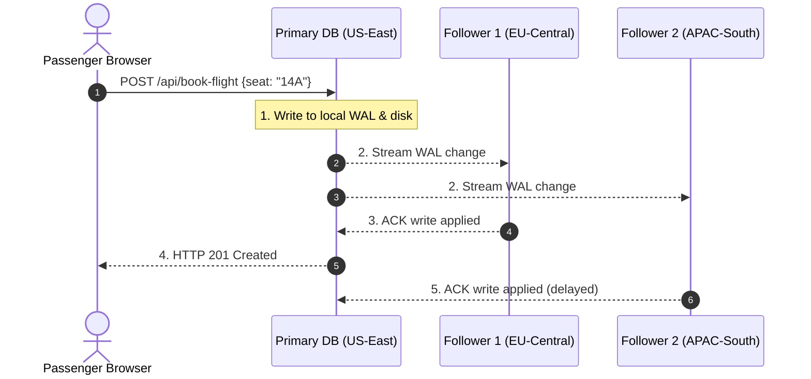

#### Synchronous vs. Asynchronous Replication

How does the leader decide when to send a success response back to the client?

```mermaid
flowchart TD
    subgraph SyncVsAsync["Replication Synchronicity Trade-offs"]
        direction TB
        A["Synchronous Replication<br/>Leader waits for Follower ACK before replying"]
        B["Asynchronous Replication<br/>Leader replies immediately after writing to local disk"]
        C["Semi-Synchronous (Recommended)<br/>Leader waits for exactly 1 Follower ACK; remaining are async"]
    end

    style SyncVsAsync fill:#020617,stroke:#38bdf8,stroke-width:2px
    style A fill:#0f172a,stroke:#f43f5e,stroke-width:1px
    style B fill:#0f172a,stroke:#eab308,stroke-width:1px
    style C fill:#0f172a,stroke:#34d399,stroke-width:1px
```

<Tabs items={['Synchronous', 'Asynchronous', 'Semi-Synchronous']}>
  <Tab value="Synchronous">
    - **How it works**: The leader sends the change to the follower and waits until the follower confirms it wrote the change to disk before returning success to the client.
    - **Advantage**: Guaranteed zero data loss ($RPO = 0$). If the leader crashes, the follower has an identical, up-to-date copy.
    - **Disadvantage**: **Catastrophic availability impact.** If a single synchronous follower becomes unresponsive (network timeout, GC pause, disk full), every write across the entire global system stalls indefinitely.
  </Tab>
  <Tab value="Asynchronous">
    - **How it works**: The leader writes to its local disk, immediately acknowledges the client, and sends replication log events to followers in the background.
    - **Advantage**: High throughput and resilience. Write latency is completely decoupled from network delays to replicas. A crashed follower does not impede writes.
    - **Disadvantage**: **Divergence and data loss ($RPO > 0$).** If the leader experiences an unrecoverable hardware failure before buffered log entries reach followers, un-replicated writes are permanently lost upon failover.
  </Tab>
  <Tab value="Semi-Synchronous">
    - **The Industry Standard**: Implemented in MySQL (`rpl_semi_sync_master_wait_no_slave`) and PostgreSQL (`synchronous_commit = on` with `synchronous_standby_names`).
    - **Mechanism**: The leader designates **one** follower as synchronous and all others as asynchronous. If the synchronous follower becomes slow or crashes, the leader promotes another follower to become synchronous.
    - **Guarantee**: Guarantees data exists on at least two independent physical nodes at all times without stalling on arbitrary downstream followers.
  </Tab>
</Tabs>

---

#### Automatic Failover & Split-Brain Dangers

When the leader stops responding, how does the cluster survive?

<Steps>
  <Step title="Failure Detection via Heartbeats">
    Followers exchange periodic heartbeat pings (e.g., every 1 second). If the leader fails to respond within a timeout window (e.g., 30 seconds), the nodes conclude the leader is dead.
  </Step>
  <Step title="Leader Election">
    A consensus algorithm (or a centralized coordinator like ZooKeeper/Consul) elects a new leader from the surviving followers. The node chosen must possess the highest Log Sequence Number ($LSN$) to minimize data loss.
  </Step>
  <Step title="Cluster Reconfiguration">
    Clients and proxies update their connection pools to direct writes to the newly elected leader. If the old leader comes back online, the system must force it to step down as a follower.
  </Step>
</Steps>

<Callout type="error" title="The Split-Brain Nightmare (TravelBuddy Incident)">
What if the original leader was not dead, but merely paused by a 35-second Stop-The-World JVM garbage collection pause or an isolated network blip?
Followers elect a new leader. When the old leader resumes, both nodes believe they are the legitimate primary. Both accept writes.
When the network heals, writes on both leaders have conflicting autoincrement primary keys and contradictory state.
**Solution**: Systems must use fencing tokens or consensus majorities to forcefully isolate (STONITH: "Shoot The Other Node In The Head") old primaries.
</Callout>

#### Under the Hood: The Four Replication Log Implementations

How does the leader serialize mutations across the network to followers? Database engines implement four distinct replication log strategies, each with profound architectural consequences:

```mermaid
flowchart TD
    subgraph LogTypes["Replication Log Implementation Spectrum"]
        SBR["1. Statement-Based Replication (SBR)<br/>Streams raw SQL statements: 'INSERT INTO flights VALUES (...)'<br/>Danger: Non-deterministic functions cause divergence"]
        WAL["2. Write-Ahead Log (WAL) Shipping<br/>Streams raw byte offsets and disk page mutations (PostgreSQL)<br/>Trade-off: Extremely tight coupling to exact DB engine version"]
        RBR["3. Logical / Row-Based Replication (RBR)<br/>Streams row before/after images (MySQL binlog row format)<br/>Advantage: Decouples storage engines, enables CDC pipelines"]
        TRG["4. Trigger-Based Replication<br/>Application/DBMS triggers copy changes to shadow audit tables<br/>Trade-off: High CPU overhead, fragile schema management"]
    end

    style LogTypes fill:#020617,stroke:#38bdf8,stroke-width:2px
    style SBR fill:#0f172a,stroke:#ef4444,stroke-width:1px
    style WAL fill:#0f172a,stroke:#f59e0b,stroke-width:1px
    style RBR fill:#0f172a,stroke:#10b981,stroke-width:1px
    style TRG fill:#0f172a,stroke:#8b5cf6,stroke-width:1px
```

1. **Statement-Based Replication (SBR):**
   * The leader writes every executing SQL statement (`INSERT`, `UPDATE`, `DELETE`) to the log. Followers parse and execute the identical SQL.
   * *Fatal Pitfalls:*
     * Any statement calling a non-deterministic function—such as `NOW()`, `RAND()`, or `UUID()`—produces different values on every follower, causing silent database divergence!
     * Statements with side effects (autoincrement sequences, concurrent triggers) must execute in the exact same serialized order, crippling write concurrency.
2. **Write-Ahead Log (WAL) Shipping:**
   * The leader transmits its append-only sequence of raw disk block bytes directly to followers (standard in PostgreSQL and Oracle physical standby).
   * *Advantage:* Extremely fast; followers write directly to disk pages without re-executing query parsing or SQL planning.
   * *Fatal Pitfall:* The log is coupled to the lowest-level storage layout. If the on-disk storage format changes between minor/major database versions (e.g., PostgreSQL 15 to 16), followers cannot read the leader's WAL. This prevents **zero-downtime rolling database upgrades**.
3. **Logical (Row-Based) Replication (RBR):**
   * The leader logs changes at the row level with explicit column values:
     * `INSERT`: The full row image with all new column values.
     * `UPDATE`: Primary key identifier plus updated column values (or before/after images).
     * `DELETE`: Primary key identifier of the removed row.
   * *Advantages:* Decoupled from the physical storage engine! The follower can run a different storage engine (or an entirely different database version). Crucially, logical row logs form the backbone of **Change Data Capture (CDC)** tools like Debezium.
4. **Trigger-Based Replication:**
   * Custom triggers registered in the database automatically execute when data changes, writing row snapshots into custom shadow tables (e.g., Bucardo, Databus).
   * *Trade-off:* Extreme flexibility, but incurs heavy database CPU overhead and triggers are prone to developer bugs.

---

#### Practitioner Insight: Vitess VTGate Query Buffering During Failover

In massive production MySQL environments (such as PlanetScale, YouTube, and GitHub), unmitigated primary failovers drop thousands of active client connections, triggering application thundering herds and cascading outages.

To solve this, **Vitess** interposes a stateless proxy layer called **VTGate**:

```mermaid
flowchart LR
    App["Application Fleet"] --> VTGate["VTGate Proxy Layer"]
    VTGate --> Leader["Primary MySQL"]
    VTGate -.-> Follower["Replica MySQL (Promoted)"]

    subgraph PRS["Planned Failover (VTOrc)"]
        direction TB
        Step1["1. Lock writes on old primary"]
        Step2["2. VTGate buffers incoming queries in memory"]
        Step3["3. Promote replica to new primary"]
        Step4["4. Drain buffered queries to new primary"]
        Step1 --> Step2 --> Step3 --> Step4
    end

    style VTGate fill:#0f172a,stroke:#38bdf8,stroke-width:2px
    style PRS fill:#020617,stroke:#10b981,stroke-width:2px
```

* **Query Buffering:** When the cluster orchestrator (VTOrc) initiates a Planned Reparent Shard (PRS) to upgrade or replace the primary node:
  1. VTGate stops forwarding queries to the demoted primary.
  2. Instead of returning connection errors to client applications, **VTGate holds inbound queries in an in-memory buffer** for up to a configurable timeout (e.g., 5–10 seconds).
  3. Once the new replica completes catchup and is promoted, VTGate immediately flushes all buffered queries to the new primary.
  4. *Result:* The application experiences a temporary 200–500ms latency spike rather than tens of thousands of database connection dropped errors!

* **Latency Reality Check: AWS Intra-AZ vs. Cross-Region:**
  * **Intra-AZ (US-East-1a to US-East-1b):** Sub-millisecond round-trip time ($< 0.8\text{ ms}$). Semi-synchronous replication within an AZ imposes negligible latency penalty.
  * **Cross-Region (US-East-1 to EU-Central-1):** Fiber propagation speed through undersea cables guarantees a physical lower bound of **$70\text{ ms}$ to $120\text{ ms}$** per round-trip! Running synchronous replication across continents is impossible for low-latency interactive applications.

---

### 2. Multi-Leader Replication (Active-Active)

In a **multi-leader** (active-active) topology, more than one node can accept writes. Each leader acts as a follower to all other leaders.

This is primarily deployed across multi-datacenter topologies:

```mermaid
flowchart LR
    subgraph DC1["US Datacenter"]
        L1[("Leader 1")]
        F1[("Follower 1A")]
        L1 --> F1
    end

    subgraph DC2["EU Datacenter"]
        L2[("Leader 2")]
        F2[("Follower 2A")]
        L2 --> F2
    end

    L1 <===>|Inter-Datacenter Replication| L2

    style DC1 fill:#020617,stroke:#38bdf8,stroke-width:1px
    style DC2 fill:#020617,stroke:#34d399,stroke-width:1px
    style L1 fill:#0f172a,stroke:#38bdf8,stroke-width:2px
    style L2 fill:#0f172a,stroke:#34d399,stroke-width:2px
```

#### Multi-Leader Benefits
- **Performance**: Every write is processed in the client’s closest local datacenter with low latency, avoiding intercontinental network hops.
- **Tolerance of Datacenter Outages**: If the US datacenter experiences a blackout, the EU datacenter operates independently without cluster-wide stalls.

#### The Conflict Resolution Dilemma
The defining challenge of multi-leader systems is **write conflict**:

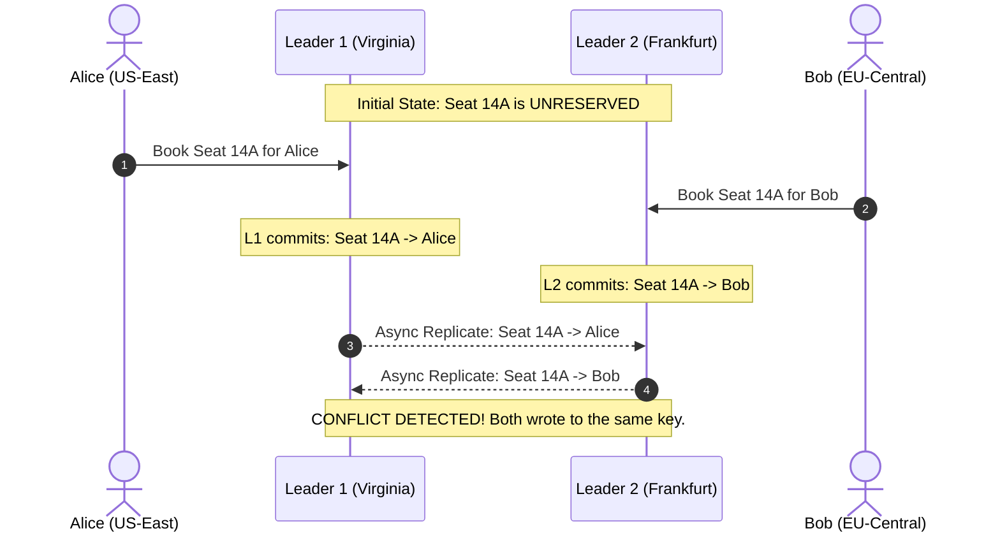

How do databases resolve these concurrent writes?

1. **Conflict Avoidance (Architectural Fix)**: Route all writes for a specific record to the exact same datacenter. For example, all flights originating in Europe are homed to the Frankfurt leader. Conflicts never occur because there is only one leader for that specific partition.
2. **Last Write Wins (LWW)**: Assign each write a physical timestamp and discard the older one. **Highly dangerous** because physical clocks drift; legitimate data is silently destroyed.
3. **Merge Conflict Values**: Retain both conflicting versions as siblings (as CouchDB does) and require client application code to merge them (e.g., union of shopping carts).
4. **Conflict-Free Replicated Data Types (CRDTs)**: Specialized data structures (Grow-Only Sets, Observed-Removed Sets, Counter CRDTs) mathematically designed to converge deterministically regardless of message arrival order.

---

### 3. Leaderless Replication (Dynamo-Style)

Pioneered by Amazon’s **Dynamo** paper (2007) and adopted by **Apache Cassandra**, **ScyllaDB**, and **Voldemort**:

- **No single leader exists**.
- The client (or an arbitrary coordinator node) sends writes directly to multiple replicas in parallel.
- The client reads from multiple replicas in parallel.

```mermaid
flowchart TD
    Client["Client (TravelBuddy Web App)"]
    
    subgraph Cluster["Leaderless Cluster (N = 3)"]
        N1[("Node 1")]
        N2[("Node 2")]
        N3[("Node 3")]
    end

    Client -->|"Write (W=2)"| N1
    Client -->|"Write (W=2)"| N2
    Client -.->|"Write timeout"| N3

    style Cluster fill:#020617,stroke:#eab308,stroke-width:2px
    style N1 fill:#0f172a,stroke:#34d399,stroke-width:2px
    style N2 fill:#0f172a,stroke:#34d399,stroke-width:2px
    style N3 fill:#0f172a,stroke:#f43f5e,stroke-width:2px
```

#### Quorum Mathematics ($W + R > N$)

In a cluster with $N$ total replicas:
- Every write must be acknowledged by at least $W$ nodes.
- Every read must query at least $R$ nodes.

As long as:
$$W + R > N$$

By the **Pigeonhole Principle**, the set of nodes written to and the set of nodes read from **must overlap by at least one node**. That overlapping node is guaranteed to return the latest version.

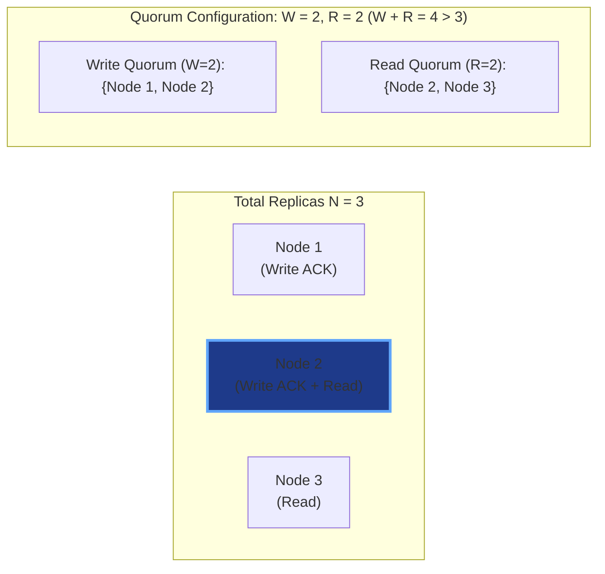

Typical production configurations with $N = 3$:
- **$W = 2, R = 2$**: Balanced read/write performance. Can tolerate 1 node failure ($N - \max(W, R) = 1$).
- **$W = 3, R = 1$**: Fast reads, but any single failed node makes writes impossible.
- **$W = 1, R = 3$**: Fast writes, but read availability suffers if any node is down.

#### Read Repair and Anti-Entropy
When a client reads from $R$ nodes and observes that Node 2 has version 5 while Node 3 has version 4:
1. **Read Repair**: The client takes the newer value (version 5) and asynchronously sends a write back to Node 3 to bring it up to date.
2. **Anti-Entropy Process**: A background daemon periodically compares data across nodes using **Merkle Trees** (cryptographic hash trees) to detect and sync missing data without streaming entire datasets over the network.

#### Sloppy Quorums and Hinted Handoff
What happens during a network partition when a client cannot reach the designated home nodes for a key?

- **Strict Quorum**: Rejects the write because $W$ home nodes cannot be reached.
- **Sloppy Quorum**: The database accepts the write on $W$ accessible nodes *outside* the designated home set. These surrogate nodes store the record temporarily with a hint indicating its true destination.
- **Hinted Handoff**: Once the network partition heals and the true home nodes become reachable, the surrogate nodes hand the writes back to their rightful owners.

<Callout type="warn" title="Sloppy Quorum Caveat">
A sloppy quorum does **not** satisfy $W + R > N$ guarantees! Even if $W + R > N$, you cannot guarantee that reads will see the latest writes until hinted handoff completes. It optimizes for write availability at the cost of immediate consistency.
</Callout>

---

## The Three Great Replication Lag Anomalies

When read replicas are asynchronous, downstream readers inevitably experience stale reads. Martin Kleppmann highlights three specific anomalies that destroy user trust:

### 1. Reading Your Own Writes (Read-After-Write Consistency)

Recall **Alice's meal preference**: Alice updates her profile on the leader. When her browser immediately re-renders by querying an asynchronous read replica in Frankfurt that is 500ms behind, her update is absent.

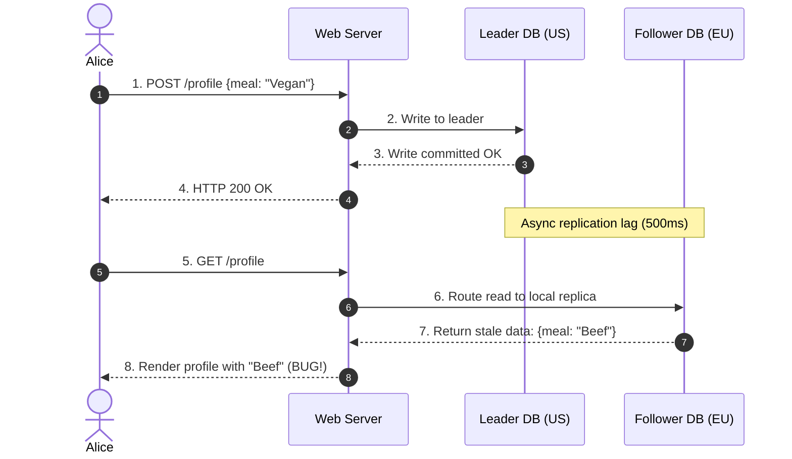

#### How to Guarantee Read-After-Write Consistency:
1. **User-Profile Heuristic**: When reading data that the user may have modified themselves (e.g., their own profile), read from the **leader**. When reading other users' data, read from **followers**.
2. **Time-Window Routing**: Track the timestamp of the client's last write. For 60 seconds after a write, route all queries from that user to the leader.
3. **Replication Lag Tracking**: The client tracks its last written Log Sequence Number ($LSN$). When querying a replica, the query waits or errors if the replica has not caught up to that $LSN$.

---

### 2. Monotonic Reads

Recall **Charlie's booking polling**: Charlie refreshed his page three times and observed the booking status jump backward in time from `CONFIRMED` to `PENDING PAYMENT`, then back to `CONFIRMED`.

Why did this occur?
Charlie's successive HTTP requests were routed to **different** read replicas with different replication lags:

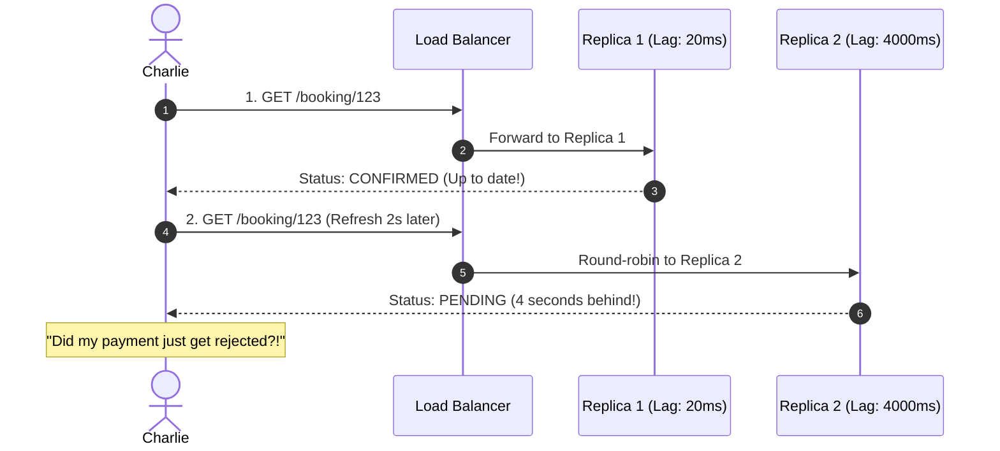

**Monotonic Reads Guarantee**: If a user makes several reads in sequence, they will never see data flip backward to an older state.

#### How to Guarantee Monotonic Reads:
- **Sticky Replica Routing**: Hash the User ID (`hash(user_id) % num_replicas`) so that an individual user always queries the exact same replica. If that replica fails, reroute to a replica with equal or higher $LSN$.

---

### 3. Consistent Prefix Reads

Recall **Bob's comment thread**: Bob saw an answer before he saw the question.

In a partitioned or sharded database where different partitions replicate at different speeds, causal relationships can be inverted:

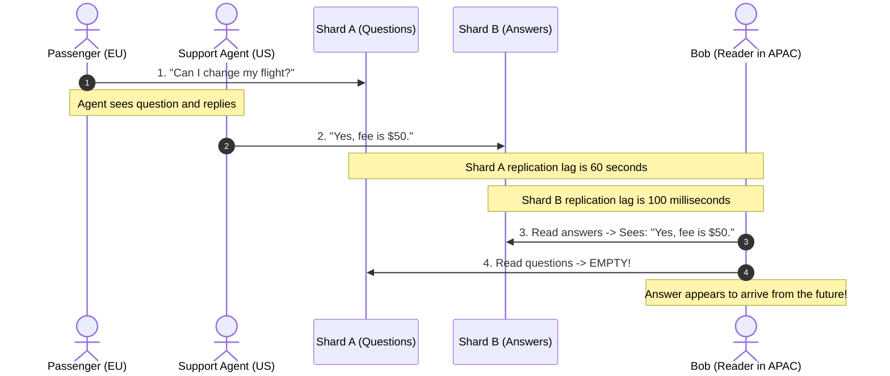

**Consistent Prefix Reads Guarantee**: If a sequence of writes happens in a specific causal order, anyone reading those writes will see them appear in that same causal order.

#### How to Guarantee Consistent Prefix Reads:
- Ensure that causally dependent writes are written to the **same partition**.
- Use algorithms that track causal dependencies, such as **Vector Clocks**.

---

## Concurrency and Version Vectors

In leaderless and multi-leader systems, two writes can occur at different nodes at roughly the same physical time. How does the system determine whether write $B$ overwrote write $A$, or if $A$ and $B$ were concurrent?

### The Happens-Before Relationship

An operation $A$ **happens before** operation $B$ ($A \to B$) if and only if:
1. Operation $B$ knew about operation $A$ at the time $B$ was executed, or
2. $B$ was built upon the state produced by $A$.

If neither $A$ happened before $B$, nor $B$ happened before $A$, then operations $A$ and $B$ are **concurrent** ($A \parallel B$).

```mermaid
flowchart TD
    subgraph ConcurrentWrites["Concurrent Write Detection"]
        direction TB
        V1["Initial: Seat 14A = Free (v1)"]
        V1 --> V2A["Alice sets Seat 14A = Alice (v2)"]
        V1 --> V2B["Bob sets Seat 14A = Bob (v2)"]
        V2A -.->|"Concurrent! Neither knew of the other"| V2B
    end

    style ConcurrentWrites fill:#020617,stroke:#38bdf8,stroke-width:2px
    style V1 fill:#0f172a,stroke:#38bdf8,stroke-width:1px
    style V2A fill:#0f172a,stroke:#34d399,stroke-width:1px
    style V2B fill:#0f172a,stroke:#eab308,stroke-width:1px
```

### Version Vectors

To capture causality across multiple replicas, databases use a **Version Vector** (a collection of version numbers, one for each replica):

$$\vec{V} = \{ R_1: v_1, R_2: v_2, \dots, R_k: v_k \}$$

```typescript
interface VersionVector {
  [nodeId: string]: number;
}

function dominates(v1: VersionVector, v2: VersionVector): boolean {
  // Returns true if v1 happened after v2 (v2 -> v1)
  let strictlyGreaterInAtLeastOne = false;
  for (const node in v2) {
    if ((v1[node] || 0) < v2[node]) return false;
    if ((v1[node] || 0) > v2[node]) strictlyGreaterInAtLeastOne = true;
  }
  return strictlyGreaterInAtLeastOne;
}

function areConcurrent(v1: VersionVector, v2: VersionVector): boolean {
  // If neither dominates the other, they occurred concurrently!
  return !dominates(v1, v2) && !dominates(v2, v1);
}
```

When a client reads a key, the database returns all values that are concurrent (called **siblings**), along with their version vectors. When the client updates the key, it must include the version vector it observed. The database can then safely discard all siblings dominated by the new version vector while preserving true concurrent updates.

---

## Architectural Decision Matrix: Replication Models

| Criterion | Single-Leader | Multi-Leader | Leaderless (Dynamo) |
| :--- | :--- | :--- | :--- |
| **Write Coordination** | Single point of write serialization | Multiple leaders accept local writes | Clients write to $W$ nodes in parallel |
| **Write Conflict Danger** | None (Single leader serializes) | High (Requires conflict resolution) | High (Requires LWW or Version Vectors) |
| **Read Scalability** | High (Add read replicas) | Very High (Local reads everywhere) | High (Tunable with $R$) |
| **Failover Complexity** | Moderate (Requires failover election) | Low for clients; complex cross-sync | Zero failover; nodes are symmetric |
| **Network Partition Impact** | Writes blocked if leader unreachable | Survives isolated datacenter cuts | Writes proceed if $W$ nodes reach quorum |
| **Typical Systems** | PostgreSQL, MySQL, MongoDB | CouchDB, DynamoDB Global Tables | Cassandra, ScyllaDB, Riak |

---

## Production Takeaways for TravelBuddy

1. **For Seat Bookings**: Never route booking updates to asynchronous read replicas. Reserve seats on a **single leader** (or consensus-backed partition) using atomic transactions.
2. **For User Profiles**: Implement **Read-Your-Own-Writes** by forcing reads to the leader for 30 seconds following any profile update.
3. **For Polling Status**: Enforce **Monotonic Reads** by pinning the user session to a single replica using consistent hashing on `user_id`.
4. **For Global Forum Threads**: Ensure causally related posts route to the same partition to enforce **Consistent Prefix Reads**.
