import { Callout } from 'fumadocs-ui/components/callout';
import { Tabs, Tab } from 'fumadocs-ui/components/tabs';
import { Steps, Step } from 'fumadocs-ui/components/steps';
import { Cards, Card } from 'fumadocs-ui/components/card';

## The TravelBuddy Narrative: The Thanksgiving Hotspot Crisis

By year three, **TravelBuddy** had scaled to 50 million registered passengers, 12,000 daily flights, and over 400 million historical ticket records. A single database server could no longer store the dataset on disk, nor could its RAM buffer pool hold the working index.

The team decided to shard the database. They partitioned the `reservations` table by **flight departure date**:
- Shard 1: Flights in January & February
- Shard 2: Flights in March & April
- ...
- Shard 6: Flights in November & December

On the Wednesday afternoon before **Thanksgiving**, Shard 6 collapsed.

```mermaid
flowchart TD
    subgraph Traffic["Incoming Flight Search & Booking Traffic"]
        T1["98% of Global Requests<br/>(Thanksgiving Week Flights)"]
        T2["2% of Requests<br/>(Future/Off-Peak Flights)"]
    end

    subgraph Shards["Database Shard Cluster"]
        S1["Shard 1 (Jan-Feb)<br/>CPU: 3% | Disk I/O: 1%"]
        S2["Shard 2 (Mar-Apr)<br/>CPU: 2% | Disk I/O: 1%"]
        S6["Shard 6 (Nov-Dec)<br/>CPU: 100% | Disk I/O: 100%<br/>OUT OF MEMORY & CRASHED"]
    end

    T1 ==> S6
    T2 --> S1
    T2 --> S2

    style S6 fill:#7f1d1d,stroke:#ef4444,stroke-width:3px
    style S1 fill:#0f172a,stroke:#38bdf8,stroke-width:1px
    style S2 fill:#0f172a,stroke:#38bdf8,stroke-width:1px
```

While five database servers sat virtually idle at 3% CPU utilization, Shard 6 was battered with 150,000 queries per second, suffered severe disk thrashing, and crashed under an out-of-memory kernel panic.

This is the classic **data skew and hotspot disaster**. Partitioning is not merely about chopping tables into arbitrary pieces; it requires understanding access patterns, index locality, and rebalancing math.

---

## Why Partition Data?

While **replication** provides multiple copies of the *same* data across different nodes (for fault tolerance and read scaling), **partitioning** (also known as **sharding**) divides a massive dataset into disjoint subsets called **partitions**:

- Each record (row, document, key-value pair) belongs to **exactly one partition**.
- Each partition functions as a smaller, self-contained database.
- A cluster of $M$ nodes can host thousands of partitions, enabling the system to scale storage and throughput far beyond the capacity of any single machine.

```mermaid
flowchart LR
    subgraph MasterDataset["Global Dataset (500 GB)"]
        D1["Keys A - Z"]
    end

    subgraph Partitions["Partitions"]
        P1["Partition 1<br/>Keys A - G"]
        P2["Partition 2<br/>Keys H - P"]
        P3["Partition 3<br/>Keys Q - Z"]
    end

    subgraph Nodes["Physical Machines"]
        N1[("Node 1<br/>Hosts P1")]
        N2[("Node 2<br/>Hosts P2")]
        N3[("Node 3<br/>Hosts P3")]
    end

    D1 --> P1 & P2 & P3
    P1 --> N1
    P2 --> N2
    P3 --> N3

    style MasterDataset fill:#020617,stroke:#38bdf8,stroke-width:2px
    style Partitions fill:#0f172a,stroke:#34d399,stroke-width:2px
    style Nodes fill:#0f172a,stroke:#eab308,stroke-width:2px
```

---

## Partitioning Strategies: Range vs. Hash

How does a database decide which partition holds a specific key?

### 1. Partitioning by Key Range

In **key range partitioning**, the database assigns a continuous range of keys (from minimum to maximum) to each partition, much like volumes of an encyclopedia (Volume 1: A–Am, Volume 2: An–Bz):

- **Mechanism**: The boundaries between ranges can be manually chosen by an administrator or automatically split by the database.
- **Advantage**: **Efficient Range Queries.** Queries searching for a contiguous slice of keys can be routed to a single partition:
  ```sql
  SELECT * FROM flights 
  WHERE flight_code BETWEEN 'TB-1000' AND 'TB-1050';
  ```
- **Disadvantage**: **Severe Hotspots.** If the partition key has a natural monotonic pattern (such as an autoincrement ID or a timestamp), all writes for the current time land on the exact same partition, leaving the rest of the cluster idle.

---

### 2. Partitioning by Hash of Key

To prevent hotspots, modern distributed databases pass the partition key through a cryptographically uniform hash function (such as MD5, MurmurHash3, or CityHash) and partition across the hash values:

$$\text{Partition ID} = \text{hash}(\text{key}) \pmod N$$

```mermaid
flowchart TD
    Key["Booking Key: 'TB-JFK-LHR-20261125'"]
    Hash["MurmurHash3('TB-JFK-LHR-20261125')<br/>= 0x7b8f9e12 (2,072,944,146)"]
    Modulo["2,072,944,146 mod 4 = Partition 2"]
    
    Key --> Hash --> Modulo

    style Key fill:#0f172a,stroke:#38bdf8,stroke-width:2px
    style Hash fill:#0f172a,stroke:#eab308,stroke-width:2px
    style Modulo fill:#0f172a,stroke:#34d399,stroke-width:2px
```

- **Advantage**: **Uniform Distribution.** Even if keys are sequential (`TB-001`, `TB-002`, `TB-003`), their hash values scatter evenly across the entire 32-bit or 64-bit integer space. Hotspots are dramatically reduced.
- **Disadvantage**: **Destruction of Range Queries.** Keys that are adjacent in the application domain are scattered across completely different nodes. A query for `WHERE booking_id BETWEEN 100 AND 200` must be executed as a **scatter-gather** query across *every single partition* in the cluster.

<Callout type="info" title="The Hybrid Solution: Compound Keys (Cassandra & DynamoDB)">
Cassandra resolves this trade-off using a **compound primary key**:
```sql
CREATE TABLE flight_seats (
    flight_id UUID,       -- PARTITION KEY (Hashed to locate the node)
    seat_number VARCHAR,  -- CLUSTERING KEY (Sorted in a local SSTable/B-Tree)
    passenger_name VARCHAR,
    PRIMARY KEY (flight_id, seat_number)
);
```
All seats for flight `TB-402` live on the exact same partition node, but *within* that partition, seats are kept in sorted order. You can execute fast range scans across seats on a single flight without cross-node network hops!
</Callout>

### Mitigating Severe Skew: The Key Salting Technique

Even with cryptographic hashing, what happens if an individual key itself experiences extreme write volume?
* In social networks: a celebrity with 100 million followers tweets.
* In TravelBuddy: tickets for a world cup final flight or flash sale open, generating 50,000 writes/sec to a single `flight_id`.

Because hashing a single key always produces the exact same hash value, **all writes for that key inevitably hammer a single physical partition**.

To eliminate this hotspot, systems engineers employ **Key Salting**:

```mermaid
flowchart TD
    subgraph WriteSalting["Write Path: Distribute across 100 partitions"]
        WriteReq["Write Event: {flight_id: 'FL-999'}"]
        RandSalt["Generate random salt: S in [0..99]"]
        SaltedKey["Salted Partition Key: 'FL-999_#42'"]
        WriteReq --> RandSalt --> SaltedKey
        SaltedKey --> Shard["Routes to Shard 42"]
    end

    subgraph ReadScatterGather["Read Path: Scatter-Gather across all 100 salts"]
        ReadReq["Read Aggregation: 'FL-999'"]
        ReadReq --> FanOut["Issue 100 parallel queries:<br/>'FL-999_#0' through 'FL-999_#99'"]
        FanOut --> Merge["Merge & sum counts in app layer"]
    end

    style WriteSalting fill:#020617,stroke:#38bdf8,stroke-width:2px
    style ReadScatterGather fill:#020617,stroke:#10b981,stroke-width:2px
```

1. **Write Path:**
   * Append a random two-digit salt to the primary key:
     $$\text{salted\_key} = \text{key} + \text{"\_"} + \text{random}(0, 99)$$
   * Writes for the celebrity key are now distributed evenly across up to 100 distinct shards.
2. **Read Path:**
   * To read all entries for the entity, the application or routing proxy must issue a **scatter-gather query across all 100 possible salted keys** (`key_0` through `key_99`) and merge the results in memory.
3. **Architectural Trade-Off:**
   * Salting makes writes $100\times$ more scalable, but makes every read $100\times$ more expensive.
   * *Best Practice:* Apply salting conditionally only to verified hot keys (e.g., tracking a metadata flag for celebrity accounts or flash sales).

---

## Consistent Hashing and Virtual Nodes

In naive hash partitioning, the partition index is calculated using modulo:

$$\text{node} = \text{hash}(\text{key}) \pmod N$$

If the cluster grows from $N = 4$ to $N = 5$ nodes, **almost every existing key maps to a new node**:

$$\frac{N}{N+1} = \frac{4}{5} = 80\% \text{ of all keys in the database must be moved!}$$

During a live rebalance, moving 80% of data across the network causes catastrophic cluster-wide I/O lockup.

### The Consistent Hashing Ring (Ketama Algorithm)

Consistent hashing maps both **keys** and **nodes** to points on a circular 32-bit integer ring ($0$ to $2^{32} - 1$):

1. Compute $\text{hash}(\text{Node IP})$ to place physical servers onto the ring.
2. To find the home node for a key, compute $\text{hash}(\text{key})$ and walk clockwise along the ring until you encounter the first node.

```mermaid
flowchart TD
    subgraph Ring["Consistent Hashing Ring (0 to 2^32 - 1)"]
        direction TB
        N1["Node 1 (Position 0x20000000)"]
        N2["Node 2 (Position 0x80000000)"]
        N3["Node 3 (Position 0xE0000000)"]
        
        K1["Key A: hash = 0x10000000 -> Routes to Node 1"]
        K2["Key B: hash = 0x50000000 -> Routes to Node 2"]
        K3["Key C: hash = 0xB0000000 -> Routes to Node 3"]
    end

    style Ring fill:#020617,stroke:#38bdf8,stroke-width:2px
    style N1 fill:#0f172a,stroke:#38bdf8,stroke-width:2px
    style N2 fill:#0f172a,stroke:#34d399,stroke-width:2px
    style N3 fill:#0f172a,stroke:#eab308,stroke-width:2px
```

When a new node (Node 4) is added to the ring at position `0x60000000`, **only keys between Node 1 and Node 4 are reassigned**. On average, adding a node requires moving only:

$$\frac{1}{N_{\text{new}}} = \frac{1}{5} = 20\% \text{ of keys}$$

### Virtual Nodes (Vnodes)

If physical nodes are placed at random locations on the ring, partitions will be highly unequal: some nodes hold huge spans of the ring, while others hold tiny slivers.

To achieve statistical uniformity, databases allocate **virtual nodes** (typically 128 to 256 vnodes per physical server):

```mermaid
flowchart LR
    subgraph Physical["2 Physical Servers"]
        ServerA["Server A (Fast 64-core)"]
        ServerB["Server B (Standard 16-core)"]
    end

    subgraph RingTokens["Virtual Nodes on Hash Ring"]
        VA1["A-vnode-1"]
        VB1["B-vnode-1"]
        VA2["A-vnode-2"]
        VA3["A-vnode-3"]
        VB2["B-vnode-2"]
        VA4["A-vnode-4"]
    end

    ServerA --> VA1 & VA2 & VA3 & VA4
    ServerB --> VB1 & VB2

    style Physical fill:#020617,stroke:#38bdf8,stroke-width:1px
    style RingTokens fill:#0f172a,stroke:#34d399,stroke-width:2px
```

- **Heterogeneous Hardware**: A powerful machine with 4TB of NVMe SSDs can be assigned 256 vnodes, while an older 1TB node is assigned 64 vnodes.
- **Smooth Rebalancing**: When a physical node crashes, its hundreds of virtual nodes are distributed evenly across all surviving machines, avoiding a thunderous load spike on any single neighbor.

---

## Secondary Index Partitioning

Partitioning works cleanly when querying by primary key. But real applications like TravelBuddy must query by non-primary attributes:
- *"Find all flights operated by Boeing 777 departing from JFK."*
- *"Find all reservations belonging to passenger surname 'Smith'."*

Martin Kleppmann details the two architectural approaches to partitioning secondary indexes:

```mermaid
flowchart TD
    subgraph Approaches["Secondary Index Architectures"]
        direction LR
        Local["1. Document-Partitioned (Local Index)<br/>Each partition indexes only its own data"]
        Global["2. Term-Partitioned (Global Index)<br/>Index keys are partitioned across the cluster"]
    end

    style Approaches fill:#020617,stroke:#38bdf8,stroke-width:2px
    style Local fill:#0f172a,stroke:#38bdf8,stroke-width:1px
    style Global fill:#0f172a,stroke:#34d399,stroke-width:1px
```

---

### 1. Document-Partitioned Index (Local Index)

In a document-partitioned setup, each partition maintains its own independent secondary index covering **only the documents stored within that specific partition**.

```mermaid
flowchart TD
    subgraph Partition1["Partition 1 (Keys 1 - 500)"]
        Data1["Flight Data Records"]
        Index1["Local Index: aircraft_type<br/>B777 -> [101, 204]<br/>A320 -> [14, 88]"]
    end

    subgraph Partition2["Partition 2 (Keys 501 - 1000)"]
        Data2["Flight Data Records"]
        Index2["Local Index: aircraft_type<br/>B777 -> [512, 890]<br/>A320 -> [701]"]
    end

    style Partition1 fill:#0f172a,stroke:#38bdf8,stroke-width:2px
    style Partition2 fill:#0f172a,stroke:#34d399,stroke-width:2px
```

- **Writing**: **Extremely fast and local.** When a new flight is inserted into Partition 1, only Partition 1 updates its local secondary index. No distributed locks or remote network calls are needed.
- **Reading**: **The Scatter-Gather Problem.** If a user queries `WHERE aircraft_type = 'B777'`, the coordinator has no idea which partition holds matching flights. It **must send the query to every single partition in the cluster**, wait for all responses, and merge the results:

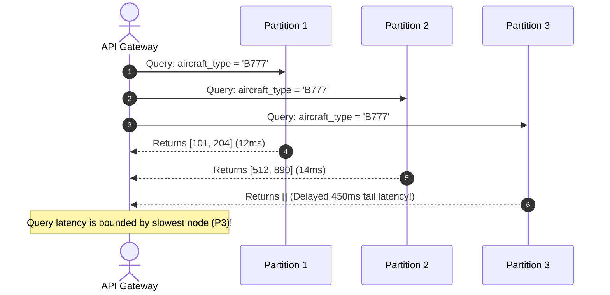

<Callout type="warn" title="Tail Latency Amplification">
In a cluster of 100 partitions, a scatter-gather query is vulnerable to the **straggler problem**: if even 1 of the 100 nodes experiences a brief garbage collection pause or disk stall, the client's end-to-end response time spikes.
</Callout>

---

### 2. Term-Partitioned Index (Global Index)

Instead of keeping indexes local, the database builds a **global secondary index** and partitions the index itself by the indexed term (e.g., indexed by letter: terms `A-F` on Node 1, `G-P` on Node 2, `Q-Z` on Node 3).

```mermaid
flowchart LR
    subgraph DataShards["Data Partitions (Partitioned by booking_id)"]
        D1["Data Node 1: Booking #12"]
        D2["Data Node 2: Booking #84"]
        D3["Data Node 3: Booking #99"]
    end

    subgraph GlobalIndex["Global Index Nodes (Partitioned by aircraft_type)"]
        GI1["Index Node A: 'A320' -> [#84]"]
        GI2["Index Node B: 'B777' -> [#12, #99]"]
    end

    D1 -.-> GI2
    D2 -.-> GI1
    D3 -.-> GI2

    style DataShards fill:#020617,stroke:#38bdf8,stroke-width:1px
    style GlobalIndex fill:#020617,stroke:#34d399,stroke-width:1px
```

- **Reading**: **Lightning fast.** To find all flights with `aircraft_type = 'B777'`, the client routes the query directly to Index Node B. No scatter-gather is needed.
- **Writing**: **Expensive and distributed.** Inserting a single flight requires writing the data row to Data Node 1, followed by an asynchronous or two-phase-commit write to Index Node B. If the index update is asynchronous, readers experience indexing lag.

---

## Rebalancing Strategies: How Clusters Grow

As TravelBuddy accumulates more passengers, new hardware nodes must be introduced into the cluster. How does data move to the new nodes without downtime?

### 1. Hash mod N (The Anti-Pattern)
As shown previously, $\text{hash}(\text{key}) \pmod N$ causes excessive data reshuffling whenever $N$ changes. **Never use this in production.**

### 2. Fixed Number of Partitions (Elasticsearch, Couchbase, Riak)
- Create significantly more partitions than physical nodes from day one (e.g., 1,000 partitions across 10 nodes = 100 partitions per node).
- When a new node is added, it simply steals a few whole partitions from existing nodes until balance is restored.
- **Advantage**: The total number of partitions never changes; partition boundaries never split. Only entire partition files are copied across nodes.

```mermaid
flowchart TD
    subgraph TenNodes["10 Physical Nodes (1,000 Partitions Total)"]
        N1["Node 1: Partitions 1-100"]
        N2["Node 2: Partitions 101-200"]
    end

    subgraph ElevenNodes["Add Node 11 to Cluster"]
        N1_new["Node 1: Partitions 1-90"]
        N11["Node 11: Steals Partitions 91-100 & 191-200"]
        N2_new["Node 2: Partitions 101-190"]
    end

    TenNodes ==> ElevenNodes

    style TenNodes fill:#020617,stroke:#38bdf8,stroke-width:1px
    style ElevenNodes fill:#020617,stroke:#34d399,stroke-width:1px
```

### 3. Dynamic Partition Splitting (HBase, CockroachDB, Bigtable)
- Partitions start as a single range.
- When a partition's size exceeds a configured threshold (e.g., 10 GB in HBase or 64 MB in CockroachDB), it **splits dynamically into two equal halves**.
- One half remains on the original node; the other half is migrated to an under-utilized node.
- If large volumes of data are deleted, adjacent partitions merge back together.

### 4. Partitions Proportional to Nodes (Cassandra)
- The number of partitions is strictly proportional to the number of nodes (e.g., fixed $K$ vnodes per physical machine).
- When a new node joins, it randomly claims tokens on the ring, splitting existing partition ranges.

---

## Request Routing: Finding the Correct Shard

When TravelBuddy's API Gateway receives an incoming HTTP request `GET /api/reservations/TB-9021`, how does it determine which database node holds the data?

Martin Kleppmann identifies three request routing architectures:

```mermaid
flowchart TD
    subgraph RoutingModels["Distributed Request Routing Models"]
        direction TB
        R1["1. Node Forwarding (Gossip Protocol)<br/>Client connects to ANY node; node routes internally (Cassandra)"]
        R2["2. Routing Proxy Tier<br/>Stateless proxies inspect key and route to correct shard (Vitess, Envoy)"]
        R3["3. Intelligent Fat Client<br/>Client library caches partition map directly (Kafka Consumer, Mongo Driver)"]
    end

    style RoutingModels fill:#020617,stroke:#38bdf8,stroke-width:2px
    style R1 fill:#0f172a,stroke:#38bdf8,stroke-width:1px
    style R2 fill:#0f172a,stroke:#34d399,stroke-width:1px
    style R3 fill:#0f172a,stroke:#eab308,stroke-width:1px
```

### The Role of Consensus in Partition Tracking

Regardless of whether a routing proxy or smart client is used, how do nodes agree on partition assignments?

```mermaid
flowchart TD
    Coord["Coordination Service<br/>(ZooKeeper / etcd / Raft)"]
    Proxy["Routing Tier / Vitess VTGate"]
    Data1[("Shard 1 (Partitions 1-50)")]
    Data2[("Shard 2 (Partitions 51-100)")]

    Data1 & Data2 -- "Heartbeats & Partition Heartbeats" --> Coord
    Proxy -- "Watches partition changes via long-poll" --> Coord
    Proxy -->|"Routes key directly"| Data1

    style Coord fill:#1e1b4b,stroke:#818cf8,stroke-width:2px
    style Proxy fill:#0f172a,stroke:#38bdf8,stroke-width:2px
```

Tools like **Apache ZooKeeper** or **etcd** maintain the authoritative mapping from partition ranges to physical node IP addresses. When a partition splits or moves, the coordination service notifies proxies via watch events, ensuring zero stale routing.

---

### Multi-Tenant Sharding & Blast Radius Isolation: The GitHub Architecture

In enterprise SaaS systems (such as GitHub, Slack, and Shopify), sharding is not merely a mechanism for data storage volume; it is a **fault containment boundary**.

GitHub's massive migration to sharded MySQL on Vitess demonstrates the power of **Tenant-Based Sharding**:

```mermaid
flowchart TD
    subgraph ClientRequests["Inbound User Traffic"]
        R1["Traffic for 'org_microsoft'"]
        R2["Traffic for 'org_google'"]
        R3["Traffic for 'org_netflix' (Spike / Outage!)"]
    end

    VTGate["VTGate Routing Proxy"]
    R1 & R2 & R3 --> VTGate

    subgraph Shards["Vitess MySQL Shard Clusters"]
        S1[("Shard 1: Tenant Orgs A-G<br/>(org_google, org_apple)")]
        S2[("Shard 2: Tenant Orgs H-N<br/>(org_microsoft)")]
        S3[("Shard 3: Tenant Orgs O-Z<br/>(org_netflix - 100% Saturation!)")]
    end

    VTGate -->|"hash(org_google) -> S1"| S1
    VTGate -->|"hash(org_microsoft) -> S2"| S2
    VTGate -->|"hash(org_netflix) -> S3"| S3

    style S3 fill:#450a0a,stroke:#ef4444,stroke-width:2px
    style S1 fill:#064e3b,stroke:#10b981,stroke-width:1px
    style S2 fill:#064e3b,stroke:#10b981,stroke-width:1px
```

1. **The Partition Key:** GitHub shards its core relational database by `organization_id` or `tenant_id`. All data belonging to an organization—repositories, issues, pull requests, commits—is co-located on the **same physical database shard**.
2. **Local Joins & ACID Transactions:** Because all repositories and issues for an organization live on the same shard, GitHub can execute standard relational `JOIN`s and single-shard ACID transactions without complex distributed two-phase commit protocols.
3. **Blast Radius Containment:**
   * If a massive automated script triggers an extreme traffic spike against `org_netflix`, Shard 3 might saturate CPU and disk I/O.
   * However, Shards 1 and 2 operate completely unaffected. Thousands of other organizations (`microsoft`, `google`) experience zero downtime or latency degradation.
   * *Architectural Principle:* Partitioning turns global site-wide catastrophic outages into localized, isolated shard-level incidents.

---

## Engineering Guidelines for TravelBuddy

| Scenario | Anti-Pattern | Recommended Solution |
| :--- | :--- | :--- |
| **Holiday Booking Rush** | Partitioning by departure date | Hash partition by `hash(flight_id)`. Append a random 2-digit salt (`flight_id + '_' + random(0, 9)`) for super-hot flights to distribute writes across 10 shards. |
| **Frequent Passenger Name Lookups** | Scatter-gather query across all shards | Maintain a document-partitioned local index for rare searches, or deploy a dedicated Elasticsearch cluster synced via Change Data Capture (CDC) for passenger name search. |
| **Adding New Nodes** | Modulo hashing ($\text{hash} \pmod N$) | Fixed partition scheme with 1,024 partitions, managed via an etcd-coordinated routing layer. |
