import { Callout } from 'fumadocs-ui/components/callout';
import { Tabs, Tab } from 'fumadocs-ui/components/tabs';
import { Steps, Step } from 'fumadocs-ui/components/steps';
import { Cards, Card } from 'fumadocs-ui/components/card';

## The TravelBuddy Narrative: The Seat 14A Double-Booking Race Condition

During the peak summer holiday season, **TravelBuddy** deployed a new high-throughput booking microservice.

At 14:02:15.102 UTC, two travelers clicked "Confirm Booking" for the last remaining premium seat (**Seat 14A**) on flight **TB-801**:
- **Alice** was booking from London.
- **Bob** was booking from New York.

Here was the naive application code executed on the application servers:

```typescript
// NAIVE BOOKING HANDLER (Vulnerable to Race Condition)
async function bookSeat(flightId: string, seatNumber: string, passengerId: string) {
  // Step 1: Check if seat is currently vacant
  const seat = await db.query(
    "SELECT is_booked FROM seats WHERE flight_id = $1 AND seat_number = $2",
    [flightId, seatNumber]
  );

  if (seat.rows[0].is_booked) {
    throw new Error("Seat is already reserved!");
  }

  // Step 2: Simulate payment gateway processing (250ms latency)
  await paymentGateway.chargePassenger(passengerId, 450.00);

  // Step 3: Mark seat as booked
  await db.query(
    "UPDATE seats SET is_booked = true, passenger_id = $3 WHERE flight_id = $1 AND seat_number = $2",
    [flightId, seatNumber, passengerId]
  );
}
```

Both requests interleaved concurrently:

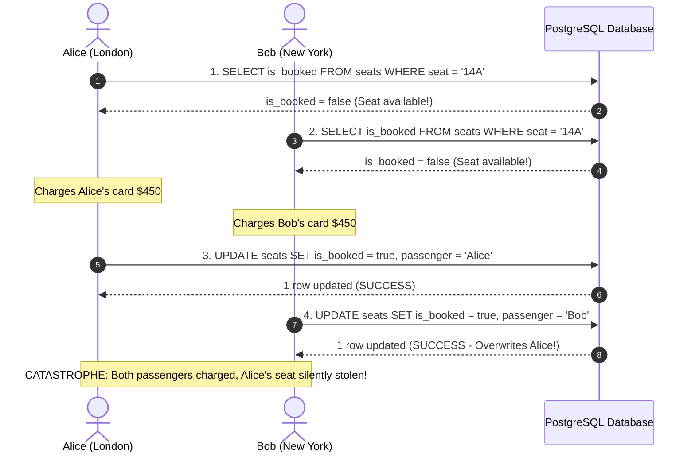

Both travelers received confirmation emails with boarding passes for Seat 14A. When Alice arrived at the gate, her boarding pass beeped red because Bob had overwritten her booking record milliseconds later.

This bug occurred because the developers did not understand **transactional isolation levels** and **concurrency anomalies**.

---

## What Does ACID Actually Mean?

The acronym **ACID** was coined in 1983 by Theo Härder and Andreas Reuter. Today, database vendors use ACID as marketing shorthand for "fault-tolerant and safe." But under Martin Kleppmann's rigorous analysis, the letters have distinct, subtle meanings:

```mermaid
flowchart TD
    subgraph ACIDBreakdown["Deconstructing the ACID Acronym"]
        direction TB
        A["A - Atomicity<br/>'Abortability': If an error occurs midway, rollback entirely. All-or-nothing."]
        C["C - Consistency<br/>Application-level invariants (e.g. credits = debits). Belongs to application logic, not DB."]
        I["I - Isolation<br/>Concurrent transactions execute as if they were running serially without interference."]
        D["D - Durability<br/>Once committed, data is safely persisted to non-volatile storage (WAL fsync)."]
    end

    style ACIDBreakdown fill:#020617,stroke:#38bdf8,stroke-width:2px
    style A fill:#0f172a,stroke:#38bdf8,stroke-width:1px
    style C fill:#0f172a,stroke:#eab308,stroke-width:1px
    style I fill:#0f172a,stroke:#34d399,stroke-width:1px
    style D fill:#0f172a,stroke:#a855f7,stroke-width:1px
```

<Callout type="info" title="The Misunderstood 'C' in ACID">
Martin Kleppmann famously points out: **Consistency does not belong in ACID.**
- Atomicity, Isolation, and Durability are properties of the **database engine**.
- Consistency (e.g., "every seat must have an assigned passenger", "account balance cannot drop below zero") depends on **application invariants**. The database cannot stop you from writing bad business logic that satisfies foreign key constraints.
- As Kleppmann quipped: *"Joe Celko famously coined ACID to make a nice acronym; without C, it would just be AID."*
</Callout>

---

## Weak Isolation Levels

If databases ran every transaction in strict serial sequence (one at a time), concurrency bugs would vanish—but throughput would collapse. To maximize concurrency, databases offer **weak (non-serializable) isolation levels**.

### 1. Read Uncommitted
- **Guarantee**: Prevents **dirty writes** (Transactions cannot overwrite uncommitted writes from other transactions).
- **Vulnerability**: Permits **dirty reads** (A transaction can read data written by another transaction that has not yet committed).
- If Transaction A updates Seat 14A and then crashes/aborts, Transaction B may have already read that uncommitted seat state and taken irreversible action. **Virtually never used in production.**

---

### 2. Read Committed
The default isolation level in PostgreSQL, Oracle, SQL Server, and MySQL (configured):
- **Prevents Dirty Reads**: Any reads from the database will only see data that has already been committed at the time of reading.
- **Prevents Dirty Writes**: Any writes to the database will only overwrite data that has already been committed.

```mermaid
flowchart LR
    subgraph DirtyReadDefense["How Read Committed Prevents Dirty Reads"]
        direction TB
        T1["Tx 1: UPDATE balance = 500<br/>(Uncommitted in WAL)"]
        OldVal[("Disk: balance = 1000<br/>(Committed Snapshot)")]
        T2["Tx 2: SELECT balance"]

        T2 -->|"Reads OLD committed value (1000)"| OldVal
        T1 -.->|"Cannot see uncommitted 500"| T2
    end

    style DirtyReadDefense fill:#020617,stroke:#38bdf8,stroke-width:2px
```

#### How It Is Implemented:
- **For Writes**: Uses row-level exclusive locks. When Transaction 1 modifies a row, it acquires a write lock. Transaction 2 must wait until Transaction 1 commits or aborts before modifying that same row.
- **For Reads**: The database retains both the old committed value and the new uncommitted value. While Transaction 1 is in progress, all other readers are given the old committed value without acquiring locks.

#### The Anomaly: Read Skew (Non-Repeatable Reads)
Consider Alice checking her two TravelBuddy account balances during a $100 transfer:

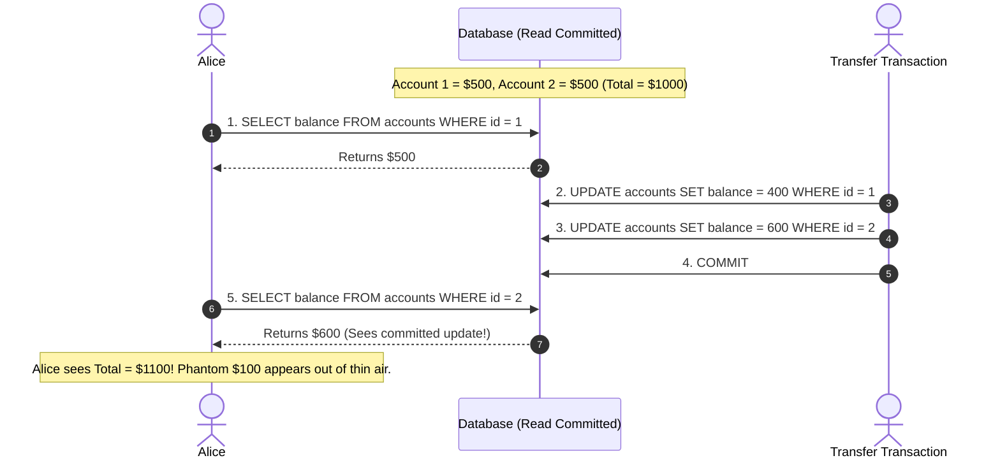

Alice observed a temporary inconsistency. If she refreshes the page, the numbers will reconcile. But for analytical reports or database backups, **read skew is unacceptable**.

---

### 3. Snapshot Isolation & MVCC (Multi-Version Concurrency Control)

**Snapshot Isolation** guarantees that each transaction sees a consistent snapshot of the database taken at the exact instant the transaction begins:
> *"Readers never block writers, and writers never block readers."*

#### How MVCC Works Under the Hood
Whenever a row is updated, the database does not overwrite the existing record in place. Instead, it creates a **new version** of the row stamped with transaction IDs:

- `created_by_tx`: The transaction ID ($txid$) that inserted this version.
- `deleted_by_tx`: The transaction ID ($txid$) that marked this version as deleted (initially empty).

```mermaid
flowchart TD
    subgraph MVCCRowVersions["Row: Seat 14A Version History"]
        direction TB
        V1["Version 1: {seat: '14A', status: 'FREE'}<br/>created_by_tx = 100 | deleted_by_tx = 105"]
        V2["Version 2: {seat: '14A', status: 'BOOKED_ALICE'}<br/>created_by_tx = 105 | deleted_by_tx = 112"]
        V3["Version 3: {seat: '14A', status: 'BOOKED_BOB'}<br/>created_by_tx = 112 | deleted_by_tx = NULL"]
    end

    style MVCCRowVersions fill:#020617,stroke:#38bdf8,stroke-width:2px
    style V1 fill:#0f172a,stroke:#64748b,stroke-width:1px
    style V2 fill:#0f172a,stroke:#38bdf8,stroke-width:1px
    style V3 fill:#0f172a,stroke:#34d399,stroke-width:2px
```

#### Snapshot Visibility Rules
When Transaction $T$ with ID $txid_T$ executes a read query, the database filters visible rows using these rules:
1. Ignore any row whose `created_by_tx` is greater than $txid_T$ (created after $T$ started).
2. Ignore any row whose `created_by_tx` was an active (uncommitted) transaction when $T$ started.
3. Ignore any row whose `deleted_by_tx` was committed *before* $T$ started.

Because old versions remain accessible, Alice's backup or reporting transaction sees a frozen, causally consistent snapshot of the world without acquiring any read locks.

#### Engine Internals: PostgreSQL (Heap & Vacuum) vs. MySQL InnoDB (Undo Logs)

While both engines provide Snapshot Isolation, their physical on-disk implementations differ fundamentally:

```mermaid
flowchart TD
    subgraph PostgresMVCC["1. PostgreSQL MVCC (Append-Only Heap)"]
        direction TB
        Page["8KB Heap Page on Disk"]
        T1["Tuple 1: xmin=100, xmax=105 (Dead Tuple!)"]
        T2["Tuple 2: xmin=105, xmax=0   (Live Tuple)"]
        Page --> T1 & T2
        Vac["Autovacuum Process: Scans page, reclaims dead tuple space"]
    end

    subgraph MySQLMVCC["2. MySQL InnoDB MVCC (In-Place + Undo Log)"]
        direction TB
        ClusteredPage["Clustered Index B+ Tree Leaf Page<br/>Row updated IN-PLACE directly in page!"]
        UndoSeg["Undo Log Segment (Rollback Pointer roll_ptr)<br/>[Old Version: balance=500, txid=100]"]
        ClusteredPage -->|"roll_ptr link"| UndoSeg
        Purge["Purge Threads: Free undo log segments when old tx commits"]
    end

    style PostgresMVCC fill:#020617,stroke:#38bdf8,stroke-width:2px
    style MySQLMVCC fill:#020617,stroke:#10b981,stroke-width:2px
```

* **PostgreSQL (Append-Only Tuples in Heap):**
  * Every row modification (`UPDATE`) creates a brand-new row tuple inside the table heap pages.
  * The old tuple is stamped with `xmax = current_txid` and becomes a **dead tuple**.
  * *Table & Index Bloat:* Dead tuples remain on disk until the background **`VACUUM` / `autovacuum`** daemon scans the pages and reclaims their line pointers. If long-running analytical queries delay vacuuming, tables and indexes bloat by $300\%–500\%$.
  * *Transaction ID Wraparound Freeze:* PostgreSQL uses a 32-bit integer for transaction IDs (approx. 2.1 billion transactions). If a database fails to freeze old tuple `xmin`s before reaching 2 billion transactions, PostgreSQL halts all write operations to prevent catastrophic data corruption. In high-throughput fleets, DBAs use tools like `pg_repack` or `pg_squeeze` to pack tables without exclusive write locks.
* **MySQL InnoDB (Clustered Index In-Place Updates + Undo Logs):**
  * InnoDB modifies rows **in-place** directly inside the primary key clustered index leaf page.
  * Previous row versions are written to append-only **Undo Log** rollback segments, chained via a 7-byte `roll_ptr`.
  * *Advantage:* Updates do not cause table page bloat; readers traverse `roll_ptr` backwards through the undo log to construct older snapshots.
  * *Cleanup:* Asynchronous **Purge Threads** discard undo log history once no active transaction's read view requires it.

---

## Concurrency Anomalies: Lost Updates and Write Skew

Snapshot isolation eliminates dirty reads, dirty writes, and read skew. However, two dangerous concurrency anomalies remain:

### 1. The Lost Update Problem
Two concurrent transactions execute a **read-modify-write cycle** on the same row:
1. Tx 1 reads counter $C = 42$.
2. Tx 2 reads counter $C = 42$.
3. Tx 1 writes $C = 43$ and commits.
4. Tx 2 writes $C = 43$ and commits.
The update from Tx 1 is silently lost.

#### Solutions to Lost Updates:
<Tabs items={['Atomic Write Operations', 'Explicit Locking', 'Compare-and-Set']}>
  <Tab value="Atomic Write Operations">
    Instead of reading into application memory, perform the increment inside SQL:
    ```sql
    UPDATE flights 
    SET available_seats = available_seats - 1 
    WHERE flight_id = 'TB-801';
    ```
    Relational databases execute single-statement updates under exclusive row locks, serializing access automatically.
  </Tab>
  <Tab value="Explicit Locking">
    Lock the row during the read phase using `SELECT ... FOR UPDATE`:
    ```sql
    BEGIN;
    SELECT is_booked FROM seats 
    WHERE flight_id = 'TB-801' AND seat_number = '14A' 
    FOR UPDATE;

    -- Other transactions are blocked here until this transaction commits!
    UPDATE seats SET is_booked = true, passenger_id = 'Alice' 
    WHERE flight_id = 'TB-801' AND seat_number = '14A';
    COMMIT;
    ```
  </Tab>
  <Tab value="Compare-and-Set">
    In databases without transactions (or for optimistic updates):
    ```sql
    UPDATE seats 
    SET is_booked = true, passenger_id = 'Alice', version = 2 
    WHERE flight_id = 'TB-801' AND seat_number = '14A' AND version = 1;
    ```
    If another transaction updated the row first, the version is no longer 1. The query updates 0 rows, signaling the application to retry.
  </Tab>
</Tabs>

---

### 2. Write Skew and Phantom Reads

**Write Skew** is the subtlest and most dangerous anomaly in distributed databases. It is a generalization of the lost update problem across **multiple different rows**.

#### The On-Call Doctor Classic Example
A hospital requires at least **one doctor on call** at all times. Doctors Alice and Bob are both on call and both feel sick:

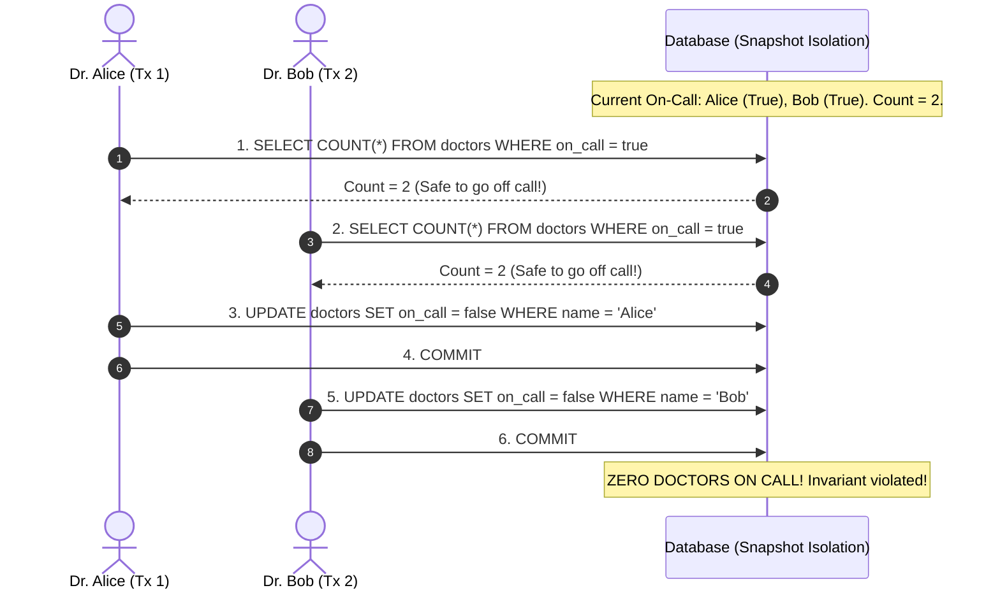

Why did Snapshot Isolation fail to stop this?
- Both transactions committed successfully because they **modified different rows** (Alice updated row `Alice`, Bob updated row `Bob`). Neither was a dirty write or a lost update on a single row!
- However, the premise of each transaction's decision (that another doctor was on call) was invalidated by the other transaction.

#### The Phantom Read Pattern
1. A transaction executes a `SELECT` query searching for rows satisfying a search condition.
2. The transaction makes a business decision based on the search result.
3. Another transaction executes an `INSERT`, `UPDATE`, or `DELETE` that **changes the set of rows matching the first query's condition**.
4. The first transaction commits, violating the invariant.

#### Materializing Conflicts: Tackling Phantoms Without Full Serializability

When no rows exist yet to lock (e.g., trying to prevent double-booking a conference room between 2 PM and 3 PM when the bookings table is currently empty for that slot):
* A `SELECT ... FOR UPDATE` has **zero rows to lock**. An exclusive row lock cannot attach to a non-existent row!
* **The Materialization Pattern:**
  1. The database schema pre-creates an artificial table of physical slots: `meeting_room_slots (room_id, date, start_time, end_time)`.
  2. For the next 365 days, all possible 30-minute intervals are pre-inserted as empty slot rows.
  3. When an application books a room, it executes `SELECT * FROM meeting_room_slots WHERE room_id = 4 AND start_time = '14:00' FOR UPDATE`.
  4. Now a physical row lock exists! The conflict is materialized onto an existing physical row, safely serializing concurrent bookings.

---

### Critical Anti-Pattern: Network I/O Inside Database Transactions

One of the most catastrophic anti-patterns in production backend systems is making synchronous external network calls inside an active database transaction:

```typescript
// ❌ CATASTROPHIC ANTI-PATTERN
await db.transaction(async (tx) => {
    // 1. Locks seat row in DB
    const seat = await tx.query("SELECT * FROM seats WHERE id = $1 FOR UPDATE", [seatId]);
    
    // 2. Synchronous HTTP call to external payment gateway!
    // DANGER: If Stripe takes 4,000ms or times out, this DB connection & lock remain frozen!
    const payment = await stripe.charges.create({ amount: seat.price });
    
    // 3. Update seat
    await tx.query("UPDATE seats SET booked = true WHERE id = $1", [seatId]);
});
```

```mermaid
flowchart LR
    subgraph Danger["Cascading Connection Pool Exhaustion"]
        T1["Tx 1: Acquires Row Lock"] --> Call["Calls External Payment API (Slow/Jitter: 5s)"]
        Call --> Holds["Holds DB Connection & Row Lock for 5,000ms!"]
        Holds --> Starve["Connection Pool Exhausted (100/100 active connections)"]
        Starve --> Crash["Entire API Gateway times out with HTTP 500/504!"]
    end

    style Danger fill:#450a0a,stroke:#ef4444,stroke-width:2px
```

* **The Rule:** **Keep transactions strictly local and microscopic (sub-millisecond).** 
* Always execute third-party API calls, LLM inference, or email dispatches **outside** the database transaction boundary, using an idempotent state machine (e.g. Reservation status: `PENDING_PAYMENT`, payment webhook confirms or background worker cancels after timeout).

---

## True Serializability: The Gold Standard

To eliminate write skew and phantoms completely, a database must guarantee **Serializability**: the concurrent execution of transactions must yield the exact same end state as if they had run in some purely serial sequence.

Martin Kleppmann details the three distinct implementations of serializability:

```mermaid
flowchart TD
    subgraph SerialImplementations["Serializability Implementations"]
        direction TB
        M1["1. Actual Serial Execution<br/>Run one transaction at a time on a single CPU core (Redis, VoltDB)"]
        M2["2. Two-Phase Locking (2PL)<br/>Pessimistic concurrency control with shared & exclusive locks"]
        M3["3. Serializable Snapshot Isolation (SSI)<br/>Optimistic concurrency control with phantom tracking (PostgreSQL SSI)"]
    end

    style SerialImplementations fill:#020617,stroke:#38bdf8,stroke-width:2px
    style M1 fill:#0f172a,stroke:#38bdf8,stroke-width:1px
    style M2 fill:#0f172a,stroke:#eab308,stroke-width:1px
    style M3 fill:#0f172a,stroke:#34d399,stroke-width:1px
```

---

### 1. Two-Phase Locking (2PL)

Used for decades in MySQL InnoDB (`SERIALIZABLE`) and DB2:
- **Shared Locks ($S$)**: Readers acquire shared locks. Multiple transactions can hold shared locks on the same row.
- **Exclusive Locks ($X$)**: Writers acquire exclusive locks. No other transaction can hold any lock on that row.
- **Rule**: If a row is being read, no one can write to it. If a row is being written, no one can read or write to it.

```mermaid
flowchart LR
    subgraph TwoPhases["The Two Phases of 2PL"]
        Growing["Phase 1: Growing Phase<br/>Acquire locks as queries execute; NO locks released"]
        Point["Commit / Abort Point"]
        Shrinking["Phase 2: Shrinking Phase<br/>Release ALL held locks simultaneously"]
        
        Growing --> Point --> Shrinking
    end

    style TwoPhases fill:#020617,stroke:#38bdf8,stroke-width:1px
```

#### Predicate Locks & Index-Range Locks
To prevent phantoms (e.g. inserting a row where none existed previously), 2PL uses **Index-Range Locks**:
- Instead of locking individual rows, the database locks the index range (e.g., all rows where `flight_id = 'TB-801'`).
- Any attempt by another transaction to insert a new booking for `TB-801` is blocked until the holding transaction completes.

<Callout type="warn" title="The High Cost of 2PL">
Under 2PL, throughput drops precipitously under high concurrency. Deadlocks occur frequently, requiring transactions to be aborted and retried.
</Callout>

---

### 2. Serializable Snapshot Isolation (SSI)

Pioneered in 2008 by Michael Cahill and adopted in PostgreSQL 9.1:
- **Optimistic Concurrency Control**: Transactions execute without acquiring blocking locks. Reads and writes proceed at full Snapshot Isolation speed.
- **Tracking Premise Violations**: The database engine tracks when a transaction reads data that is subsequently modified by a concurrent transaction (called an `si-read` dependency).
- **Abort on Commit**: When a transaction attempts to commit, the engine checks whether a cycle of causal dependencies was formed. If a potential write skew anomaly is detected, **one of the transactions is aborted and safely retried**.

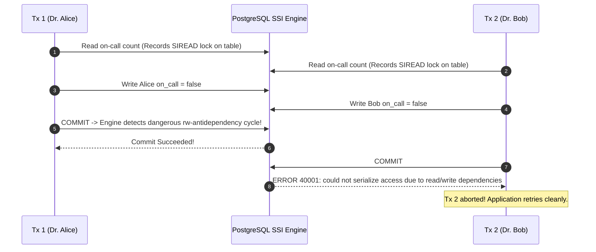

SSI provides full serializability with **zero read-write lock contention**, making it the modern standard for high-performance relational databases.

---

## Fixing TravelBuddy's Seat 14A Booking Race

Here is the bulletproof, production-grade implementation of TravelBuddy's seat reservation using PostgreSQL row-level locks and unique constraints:

```sql
-- DDL: Ensure database enforces physical uniqueness at engine level
CREATE TABLE flight_seats (
    flight_id VARCHAR(32) NOT NULL,
    seat_number VARCHAR(8) NOT NULL,
    passenger_id VARCHAR(64),
    status VARCHAR(16) NOT NULL DEFAULT 'AVAILABLE',
    updated_at TIMESTAMPTZ NOT NULL DEFAULT NOW(),
    PRIMARY KEY (flight_id, seat_number)
);

-- TRANSACTION: Atomic Reservation with Row Locking
BEGIN;

-- 1. Lock the exact seat row exclusively
SELECT status 
FROM flight_seats 
WHERE flight_id = 'TB-801' AND seat_number = '14A' 
FOR UPDATE;

-- 2. Verify availability in app logic; if available, mark RESERVED
UPDATE flight_seats 
SET status = 'RESERVED', 
    passenger_id = 'Alice-904', 
    updated_at = NOW()
WHERE flight_id = 'TB-801' 
  AND seat_number = '14A' 
  AND status = 'AVAILABLE';

COMMIT;
```

If Bob's transaction attempts to execute concurrently, his `SELECT ... FOR UPDATE` will block until Alice's transaction commits. Once Alice commits, Bob unblocks, observes `status = 'RESERVED'`, and gracefully returns: *"Seat 14A is no longer available; please choose another seat."*
