import { Callout } from 'fumadocs-ui/components/callout';
import { Tabs, Tab } from 'fumadocs-ui/components/tabs';
import { Steps, Step } from 'fumadocs-ui/components/steps';
import { Cards, Card } from 'fumadocs-ui/components/card';

## The TravelBuddy Narrative: The NTP Time-Warp Disaster

At 03:00:00 UTC on a Sunday morning, the database administrator at **TravelBuddy** scheduled an automated server maintenance job across the Virginia and Frankfurt datacenters.

During this window, an NTP (Network Time Protocol) client on the Virginia primary database resynchronized against an upstream Stratum-2 time server. The local clock had drifted forward by 450 milliseconds. The NTP daemon abruptly **stepped the clock backward by 450ms**.

At that exact instant, passenger **Danielle** was managing her flight reservation for flight **TB-505**:

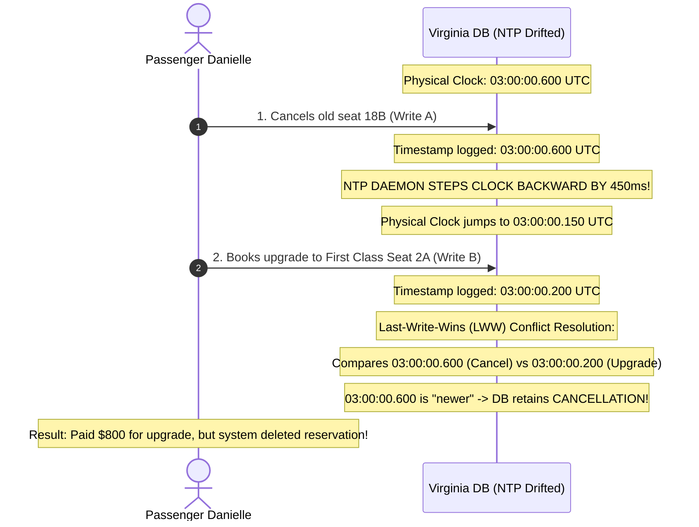

Because TravelBuddy used physical wall-clock timestamps for Last-Write-Wins (LWW) conflict resolution, **an event that happened later in real physical time was assigned an earlier timestamp than an event that happened before it**. Danielle’s $800 ticket upgrade was silently discarded.

This chapter explores why distributed systems cannot trust physical clocks, networks, or process runtimes.

---

## The Philosophy of Distributed Failure: Partial Failure

On a single computer, when hardware or software fails, it usually fails completely: the operating system kernel panics, the blue screen appears, or the power supply cuts out.

In a distributed system, you face **partial failure**:
- Some components of the cluster work perfectly, while others fail intermittently.
- The nondeterminism of partial failure makes distributed programming uniquely difficult: **a healthy node cannot determine whether a non-responsive peer has crashed, is temporarily overloaded, or if the network cable between them has been cut.**

```mermaid
flowchart TD
    subgraph SingleMachine["Single Machine Model"]
        Deterministic["Deterministic Failure:<br/>Process crashes -> OS notifies callers or system dies"]
    end

    subgraph DistributedCluster["Distributed Systems Reality"]
        Partial["Partial Failure:<br/>• Packet dropped silently<br/>• Node paused for 15s in GC<br/>• Network switch dropped route<br/>• Node is alive but cannot reach peer"]
    end

    style SingleMachine fill:#0f172a,stroke:#38bdf8,stroke-width:2px
    style DistributedCluster fill:#020617,stroke:#f43f5e,stroke-width:2px
```

---

## Unreliable Networks

The Internet and internal datacenter networks are **asynchronous packet networks**. When Node A sends a packet to Node B, the network gives **no guarantee** of:
1. Whether the packet will ever arrive.
2. How long the packet will take to arrive (latency is unbounded).
3. Whether packets will arrive in the order they were transmitted.
4. Whether a duplicate packet will arrive.

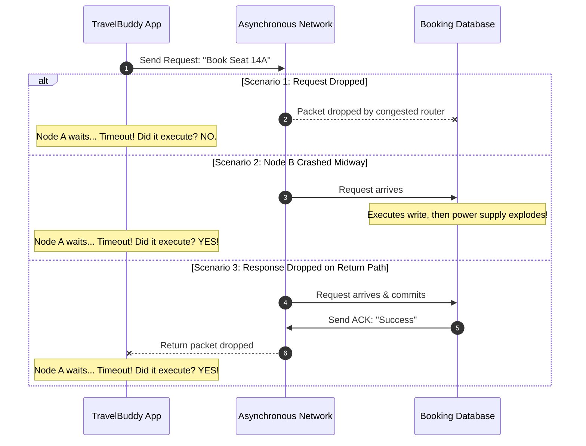

<Callout type="error" title="The Fundamental Timeout Dilemma">
When a network call times out, **it is impossible to know whether the remote node executed the request or not.**
- If you set a timeout too short (e.g., 100ms), a temporary latency spike causes the cluster to falsely declare healthy nodes dead, triggering costly failover storms and cascading thundering herds.
- If you set a timeout too long (e.g., 60 seconds), the system leaves users waiting for a full minute whenever a node actually crashes.
</Callout>

### Adaptive Heartbeats: The $\phi$-Accrual Failure Detector

Traditional clusters rely on a static threshold: *"If no heartbeat arrives in 10 seconds, mark the node dead."*
In cloud networks with unpredictable noisy neighbors and garbage collection pauses, static timeouts fail:
* During morning peak load, normal network latency jumps from 2ms to 2,000ms. A 2-second timeout triggers false failovers.
* Increasing the timeout to 30 seconds leaves dead nodes in rotation for half a minute.

To solve this, **Hayashibara et al. (2004)** introduced the **$\phi$-Accrual Failure Detector** (implemented in **Apache Cassandra** and **Akka Cluster**):

```mermaid
flowchart LR
    Heartbeat["Incoming Heartbeat History<br/>Sliding Window: [100ms, 102ms, 98ms, 105ms]"] --> Distribution["Fit to Normal Distribution<br/>(Mean mu, Variance sigma^2)"]
    Distribution --> Prob["Compute P_later(t - t_last)<br/>Probability heartbeat is merely delayed"]
    Prob --> Phi["Calculate Suspicion Level phi = -log10(P_later)"]
    Phi --> Decision{"phi > Threshold?<br/>(e.g. phi = 8)"}
    Decision -- Yes --> MarkDead["Mark Node Dead / Initiate Failover"]
    Decision -- No --> Wait["Keep Node in Cluster (Normal Jitter)"]

    style Heartbeat fill:#020617,stroke:#38bdf8,stroke-width:2px
    style Phi fill:#0f172a,stroke:#f59e0b,stroke-width:2px
    style MarkDead fill:#450a0a,stroke:#ef4444,stroke-width:2px
```

* **Continuous Suspicion Metric:** Instead of returning a binary `true/false`, the accrual detector outputs a continuous suspicion value $\phi$:
  $$\phi = -\log_{10}\left(P_{\text{later}}(t - t_{\text{last}})\right)$$
* **Interpretation:**
  * $\phi = 1$: A $10\%$ chance that the delay is normal network jitter (1 in 10 false positive).
  * $\phi = 2$: A $1\%$ chance of false positive ($10^{-2}$).
  * $\phi = 8$: A $0.000001\%$ chance of false positive ($10^{-8}$) — the recommended threshold in Cassandra for declaring a node dead.
* **Dynamic Self-Tuning:** If the network is calm, $\phi$ ramps up quickly, triggering failover in hundreds of milliseconds. If network variance is high, the model widens its distribution, automatically preventing false failover storms without manual configuration!

---

### The Two Generals Problem: Proof of Unreliable Coordination

Can two servers ever guarantee 100% agreement over an unreliable network?

The classic thought experiment in distributed computing proves this is mathematically impossible:

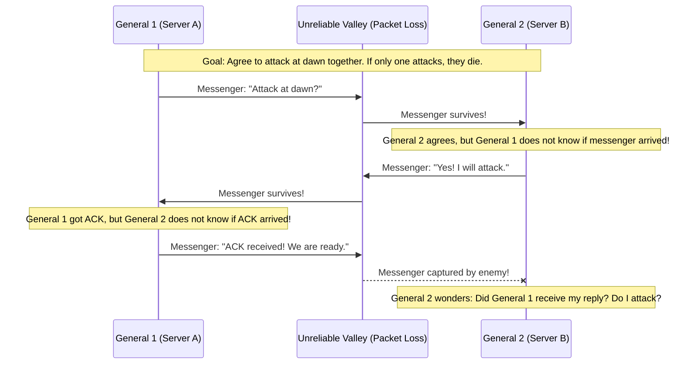

* **The Inductive Impossibility Proof:**
  * Suppose there exists a protocol of $N$ messages that guarantees consensus.
  * The final messenger ($M_N$) could always be intercepted by the enemy.
  * Therefore, the sender of $M_N$ cannot rely on $M_N$ arriving, and the recipient cannot rely on receiving it.
  * Hence, message $M_N$ was redundant; the protocol must work with $N-1$ messages.
  * By mathematical induction, we reduce to 0 messages, which is impossible.
* **The Lesson:** In an asynchronous network with packet loss, **no deterministic protocol can achieve common knowledge**. Systems must settle for quorum consensus (majority agreement) rather than unanimous certainty.

---

## Clocks in Distributed Systems: Time is an Illusion

Computers use physical quartz crystal oscillators to measure the passage of time. Under variations in temperature, voltage, and crystal manufacturing tolerances, quartz clocks suffer from **clock drift** (typically gaining or losing several seconds per week).

Distributed algorithms must distinguish between two fundamentally different types of operating system clocks:

```mermaid
flowchart TD
    subgraph ClockTypes["The Two Types of OS Clocks"]
        direction TB
        TOD["1. Time-of-Day Clocks (Wall Clocks)<br/>• clock_gettime(CLOCK_REALTIME)<br/>• System.currentTimeMillis()<br/>• Returns seconds since Jan 1, 1970 UTC<br/>• Can jump BACKWARDS during NTP sync!"]
        MONO["2. Monotonic Clocks<br/>• clock_gettime(CLOCK_MONOTONIC)<br/>• System.nanoTime()<br/>• Monotonically increases with CPU ticks<br/>• Value has no absolute meaning; used ONLY for durations (t2 - t1)"]
    end

    style ClockTypes fill:#020617,stroke:#38bdf8,stroke-width:2px
    style TOD fill:#0f172a,stroke:#f43f5e,stroke-width:1px
    style MONO fill:#0f172a,stroke:#34d399,stroke-width:1px
```

### NTP Synchronization: Slew vs. Step
To prevent clocks from drifting endlessly, computers run NTP daemons that query atomic clocks and GPS receivers over the network:
- **Slewing**: If the local clock is off by less than 128 milliseconds, NTP adjusts the clock frequency slightly (speeding it up or slowing it down by up to 0.05%) to smoothly drift back into sync.
- **Stepping**: If the clock is off by more than 128 milliseconds, NTP **abruptly steps the clock forward or backward**. When a clock steps backward, `currentTimeMillis()` yields a timestamp smaller than a timestamp generated milliseconds earlier!

### The Trap of Last-Write-Wins (LWW)
Many databases (Apache Cassandra, Riak) default to **Last-Write-Wins (LWW)** conflict resolution: when two writes compete, the write with the highest wall-clock timestamp wins.

As demonstrated in TravelBuddy's Danielle incident:
1. Clocks on different servers can easily drift by 50 to 500 milliseconds.
2. A fast write on a server whose clock is 100ms slow will be permanently overwritten by an older write on a server whose clock is 100ms fast.
3. **LWW silently discards data without generating an error.**

---

## Google TrueTime: Taming Physical Clock Uncertainty

In 2012, Google published the design of **Spanner**, a globally distributed database that guarantees **external consistency (linearizable serializability)** across multi-datacenter clusters.

Spanner solved the clock drift problem using the **TrueTime API**.

### The TrueTime Uncertainty Interval
Instead of pretending that a clock returns a single precise point in time $t$, TrueTime explicitly returns an **interval of uncertainty**:

$$\text{TT.now}() \to [t_{\text{earliest}}, t_{\text{latest}}]$$

where:
$$t_{\text{latest}} - t_{\text{earliest}} = 2\epsilon$$

The parameter $\epsilon$ represents the maximum clock error bound (typically between 1 ms and 7 ms in Google datacenters equipped with redundant atomic clocks and GPS receivers in every datacenter).

```mermaid
flowchart LR
    subgraph TrueTimeInterval["TrueTime Uncertainty Interval"]
        direction LR
        TE["t_earliest"] --- TrueT["Actual Physical Instant"]
        TrueT --- TL["t_latest"]
    end

    style TrueTimeInterval fill:#020617,stroke:#38bdf8,stroke-width:2px
    style TrueT fill:#1e3a8a,stroke:#60a5fa,stroke-width:2px
```

### The "Wait Out the Uncertainty" Protocol
If Transaction $T_1$ writes data at timestamp $s_1$, how can Spanner guarantee that a subsequent Transaction $T_2$ will definitely receive a timestamp $s_2 > s_1$?

Spanner enforces the **Wait-Out-The-Uncertainty rule**:
1. When $T_1$ requests a commit timestamp, the engine picks $s_1 = t_{\text{latest}}$ from $\text{TT.now}()$.
2. The transaction **deliberately pauses and waits** for $2\epsilon$ time (up to 7 milliseconds) before releasing locks and acknowledging the client!
3. By the time $T_1$ finishes waiting, physical time is guaranteed to have passed $s_1$. Any subsequent transaction $T_2$ will read $\text{TT.now}().t_{\text{earliest}} > s_1$, guaranteeing total causal order globally.

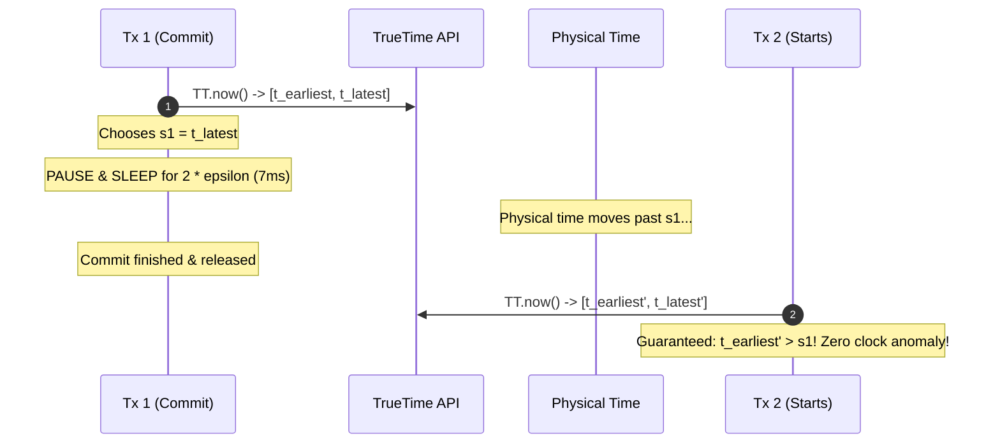

---

## Process Pauses and the Zombie Leader

Consider a distributed lock implemented via leases. Node 1 obtains a lease to be the leader for 10 seconds:

```java
// DANGEROUS PATTERN: Assuming execution is instantaneous
void processBookingBatch() {
    if (lease.isValid()) { // Checks: 8 seconds remaining on lease
        // DANGER: What if a Stop-The-World GC pause happens HERE?
        storageEngine.writeCustomerData(batch);
    }
}
```

What could possibly go wrong?

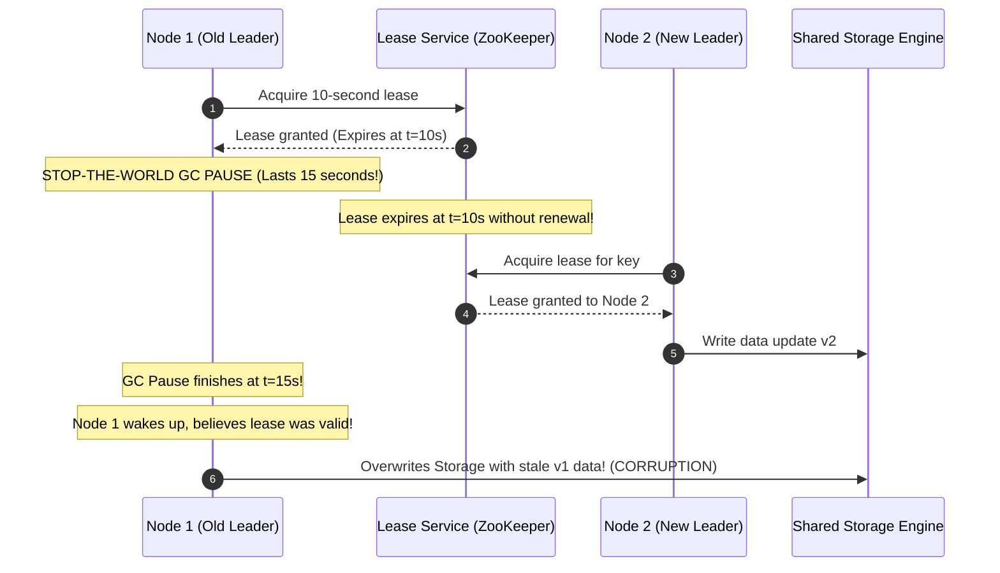

### Causes of Unpredictable Process Pauses:
1. **Garbage Collection**: Stop-the-world GC sweeps in Java, Go, or .NET can freeze a thread for tens of seconds.
2. **Virtual Machine Live Migration**: When AWS or GCP migrates a guest VM to a new hypervisor host, CPU execution is suspended for tens to hundreds of milliseconds.
3. **OS Page Swapping**: If memory is overcommitted, reading code or data from pagefile/swap stalls the CPU waiting for slow disk I/O.
4. **Unix Signals**: Pausing processes via `SIGSTOP`.

### The Solution: Fencing Tokens

To protect shared storage from zombie leaders waking from a pause, we use **fencing tokens**:

1. Every time the lock service grants a lease, it issues a **monotonically increasing fencing token** (e.g., token 34, 35, 36).
2. Whenever a client writes to the storage engine, it **must attach its fencing token** to the request.
3. The storage engine remembers the highest token it has ever processed. If a write arrives with a token smaller than the highest seen token, **the write is rejected**.

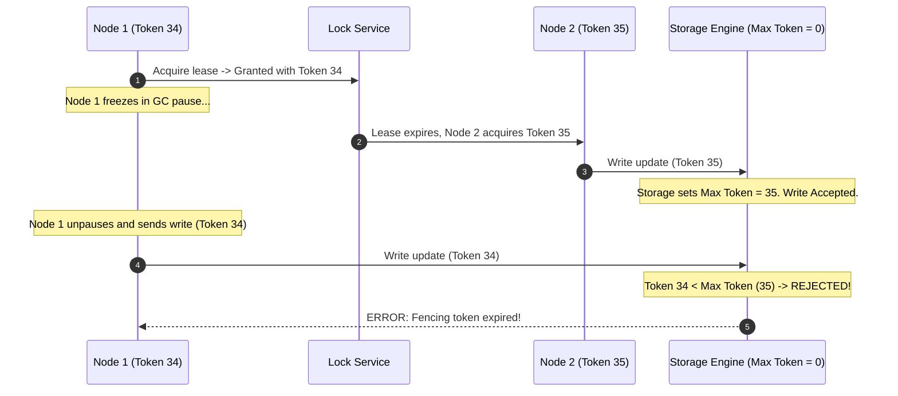

---

## Fault Models: Crash-Stop vs. Byzantine Faults

In distributed systems theory, we formally categorize the types of failures our algorithms must survive:

```mermaid
flowchart TD
    subgraph FaultHierarchy["Hierarchy of Distributed Fault Models"]
        direction TB
        CS["Crash-Stop Model<br/>A node operates correctly until it crashes. Once dead, it NEVER resumes."]
        CR["Crash-Recovery Model (Standard Cloud Reality)<br/>Nodes can crash, lose in-memory state, reboot, and catch up from WAL disk logs."]
        BYZ["Byzantine Fault Model<br/>Nodes can act maliciously, lie, forge messages, or tamper with data.<br/>(Blockchain, Aerospace, Bitcoin)"]
    end

    style FaultHierarchy fill:#020617,stroke:#38bdf8,stroke-width:2px
    style CS fill:#0f172a,stroke:#38bdf8,stroke-width:1px
    style CR fill:#0f172a,stroke:#34d399,stroke-width:1px
    style BYZ fill:#0f172a,stroke:#f43f5e,stroke-width:1px
```

### Why Most Enterprise Systems Assume Crash-Recovery:
In private enterprise infrastructure (such as TravelBuddy's AWS clusters), nodes are controlled by the same organization. Nodes may suffer software bugs, hardware crashes, or network loss, but they do not actively forge cryptographic signatures or attempt to defraud other nodes.

Therefore, algorithms like **Raft** and **Paxos** are designed for the **Crash-Recovery model**, achieving extreme throughput without the prohibitive overhead of Byzantine fault tolerance (BFT).

---

## Summary: Designing for Failure in TravelBuddy

1. **Never use physical wall-clock timestamps for causality**: Never rely on `System.currentTimeMillis()` for Last-Write-Wins (LWW) conflict resolution across distributed nodes. Use logical timestamps (Lamport clocks, Version Vectors).
2. **Always fence distributed locks**: Never assume a lock lease check remains valid by the time the I/O statement executes. Always validate monotonically incrementing fencing tokens at the storage layer.
3. **Expect process pauses**: Configure JVM garbage collectors for low-latency concurrent sweeping (ZGC or Shenandoah), pin memory to prevent swap thrashing, and size heartbeat timeouts conservatively.
