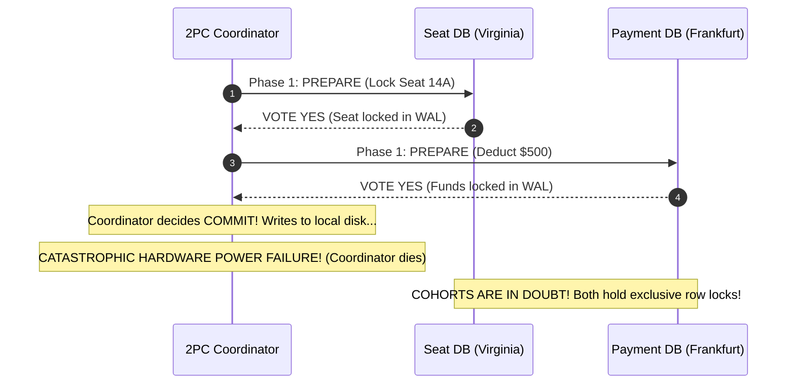
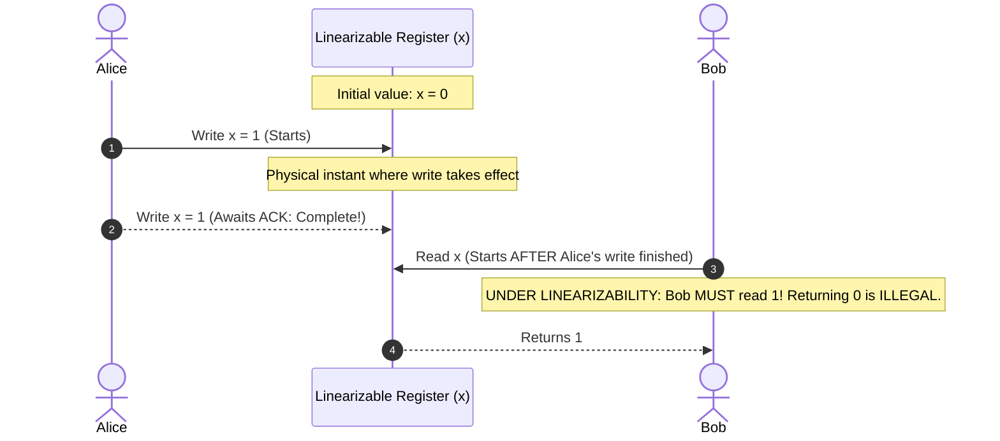
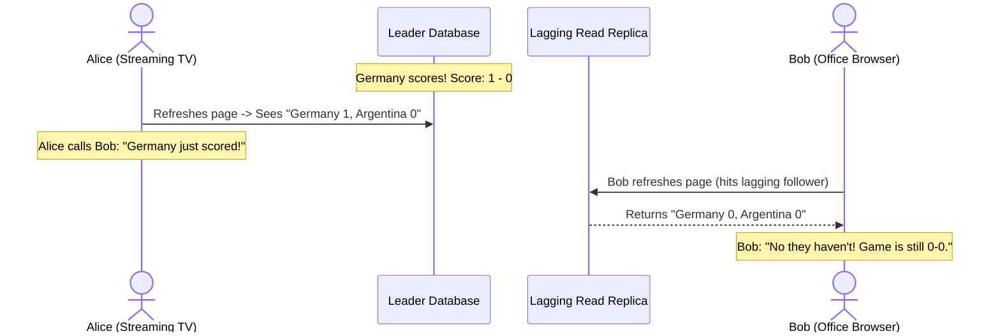
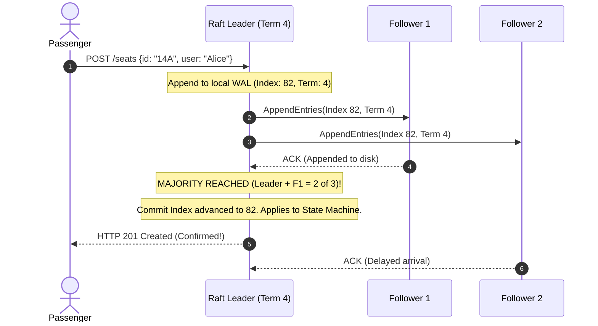

import { Callout } from 'fumadocs-ui/components/callout';
import { Tabs, Tab } from 'fumadocs-ui/components/tabs';
import { Steps, Step } from 'fumadocs-ui/components/steps';
import { Cards, Card } from 'fumadocs-ui/components/card';

## The TravelBuddy Narrative: The 18-Hour Coordinator Deadlock

During a high-profile flash sale for holiday flights, **TravelBuddy** executed a distributed transaction across two independent systems:
1. The **Seat Reservation Database** (PostgreSQL in Virginia)
2. The **Payment Ledger Database** (MySQL in Frankfurt)

To guarantee that a passenger was never charged without a confirmed seat, the engineering team implemented a classic **Two-Phase Commit (2PC)** protocol with a central microservice acting as the Transaction Coordinator.

At 21:14:02 UTC, the coordinator initiated a 2PC transaction for passenger **Edward**:

Both databases voted `YES` and placed exclusive row-level locks on the seat and the bank account.
Before the coordinator could transmit the `COMMIT` messages, its hosting server suffered an unrecoverable hardware power surge.

The result:
- The Seat DB in Virginia held an exclusive lock on Seat 14A.
- The Payment DB in Frankfurt held an exclusive lock on Edward’s bank account.
- Neither database knew whether the other had voted Yes or No, or whether the coordinator had decided to Commit or Abort.
- Under the mathematical rules of 2PC, **the databases could not make an independent decision without risking data inconsistency.**

For **18 hours**, until a database administrator manually reviewed transaction logs and forced a manual commit, Seat 14A remained locked, and Edward's bank account was frozen.

This crisis illustrates the core challenge of distributed data: **how do multiple machines reach agreement (consensus) in the presence of partial failures?**

---

## Linearizability vs. Serializability

Few concepts in computer science cause more confusion than the difference between **Linearizability** and **Serializability**. Although both sound like "making things sequential," they operate on completely different dimensions:

```mermaid
flowchart TD
    subgraph ConsistencyDichotomy["Linearizability vs Serializability"]
        direction TB
        LIN["Linearizability (Recency Guarantee)<br/>• Applies to SINGLE objects (registers, keys)<br/>• Real-time constraint: once a write completes, all subsequent reads MUST see it.<br/>• System behaves as if there is only ONE copy of the data."]
        SER["Serializability (Multi-Operation Guarantee)<br/>• Applies to MULTI-OBJECT transactions<br/>• Ensures concurrent transactions execute equivalently to SOME serial order.<br/>• Does NOT impose real-time constraints!"]
        STRICT["Strict Serializability (External Consistency)<br/>• Combines BOTH: Multi-object serializability + real-time linearizability.<br/>• The gold standard implemented by Google Spanner & CockroachDB."]
    end

    style ConsistencyDichotomy fill:#020617,stroke:#38bdf8,stroke-width:2px
    style LIN fill:#0f172a,stroke:#38bdf8,stroke-width:1px
    style SER fill:#0f172a,stroke:#eab308,stroke-width:1px
    style STRICT fill:#0f172a,stroke:#34d399,stroke-width:2px
```

### The Linearizability Invariant

A system is linearizable if:
> **As soon as any client finishes a write operation, all subsequent read operations (by any client anywhere in the world) must return the new value or an even newer value.**

If a system allows Bob to read the old value `0` after Alice’s write has completed, the system is **not linearizable**.

#### The Cost of Linearizability: The CAP Theorem
The famous **CAP Theorem** (Gilbert & Lynch, 2002) is strictly about linearizability:
- If your system requires **Linearizability (Consistency)**, and a **Network Partition ($P$)** occurs between two datacenters, nodes in the disconnected datacenter **must reject writes or wait**, sacrificing **Availability ($A$)**.
- If you demand that disconnected nodes continue accepting writes ($A$), the system cannot guarantee linearizability ($C$).

#### The Attiya-Welch Theorem: The Latency Cost of Linearizability

Even in the absence of network partitions, linearizability imposes a fundamental physics penalty proven by **Hagit Attiya and Jennifer Welch (1994)**:

<Callout type="warn" title="The Attiya-Welch Lower Bound">
In any distributed system implementing a linearizable read/write register over an asynchronous network with network delay bound $d$, the sum of read response time $r$ and write response time $w$ must satisfy:
$$r + w \ge d$$
</Callout>

* **The Trade-Off:**
  * If you design an engine with instantaneous local reads ($r = 0$, reading directly from local memory without network round-trips), **writes must take at least the full round-trip network delay ($w \ge d$)** to synchronize synchronously with remote replicas.
  * Conversely, if you design an engine with instantaneous local writes ($w = 0$), **every read query must pay the full network delay ($r \ge d$)** to poll replicas and verify recency.
  * You cannot build a distributed database that offers both zero-latency reads and zero-latency writes while remaining linearizable.

#### Real-World Intuition: The World Cup Score Anomaly

In *Designing Data-Intensive Applications*, Martin Kleppmann illustrates why non-linearizable replication breaks human assumptions:

* Because Alice communicated out-of-band (via telephone) to Bob, a causal dependency was established outside the database.
* When Bob queried a lagging replica, he traveled "backwards in time", violating linearizability and breaking causal expectations.

---

## Total Order Broadcast

To coordinate distributed state machines, we need an abstraction known as **Total Order Broadcast** (Atomic Broadcast):

A protocol for transmitting messages to a set of nodes such that two safety properties hold:
1. **Reliable Delivery**: If a message is delivered to one correct node, it will eventually be delivered to all correct nodes.
2. **Total Order**: All nodes deliver all messages in the **exact same order**.

```mermaid
flowchart TD
    subgraph TotalOrderLog["Total Order Broadcast Append-Only Log"]
        direction LR
        M1["Msg #1: Seat 14A -> Alice"] --> M2["Msg #2: Seat 14B -> Bob"]
        M2 --> M3["Msg #3: Seat 14C -> Charlie"]
    end

    subgraph NodeReplicas["Independent State Machine Replicas"]
        R1[("Node 1 (US)<br/>Executes: 1, 2, 3")]
        R2[("Node 2 (EU)<br/>Executes: 1, 2, 3")]
        R3[("Node 3 (APAC)<br/>Executes: 1, 2, 3")]
    end

    TotalOrderLog ==> R1 & R2 & R3

    style TotalOrderLog fill:#020617,stroke:#38bdf8,stroke-width:2px
    style NodeReplicas fill:#0f172a,stroke:#34d399,stroke-width:1px
```

### State Machine Replication (SMR)
Formulated by **Fred Schneider**:
> *If every replica starts in the exact same initial state, and every replica applies the exact same sequence of deterministic transitions in the exact same total order, all replicas will end up in the exact same state.*

**Total Order Broadcast is mathematically equivalent to Distributed Consensus.** If you can solve consensus, you can implement Total Order Broadcast; if you have Total Order Broadcast, you can solve consensus.

---

## Two-Phase Commit (2PC): The Atomic Commitment Protocol

When an atomic transaction spans multiple heterogeneous storage nodes (e.g., reserving a seat in Postgres while deducting loyalty points in Redis), databases turn to **Two-Phase Commit (2PC)**:

```mermaid
flowchart TD
    subgraph Phase1["Phase 1: Prepare Phase"]
        P1["Coordinator sends PREPARE to all cohorts.<br/>Cohorts check constraints, acquire row locks, write redo/undo logs to disk.<br/>Cohorts reply with VOTE: YES or NO."]
    end

    subgraph Phase2["Phase 2: Commit Phase"]
        P2["If ALL cohorts vote YES:<br/>Coordinator writes COMMIT to its WAL, then sends COMMIT to all cohorts.<br/>If ANY cohort votes NO (or times out):<br/>Coordinator writes ABORT to its WAL, then sends ABORT to all cohorts."]
    end

    Phase1 ==> Phase2

    style Phase1 fill:#0f172a,stroke:#38bdf8,stroke-width:2px
    style Phase2 fill:#0f172a,stroke:#34d399,stroke-width:2px
```

### Why Cohorts Cannot Unilaterally Decide
Once a cohort votes `YES`, it enters the **In-Doubt State**:
- It has surrendered its sovereignty. It is legally bound to commit if the coordinator commands commit, or abort if the coordinator commands abort.
- If it unilaterally decides to abort, the coordinator might have sent commit to another cohort $\implies$ **Atomicity violated**.
- If it unilaterally decides to commit, another cohort might have voted No $\implies$ **Consistency violated**.

<Callout type="error" title="The Fatal Flaw of 2PC: The Blocking Coordinator">
2PC is a **blocking atomic commitment protocol**. If the coordinator crashes after cohorts vote `YES`, cohorts are frozen indefinitely holding locks.
This is why 2PC is notoriously fragile for high-availability cloud systems: a single dead coordinator blocks the entire cluster.
</Callout>

### Can We Avoid Blocking? Three-Phase Commit (3PC)

To solve the blocking coordinator problem of 2PC, researchers developed **Three-Phase Commit (3PC)** (Skeen, 1981):

```mermaid
flowchart TD
    subgraph ThreePhases["Three-Phase Commit Protocol (3PC)"]
        direction TB
        P1["Phase 1: Can-Commit?<br/>Coordinator asks cohorts: 'Can you commit?' (Cohorts vote YES/NO)"]
        P2["Phase 2: Pre-Commit<br/>If all YES, coordinator broadcasts PRE-COMMIT.<br/>Cohorts ACK: 'Ready to commit, locks held.'"]
        P3["Phase 3: Do-Commit<br/>Coordinator broadcasts DO-COMMIT.<br/>Cohorts write commit to WAL and release locks."]
        P1 --> P2 --> P3
    end

    style ThreePhases fill:#020617,stroke:#38bdf8,stroke-width:2px
    style P1 fill:#0f172a,stroke:#38bdf8,stroke-width:1px
    style P2 fill:#0f172a,stroke:#eab308,stroke-width:1px
    style P3 fill:#0f172a,stroke:#34d399,stroke-width:1px
```

* **The Theoretical Promise:**
  * By inserting the **Pre-Commit** buffer state, cohorts know that *every other cohort has already voted YES*.
  * If the coordinator crashes during Phase 3, cohorts can safely elect a backup coordinator and proceed to commit without getting stuck in-doubt.
* **Why 3PC Fails Completely in Real Networks:**
  * 3PC makes a fatal assumption: **a synchronous network with bounded packet delay and crash-stop failures (no network partitions)**.
  * In the real world, if a network partition splits the coordinator from a cohort during the Pre-Commit phase:
    * The partitioned cohort times out and decides to **abort**.
    * Meanwhile, the coordinator and remaining cohorts proceed to **commit**.
    * The cluster experiences a catastrophic **split-brain divergence**, violating transaction atomicity!
  * *Conclusion:* 3PC is practically never used in production. Distributed transactions either rely on 2PC with human intervention / automated timeout failover, or use consensus-backed state machine replication (Raft/Paxos).

---

### The Genesis of Consensus: Viewstamped Replication (VSR)

Before Paxos became famous, **Brian Oki and Barbara Liskov (MIT, 1988)** published **Viewstamped Replication (VSR)**, the first practical consensus algorithm for state machine replication:
* **Views and Primaries:** Execution is divided into numbered **Views** (analogous to Raft Terms or Paxos Epochs).
* Exactly one active **Primary** replica processes client write requests and assigns monotonically increasing viewstamped sequence numbers.
* Backup replicas follow the primary. If the primary crashes, backups execute a **View Change Protocol** to elect a new primary with a higher view number.
* Modern consensus algorithms (Raft and Zab) are direct intellectual descendants of Viewstamped Replication, adopting its view change philosophy for human intelligibility.

---

## Distributed Consensus: Paxos, Raft, and Zab

To eliminate single points of failure, we use **fault-tolerant consensus algorithms**. A consensus algorithm ensures that a cluster of nodes can agree on values even when some nodes crash or the network drops packets.

### Formal Properties of Consensus
A consensus algorithm must guarantee four invariant properties:

1. **Uniform Agreement**: No two nodes decide different values.
2. **Integrity**: No node decides twice.
3. **Validity**: If a node decides value $v$, then $v$ must have been proposed by some node.
4. **Termination (Liveness)**: Every node that does not crash eventually reaches a decision.

<Callout type="info" title="The FLP Impossibility Result (Fischer, Lynch, Paterson, 1985)">
In an asynchronous network where even a single process can experience an unannounced crash, **no deterministic consensus algorithm can guarantee termination (liveness) 100% of the time.**
Practical algorithms like Paxos and Raft bypass FLP by introducing **timeouts and randomized backoff**, achieving guaranteed safety at all times, with liveness guaranteed whenever network delays stabilize.
</Callout>

---

## How Raft Works: Leader Election & Log Replication

Designed by Diego Ongaro and John Ousterhout (Stanford, 2014) to replace the notoriously complex Paxos algorithm, **Raft** decomposes consensus into distinct, understandable subproblems:

```mermaid
flowchart TD
    subgraph RaftStates["Raft Node State Machine"]
        Follower["Follower<br/>(Listens to Leader heartbeats)"]
        Candidate["Candidate<br/>(Times out, requests votes)"]
        Leader["Leader<br/>(Appends logs, broadcasts heartbeats)"]

        Follower -->|"Election timeout elapses"| Candidate
        Candidate -->|"Wins majority of votes"| Leader
        Candidate -->|"Discovers new leader"| Follower
        Leader -->|"Discovers node with higher Term"| Follower
    end

    style RaftStates fill:#020617,stroke:#38bdf8,stroke-width:2px
    style Follower fill:#0f172a,stroke:#38bdf8,stroke-width:1px
    style Candidate fill:#0f172a,stroke:#eab308,stroke-width:1px
    style Leader fill:#0f172a,stroke:#34d399,stroke-width:2px
```

### 1. Terms and Epoch Numbers
Time in Raft is divided into arbitrary **Terms** (numbered sequentially: Term 1, Term 2, Term 3...):
- Terms act as a **logical clock**.
- Each term begins with an election. If an election results in a split vote, the term ends without a leader, and a new term begins immediately.
- If a node receives a message with a higher term number, it immediately steps down to follower status.

### 2. Leader Election
1. If a follower node hears no heartbeats within its randomized election timeout (e.g., between 150ms and 300ms), it transitions to **Candidate**, increments its term, votes for itself, and sends `RequestVote` RPCs to all peers.
2. If it receives votes from a **majority of nodes** ($\lfloor N/2 \rfloor + 1$), it becomes the **Leader**.

### 3. Log Replication & Commit Safety
When a client sends a write (`SET seat:14A = "Alice"`):
1. The leader appends the entry to its local log.
2. The leader sends `AppendEntries` RPCs to all followers.
3. Once the entry has been replicated on a **majority of nodes**, the leader considers the entry **committed**.
4. The leader applies the entry to its state machine and returns success to the client.
5. In subsequent heartbeats, the leader informs followers to apply the committed entry to their state machines.

<Callout type="warn" title="The Raft Leader Completeness Property">
How does Raft guarantee that a newly elected leader will never overwrite committed log entries?
**A follower will refuse to vote for a candidate whose log is less up-to-date than its own.**
Because any committed entry must reside on a majority of nodes, and winning an election requires votes from a majority of nodes, **the two majorities must overlap by at least one node**. That overlapping node will refuse its vote to any candidate missing committed entries!
</Callout>

---

## Comparison of Production Consensus Engines

| Feature | Paxos (Multi-Paxos) | Raft | Zab (ZooKeeper) |
| :--- | :--- | :--- | :--- |
| **Origin** | Leslie Lamport (1998) | Ongaro & Ousterhout (2014) | Yahoo! Research (2011) |
| **Primary Goal** | Mathematical generality | Understandability & implementation safety | High-throughput hierarchical metadata sync |
| **Leader Model** | Can function without leader; Multi-Paxos uses stable leader | Strict, strong leader (all writes flow through leader) | Primary-backup with recovery phase |
| **Log Gaps** | Permits out-of-order log gaps | Strictly sequential logs (no holes allowed) | Strictly sequential prefix logs |
| **Quorum Formula** | Majority ($\lfloor N/2 \rfloor + 1$) | Majority ($\lfloor N/2 \rfloor + 1$) | Majority ($\lfloor N/2 \rfloor + 1$) |
| **Production Use** | Google Chubby, Google Spanner | etcd (Kubernetes), CockroachDB, TiKV | Apache ZooKeeper, Apache Kafka (KRaft replaced Zab) |

---

## How TravelBuddy Replaced 2PC with SMR and Raft

TravelBuddy eliminated the 18-hour coordinator deadlock by re-architecting its global reservation pipeline around **etcd and Raft-backed State Machine Replication**:

```mermaid
flowchart TD
    subgraph ClientTier["TravelBuddy Booking Gateway"]
        GW["API Gateway<br/>(Stateless)"]
    end

    subgraph ConsensusTier["Raft Coordination Cluster (etcd)"]
        R1[("Leader Node<br/>Term 5")]
        R2[("Follower Node")]
        R3[("Follower Node")]
        R1 <--> R2 & R3
    end

    subgraph SagaTier["Orchestrated Saga Pattern"]
        SeatSvc["Seat Service<br/>(Local Postgres Tx)"]
        PaySvc["Payment Service<br/>(Local Stripe/Ledger Tx)"]
    end

    GW -->|"1. Propose Linearizable Reservation Lease"| R1
    R1 -->|"2. Consensus Log Replicated"| R2 & R3
    R1 -- "3. Lease Granted (Fencing Token #1042)" --> GW
    GW -->|"4. Execute Local Seat Reservation"| SeatSvc
    GW -->|"5. Execute Local Payment"| PaySvc

    style ConsensusTier fill:#020617,stroke:#34d399,stroke-width:2px
    style R1 fill:#0f172a,stroke:#34d399,stroke-width:2px
    style SagaTier fill:#020617,stroke:#38bdf8,stroke-width:1px
```

1. **Zero Blocking**: If a node crashes during reservation, the Raft cluster detects the timeout within 250ms and elects a new leader.
2. **Sagas over 2PC**: Instead of distributed row locks across databases, TravelBuddy executes **local transactions** coupled with compensating transactions (Saga pattern) managed by a durable Raft log.
3. **Fencing Protection**: All seat updates verify the monotonic fencing token issued by etcd, preventing zombie coordinators from corrupting passenger manifests.
