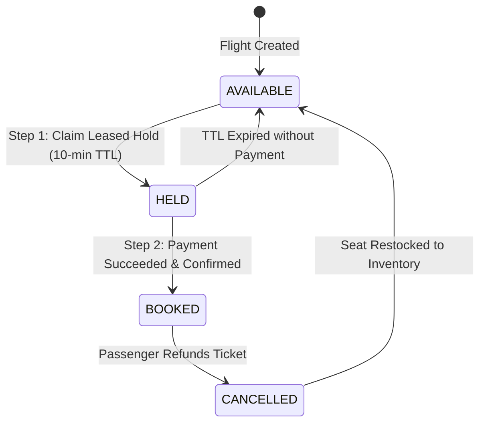
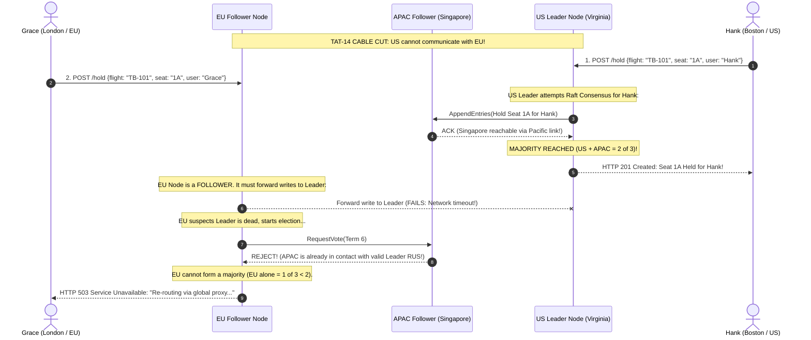
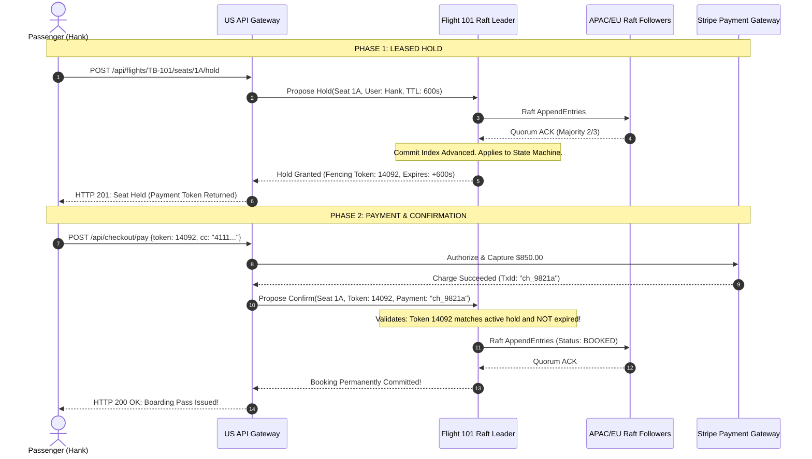

import { Callout } from 'fumadocs-ui/components/callout';
import { Tabs, Tab } from 'fumadocs-ui/components/tabs';
import { Steps, Step } from 'fumadocs-ui/components/steps';
import { Cards, Card } from 'fumadocs-ui/components/card';

## Executive Challenge: The Transatlantic Fiber Cut

It is 18:30 UTC on the eve of Christmas travel. 
A deep-sea commercial fishing vessel operating off the coast of Ireland drags its anchor, severing the **TAT-14 undersea fiber optic cable** connecting North America and Western Europe.

Simultaneously:
- 120,000 global passengers are actively browsing flights on **TravelBuddy**.
- On flight **TB-101 (London Heathrow to New York JFK)**, exactly **one first-class seat (Seat 1A)** remains unreserved.
- Passenger **Grace in London (EU-Central)** and passenger **Hank in Boston (US-East)** click "Confirm Reservation" at the exact same physical millisecond.
- The transatlantic network link is completely dead ($100\%$ packet loss between Virginia and Frankfurt).

```mermaid
flowchart LR
    subgraph USEast["US-East (Virginia)"]
        Hank["Hank (Boston)"] --> AppUS["US API Gateway"]
        AppUS --> DB_US[("Database Replica US")]
    end

    subgraph FiberCut["TAT-14 Undersea Fiber Link"]
        DeadLink["TRANSATLANTIC OPTICAL FIBER CUT<br/>100% Packet Loss / High Jitter"]
    end

    subgraph EUCentral["EU-Central (Frankfurt)"]
        Grace["Grace (London)"] --> AppEU["EU API Gateway"]
        AppEU --> DB_EU[("Database Replica EU")]
    end

    DB_US -.-x DeadLink -.-x DB_EU

    style FiberCut fill:#450a0a,stroke:#ef4444,stroke-width:2px
    style DeadLink fill:#7f1d1d,stroke:#f87171,stroke-width:2px
    style USEast fill:#020617,stroke:#38bdf8,stroke-width:1px
    style EUCentral fill:#020617,stroke:#34d399,stroke-width:1px
```



### The Engineering Mandate:
Your distributed database architecture must satisfy three non-negotiable operational invariants:
1. **Absolute Zero Double-Booking**: Under no circumstances may both Grace and Hank receive confirmed boarding passes for Seat 1A ($RPO = 0$).
2. **Deterministic Partition Survival**: The system must avoid split-brain execution without human intervention.
3. **Sub-100ms Read Latency for Browsing**: Flight seat maps and flight schedules must remain queryable even across disrupted regions.

---

## High-Level Architectural Blueprint

To solve this planetary challenge, TravelBuddy adopts a **Multi-Region Multi-Raft Architecture** paired with a **Two-Stage Leased Hold Reservation Protocol**:

```mermaid
flowchart TD
    subgraph GlobalUsers["Global Traffic Ingestion"]
        U_US["US Passengers"] --> CDN_US["Cloudflare Edge US"]
        U_EU["EU Passengers"] --> CDN_EU["Cloudflare Edge EU"]
        U_APAC["APAC Passengers"] --> CDN_APAC["Cloudflare Edge APAC"]
    end

    subgraph MultiRaftCluster["Global Distributed Multi-Raft Cluster (3 Datacenters)"]
        direction TB
        
        subgraph RangeGroup1["Flight TB-101 Raft Consensus Group (3 Replicas)"]
            R_US["Replica 1 (Virginia)<br/>State: LEADER"]
            R_EU["Replica 2 (Frankfurt)<br/>State: FOLLOWER"]
            R_APAC["Replica 3 (Singapore)<br/>State: FOLLOWER (Tie-Breaker)"]
            R_US <===>|Intra-Cluster Raft RPC| R_EU
            R_EU <===>|Intra-Cluster Raft RPC| R_APAC
            R_US <===>|Intra-Cluster Raft RPC| R_APAC
        end
    end

    CDN_US --> R_US
    CDN_EU --> R_EU
    CDN_APAC --> R_APAC

    style GlobalUsers fill:#020617,stroke:#38bdf8,stroke-width:2px
    style MultiRaftCluster fill:#020617,stroke:#34d399,stroke-width:2px
    style RangeGroup1 fill:#0f172a,stroke:#818cf8,stroke-width:2px
    style R_US fill:#1e1b4b,stroke:#38bdf8,stroke-width:2px
    style R_EU fill:#0f172a,stroke:#34d399,stroke-width:1px
    style R_APAC fill:#0f172a,stroke:#eab308,stroke-width:1px
```



---

## Deep Dive 1: Partitioning Strategy (Multi-Raft Range Groups)

### Why Partitioning by `user_id` Fails
If you partition the database by `user_id`, Grace's record lives on Shard A and Hank's record lives on Shard B. Reserving Seat 1A would require a cross-shard distributed transaction (2PC) spanning transatlantic links on every single booking attempt.

### The Correct Partitioning Key: `flight_id`
All data related to a single flight—including seat availability, price tiers, and confirmed passenger manifests—is collocated in the **same database range partition**:

$$\text{Partition Range} = \text{hash}(\text{flight\_id}) \pmod{\text{Total Ranges}}$$

```sql
-- DDL for Collocated Flight Seat Partition
CREATE TABLE flight_seats (
    flight_id VARCHAR(32) NOT NULL,
    seat_number VARCHAR(8) NOT NULL,
    status VARCHAR(16) NOT NULL DEFAULT 'AVAILABLE', -- AVAILABLE, HELD, BOOKED
    hold_passenger_id VARCHAR(64),
    hold_expires_at TIMESTAMPTZ,
    fencing_token BIGINT NOT NULL DEFAULT 0,
    confirmed_booking_id VARCHAR(64),
    version BIGINT NOT NULL DEFAULT 1,
    PRIMARY KEY (flight_id, seat_number)
);
```

### The Multi-Raft Advantage
Instead of running a single monolithic Raft cluster for all data, TravelBuddy runs **thousands of independent small Raft consensus groups** (Multi-Raft, as pioneered by CockroachDB and TiKV):
- Each flight (or group of flights) forms its own 3-node Raft consensus group.
- The three replicas are distributed across **Virginia (US)**, **Frankfurt (EU)**, and **Singapore (APAC)**.
- Replicating a write to flight `TB-101` requires reaching consensus only across the nodes assigned to that specific flight, completely decoupled from other flights.

---

## Deep Dive 2: The Two-Stage Leased Hold Protocol

Directly charging a credit card before confirming a seat leads to double-charges. Directly writing a final booking to the database before payment leads to unpaid seat hoarding.

TravelBuddy implements a stateful **Two-Stage Leased Hold**:



### Phase 1: Acquiring the Leased Hold
When a passenger selects a seat:
1. The request routes to the Raft Leader for that flight's partition.
2. The Leader proposes an atomic state transition in its Raft log:
   ```json
   {
     "op": "ACQUIRE_HOLD",
     "flight_id": "TB-101",
     "seat_number": "1A",
     "passenger_id": "Hank-8041",
     "ttl_seconds": 600,
     "token": 14092
   }
   ```
3. Once the Raft Leader replicates this log entry to a **majority of nodes** (2 out of 3), the state machine executes:
   - Sets `status = 'HELD'`.
   - Sets `hold_expires_at = NOW() + INTERVAL '10 minutes'`.
   - Generates a unique monotonic **fencing token** `14092`.
4. The client receives the fencing token and transitions to the payment checkout screen.

---

## Deep Dive 3: Surviving the Transatlantic Fiber Cut

Now, trace what happens when the TAT-14 fiber cable is severed between US-East and EU-Central:



### The Quorum Arithmetic During Partition
- Total Replicas: $N = 3$.
- Quorum Required: $\lfloor 3/2 \rfloor + 1 = 2$.

When the transatlantic link is severed:
1. **The US Region** retains an active connection to **APAC (Singapore)** across transpacific fibers.
   - Accessible Nodes: $\text{US} + \text{APAC} = 2$.
   - Quorum Check: $2 \ge 2 \implies$ **Quorum Intact.**
   - The US region continues processing full read/write bookings with zero interruption!
2. **The EU Region** is isolated from the US Leader.
   - If EU attempts to elect itself leader, it can only obtain 1 vote (itself).
   - Quorum Check: $1 < 2 \implies$ **Election Fails.**
   - EU **cannot accept writes**, mathematically preventing split-brain execution!

<Callout type="info" title="Grace's Failover Experience">
Rather than dropping Grace's request, the EU API Gateway detects the Raft quorum partition and transparently proxies her HTTP request through the alternate APAC route (`Frankfurt -> Singapore -> Virginia`).
Although her network latency increases by ~180ms, her request arrives at the legitimate Leader in Virginia. If Hank reserved Seat 1A first, Grace receives an immediate, accurate message: *"Seat 1A was just claimed; would you like Seat 1B?"*
</Callout>

---

## Deep Dive 4: Preventing Clock Drift with Hybrid Logical Clocks (HLC)

What if the 10-minute hold lease on Seat 1A expires? How does the database know when a hold has expired without trusting physical wall clocks that drift?

TravelBuddy uses **Hybrid Logical Clocks (HLC)**:
Every HLC timestamp $T = (l, c)$ consists of:
1. $l$: Physical component (tracks the maximum known physical time from local clock and incoming messages).
2. $c$: Logical component (a counter that increments to order events occurring within the same physical tick).

```typescript
class HybridLogicalClock {
  private latestPhysical: number = 0;
  private logicalCounter: number = 0;

  public now(physicalWallClock: number): { physical: number; logical: number } {
    if (physicalWallClock > this.latestPhysical) {
      this.latestPhysical = physicalWallClock;
      this.logicalCounter = 0;
    } else {
      this.logicalCounter++;
    }
    return { physical: this.latestPhysical, logical: this.logicalCounter };
  }

  public update(msgPhysical: number, msgLogical: number, localWall: number) {
    const maxPhysical = Math.max(this.latestPhysical, localWall, msgPhysical);
    if (maxPhysical === this.latestPhysical && maxPhysical === msgPhysical) {
      this.logicalCounter = Math.max(this.logicalCounter, msgLogical) + 1;
    } else if (maxPhysical === this.latestPhysical) {
      this.logicalCounter++;
    } else if (maxPhysical === msgPhysical) {
      this.logicalCounter = msgLogical + 1;
    } else {
      this.logicalCounter = 0;
    }
    this.latestPhysical = maxPhysical;
  }
}
```

By passing HLC timestamps through the Raft log, **lease expiration is evaluated based on the Raft log's committed logical time, not the physical wall clock of individual replica nodes.**

---

## End-to-End Sequence Diagram: Confirmed Booking Flow



---

## Production Failure Recovery Matrix

| Failure Scenario | Immediate System Impact | Automated Recovery Mechanism | Maximum Data Loss ($RPO$) |
| :--- | :--- | :--- | :--- |
| **Transatlantic Cable Cut** | EU follower disconnected from US Leader | APAC node provides quorum tie-breaker with US Leader. EU proxies writes via APAC. | **$RPO = 0$** (Strict linearizability preserved) |
| **US Datacenter Complete Power Outage** | Leader node abruptly killed | EU and APAC elect a new Leader in Singapore within 300ms using Raft term election. | **$RPO = 0$** (Only uncommitted inflight holds rejected) |
| **Zombie Leader Wakes from 20s GC Pause** | Old leader attempts to write stale data | Storage engine validates monotonic fencing token. Stale token rejected immediately. | **$RPO = 0$** (Zero corruption) |
| **Payment Gateway Times Out During Checkout** | Money status unknown | Gateway queries Stripe idempotency key. If charged, confirms booking; if failed, releases hold. | **$RPO = 0$** |

---

## Capstone Verification Checklist

To prove your distributed booking architecture is production-ready, ensure your implementation passes these four automated integration tests:

<Steps>
  <Step title="Concurrent Double-Booking Chaos Test">
    Spin up 1,000 concurrent virtual users attempting to book the exact same single seat on flight `TB-101` at $T=0$. Verify that exactly 1 request returns HTTP 201, while 999 requests return HTTP 409 Conflict.
  </Step>
  <Step title="Network Jitter & Partition Injection (Chaos Mesh)">
    Sever network traffic between Virginia and Frankfurt using iptables packet drops. Verify that seat bookings originating in US and APAC complete with zero errors, and that EU writes are safely proxied without split-brain.
  </Step>
  <Step title="Clock Slew and Step Resynchronization">
    Step the system clock backward by 5 seconds on the active Raft leader node. Verify that lease expirations and commit sequences maintain causal ordering via Hybrid Logical Clocks without data deletion.
  </Step>
  <Step title="Simulated Zombie Primary (SIGSTOP / SIGCONT)">
    Send `SIGSTOP` to the primary node for 30 seconds. Verify that followers elect a new leader, and that when `SIGCONT` resumes the original node, its delayed writes are rejected by storage fencing tokens.
  </Step>
</Steps>
