import { Callout } from 'fumadocs-ui/components/callout';
import { Tabs, Tab } from 'fumadocs-ui/components/tabs';
import { Steps, Step } from 'fumadocs-ui/components/steps';
import { Cards, Card } from 'fumadocs-ui/components/card';

## Welcome to Distributed Systems Reality

In Track 2, we explored how a database manages bytes on a **single machine**: how LSM-trees append log entries sequentially to disk, how B-trees update 4KB pages in place, and how columnar storage packs billions of analytical rows into memory.

On a single node, software behaves deterministically:
- If a CPU executes an instruction, it either succeeds or faults.
- If memory writes a byte, that byte is visible to subsequent reads.
- If the operating system clock ticks, time moves forward monotonically.

**When you cross the boundary from one machine to a cluster of machines across the globe, every single guarantee shatters.**

```mermaid
flowchart LR
    subgraph SingleNode["Single-Node System (Track 2)"]
        direction TB
        CPU["Deterministic CPU"] --- RAM["Shared Coherent RAM"]
        RAM --- Disk["Single Disk Controller"]
        Disk --- OSClock["Monotonic Kernel Clock"]
    end

    subgraph DistributedCluster["Distributed System (Track 3)"]
        direction TB
        N1["US-East Node<br/>Clock: 12:00:00.004"] <-->|75ms Fiber Cable<br/>Packet Drops & Reordering| N2["EU-Central Node<br/>Clock: 11:59:59.982"]
        N2 <-->|140ms Undersea Cable<br/>Transient Jitter| N3["APAC-South Node<br/>Clock: 12:00:00.045"]
        N1 <-->|210ms Fiber Link| N3
    end

    style SingleNode fill:#0f172a,stroke:#38bdf8,stroke-width:2px
    style DistributedCluster fill:#020617,stroke:#f43f5e,stroke-width:2px
```

In a distributed environment:
1. **Networks are inherently asynchronous**: A message sent over fiber optic cable may arrive in 20 milliseconds, 5 minutes, or never. You cannot distinguish between a server that crashed and a network cable that was severed.
2. **Physical clocks drift**: Quartz crystal oscillators drift under heat and voltage fluctuation. Two co-located rack servers can disagree on time by milliseconds; two machines across continents will disagree by tens to hundreds of milliseconds.
3. **Processes pause unpredictably**: Stop-the-world garbage collection (JVM/Go), hypervisor VM migrations, and OS page thrashing can pause a server for several seconds without its knowledge. A node may believe it is the primary leader while the rest of the cluster has already declared it dead and elected a successor.
4. **Partial failure is the default state**: In a cluster of 1,000 servers, individual nodes, NICs, and power supplies fail daily. The system as a whole must remain correct and available despite continuous component decay.

---

## The TravelBuddy Narrative: The Global Expansion Crisis

Throughout this track, we follow **TravelBuddy** as it transitions from a regional domestic booking app into a planetary flight and hotel reservation platform.

```mermaid
flowchart TD
    subgraph GlobalClients["Global Users"]
        U1["Passenger in New York (US)"]
        U2["Passenger in Frankfurt (EU)"]
        U3["Passenger in Singapore (APAC)"]
    end

    subgraph RegionalClusters["Multi-Region Cloud Infrastructure"]
        DC_US["US-East Datacenter<br/>(Virginia)"]
        DC_EU["EU-Central Datacenter<br/>(Frankfurt)"]
        DC_APAC["APAC-South Datacenter<br/>(Singapore)"]
    end

    U1 -->|Sub-10ms Latency| DC_US
    U2 -->|Sub-10ms Latency| DC_EU
    U3 -->|Sub-10ms Latency| DC_APAC

    DC_US <===>|Replication & Consensus| DC_EU
    DC_EU <===>|Replication & Consensus| DC_APAC
    DC_US <===>|Replication & Consensus| DC_APAC

    style GlobalClients fill:#0f172a,stroke:#38bdf8,stroke-width:2px
    style RegionalClusters fill:#020617,stroke:#34d399,stroke-width:2px
```

### The Black Friday Meltdown

To achieve sub-50ms latency for global travelers, TravelBuddy placed application instances and database replicas in three core regions: **US-East (Virginia)**, **EU-Central (Frankfurt)**, and **APAC-South (Singapore)**.

During the global Black Friday rush, three catastrophic failures struck simultaneously:

1. **The Double-Booking Nightmare (Seat 14A)**:
   - A traveler in New York booked the final first-class seat (14A) on flight **TB-402** via the US leader node.
   - At the exact same millisecond, a traveler in Frankfurt loaded the seating map from an EU read replica suffering from a 650ms replication lag. Seat 14A still appeared available.
   - The EU user clicked "Confirm Booking". Both credit cards were charged. Two passengers arrived at JFK Airport holding confirmed boarding passes for Seat 14A.
2. **The Undersea Cable Partition (Split-Brain)**:
   - A deep-sea trawler in the Atlantic severed the primary transatlantic optical fiber trunk between North America and Europe.
   - The US datacenter could no longer communicate with the EU datacenter.
   - The EU cluster presumed the US leader was dead, auto-promoted an EU replica to leader, and began processing local reservations. When network connectivity resumed 4 hours later, the two database branches had divergent histories that could not be reconciled automatically.
3. **The Wall-Clock Timestamp Catastrophe**:
   - TravelBuddy used NTP (Network Time Protocol) to resolve booking conflicts using "Last-Write-Wins" (LWW).
   - An NTP synchronization daemon on the Virginia node stepped the clock backward by 250 milliseconds.
   - A seat reservation made at 12:00:00.100 was overwritten by an older cancellation timestamped at 12:00:00.250, wiping out a paid business customer's ticket.

<Callout type="error" title="Why Hardware Upgrades Cannot Fix This">
These failures are not bugs in application logic that can be patched with `try/catch` blocks or bigger AWS instances. They are mathematical constraints governing information propagation across space and time.
</Callout>

---

## Mapping DDIA Part 2: The Core Curriculum

This track delivers a rigorous, pedagogical breakdown of **Part 2 of Martin Kleppmann’s *Designing Data-Intensive Applications***, combining foundational theory with production system implementations:

```mermaid
flowchart TD
    subgraph Track3Modules["Track 3 Curriculum Structure"]
        direction TB
        M1["01. Replication Models & Lag<br/>(DDIA Chapter 5)<br/>Single-Leader • Multi-Leader • Leaderless • Quorums (W + R > N)"]
        M2["02. Partitioning & Sharding<br/>(DDIA Chapter 6)<br/>Range vs Hash • Consistent Hashing • Secondary Indexes • Rebalancing"]
        M3["03. Transactions, ACID & Isolation<br/>(DDIA Chapter 7)<br/>Read Committed • Snapshot Isolation / MVCC • SSI • Lost Updates & Skew"]
        M4["04. Distributed Failures & Clocks<br/>(DDIA Chapter 8)<br/>Unreliable Networks • Clock Drift • TrueTime • Fencing Tokens • Byzantine"]
        M5["05. Consistency & Consensus<br/>(DDIA Chapter 9)<br/>Linearizability • Total Order Broadcast • 2PC • Paxos • Raft • Zab"]
        LAB["Capstone: Global Airline Reservation<br/>Zero-Double-Booking Architecture under Multi-Region Fiber Cuts"]
        REF["Quick Reference & Cheat Sheets<br/>Anomalies Matrix • CAP/PACELC • Lock Models • Consensus Comparison"]

        M1 --> M2 --> M3 --> M4 --> M5 --> LAB --> REF
    end

    style Track3Modules fill:#020617,stroke:#38bdf8,stroke-width:2px
    style M1 fill:#0f172a,stroke:#38bdf8,stroke-width:1px
    style M2 fill:#0f172a,stroke:#38bdf8,stroke-width:1px
    style M3 fill:#0f172a,stroke:#38bdf8,stroke-width:1px
    style M4 fill:#0f172a,stroke:#38bdf8,stroke-width:1px
    style M5 fill:#0f172a,stroke:#38bdf8,stroke-width:1px
    style LAB fill:#0f172a,stroke:#34d399,stroke-width:2px
    style REF fill:#0f172a,stroke:#eab308,stroke-width:2px
```

---

## The 5 Invariant Dilemmas of Distributed Data

Every distributed architecture balances trade-offs across five inescapable theoretical boundaries:

<Tabs items={['1. Replication Trade-offs', '2. Partitioning & Routing', '3. Isolation vs Concurrency', '4. Physical vs Logical Time', '5. Consensus & Coordination']}>
  <Tab value="1. Replication Trade-offs">
    - **Synchronous vs. Asynchronous**: Synchronous replication guarantees zero data loss on leader crash ($RPO = 0$) but stalls all writes if a single follower experiences a network hiccup. Asynchronous replication maximizes write throughput and availability but exposes readers to replication lag and data loss upon ungraceful failover.
    - **Replication Lag Anomalies**: How to guarantee *Read-Your-Own-Writes*, *Monotonic Reads*, and *Consistent Prefix Reads* when querying replicas.
    - **Quorum Mathematics**: Why strict quorums require $W + R > N$, and how sloppy quorums with hinted handoff trade linearizability for durable ingestion during widespread outages.
  </Tab>
  <Tab value="2. Partitioning & Routing">
    - **Partition Boundaries**: Partitioning by continuous key range preserves range scans (`WHERE flight_date BETWEEN ...`) but generates extreme hotspots; partitioning by hash of key spreads load uniformly but turns every range query into a cluster-wide scatter-gather operation.
    - **Secondary Indexes**: The tension between document-partitioned local indexes (cheap writes, expensive scatter-gather reads) and term-partitioned global indexes (fast reads, multi-node distributed transactions on write).
    - **Rebalancing Mechanics**: Why hash-modulo-$N$ rebalancing creates disastrous cluster-wide churn, and how fixed partitions or consistent hashing with virtual nodes move minimal keys during node membership shifts.
  </Tab>
  <Tab value="3. Isolation vs Concurrency">
    - **The Illusion of ACID**: What ACID actually means versus marketing buzzwords. Atomicity is about fault recovery (abortability); Isolation is about concurrent correctness.
    - **The Hierarchy of Isolation**: Moving from Read Uncommitted $\to$ Read Committed $\to$ Snapshot Isolation (MVCC) $\to$ Serializability.
    - **Silent Concurrency Bugs**: Diagnosing Lost Updates, Dirty Reads, Non-repeatable Reads, Read Skew, Write Skew, and Phantom Reads.
    - **Serializability Mechanisms**: Two-Phase Locking (2PL), strict serial execution (VoltDB/Redis), and Serializable Snapshot Isolation (SSI).
  </Tab>
  <Tab value="4. Physical vs Logical Time">
    - **Clock Skew vs Network Delay**: Why you can never trust `System.currentTimeMillis()` for ordering distributed causal events.
    - **Monotonic vs Time-of-Day Clocks**: Using monotonic clocks for local elapsed durations ($\Delta t$) and understanding NTP step adjustments.
    - **Google TrueTime**: How GPS receivers and atomic clocks in Google datacenters bound clock uncertainty to $\epsilon \approx [1, 7\text{ ms}]$, allowing Spanner to achieve external consistency via "wait-out-the-uncertainty".
    - **Fencing Tokens**: Eliminating split-brain zombie primaries using monotonically incrementing generation counters validated by storage backends.
  </Tab>
  <Tab value="5. Consensus & Coordination">
    - **Linearizability**: The strongest recency guarantee (making a distributed system appear as a single atomic register).
    - **Total Order Broadcast**: An append-only log where all nodes agree on the exact same sequence of messages.
    - **Two-Phase Commit (2PC)**: The classic atomic commitment protocol, and why its blocking coordinator makes it unacceptable for high-availability multi-region setups.
    - **Fault-Tolerant Consensus**: Paxos, Raft, and Zab—how majority quorums ($\lfloor N/2 \rfloor + 1$) and epoch terms allow clusters to make forward progress despite $F < N/2$ crash failures.
  </Tab>
</Tabs>

---

## Detailed Track Roadmap

<Cards>
  <Card
    title="01. Replication Models & Lag (DDIA Ch 5)"
    href="/docs/system-design/03-distributed-data-and-consensus/01-replication-models-and-lag"
    description="Single-leader, multi-leader, and leaderless (Dynamo-style) architectures. Solving read-your-own-writes, monotonic reads, consistent prefix lag, and quorum mathematics."
  />
  <Card
    title="02. Partitioning & Sharding (DDIA Ch 6)"
    href="/docs/system-design/03-distributed-data-and-consensus/02-partitioning-and-sharding"
    description="Range vs hash partitioning, consistent hashing rings, document vs term secondary indexes, dynamic partition splitting, and request routing tiers."
  />
  <Card
    title="03. Transactions, ACID & Isolation (DDIA Ch 7)"
    href="/docs/system-design/03-distributed-data-and-consensus/03-transactions-acid-and-isolation"
    description="ACID first principles, MVCC snapshot isolation, dirty reads, lost updates, write skew, two-phase locking (2PL), and serializable snapshot isolation (SSI)."
  />
  <Card
    title="04. Distributed Failures & Clocks (DDIA Ch 8)"
    href="/docs/system-design/03-distributed-data-and-consensus/04-distributed-failures-and-clocks"
    description="Unreliable networks, packet loss, monotonic vs wall clocks, NTP drift, Google TrueTime, GC pauses, fencing tokens, and crash-stop vs Byzantine models."
  />
  <Card
    title="05. Consistency & Consensus (DDIA Ch 9)"
    href="/docs/system-design/03-distributed-data-and-consensus/05-consistency-and-consensus"
    description="Linearizability, Total Order Broadcast, Two-Phase Commit (2PC) blocking failure, Paxos, Raft, and Zab consensus engines, and state machine replication."
  />
  <Card
    title="Capstone: Global Airline Reservation"
    href="/docs/system-design/03-distributed-data-and-consensus/capstone-global-airline-reservation"
    description="Architecting TravelBuddy's multi-region distributed booking engine to prevent seat double-booking across transatlantic partitions with zero downtime."
  />
  <Card
    title="Quick Reference & Cheat Sheets"
    href="/docs/system-design/03-distributed-data-and-consensus/quick-reference"
    description="Concurrency anomalies matrix, CAP vs PACELC decision trees, SQL isolation lock mappings, and Raft vs Paxos vs 2PC algorithm comparison."
  />
</Cards>

---

## How to Work Through This Track

To extract maximum engineering value from these chapters:

<Steps>
  <Step title="Trace Every Failure Mode to First Principles">
    Whenever an anomaly is discussed (such as *Write Skew* or *Split-Brain*), draw out the sequence of messages and timestamps across nodes before reading the solution.
  </Step>
  <Step title="Follow the TravelBuddy Production Incident">
    Each chapter begins with a concrete bug encountered by TravelBuddy during its global rollout. Use this narrative to understand why theoretical distributed properties directly determine business outcomes.
  </Step>
  <Step title="Implement the Quorum and Consensus Math">
    Practice evaluating quorum equations ($W + R > N$) and clock drift bounds ($[t - \epsilon, t + \epsilon]$) manually to develop intuition for sizing production database clusters.
  </Step>
  <Step title="Build the Capstone Architecture">
    Conclude by synthesising all five chapters in the Capstone lab, delivering an end-to-end multi-region design that handles network partitions and node crashes without data corruption.
  </Step>
</Steps>
