import { Callout } from 'fumadocs-ui/components/callout';
import { Tabs, Tab } from 'fumadocs-ui/components/tabs';
import { Cards, Card } from 'fumadocs-ui/components/card';

## 1. Concurrency Anomalies Master Matrix

This matrix details the full taxonomy of transactional race conditions, their root causes, and the minimum isolation level required to prevent them:

| Concurrency Anomaly | Formal Definition | Real-World Example | Minimum Level Required to Prevent |
| :--- | :--- | :--- | :--- |
| **Dirty Write** | Transaction 1 overwrites an uncommitted value written by Transaction 2. | Alice updates Seat 14A, Bob updates Seat 14A before Alice commits. | **Read Uncommitted** (Row-level write locks) |
| **Dirty Read** | Transaction 1 reads data written by Transaction 2 that has not yet committed. | Bob reads uncommitted seat price $100 before Alice's abort rollback. | **Read Committed** |
| **Non-Repeatable Read (Read Skew)** | Transaction 1 reads the same row twice and observes different values because Transaction 2 committed in between. | Alice reads account balance ($500), transfer moves $100, Alice re-reads and sees $600. | **Snapshot Isolation / Repeatable Read** |
| **Lost Update** | Two transactions perform concurrent read-modify-write cycles; one update overwrites the other without including its changes. | Two users concurrently increment flight reservation counter from 42 to 43. | **Atomic Updates / SELECT FOR UPDATE / SSI** |
| **Write Skew** | Two transactions concurrently query a common premise, make decisions based on it, and write to different rows, violating an invariant. | Two doctors both go off on-call because each saw the other was active. | **Serializable (2PL or SSI)** |
| **Phantom Read** | A transaction executes a query searching for rows matching a predicate; a concurrent transaction inserts rows matching that predicate. | Checking if flight has fewer than 100 passengers, while another user inserts 101st passenger. | **Serializable (Index-Range Locks or SSI)** |

---

## 2. CAP vs. PACELC Theorem Cheat Sheet

### The CAP Theorem (Brewer, Gilbert & Lynch)
In any networked distributed data store, you can choose only **two** out of three guarantees:

```mermaid
flowchart TD
    subgraph CAP["The CAP Theorem"]
        C["Consistency (Linearizability)<br/>Every read receives the most recent write or an error."]
        A["Availability<br/>Every non-failing node returns a non-error response."]
        P["Partition Tolerance<br/>System operates despite dropped/delayed network messages."]
    end

    style CAP fill:#020617,stroke:#38bdf8,stroke-width:2px
    style C fill:#0f172a,stroke:#38bdf8,stroke-width:1px
    style A fill:#0f172a,stroke:#34d399,stroke-width:1px
    style P fill:#0f172a,stroke:#f43f5e,stroke-width:1px
```

<Callout type="warn" title="Why 'CA Systems' Do Not Exist in Practice">
You cannot choose "CA" over network partitions. **Network partitions ($P$) are a physical reality of our universe** (cables get cut, switches crash).
Therefore, your true architectural choice is strictly binary:
- **CP (Consistency over Availability)**: If a partition occurs, reject writes or wait to avoid serving stale data.
- **AP (Availability over Consistency)**: If a partition occurs, accept writes on both sides and resolve divergence later.
</Callout>

---

### The PACELC Theorem (Daniel Abadi)
CAP only describes system behavior during rare network partitions. **PACELC** extends CAP to explain how systems trade off latency when the network is completely normal:

$$\text{If } \mathbf{P} \text{ (Partition)} \implies \text{choose } \mathbf{A} \lor \mathbf{C}; \quad \text{ELSE } \mathbf{E} \implies \text{choose } \mathbf{L} \lor \mathbf{C}$$

> *"If there is a **P**artition, how does the system choose between **A**vailability and **C**onsistency? **E**lse (under normal conditions), how does the system choose between **L**atency and **C**onsistency?"*

### Production Database PACELC Classification

| Database | PACELC Classification | Partition Behavior ($P$) | Normal Operation Behavior ($E$) |
| :--- | :--- | :--- | :--- |
| **Google Spanner** | **PC/EC** | Retains strict consistency; stalls writes in minority partitions. | Prioritizes linearizable consistency over lowest latency. |
| **CockroachDB** | **PC/EC** | Uses Raft consensus; rejects writes if majority unreachable. | Enforces strict serializability across range leases. |
| **MongoDB (Default)** | **PC/EC** | Rejects writes in minority partitions until election. | Routes writes to primary for consistency. |
| **Apache Cassandra** | **PA/EL** | Accepts writes via sloppy quorums and hinted handoff. | Prioritizes ultra-low latency; returns stale data unless $W+R>N$. |
| **Amazon DynamoDB** | **PA/EL (Tunable)** | Default is eventually consistent (AP). | Tunable: Can select strongly consistent reads at double cost. |
| **PostgreSQL (Async)** | **PC/EL** | Single leader rejects writes if down. | Asynchronous replication prioritizes write latency over replica sync. |

---

## 3. SQL Isolation Levels vs. Lock Mapping

| Isolation Level | Read Locking Mechanism | Write Locking Mechanism | Prevents Dirty Read | Prevents Read Skew | Prevents Lost Update | Prevents Write Skew |
| :--- | :--- | :--- | :--- | :--- | :--- | :--- |
| **Read Uncommitted** | None (reads dirty buffers directly) | Row exclusive write lock held until statement ends | No | No | No | No |
| **Read Committed** | MVCC: reads latest committed version at statement start | Row exclusive write lock held until transaction commits | **Yes** | No | No | No |
| **Repeatable Read (Snapshot Isolation)** | MVCC: reads latest committed version at transaction start | Row exclusive write lock held until transaction commits; aborts on concurrent row write | **Yes** | **Yes** | Partial (First-committer wins) | No |
| **Serializable (2PL)** | Shared lock ($S$) held on rows and index ranges until commit | Exclusive lock ($X$) held on rows and index ranges until commit | **Yes** | **Yes** | **Yes** | **Yes** |
| **Serializable (SSI)** | Optimistic: records `SIREAD` lock; no blocking | Normal MVCC write; tracks read-write dependency graph | **Yes** | **Yes** | **Yes** | **Yes** |

---

## 4. Distributed Consensus & Atomic Commit Algorithms

| Algorithm | Type | Leader Model | Quorum Requirement | Primary Failure Mode | Production Examples |
| :--- | :--- | :--- | :--- | :--- | :--- |
| **Two-Phase Commit (2PC)** | Atomic Commitment | Single Central Coordinator | **Unanimous** ($100\%$ of cohorts must vote Yes) | **Blocking**: If coordinator dies during commit, cohorts hold locks indefinitely. | XA Transactions, Distributed RDBMS |
| **Three-Phase Commit (3PC)** | Atomic Commitment | Central Coordinator with Pre-Commit phase | Unanimous (Assumes bounded network delay) | **Unsafe during partitions**: Network partitions cause split-brain commits. | Rarely used in cloud systems |
| **Classic Paxos** | Distributed Consensus | Symmetric (Any node can propose) | Majority ($\lfloor N/2 \rfloor + 1$) | Duelling proposers can livelock without randomized backoff. | Academic foundation, Google Chubby |
| **Multi-Paxos** | Distributed Consensus | Stable elected leader optimizes Phase 1 | Majority ($\lfloor N/2 \rfloor + 1$) | Complex leader takeover and log hole reconciliation. | Google Spanner, Apache Cassandra LWT |
| **Raft** | Distributed Consensus | Strong leader (All writes flow through leader) | Majority ($\lfloor N/2 \rfloor + 1$) | Candidate election storms if election timeouts are identical. | etcd (Kubernetes), CockroachDB, TiKV |
| **Zab** | Atomic Broadcast | Primary-backup with recovery phase | Majority ($\lfloor N/2 \rfloor + 1$) | ZooKeeper cluster becomes read-only if majority lost. | Apache ZooKeeper |

---

## 5. Essential Distributed Systems Mathematical Formulas

### 1. Quorum Intersection Condition
For $N$ total replicas, write quorum $W$, and read quorum $R$:
$$W + R > N$$
Guarantees that at least one node in the read quorum witnessed the latest write:
$$\text{Overlap Nodes} = (W + R) - N \ge 1$$

### 2. Fault Tolerance in Majority Consensus
To tolerate $F$ arbitrary crash-stop node failures in a Raft or Paxos cluster, the total cluster size $N$ must satisfy:
$$N \ge 2F + 1 \iff F = \left\lfloor \frac{N - 1}{2} \right\rfloor$$
- **3 nodes** can tolerate **1 failure**.
- **5 nodes** can tolerate **2 failures**.
- **7 nodes** can tolerate **3 failures**.

### 3. Google TrueTime External Consistency Wait
To guarantee linearizable order between consecutive transactions $T_1$ and $T_2$ with maximum clock uncertainty $\epsilon$:
$$\text{Wait Duration} \ge 2\epsilon$$
Given $\epsilon = 3.5\text{ ms}$:
$$\text{Wait} \ge 2 \times 3.5\text{ ms} = 7\text{ ms}$$

### 4. Key Redistribution in Rebalancing
When adding a node to a naive hash-modulo cluster:
$$\text{Fraction of Keys Moved} = \frac{N}{N + 1}$$
When adding a node to a consistent hashing ring with virtual nodes:
$$\text{Fraction of Keys Moved} = \frac{1}{N + 1}$$
*(e.g., adding a 10th node to a 9-node cluster moves only $10\%$ of keys instead of $90\%$).*
