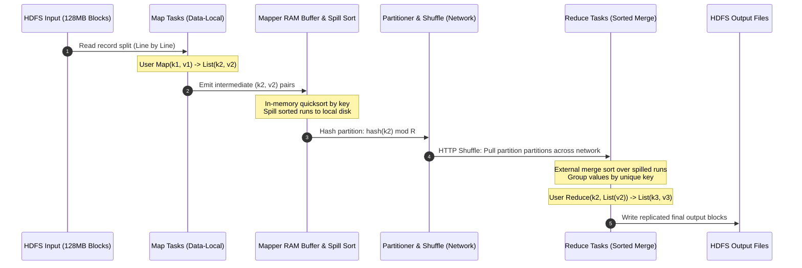
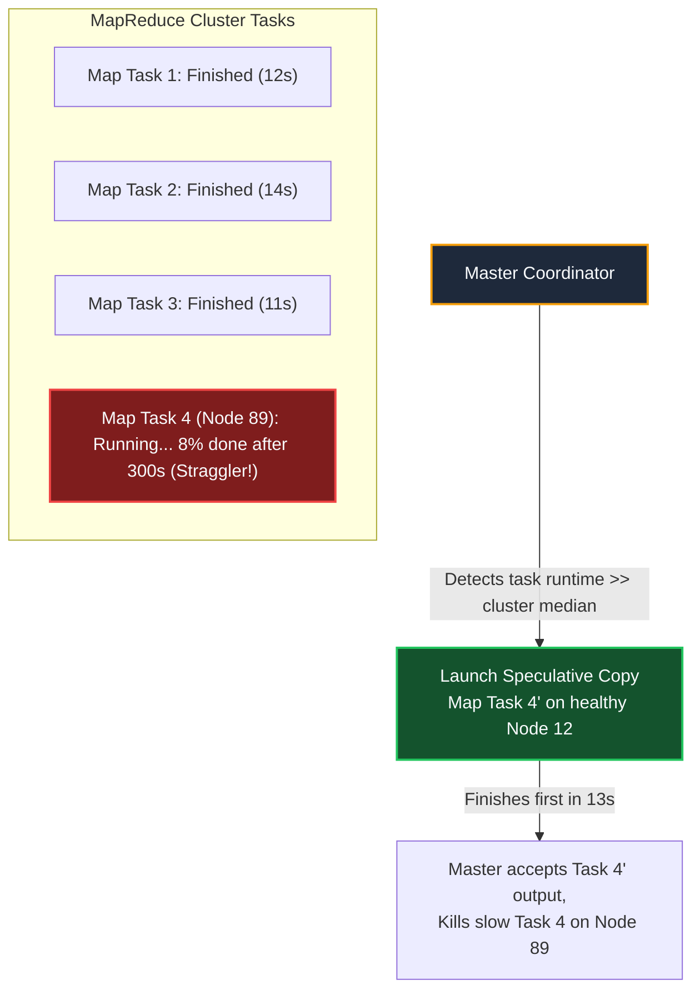
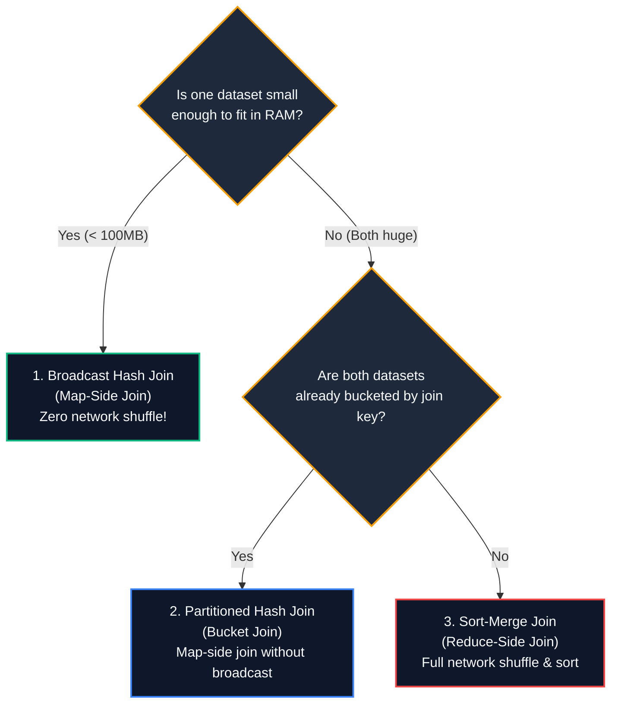

import { Callout } from 'fumadocs-ui/components/callout';
import { Tabs, Tab } from 'fumadocs-ui/components/tabs';
import { Steps, Step } from 'fumadocs-ui/components/steps';
import { Cards, Card } from 'fumadocs-ui/components/card';

## The Philosophy of Batch Processing: From Unix to Planet Scale

In 1978, Doug McIlroy articulated the **Unix philosophy**:
1. Make each program do one thing well.
2. Expect the output of every program to become the input to another, as yet unknown, program.
3. Design and build software to be run early and often.
4. Use tools in preference to unskilled help to lighten a programming task.

At the heart of Unix was a simple, uniform interface: **streams of bytes (files) and text lines separated by newlines**, manipulated via pipes (`|`), standard input (`stdin`), and standard output (`stdout`).

Consider this classic Unix pipeline analyzing TravelBuddy's web server access logs to find the top 5 most frequently requested flight routes:

```bash
cat access.log | awk '{print $7}' | sort | uniq -c | sort -rn | head -n 5
```


Notice what makes this Unix pipeline remarkably elegant:
- **Uniform Interface**: Every tool accepts text input and emits text output. No tool needs custom adapters for the next.
- **Separation of Logic and Wiring**: `sort` does not care whether its input came from a 10KB local file or a 10GB streaming network socket.
- **Automatic Streaming & Memory Management**: Data pipes stream incrementally when possible. If data exceeds RAM, Unix `sort` seamlessly spills chunks to disk and runs an external merge sort.

### The Scaling Limit of a Single Node

When TravelBuddy grew from a regional startup to a planetary travel aggregator, nightly log volumes reached **45 Terabytes per day** (1.2 billion boarding pass scans, search queries, and payment settlement records). 

A single machine, no matter how beefy, hits hard physical walls:
- Sequential disk read throughput of a fast NVMe SSD: $\approx 3.5\text{ GB/s}$. Reading 45 TB takes over 3.5 hours on raw disk I/O alone, before executing any sorting or joining.
- Memory capacity: Servers with 512 GB or 1 TB of RAM cannot hold 45 TB in memory.
- Hardware failure rates: If a 4-hour batch job fails at hour 3 minute 50 due to an uncorrectable ECC memory error or thermal CPU throttling, a single-machine script must restart from scratch.

To process data at this scale, we must translate the Unix philosophy into a **shared-nothing distributed cluster**. This was the revolution of **HDFS and MapReduce**.

---

## Distributed Storage: The Foundation of HDFS

Before you can run distributed computation, you must store petabytes of data reliably across hundreds or thousands of commodity commodity machines with unreliable hardware. 

Google solved this with **GFS (Google File System)** in 2003; the open-source ecosystem followed with **HDFS (Hadoop Distributed File System)**.

```mermaid
flowchart TD
    Client["TravelBuddy Batch Client"]
    NN[("NameNode (Master)<br/>Stores Metadata, Inode Directory,<br/>Block-to-DataNode Mapping in RAM")]
    
    subgraph Rack1["Server Rack A"]
        DN1[("DataNode 1<br/>Block A, Block B")]
        DN2[("DataNode 2<br/>Block C, Block A'")]
    end
    
    subgraph Rack2["Server Rack B"]
        DN3[("DataNode 3<br/>Block B', Block C'")]
        DN4[("DataNode 4<br/>Block A'', Block B''")]
    end

    Client -- "1. Request Block Locations" --> NN
    NN -- "2. Returns DataNode IPs" --> Client
    Client -- "3. Direct Parallel Read/Write" --> DN1
    Client -. "Parallel Read" .-> DN3

    style NN fill:#1e293b,stroke:#f59e0b,stroke-width:2px,color:#f8fafc
    style Client fill:#0f172a,stroke:#3b82f6,stroke-width:2px,color:#f8fafc
    style DN1 fill:#0f172a,stroke:#10b981,stroke-width:1px
    style DN2 fill:#0f172a,stroke:#10b981,stroke-width:1px
    style DN3 fill:#0f172a,stroke:#10b981,stroke-width:1px
    style DN4 fill:#0f172a,stroke:#10b981,stroke-width:1px
```



### Architectural Principles of HDFS

<Tabs items={['Block Size & Immutability', 'NameNode vs DataNode', 'Rack Awareness & Replication']}>
  <Tab value="Block Size & Immutability">
    Unlike standard OS filesystems with 4 KB disk blocks, HDFS files are divided into massive blocks—typically **128 MB or 256 MB**.
    
    - **Why so large?** To amortize disk seek times against sequential transfer rates. Seeking to a block takes $\sim 10\text{ ms}$; transferring 128 MB sequentially at $100\text{ MB/s}$ takes $1.28\text{ s}$. The seek overhead is under $1\%$.
    - **Append-Only Immutability**: Files in HDFS are strictly written once and read many times. In-place arbitrary updates are forbidden. This radical simplification eliminates complex distributed lock managers.
  </Tab>
  <Tab value="NameNode vs DataNode">
    - **NameNode (Central Coordinator)**: Maintains the entire filesystem namespace metadata tree and mapping of file blocks to DataNodes entirely in memory. It journals mutations to an edit log on disk and checkpoints them to an `fsimage`.
    - **DataNodes (Worker Daemons)**: Store raw block files directly on their local Linux filesystems (ext4/xfs). They periodically send heartbeats and block reports to the NameNode.
    - **Direct Client Transfer**: Clients read metadata from the NameNode once, but stream actual file blocks directly from DataNodes in parallel. The NameNode never proxies raw payload bytes.
  </Tab>
  <Tab value="Rack Awareness & Replication">
    By default, HDFS uses a replication factor of $3$:
    1. First replica on the local node (or a random node in the cluster).
    2. Second replica on a different node in a **different rack**.
    3. Third replica on a different node within that **same remote rack**.

    This topology protects against single disk failure, complete machine failure, and catastrophic top-of-rack (ToR) network switch failures, while minimizing cross-rack network saturation during writes.
  </Tab>
</Tabs>

---

## MapReduce Mechanics: The Dataflow Engine

MapReduce (introduced by Jeffrey Dean and Sanjay Ghemawat at Google in 2004) is a programming model and execution framework designed to process multi-terabyte datasets across thousands of commodity nodes.

The core insight: **Computation is moved to the data, not data to the computation.** Instead of copying 45 Terabytes over the network to a central processing node, MapReduce tasks execute directly on the DataNodes storing the physical blocks (**Data Locality**).

### The Complete MapReduce Execution Pipeline



### Deep Dive into the 4 Phases

<Steps>
  <Step>
    #### Phase 1: Input Split & Map
    HDFS splits the input dataset into fixed-size chunks (one per block, e.g., 128 MB). For each split, a `Map` task is launched on the host holding that block.
    
    The Map function takes one record at a time:
    $$\text{map}(k_1, v_1) \longrightarrow \text{list}(k_2, v_2)$$
    The mapper filters, transforms, and extracts the target dimension. It has no visibility into what other mappers are doing.
  </Step>

  <Step>
    #### Phase 2: Mapper Memory Spilling & Combiner
    Mappers write output pairs into a circular in-memory buffer (typically 100 MB). When the buffer hits an $80\%$ threshold, a background thread wakes up:
    - Sorts the records in memory by key.
    - If a **Combiner** is defined (a mini-reducer run locally), it pre-aggregates values for each key to drastically reduce disk and network I/O.
    - Spills the sorted run to the mapper's local disk.
    - When the mapper finishes, all spilled runs are merged into a single sorted, partitioned file.
  </Step>

  <Step>
    #### Phase 3: The Shuffle and Sort (Network Barrier)
    This is the heart of MapReduce. Every reduce task $r$ must collect all intermediate pairs for its assigned partition from **every mapper in the entire cluster**.
    
    - The partitioner determines the destination reducer:
      $$\text{partition}(k_2) = \text{hash}(k_2) \pmod R$$
      where $R$ is the total number of reduce tasks.
    - Reducers pull their partitions over HTTP concurrently across the data center network.
    - As segments arrive, the reducer performs a multi-way external merge sort so all identical keys are clustered together sequentially.
  </Step>

  <Step>
    #### Phase 4: Reduce & Immutable Output
    The Reducer receives an iterator over all values associated with a single key:
    $$\text{reduce}(k_2, \text{list}(v_2)) \longrightarrow \text{list}(k_3, v_3)$$
    It computes the aggregation, writes the result directly to HDFS (replicated 3-ways), and finishes.
  </Step>
</Steps>

---

## Fault Tolerance & The Straggler Problem

Why did MapReduce succeed where traditional distributed databases failed at petabyte scale? **Its fault-tolerance contract.**

### Handling Worker Node Crashes
1. **Mapper Dies Mid-Job**: The master detects missing heartbeats. Because mapper output was saved on local disk (which might now be unreachable), the master reschedules the map task on another node that holds a replica of that HDFS block.
2. **Reducer Dies Mid-Job**: The master reschedules the reduce task on an alternate node. The new reducer pulls its intermediate partitions from the original mappers' local disks.
3. **Purity & Determinism**: Because mappers and reducers are pure functions with no side-effects, re-executing them produces identical outputs. If a task crashes 95% of the way through, discarded temporary files are swept away, and the new run cleanly takes over.

### Handling "Stragglers" via Speculative Execution
In a cluster of 2,000 servers, one machine might have a degraded memory bus, bad sectors on its hard drive, or thermal throttling. It doesn't crash, but it runs $10\times$ slower than the other nodes.

In a naive system, the entire batch job waits for this single bottleneck. MapReduce solves this with **Speculative Execution**:



---

## TravelBuddy Batch Case Study: Route Profitability Engine

Every night at 02:00 UTC, TravelBuddy recalculates the net operating profitability of every commercial airline route (e.g., `JFK -> LHR`, `SFO -> HND`) across 1.2 billion ticketing records, factoring in jet fuel burn index, passenger manifest fares, and partner airport gate licensing tariffs.

Let's inspect the canonical MapReduce implementation:

<Tabs items={['Mapper (Python Streaming)', 'Reducer (Python Streaming)', 'Test in Unix Shell']}>
  <Tab value="Mapper (Python Streaming)">
```python
#!/usr/bin/env python3
"""
TravelBuddy Nightly Batch Analytics: Route Profitability Mapper
Input format (CSV):
ticket_id, user_id, route_code, fare_usd, fuel_burn_cost, gate_fee, status
"""
import sys

def main():
    for line in sys.stdin:
        line = line.strip()
        if not line:
            continue
        
        parts = line.split(',')
        if len(parts) < 7:
            continue
            
        ticket_id, user_id, route, fare_str, fuel_str, gate_str, status = parts
        
        # Only analyze completed, revenue-generating flights
        if status != "COMPLETED":
            continue
            
        try:
            fare = float(fare_str)
            fuel = float(fuel_str)
            gate = float(gate_str)
            net_margin = fare - (fuel + gate)
            
            # Emit key: route_code, value: net_margin, revenue, count
            print(f"{route}\t{net_margin:.2f}\t{fare:.2f}\t1")
        except ValueError:
            # Skip corrupted rows
            continue

if __name__ == "__main__":
    main()
```
  </Tab>

  <Tab value="Reducer (Python Streaming)">
```python
#!/usr/bin/env python3
"""
TravelBuddy Nightly Batch Analytics: Route Profitability Reducer
Groups by route_code and aggregates total margin, revenue, and flight count.
"""
import sys

def emit_route_summary(route, total_margin, total_rev, count):
    if count == 0:
        return
    avg_margin_pct = (total_margin / total_rev) * 100 if total_rev > 0 else 0.0
    print(f"{route}\tFlights:{count}\tRevenue:${total_rev:,.2f}\tNetMargin:${total_margin:,.2f}\tMarginPct:{avg_margin_pct:.1f}%")

def main():
    current_route = None
    accum_margin = 0.0
    accum_revenue = 0.0
    accum_count = 0

    for line in sys.stdin:
        line = line.strip()
        if not line:
            continue
            
        parts = line.split('\t')
        if len(parts) != 4:
            continue
            
        route, margin_str, rev_str, count_str = parts
        try:
            margin = float(margin_str)
            rev = float(rev_str)
            count = int(count_str)
        except ValueError:
            continue

        if current_route == route:
            accum_margin += margin
            accum_revenue += rev
            accum_count += count
        else:
            if current_route:
                emit_route_summary(current_route, accum_margin, accum_revenue, accum_count)
            current_route = route
            accum_margin = margin
            accum_revenue = rev
            accum_count = count

    if current_route:
        emit_route_summary(current_route, accum_margin, accum_revenue, accum_count)

if __name__ == "__main__":
    main()
```
  </Tab>

  <Tab value="Test in Unix Shell">
```bash
# Verify MapReduce logic locally on a test split using pure Unix pipes:
chmod +x mapper.py reducer.py

cat << 'EOF' > sample_tickets.csv
T001,U101,JFK-LHR,850.00,420.00,110.00,COMPLETED
T002,U102,JFK-LHR,920.00,420.00,110.00,COMPLETED
T003,U103,SFO-HND,1200.00,600.00,150.00,COMPLETED
T004,U104,JFK-LHR,300.00,420.00,110.00,CANCELLED
T005,U105,SFO-HND,1150.00,600.00,150.00,COMPLETED
EOF

cat sample_tickets.csv | ./mapper.py | sort -k1,1 | ./reducer.py

# Expected Output:
# JFK-LHR  Flights:2  Revenue:$1,770.00  NetMargin:$720.00  MarginPct:40.7%
# SFO-HND  Flights:2  Revenue:$2,350.00  NetMargin:$850.00  MarginPct:36.2%
```
  </Tab>
</Tabs>

---

## Distributed Joins: The Three Fundamental Strategies

In real-world analytics, data does not live in one neat file. We must join datasets: for example, joining **1.2 billion ticketing transactions** with an **airport reference table** (metadata for 9,000 global airports) or a **user profile table** (50 million frequent flyers).

DDIA categorizes distributed join algorithms into three distinct architectures:



### 1. Broadcast Hash Join (Map-Side Join)
- **Condition**: One table is large (45 TB ticket logs); the other is small (e.g., 500 KB airport code table: `JFK -> John F. Kennedy International, New York, US`).
- **Mechanics**: Before the mappers start, the framework copies the small table to the local disk of every worker node in the cluster.
- **Execution**: Each mapper loads the small table into an in-memory hash table. As it streams through its 128 MB HDFS block of ticket records, it looks up the airport metadata directly in RAM and emits joined records.
- **Cost**: **Zero network shuffle**. No sorting. Blazing fast.

```mermaid
flowchart LR
    AirportDim[("Airports Metadata<br/>(500 KB)")] -- "Broadcast to all workers" --> M1 & M2 & M3
    
    subgraph Workers["Cluster DataNodes"]
        direction TB
        M1["Mapper 1<br/>Loads 500KB into RAM Hash Table<br/>Streams Split 1 (128MB)"]
        M2["Mapper 2<br/>Loads 500KB into RAM Hash Table<br/>Streams Split 2 (128MB)"]
        M3["Mapper 3<br/>Loads 500KB into RAM Hash Table<br/>Streams Split 3 (128MB)"]
    end

    M1 --> O1[("Joined Output (HDFS)")]
    M2 --> O2[("Joined Output (HDFS)")]
    M3 --> O3[("Joined Output (HDFS)")]

    style AirportDim fill:#1e293b,stroke:#10b981,stroke-width:2px,color:#f8fafc
    style Workers fill:#020617,stroke:#64748b,stroke-width:1px
```



### 2. Partitioned Hash Join (Bucket Join)
- **Condition**: Both datasets are too large for memory, but both inputs are **pre-partitioned** (bucketed) by the join key using the exact same hash function into the exact same number of partitions.
- **Mechanics**: Partition 42 of tickets only contains keys that can ever match Partition 42 of user profiles.
- **Execution**: A mapper can read Partition 42 of tickets and Partition 42 of users simultaneously. It hashes the smaller partition into memory and streams the larger partition against it.
- **Cost**: Zero cross-rack network shuffle during the job!

### 3. Sort-Merge Join (Reduce-Side Join)
- **Condition**: Neither dataset fits in memory, and neither is pre-partitioned.
- **Mechanics**:
  1. **Mappers**: Read both datasets. For every record, emit `(join_key, tagged_record)`.
  2. **Shuffle**: The framework hashes the join key, ensuring all records with key `user_1092` from both tables arrive at the exact same reducer.
  3. **Secondary Sort**: The framework sorts pairs so the user record arrives just before that user's 2,000 flight ticket records.
  4. **Reducer**: Buffers the user record in memory, iterates over tickets, and outputs joined rows.

<Callout type="warning" title="The Skew / Hot-Key Disaster in Reduce-Side Joins">
What happens if TravelBuddy has an enterprise corporate account (e.g., `user_id = 99999` representing a global travel agent booking 15,000,000 flights a year)?
- All 15,000,000 records hash to **one single reducer**.
- While 499 reducers finish in 4 minutes, Reducer #73 runs for 3 hours, runs out of memory, spills repeatedly, and stalls the entire enterprise pipeline.
- **Solution (Skewed Join Handling)**: Detect hot keys. Mappers append a random salt $1 \dots N$ to hot keys, spreading them across $N$ reducers, while replicating the small join partner $N$ times.
</Callout>

---

## Beyond MapReduce: The Rise of DAG Engines (Spark & Flink)

Despite its robustness, classical Hadoop MapReduce had fatal performance flaws that led to its obsolescence for modern batch engineering:

```mermaid
flowchart TD
    subgraph MR["Hadoop MapReduce: Disk Materialization Overhead"]
        M1["Job 1: Map"] --> S1["Job 1: Shuffle"] --> R1["Job 1: Reduce"]
        R1 -- "Write 3 Replicas to Disk (HDFS)" --> H1[("HDFS Intermediate Disk")]
        H1 -- "Read from Disk over Network" --> M2["Job 2: Map"]
        M2 --> S2["Job 2: Shuffle"] --> R2["Job 2: Reduce"]
    end

    subgraph Spark["Apache Spark: In-Memory DAG Execution Engine"]
        SP_M1["Stage 1: Map / Filter"] --> SP_P["In-Memory Pipelining<br/>Tungsten Code Generation"]
        SP_P --> SP_S["Stage 2: Shuffle Boundary<br/>(Only when necessary)"]
        SP_S --> SP_R["Stage 3: In-Memory Aggregation"]
    end

    style MR fill:#0f172a,stroke:#ef4444,stroke-width:1px
    style Spark fill:#0f172a,stroke:#10b981,stroke-width:1px
```



### The Three Fatal Bottlenecks of MapReduce
1. **Mandatory Disk Materialization**: Every intermediate step must be written to disk and replicated 3-ways over the network before the next step can read it.
2. **High Startup Latency**: JVM spin-up and task orchestration via YARN takes 15–45 seconds per job, making iterative algorithms (like machine learning or graph algorithms) excruciatingly slow.
3. **Rigid Two-Stage Abstraction**: Expressing complex SQL joins or iterative loops required stitching together 8 separate MapReduce jobs linked by brittle bash scripts.

### Directed Acyclic Graph (DAG) Engines: Apache Spark
In 2010, UC Berkeley AMPLab developed **Apache Spark**, introducing:
- **Resilient Distributed Datasets (RDDs)**: Read-only, lazily evaluated collections of records partitioned across cluster nodes. If a partition in memory is lost, Spark recomputes only that lost partition using its transformation lineage graph.
- **Pipelining**: Mappers and filters are chained together in memory within the same thread (`map().filter().flatMap()`) without intermediate writes.
- **Catalyst Optimizer**: Converts high-level SQL / DataFrame expressions into optimized physical execution plans, automatically reordering filters and selecting Broadcast Hash Joins when table statistics permit.

### TravelBuddy Route Profitability in PySpark

Here is how TravelBuddy's nightly route profitability batch job is written today in production PySpark:

```python
from pyspark.sql import SparkSession
from pyspark.sql.functions import col, sum as _sum, count as _count, round as _round, broadcast

def run_nightly_profitability_job():
    spark = SparkSession.builder \
        .appName("TravelBuddy-Nightly-Route-Profitability") \
        .config("spark.sql.adaptive.enabled", "true") \
        .config("spark.sql.autoBroadcastJoinThreshold", "20971520") \
        .getOrCreate()

    # 1. Load 1.2 Billion raw tickets from Parquet lakehouse
    tickets_df = spark.read.parquet("s3a://travelbuddy-data-lake/tickets/dt=2026-10-06/")

    # 2. Load small dimension table (Airport metadata, 500 KB)
    airports_df = spark.read.json("s3a://travelbuddy-data-lake/dimensions/airports.json")

    # 3. Filter completed trips & compute net margins
    completed_tickets = tickets_df \
        .filter(col("status") == "COMPLETED") \
        .withColumn("net_margin", col("fare_usd") - (col("fuel_burn_cost") + col("gate_fee")))

    # 4. Broadcast join airport metadata (Map-side join, zero shuffle!)
    enriched_tickets = completed_tickets.join(
        broadcast(airports_df),
        completed_tickets.origin_airport_id == airports_df.airport_id,
        "inner"
    )

    # 5. Group by route and aggregate metrics
    route_metrics = enriched_tickets.groupBy("route_code") \
        .agg(
            _count("ticket_id").alias("total_flights"),
            _round(_sum("fare_usd"), 2).alias("total_revenue"),
            _round(_sum("net_margin"), 2).alias("total_net_margin")
        ) \
        .withColumn("margin_pct", _round((col("total_net_margin") / col("total_revenue")) * 100, 2))

    # 6. Write partitioned analytical output to ClickHouse / S3
    route_metrics.write \
        .mode("overwrite") \
        .parquet("s3a://travelbuddy-analytics/route_profitability/dt=2026-10-06/")

    spark.stop()

if __name__ == "__main__":
    run_nightly_profitability_job()
```

---

### Batch Workflows for Building Immutable Search Indexes

In production systems, MapReduce and Spark are not only used for statistical aggregation; they are the premier tool for **deriving read-only search indexes and serving datasets**:

```mermaid
flowchart TD
    subgraph RawCorpus["1. Raw Document Corpus (HDFS / S3)"]
        D1["Flight & Hotel Descriptions: 50M records"]
    end

    subgraph MapReduceIndexJob["2. Batch Index Construction Pipeline"]
        direction LR
        Map["Mappers:<br/>Tokenize text into (term, doc_id)"]
        Shuffle["Shuffle / Sort:<br/>Group all doc_ids by term alphabetically"]
        Reduce["Reducers:<br/>Construct sorted posting lists and write Lucene segment files"]
        Map --> Shuffle --> Reduce
    end

    subgraph ServingTier["3. Live Serving Fleet (Elasticsearch / Solr)"]
        Cluster["Read Replicas atomically swap in new immutable index files via symlink!"]
    end

    RawCorpus --> MapReduceIndexJob --> ServingTier

    style RawCorpus fill:#020617,stroke:#38bdf8,stroke-width:2px
    style MapReduceIndexJob fill:#0f172a,stroke:#f59e0b,stroke-width:2px
    style ServingTier fill:#020617,stroke:#10b981,stroke-width:2px
```



* **Why Build Search Indexes in Batch?**
  * When writing incremental updates directly into a live search cluster (Elasticsearch/Lucene), background segment merging consumes enormous CPU and I/O, competing with live search queries.
  * In the batch model (Google's original web crawl pipeline, LinkedIn's Voldemort key-value store):
    1. The batch job reads the entire corpus from object storage.
    2. Reducers construct optimized, fully compacted, read-only index segments.
    3. The resulting files are copied to the serving fleet, where servers execute an atomic pointer swap to make the new index live instantly with **zero write locks and zero latency degradation**.

---

## Chapter Summary & Architectural Rules

1. **Batch Processing is Offline & Non-Interactive**: Batch jobs take bounded input files, process them over minutes or hours, and produce immutable output files.
2. **Determinism Enables Fault Tolerance**: Because batch tasks are pure functions without side effects, node crashes are recovered simply by restarting failed tasks on another machine.
3. **Know Your Join Algorithms**:
   - Small table + Large table $\implies$ **Broadcast Hash Join** (always!).
   - Large table + Large table (already sorted/bucketed) $\implies$ **Partitioned Hash Join**.
   - Arbitrary large joins $\implies$ **Sort-Merge Join** (watch out for hot-key skew!).
4. **The Unix Heritage Lives On**: What `cat | sort | uniq` was to 1970s minicomputers, Spark and MapReduce are to modern planetary clusters.
