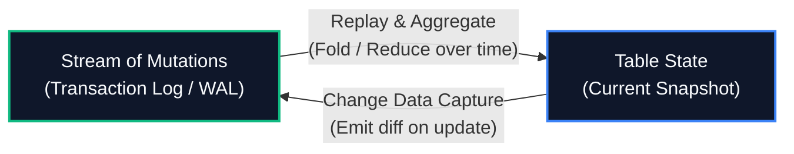
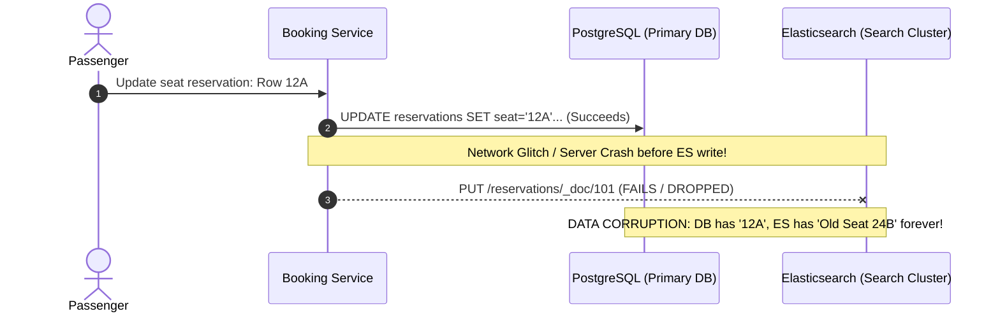
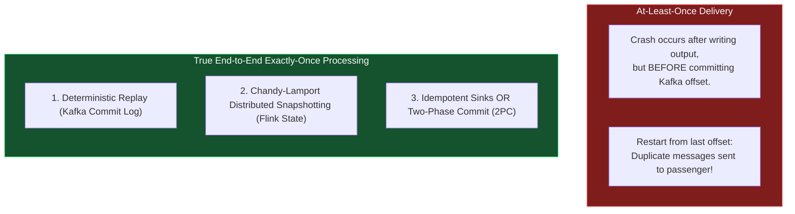

import { Callout } from 'fumadocs-ui/components/callout';
import { Tabs, Tab } from 'fumadocs-ui/components/tabs';
import { Steps, Step } from 'fumadocs-ui/components/steps';
import { Cards, Card } from 'fumadocs-ui/components/card';

## The Streaming Imperative: From Bounded to Unbounded Data

In Chapter 10, batch processing operated on **bounded data**: files of a fixed size, known in advance, processed offline.

In production engineering, however, data is never truly bounded. Data arrives continuously, one event at a time:
- An aircraft transponder broadcasts a GPS position coordinate.
- An airline gate agent scans a boarding pass at London Heathrow.
- An automated weather sensor reports wind shear over Chicago O'Hare.

If TravelBuddy waits until the 02:00 UTC nightly batch job to notify passengers that Flight `TB-402` is delayed by 3 hours, the passengers have already driven to the airport, checked their luggage, and waited at an empty gate.

**Stream processing** is the paradigm of running continuous computation over **unbounded datasets** with low latency (milliseconds to seconds).

```mermaid
flowchart LR
    subgraph Batch["Batch Processing (DDIA Ch 10)"]
        direction TB
        B_In["Bounded Input Files<br/>(45 TB Yesterday's Logs)"] --> B_Engine["Batch Engine<br/>(Hadoop / Spark)"]
        B_Engine --> B_Out["Output Files<br/>(New Static Files)"]
    end

    subgraph Streaming["Stream Processing (DDIA Ch 11)"]
        direction TB
        S_In["Unbounded Event Stream<br/>(e1, e2, e3, e4, ... ∞)"] --> S_Engine["Stream Engine<br/>(Kafka + Flink)"]
        S_Engine --> S_Out["Continuous Derived State<br/>(Live Alerts, Real-Time Dashboards)"]
    end

    style Batch fill:#0f172a,stroke:#3b82f6,stroke-width:2px
    style Streaming fill:#0f172a,stroke:#10b981,stroke-width:2px
```



---

## Messaging Systems: JMS vs. Log-Based Message Brokers

To transmit events from producers (flight sensors, web clients) to consumers (push engines, fraud detectors), we need a **message broker**.

Historically, enterprise systems relied on traditional message brokers like **ActiveMQ, RabbitMQ, and IBM MQ (JMS standard)**. However, modern high-throughput streaming systems rely on **log-based message brokers (Apache Kafka, Apache Pulsar)**.

Understanding the deep architectural divide between these two models is essential:

```mermaid
flowchart TD
    subgraph Traditional["Traditional Broker (RabbitMQ / JMS)"]
        P1["Producer"] --> Q["Broker Queue Memory"]
        Q -- "Deliver & ACK" --> C1["Consumer A"]
        Q -- "Deliver & ACK" --> C2["Consumer B"]
        Note1["Broker tracks delivery state per message.<br/>Message DELETED once ACKed.<br/>Destructive read; no replay."]
    end

    subgraph LogBased["Log-Based Broker (Apache Kafka)"]
        P2["Producer"] --> L["Append-Only Disk Commit Log<br/>Partition 0: [0][1][2][3][4][5][6]..."]
        L -- "Read offset 2" --> CG1["Consumer Group 1 (Offset: 3)"]
        L -- "Read offset 5" --> CG2["Consumer Group 2 (Offset: 6)"]
        Note2["Consumers track their own offset pointer.<br/>Log is IMMUTABLE and persistent.<br/>Non-destructive read; full replayability!"]
    end

    style Traditional fill:#0f172a,stroke:#ef4444,stroke-width:1px
    style LogBased fill:#0f172a,stroke:#10b981,stroke-width:1px
```



### Architectural Comparison

| Dimension | Traditional Message Brokers (JMS, RabbitMQ) | Log-Based Brokers (Apache Kafka) |
| :--- | :--- | :--- |
| **Storage Model** | Transient in-memory queue; disk only for overflow/durability | Append-only sequential commit log directly on disk |
| **Consumption Model** | **Destructive read**: broker deletes message once acknowledged | **Non-destructive read**: message stays for retention period (e.g. 7 days) |
| **Consumer Tracking** | Broker maintains complex state per message per consumer | Consumer maintains a single integer scalar: its **offset** |
| **Replayability** | **Impossible**: once consumed, data is gone forever | **Trivial**: rewind consumer offset back 2 hours or to zero |
| **Throughput** | $\sim 20,000 - 50,000\text{ msgs/sec}$ (CPU & lock bound) | $\sim 1,000,000+\text{ msgs/sec}$ (Sequential disk I/O & zero-copy) |
| **Backpressure** | Broker RAM fills up; queues thrash disk and crash | Consumer lag increases, but broker disk absorbs millions of unread records |

---

## Apache Kafka Architecture: Mechanical Sympathy

Kafka was designed by Jay Kreps, Neha Narkhede, and Jun Rao at LinkedIn to solve the planetary ingestion problem. It achieves extreme throughput through **mechanical sympathy** with modern Linux OS kernels and hardware.

```mermaid
flowchart TD
    subgraph Topic["Topic: flight-telemetry (3 Partitions)"]
        direction TB
        subgraph P0["Partition 0 (Leader: Broker 1)"]
            P0_Seg["[0] | [1] | [2] | [3] | [4] | [5] | [6] (Active Segment)"]
        end
        subgraph P1["Partition 1 (Leader: Broker 2)"]
            P1_Seg["[0] | [1] | [2] | [3] | [4] | [5] (Active Segment)"]
        end
        subgraph P2["Partition 2 (Leader: Broker 3)"]
            P2_Seg["[0] | [1] | [2] | [3] | [4] | [5] | [6] | [7] (Active Segment)"]
        end
    end

    Prod["Producers<br/>hash(flight_id) mod 3"] --> P0 & P1 & P2

    subgraph CG_Radar["Consumer Group: flight-radar-ui"]
        C1["Consumer Instance A (Reads P0)"]
        C2["Consumer Instance B (Reads P1)"]
        C3["Consumer Instance C (Reads P2)"]
    end

    subgraph CG_Alerts["Consumer Group: delay-notification-engine"]
        C4["Consumer Instance X (Reads P0, P1)"]
        C5["Consumer Instance Y (Reads P2)"]
    end

    P0 --> C1
    P1 --> C2
    P2 --> C3

    P0 --> C4
    P1 --> C4
    P2 --> C5

    style Topic fill:#020617,stroke:#64748b,stroke-width:1px
    style CG_Radar fill:#0f172a,stroke:#3b82f6,stroke-width:2px
    style CG_Alerts fill:#0f172a,stroke:#f59e0b,stroke-width:2px
```



### The 4 Secrets to Kafka's Extreme Performance

<Tabs items={['Sequential Disk I/O', 'OS Page Cache & Zero-Copy', 'Partitions & Horizontal Scale', 'Segment Log Compaction']}>
  <Tab value="Sequential Disk I/O">
    Many developers believe *“disks are slow, RAM is fast.”* While random disk seeks are indeed slow ($10\text{ ms}$ on spinning disk, $0.1\text{ ms}$ on SSD), **sequential disk I/O is extraordinarily fast** ($600\text{ MB/s}$ on SATA, $> 3\text{ GB/s}$ on NVMe).
    
    Kafka appends records strictly to the end of a partition file. Writing to sequential disk is often faster than random writes to a fragmented JVM heap!
  </Tab>
  <Tab value="OS Page Cache & Zero-Copy">
    Kafka runs in the JVM, but it avoids caching messages in JVM heap memory (which causes terrible GC pauses and object overhead). Instead, it relies on the **Linux OS Page Cache**.
    
    When a consumer requests data, Kafka bypasses user-space buffers entirely using the Linux **`sendfile()` system call** (**Zero-Copy**):
    ```
    Disk -> Page Cache -> NIC Network Buffer -> Socket
    ```
    Data never passes through CPU registers or JVM memory, eliminating CPU copying overhead completely.
  </Tab>
  <Tab value="Partitions & Horizontal Scale">
    A Topic is broken into multiple **Partitions**.
    - Each partition is an ordered, immutable sequence of records.
    - Partitioning provides the unit of parallelism: if a topic has 12 partitions, up to 12 consumer instances in a consumer group can read the topic concurrently in parallel.
    - Within a single partition, events are strictly ordered. Across partitions, no global ordering is guaranteed.
  </Tab>
  <Tab value="Segment Log Compaction">
    Partitions are broken into segment files (e.g., 1 GB each). In addition to time-based retention (e.g., delete segments older than 7 days), Kafka supports **Log Compaction**.
    
    If producers publish keyed messages (e.g., `flight_id -> current_status`), log compaction discards older records with the same key, retaining only the latest value. This allows a Kafka topic to serve as a durable, rebuildable key-value store.
  </Tab>
</Tabs>

### Consumer Group Rebalances: Eager vs. Cooperative Sticky Assignor

When consumers in a group scale up, restart during rolling deploys, or crash, Kafka rebalances partition assignments. How this rebalance executes is critical to system stability:

```mermaid
flowchart TD
    subgraph EagerRebalance["1. Legacy Eager Rebalance (Stop-the-World)"]
        direction TB
        E1["Consumer 3 Joins Group"] --> E2["ALL Consumers Revoke ALL Partitions!"]
        E2 --> E3["Processing Halts Across Entire Consumer Group"]
        E3 --> E4["Coordinator reassigns partitions; consumers reconnect"]
    end

    subgraph CooperativeRebalance["2. Cooperative Sticky Rebalance (Incremental)"]
        direction TB
        C1["Consumer 3 Joins Group"] --> C2["Consumers 1 & 2 KEEP processing unaffected partitions"]
        C2 --> C3["Only migrated partitions are revoked and assigned to Consumer 3"]
        C3 --> C4["Zero global pipeline downtime!"]
    end

    style EagerRebalance fill:#450a0a,stroke:#ef4444,stroke-width:2px
    style CooperativeRebalance fill:#064e3b,stroke:#10b981,stroke-width:2px
```



* **The Rebalance Storm Problem (Eager Protocol):**
  * In the legacy eager assignor (e.g., `RangeAssignor`, `RoundRobinAssignor`), any change in group membership causes the Group Coordinator broker to trigger a **Stop-the-World pause**.
  * Every consumer stops reading, commits current offsets, and revokes all assigned partitions.
  * If a slow consumer takes too long to process a batch, exceeding `max.poll.interval.ms` (default 5 minutes), the coordinator kicks it out, triggering a rebalance. The rebalance causes other consumers to pause, which may cause *them* to exceed `max.poll.interval.ms`, spiraling into an endless **Rebalance Storm**.
* **The Modern Solution: Cooperative Sticky Assignor:**
  * Enabled with `partition.assignment.strategy = org.apache.kafka.clients.consumer.CooperativeStickyAssignor`.
  * Partitions are rebalanced **incrementally in two rounds**.
  * Consumers continue reading from their existing partitions without interruption. Only the specific partitions migrating to new consumers are reassigned, eliminating processing lag spikes during rolling deployments.

---

## Change Data Capture (CDC): The Dualism of Streams and Tables

One of Martin Kleppmann’s most celebrated insights in DDIA is the **Stream-Table Dualism**:

> **“A table is a snapshot of state at a single point in time; a stream is the complete history of changes that produced that state.”**



### The Dual-Write Anti-Pattern vs. CDC
In naive microservices architectures, developers attempt to update their primary database and update secondary indexes (Elasticsearch, Redis cache) in application code (**Dual-Write**):



Dual-writes suffer from two fatal distributed systems bugs:
1. **Partial Failure**: The database write succeeds, but the search index write fails. Your state is now permanently desynchronized.
2. **Race Conditions**: Thread A writes $v_1$ to DB, then $v_1$ to ES. Thread B writes $v_2$ to DB, but due to network jitter, Thread B's update hits ES *before* Thread A's update. The DB has $v_2$, but ES has $v_1$ forever.

### The Solution: Change Data Capture (CDC) with Debezium

Instead of dual-writing, the application writes **only** to the primary ACID database. 

A CDC engine like **Debezium** attaches directly to PostgreSQL's **Write-Ahead Log (WAL)** or MySQL's **Binary Log (binlog)** as a replication follower, extracts every committed transaction, and streams it into Kafka:

```mermaid
flowchart LR
    App["Application"] -- "1. Single ACID Write" --> PG[("PostgreSQL")]
    PG -- "Appends to" --> WAL["PostgreSQL WAL Engine"]
    WAL -- "2. Streams commits" --> Deb["Debezium CDC Connector"]
    Deb -- "3. Publishes event" --> Kafka{{"Kafka Topic: dbserver1.travelbuddy.reservations"}}
    
    Kafka --> SinkES["Kafka Connect ES Sink"] --> ES[("Elasticsearch")]
    Kafka --> SinkCache["Cache Invalidation Worker"] --> Redis[("Redis")]

    style App fill:#0f172a,stroke:#64748b,stroke-width:1px
    style PG fill:#0f172a,stroke:#3b82f6,stroke-width:2px
    style WAL fill:#020617,stroke:#f59e0b,stroke-width:1px
    style Deb fill:#0f172a,stroke:#ec4899,stroke-width:2px
    style Kafka fill:#0f172a,stroke:#10b981,stroke-width:2px
```



Because WAL reading happens after the transaction commits, **partial failures and race conditions are mathematically impossible**. Downstream search indexes and caches become perfectly consistent derived materialized views.

### Telemetry Pipeline Architecture: Direct-to-ClickHouse vs. OLTP Protection

In data-intensive platforms, telemetry events (airplane GPS coordinates, page views, search keystrokes) produce $100\times$ higher write volume than transactional events (seat purchases).

As emphasized in live-stream database engineering: **never route raw event telemetry through your transactional OLTP database!**

```mermaid
flowchart TD
    subgraph Clients["Edge Clients / Mobile Apps"]
        TxAction["Seat Booking Request (Critical)"]
        TelemetryAction["Flight GPS Telemetry / Clicks (High Volume)"]
    end

    subgraph OLTP["Transactional Path"]
        API["Booking API"] --> PG[("PostgreSQL Primary DB<br/>ACID seat reservation")]
    end

    subgraph AnalyticalStream["Telemetry Stream Path"]
        Collector["Stateless Edge Collector"] --> Kafka{{"Kafka Topic: raw-telemetry"}}
        Kafka --> ClickHouse[("ClickHouse / Snowflake<br/>Columnar OLAP Storage")]
    end

    TxAction --> API
    TelemetryAction --> Collector

    style OLTP fill:#0f172a,stroke:#3b82f6,stroke-width:2px
    style AnalyticalStream fill:#020617,stroke:#10b981,stroke-width:2px
```



* **The Anti-Pattern:** Routing clickstream and GPS pings into PostgreSQL tables triggers massive WAL write amplification, fills buffer pools with ephemeral rows, and starves IOPS for transactional seat reservations.
* **The High-Throughput Pattern:**
  1. Telemetry is sent to lightweight, stateless collectors that write directly into a partitioned Kafka topic.
  2. A streaming consumer or Kafka Connect batches events and flushes them directly into columnar storage (**ClickHouse**, BigQuery, or S3 Parquet).
  3. The core OLTP database remains dedicated exclusively to high-value ACID business transactions.

---

## Stream Processing Patterns: Joins & Windows

When writing continuous applications on engines like **Apache Flink** or **Kafka Streams**, we combine events across time.

### 1. Windowing Semantics

Since an event stream is infinite, aggregations (e.g., *“Count flight delay incidents”*) must be bound to time windows:

```mermaid
flowchart TD
    subgraph Tumbling["1. Tumbling Window (Fixed, Non-overlapping: e.g. 10m)"]
        T1["[00:00 - 00:10]"] --- T2["[00:10 - 00:20]"] --- T3["[00:20 - 00:30]"]
    end

    subgraph Hopping["2. Sliding / Hopping Window (Overlapping: e.g. 10m window, 2m slide)"]
        H1["[00:00 ---------- 00:10]"]
        H2["    [00:02 ---------- 00:12]"]
        H3["        [00:04 ---------- 00:14]"]
    end

    subgraph Session["3. Session Window (Dynamic, bound by user inactivity gap)"]
        S1["[User Active: 8m]"] --- Gap1["Gap > 15m"] --- S2["[User Active: 22m]"]
    end

    style Tumbling fill:#020617,stroke:#3b82f6,stroke-width:1px
    style Hopping fill:#020617,stroke:#10b981,stroke-width:1px
    style Session fill:#020617,stroke:#f59e0b,stroke-width:1px
```



### 2. Time Semantics & Watermarks
In distributed systems, the clock on the machine generating the event is never synchronized with the clock on the machine processing it:
- **Event Time**: The timestamp when the event physically occurred in the real world (e.g., aircraft GPS reading recorded by transponder at `14:02:01.400Z`).
- **Processing Time**: The local system clock of the streaming server executing the code when the event arrives (e.g., Flink node clock at `14:02:08.100Z` due to cell tower network lag).

<Callout type="error" title="Never Window on Processing Time in Production">
If a mobile network drops for 10 minutes and suddenly dumps 10,000 passenger location pings at once, processing time will bunch all 10,000 pings into a single 1-minute window, corrupting all route velocity calculations. Always window on **Event Time**!
</Callout>

To handle late-arriving data in event time, stream engines use **Watermarks**:
A watermark $W(t)$ is a control event asserting: *“We assume no further events with timestamp $\le t$ will arrive.”* If an event arrives with timestamp $< W(t)$, it is categorized as late-arriving and directed to a side-output dead-letter queue.

### 3. Stream Joins
- **Stream-Stream Join (Windowed Join)**: Matching two infinite streams within a time buffer. For example, joining a `FlightBooking` event with a `CreditCardPaymentAuthorized` event if both occur within a 15-minute window. Both streams maintain an internal state store (RocksDB) to hold unmatched events.
- **Stream-Table Join**: Enriching a fast, unbounded event stream (live aircraft GPS coordinates) with a slower CDC changelog stream representing database table state (aircraft tail number metadata, passenger manifests).

---

## Fault Tolerance: Exactly-Once Processing Semantics

What happens if a worker node crashes mid-stream?



### The Three Guarantees
1. **At-most-once**: Messages can be dropped, but never duplicated (offsets committed before processing).
2. **At-least-once**: Messages are never lost, but may be processed multiple times during failure recovery.
3. **Effectively Exactly-Once**: The end-to-end outcome is identical to a world where every record was processed precisely once.

### Chandy-Lamport Distributed Checkpointing (Apache Flink)
Flink injects special **Checkpoint Barriers** into the Kafka partition stream. As barriers flow through operators:
1. Operator pauses incoming channel, aligns barriers from all inputs.
2. Operator writes its local state (e.g., active window aggregates in RocksDB) to durable storage (S3/HDFS).
3. Once all sinks acknowledge the barrier, the checkpoint is complete. On failure, all operators roll back their state and rewind Kafka consumer offsets to the exact barrier timestamp simultaneously.

---

## TravelBuddy Case Study: Real-Time Delay Notification Engine

When a flight is delayed, TravelBuddy must alert all affected passengers via SMS and push notification. Crucially: **No passenger must ever receive duplicate SMS text messages**, even if a Kafka consumer node crashes and restarts during the broadcast.

Here is TravelBuddy's production-grade idempotent stream processor:

```python
"""
TravelBuddy Real-Time Flight Delay Alert Processor
Consumes 'flight-delays' topic, enriches with passenger reservations,
and issues idempotent push alerts using Kafka + Redis deduplication.
"""
import json
import logging
import redis
from kafka import KafkaConsumer, KafkaProducer

logging.basicConfig(level=logging.INFO)
logger = logging.getLogger("DelayAlertProcessor")

# Redis instance used for distributed idempotency tracking
redis_client = redis.Redis(host='localhost', port=6379, db=0)

consumer = KafkaConsumer(
    'flight-delay-events',
    bootstrap_servers=['localhost:9092'],
    group_id='delay-notification-engine-prod',
    enable_auto_commit=False,  # Manual commit for fault-tolerance
    auto_offset_reset='earliest',
    value_deserializer=lambda m: json.loads(m.decode('utf-8'))
)

producer = KafkaProducer(
    bootstrap_servers=['localhost:9092'],
    value_serializer=lambda m: json.dumps(m).encode('utf-8')
)

def send_push_notification(passenger_id, flight_id, delay_minutes, reason):
    # Simulated integration with APNS / FCM push gateway
    logger.info(f"[PUSH SENT] Passenger {passenger_id}: Flight {flight_id} delayed by {delay_minutes}m ({reason})")

def process_event(event):
    flight_id = event["flight_id"]
    delay_minutes = event["delay_minutes"]
    reason = event.get("reason", "Weather Advisory")
    passengers = event["affected_passenger_ids"]

    for passenger_id in passengers:
        # Construct unique idempotency key: passenger + flight + delay duration
        idempotency_key = f"alert_sent:{passenger_id}:{flight_id}:{delay_minutes}"

        # ATOMIC SETNX with 24-hour expiration
        # Returns True if key was newly set, False if already present
        is_first_broadcast = redis_client.set(idempotency_key, "1", nx=True, ex=86400)

        if is_first_broadcast:
            send_push_notification(passenger_id, flight_id, delay_minutes, reason)
        else:
            logger.warning(f"[DEDUPED] Suppressed duplicate alert for {passenger_id} on {flight_id}")

def main():
    logger.info("Starting TravelBuddy Delay Notification Stream Processor...")
    try:
        for message in consumer:
            event = message.value
            process_event(event)

            # Commit offset synchronously only AFTER all passenger alerts
            # are safely pushed and recorded in idempotent Redis store
            consumer.commit()
    except KeyboardInterrupt:
        logger.info("Gracefully shutting down consumer...")
    finally:
        consumer.close()

if __name__ == "__main__":
    main()
```

---

## Chapter Summary & Architectural Rules

1. **Logs are the Foundation of Modern Streaming**: Append-only disk logs (Kafka) solve high throughput, replayability, and decoupled backpressure in a way traditional queues cannot.
2. **Never Dual-Write**: Use Change Data Capture (Debezium + DB WAL) to derive search indexes and caches asynchronously and reliably.
3. **Always Anchor to Event Time**: Network latencies and offline devices guarantee that arrival order is scrambled. Use Event Time with Watermarks.
4. **Idempotence is the Key to Exactly-Once**: In distributed architectures, combine at-least-once delivery with atomic idempotent sinks (`SETNX`, deterministic unique keys) to prevent duplicate side-effects.
