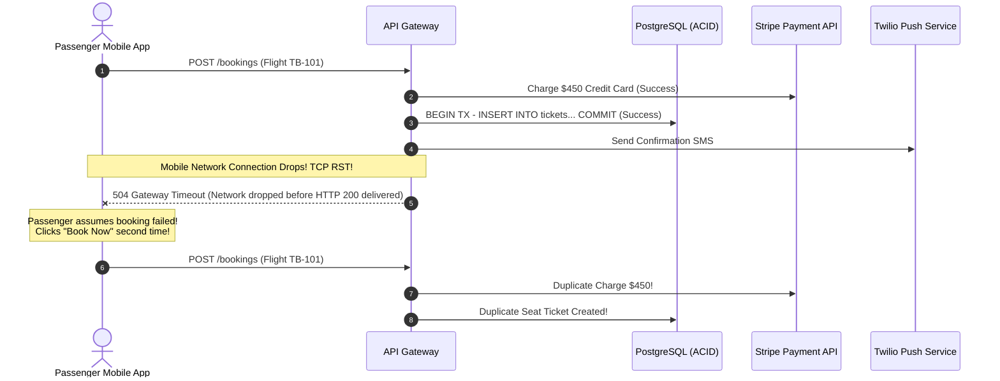

import { Callout } from 'fumadocs-ui/components/callout';
import { Tabs, Tab } from 'fumadocs-ui/components/tabs';
import { Steps, Step } from 'fumadocs-ui/components/steps';
import { Cards, Card } from 'fumadocs-ui/components/card';

## The Architectural Crisis: The Monolithic Database Myth

In the early decades of database systems, vendors sold an appealing vision: *a single relational database management system (RDBMS) could handle every enterprise requirement.* It would store relational records, enforce foreign keys, run transactional accounting, execute full-text search, process analytical aggregations, and cache hot records.

Today, at planet scale, that vision is dead. 

No single storage engine can simultaneously optimize for:
1. Low-latency OLTP row mutations (B-Trees in PostgreSQL)
2. Inverted index fuzzy text matching (Lucene in Elasticsearch)
3. Columnar vector scans for billion-row aggregations (ClickHouse / Snowflake)
4. Sub-millisecond key-value cache lookups (Redis in-memory dicts)
5. Complex graph traversals (Neo4j adjacency lists)

The industry responded by deploying multiple specialized databases side by side. But this created a secondary disaster: **how do you keep five disparate distributed databases in sync without distributed transaction deadlocks or corrupt data drift?**

In Chapter 12 of *Designing Data-Intensive Applications*, Martin Kleppmann provides the unifying philosophical framework: **Unbundling the Database**.

---

## Unbundling the Database

What is a database, really? 

If you peel back the layers of an RDBMS like PostgreSQL or Oracle, you find several modular sub-components tightly coupled inside one executable:
- A **Storage Engine** (B-Tree on disk)
- A **Write-Ahead Log (WAL)** (append-only ledger for durability and crash recovery)
- **Secondary Indexes** (B-Trees or GIN indexes updated automatically on mutations)
- A **Cache Layer** (Shared buffers in memory)
- A **Query Planner & Execution Engine**

```mermaid
flowchart TD
    subgraph Monolith["Traditional Monolithic Database (Bundled)"]
        direction TB
        M_WAL["1. Write-Ahead Log (WAL)"]
        M_Store["2. Primary Table Storage (Heap/B-Tree)"]
        M_Idx["3. Secondary Indexes (B-Tree, Hash)"]
        M_Views["4. Materialized Views"]
        M_Cache["5. In-Memory Buffer Cache"]
        
        M_WAL --> M_Store & M_Idx & M_Views & M_Cache
    end

    subgraph Unbundled["The Modern Unbundled Data Platform"]
        direction TB
        U_Bus{{"1. Append-Only Commit Log<br/>(Apache Kafka / Pulsar)"}}
        U_OLTP[("2. OLTP System of Record<br/>(PostgreSQL / DynamoDB)")]
        U_Search[("3. Search Index<br/>(Elasticsearch / OpenSearch)")]
        U_Cache[("4. In-Memory Cache<br/>(Redis Cluster)")]
        U_OLAP[("5. Columnar Analytics<br/>(ClickHouse / Snowflake)")]

        U_OLTP -- "CDC (Debezium)" --> U_Bus
        U_Bus --> U_Search
        U_Bus --> U_Cache
        U_Bus --> U_OLAP
    end

    style Monolith fill:#0f172a,stroke:#64748b,stroke-width:1px
    style Unbundled fill:#020617,stroke:#3b82f6,stroke-width:2px
```



### The Unbundled Architecture
Instead of hiding the WAL inside a single proprietary database binary:
1. **The Commit Log is elevated to a first-class distributed infrastructure service** (Apache Kafka).
2. **PostgreSQL** serves as the authoritative System of Record (recording raw writes).
3. **Elasticsearch, Redis, and ClickHouse are treated simply as Secondary Indexes and Materialized Views**, continuously derived by consuming the commit log!

<Callout type="info" title="Derived Data as Continuous Materialized Views">
In an RDBMS, a materialized view is a query result stored on disk and refreshed when underlying tables change.
In an unbundled architecture:
$$\text{Elasticsearch Index} = f(\text{Kafka Log})$$
$$\text{Redis Cache} = g(\text{Kafka Log})$$
$$\text{ClickHouse OLAP Table} = h(\text{Kafka Log})$$
Each derived data store is simply a materialized view computed deterministically by a stream processing consumer function.
</Callout>

---

## Architectural Paradigms: Lambda vs. Kappa Architecture

When unifying real-time event streaming with historical batch analytics, two primary architectural patterns emerged:

```mermaid
flowchart TD
    subgraph Lambda["Lambda Architecture (Nathan Marz)"]
        direction TB
        L_In["Raw Events"]
        L_Batch["Batch Layer (Hadoop / Spark)<br/>Slow, accurate, recomputes master dataset"]
        L_Speed["Speed Layer (Storm / Flink)<br/>Fast, low-latency delta estimates"]
        L_Serve["Serving Layer<br/>Merges batch views + speed real-time delta"]
        
        L_In --> L_Batch & L_Speed
        L_Batch --> L_Serve
        L_Speed --> L_Serve
    end

    subgraph Kappa["Kappa Architecture (Jay Kreps)"]
        direction TB
        K_In["Raw Immutable Event Log<br/>(Kafka / Pulsar with Long Retention)"]
        K_Stream["Single Stream Processing Engine<br/>(Apache Flink / Kafka Streams)"]
        K_Serve["Serving Views<br/>(Elasticsearch, Redis, ClickHouse)"]

        K_In --> K_Stream --> K_Serve
    end

    style Lambda fill:#0f172a,stroke:#ef4444,stroke-width:1px
    style Kappa fill:#0f172a,stroke:#10b981,stroke-width:2px
```



### The Lambda Architecture: Dual-Codebase Tax
Proposed by Nathan Marz (creator of Apache Storm), Lambda splits dataflow into two parallel tracks:
1. **Batch Layer**: An immutable master dataset in HDFS/S3. A Spark job recomputes aggregates every night to ensure 100% mathematical accuracy.
2. **Speed Layer**: A streaming engine (Storm/Flink) processes live events to provide low-latency estimates for the last few hours.
3. **Serving Layer**: Responds to client queries by combining the latest batch view with the real-time speed delta.

**Why Lambda Failed in Production**:
- **The Dual-Codebase Nightmare**: Engineers had to write the exact same business logic twice: once in Java/Scala for Spark (batch), and once in Java for Storm (streaming).
- **Reconciliation Drift**: Subtle differences in floating-point math, timezone libraries, or window boundary definitions caused the real-time view and batch view to return conflicting numbers at query time.

### The Kappa Architecture: The Stream Replay Revolution
Proposed by Jay Kreps (co-founder of Apache Kafka), Kappa eliminates the batch layer entirely:
1. **Single Engine**: All computation is written **once** using a stream processor (Flink or Kafka Streams).
2. **Historical Recomputation via Log Replay**: What happens if you modify your analytics algorithm or fix a business logic bug?
   - You do **not** run an offline MapReduce job.
   - You launch a second version of your stream processor ($v_2$).
   - You point $v_2$'s consumer group offset to **Offset 0** (the beginning of the immutable Kafka log).
   - $v_2$ rapidly streams through historical events, populating a new derived view in parallel.
   - Once $v_2$ catches up to real-time lag, the API gateway flips read traffic to the new view, and $v_1$ is decommissioned.

---

## End-to-End Correctness: The Myth of ACID in Distributed Systems

A common developer belief is that using an ACID relational database guarantees overall application correctness. 

Martin Kleppmann shows why this is an illusion: **ACID guarantees correctness only within the boundaries of a single database process. It does not protect the end-to-end distributed system.**



Even though PostgreSQL executed its transaction with pristine Serializable ACID isolation, the user was double-charged and assigned duplicate seats!

### The End-to-End Principle (Saltzer, Reed, and Clark, 1984)
The **End-to-End Principle** in computer science states:
> *A low-level subsystem (like an ACID database or reliable TCP socket) cannot solve a problem completely if that problem requires knowledge of the end-to-end application context.*

To achieve true end-to-end correctness, the system must design for **Idempotence and Deduplication at the perimeter**:

```mermaid
flowchart TD
    App["Passenger App<br/>Generates client UUID: req_8f1b2c"] --> Edge["API Gateway"]
    Edge --> IdempStore{{"Redis Idempotency Store<br/>Key: req_8f1b2c"}}
    
    IdempStore -- "Key exists (In-Flight or Completed)" --> Cached["Return Previous Cached Result<br/>Zero duplicate side effects!"]
    IdempStore -- "Key absent (New Request)" --> Exec["Execute Transactional Pipeline<br/>& Store Result"]

    style App fill:#0f172a,stroke:#64748b,stroke-width:1px
    style Edge fill:#0f172a,stroke:#3b82f6,stroke-width:2px
    style IdempStore fill:#1e293b,stroke:#f59e0b,stroke-width:2px,color:#f8fafc
    style Cached fill:#14532d,stroke:#22c55e,stroke-width:2px,color:#f8fafc
    style Exec fill:#0f172a,stroke:#3b82f6,stroke-width:2px
```



---

## Auditing, Immutability & The Accounting Ledger Model

Why do classical databases provide the SQL commands `UPDATE` and `DELETE`? Because in the 1970s, disk space was astronomically expensive; overwriting a block in-place saved valuable megabytes.

In contrast, **accountants have understood distributed immutability for 500 years**:

<Callout type="warning" title="The Golden Rule of Accounting">
Accountants never erase or overwrite a ledger entry. If you make an accounting error of $\$100$, you do not white-out the column. You write a **compensating transaction** of $-\$100$ on the next line.
</Callout>

### The Danger of In-Place Mutation
If TravelBuddy runs:
```sql
UPDATE reservations 
SET status = 'CANCELLED', seat = NULL 
WHERE ticket_id = 'T-98124';
```
Valuable audit and operational context is wiped out:
- What seat did the passenger hold prior to cancellation?
- Exactly who cancelled it, at what microsecond, and why?
- If fraud occurred, the evidence was overwritten in-place!

### The Immutable Ledger Pattern
In an unbundled, log-centric system, the database is strictly **append-only**:

```json
// Event 1: Created
{"event_id": "e_01", "type": "TICKET_ISSUED", "ticket_id": "T-98124", "seat": "14B", "fare": 320, "ts": 1728200000}

// Event 2: Upgraded
{"event_id": "e_02", "type": "SEAT_UPGRADED", "ticket_id": "T-98124", "from": "14B", "to": "3A", "surcharge": 150, "ts": 1728203600}

// Event 3: Compensating cancellation
{"event_id": "e_03", "type": "TICKET_CANCELLED", "ticket_id": "T-98124", "reason": "Weather Delay", "refund": 470, "ts": 1728207200}
```

Current state is simply a projection of the log:
$$\text{Current State} = \sum_{i=1}^{n} \text{Event}_i$$

**Benefits of Immutability**:
1. **Zero-Loss Auditing**: Regulatory aviation bodies (FAA / EASA) can inspect every historical state change without forensic data recovery.
2. **Time-Travel Debugging**: If a machine learning surge pricing algorithm malfunctions, engineers can replay the exact historical state of the world as it existed at 14:15 UTC yesterday.
3. **Trivial Replication**: Append-only files have zero concurrency lock contention.

---

## TravelBuddy Case Study: The Planetary Immutable Settlement Ledger

At TravelBuddy, millions of dollars flow daily between international airlines, global distribution systems, and passenger credit cards. 

Below is TravelBuddy's production immutable ledger transaction processor, demonstrating append-only compensatory accounting with cryptographically chained audit hashes:

```python
"""
TravelBuddy Planetary Settlement Ledger
Enforces append-only immutable financial accounting with SHA-256 audit chaining.
Never mutates or deletes historical entries.
"""
import hashlib
import json
import time
from typing import List, Dict, Optional

class LedgerEntry:
    def __init__(self, entry_id: int, tx_type: str, account_id: str, 
                 amount_usd: float, prev_hash: str, metadata: dict):
        self.entry_id = entry_id
        self.timestamp = time.time_ns()
        self.tx_type = tx_type          # 'CREDIT', 'DEBIT', 'COMPENSATING_REVERSAL'
        self.account_id = account_id
        self.amount_usd = amount_usd
        self.prev_hash = prev_hash
        self.metadata = metadata
        self.hash = self.compute_hash()

    def compute_hash(self) -> str:
        payload = f"{self.entry_id}:{self.timestamp}:{self.tx_type}:{self.account_id}:{self.amount_usd:.2f}:{self.prev_hash}:{json.dumps(self.metadata, sort_keys=True)}"
        return hashlib.sha256(payload.encode('utf-8')).hexdigest()

class ImmutableFinancialLedger:
    def __init__(self):
        self.entries: List[LedgerEntry] = []
        # Genesis block anchor
        self.latest_hash: str = "0000000000000000000000000000000000000000000000000000000000000000"

    def append_transaction(self, tx_type: str, account_id: str, 
                           amount_usd: float, metadata: dict) -> LedgerEntry:
        entry_id = len(self.entries) + 1
        entry = LedgerEntry(entry_id, tx_type, account_id, amount_usd, self.latest_hash, metadata)
        self.entries.append(entry)
        self.latest_hash = entry.hash
        return entry

    def issue_compensating_reversal(self, original_entry_id: int, reason: str) -> LedgerEntry:
        target = self.entries[original_entry_id - 1]
        reversal_amount = -target.amount_usd
        reversal_type = "COMPENSATING_REVERSAL"
        metadata = {
            "reversing_entry_id": original_entry_id,
            "reason": reason,
            "original_tx_type": target.tx_type
        }
        return self.append_transaction(reversal_type, target.account_id, reversal_amount, metadata)

    def calculate_balance(self, account_id: str) -> float:
        # Balance is a deterministic fold over the immutable event log
        return sum(e.amount_usd for e in self.entries if e.account_id == account_id)

    def verify_audit_integrity(self) -> bool:
        prev_hash = "0000000000000000000000000000000000000000000000000000000000000000"
        for entry in self.entries:
            if entry.prev_hash != prev_hash:
                return False
            if entry.hash != entry.compute_hash():
                return False
            prev_hash = entry.hash
        return True

# Demonstration of Immutable Auditing
if __name__ == "__main__":
    ledger = ImmutableFinancialLedger()

    # 1. Passenger purchases ticket on United Airlines via TravelBuddy
    ledger.append_transaction("CREDIT", "UA_SETTLEMENT", 450.00, {"ticket": "T-101", "pax": "U-55"})
    ledger.append_transaction("DEBIT", "STRIPE_ESCROW", 450.00, {"ticket": "T-101", "fee": 13.50})

    # 2. Flight cancelled due to blizzard; issue compensatory refund (never delete row 1!)
    ledger.issue_compensating_reversal(1, reason="Blizzard ORD Cancel - DOT Mandated Refund")

    print(f"Final UA Account Balance: ${ledger.calculate_balance('UA_SETTLEMENT'):.2f}")
    print(f"Ledger Audit Integrity Verified: {ledger.verify_audit_integrity()}")
    print(f"Total Audit Trail Entries: {len(ledger.entries)}")
```

---

### Practitioner Case Study: Uber's Fleet-Scale MySQL Group Replication (MGR)

In live-stream database architecture reviews, real-world fleet automation demonstrates how consensus transforms massive database footprints:

```mermaid
flowchart TD
    subgraph UberFleet["Uber's Global Fleet (Tens of Thousands of MySQL Instances)"]
        direction LR
        subgraph Group1["MGR Replication Group (Shard 104)"]
            Node1[("Primary Node (Writer)")]
            Node2[("Secondary Node (Follower)")]
            Node3[("Secondary Node (Follower)")]
            Node1 <== "Paxos / Raft Consensus Ring" ==> Node2 & Node3
        end
    end

    AppTier["Microservice Fleet"] --> RouteProxy["Routing Tier"] --> Node1

    style Group1 fill:#020617,stroke:#38bdf8,stroke-width:2px
    style Node1 fill:#064e3b,stroke:#10b981,stroke-width:2px
    style UberFleet fill:#0f172a,stroke:#64748b,stroke-width:1px
```



* **The Problem at Scale:** Managing thousands of MySQL master-replica clusters with traditional scripts often resulted in split-brain incidents when a primary flapped during network glitches, requiring manual human on-call intervention.
* **The Solution (MySQL Group Replication with Consensus):**
  * Uber migrated tens of thousands of MySQL instances to **MySQL Group Replication (MGR)**.
  * MGR embeds Paxos/Raft-based group communication into the database engine itself.
  * Group members coordinate transaction certification: if a primary crashes, the remaining nodes automatically elect a new primary with zero data loss ($RPO = 0$) and zero split-brain risk, without relying on external orchestrators.

---

### Hardware Unreliability: Silent Bit Rot & Backup Verification

As Martin Kleppmann highlights, distributed systems cannot assume that hardware operates reliably:
* **Silent Data Corruption (Bit Rot):** Hard drives and flash SSDs experience silent bit flips caused by cosmic rays, electrical degradation, and firmware bugs. TCP checksums (16-bit) are shockingly weak—statistically, one in several billion packets passes TCP verification with corrupted payload bytes!
* **End-to-End Cryptographic Hashes:** Storage and transport engines must enforce cryptographic hashing (SHA-256 or CRC32c) on every file segment and network frame to detect silent corruption before it spreads.
* **The Iron Law of Disaster Recovery:** 
  > *“An untested backup does not exist.”*
  * Thousands of companies have suffered catastrophic data loss because their backup scripts had silently produced empty files for months.
  * Automated testing pipelines must continuously restore production backup snapshots into ephemeral staging clusters and execute assertion queries to verify data integrity.

---

### The Ethics of Data Systems: Bias, Privacy & Data Ecology

In the final chapter of *Designing Data-Intensive Applications*, Martin Kleppmann steps beyond technical mechanics to address software engineering's moral imperative: **Doing the Right Thing**.

Technology is not neutral; the data systems we construct shape human society:

```mermaid
flowchart TD
    subgraph FeedbackLoop["The Self-Fulfilling Algorithmic Loop"]
        Historical["1. Historical Biased Data"] --> Model["2. Machine Learning Model"]
        Model --> Decision["3. Automated Decision (Denied Loan / Target Policing)"]
        Decision --> Outcome["4. Deprived Opportunity / Target Arrests"]
        Outcome --> Historical
    end

    style FeedbackLoop fill:#450a0a,stroke:#ef4444,stroke-width:2px
```



1. **Automated Discrimination & Predictive Profiling:**
   * When machine learning models and data pipelines train on historical data, they systematically codify past human prejudices.
   * If an automated airline pricing or credit algorithm penalizes specific demographics, people are denied opportunities with zero human accountability or recourse.
2. **Surveillance Capitalism & User Agency:**
   * Collecting tracking events under the guise of "improving user experience" often degenerates into pervasive behavioral surveillance.
   * True user consent requires transparency and genuine choice—not manipulative cookie consent banners designed to coerce users into surrender.
3. **Self-Fulfilling Feedback Loops:**
   * Predictive algorithms do not merely observe the world; they alter it. An algorithm that predicts high crime in a neighborhood sends more police, which leads to more arrests, generating "data" that retroactively validates the algorithm's bias.
4. **Data Ecology & Industrial Responsibility:**
   * In the 20th century, chemical plants treated rivers as free dumping grounds for toxic waste. In the 21st century, technology companies often treat human personal data as free raw exhaust to be hoarded forever.
   * **Data has liability and environmental cost:** Storing petabytes of unpruned data consumes enormous electrical power in cooling datacenters and poses catastrophic breach liabilities.
   * *The Engineering Principle of Data Ecology:* Practice **Data Minimization**—collect only what is strictly necessary, enforce aggressive data retention pruning, and honor the human right to be forgotten.

---

## Chapter Summary & Architectural Rules

1. **Unbundle Your Data Systems**: Do not force one database to handle transactions, full-text search, and analytical reporting. Use an append-only commit log (Kafka) to sync specialized stores.
2. **Derived Data Equals Materialized Views**: Treat caches, search indexes, and warehouses as downstream projections of the primary commit log.
3. **Prefer Kappa over Lambda**: Maintaining dual batch and stream codebases introduces high maintenance costs and data drift. Use a unified stream processing engine capable of historical log replay.
4. **End-to-End Correctness Trumps ACID**: Rely on perimeter idempotency keys and compensating transactions, because database ACID boundaries cannot protect against real-world network and client failures.
5. **Never Delete State**: Append-only immutable logs guarantee complete auditability, time-travel reproducibility, and resilience against operational errors.
